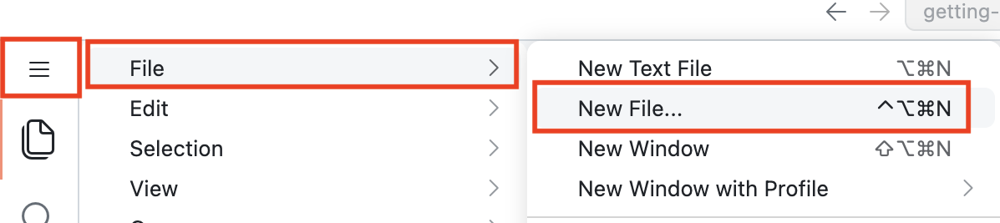
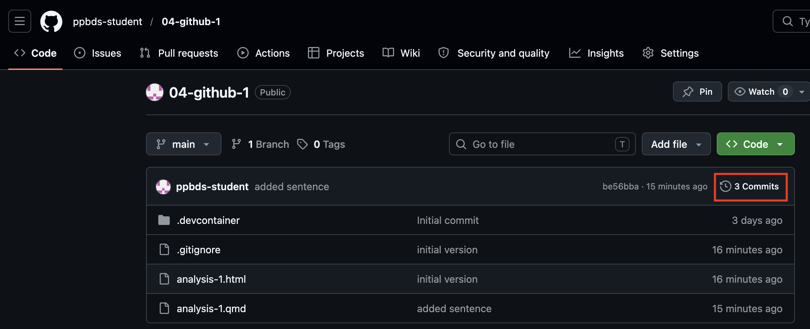

```{r setup, include = FALSE}
library(learnr)
library(tutorial.helpers)
library(knitr)

knitr::opts_chunk$set(echo = FALSE)
knitr::opts_chunk$set(out.width = '90%')
options(tutorial.exercise.timelimit = 60,
        tutorial.storage = "local")
```

```{r copy-code-chunk, child = system.file("child_documents/copy_button.Rmd", package = "tutorial.helpers")}
```

```{r info-section, child = system.file("child_documents/info_section.Rmd", package = "tutorial.helpers")}
```

## Introduction
###

This is the first tutorial you should complete after **Getting Started**. It repeats the most important setup ideas so that it can stand on its own.


You will:

* Move around VS Code and use its Terminal tab.
* Create your own GitHub repository.
* Create and run R scripts by hand and with AI.
* Make two plots using the `diamonds` data.
* Commit your files with Git and push them to GitHub.

###

Every tutorial begins in the same place: a Codespace on the `main` branch of [`PPBDS/codespace-starter`](https://github.com/PPBDS/codespace-starter). You then start the tutorial from the R Tutorials view in VS Code. That is where you should be now.

<!-- DK: Cut or add images. -->

The tutorial itself runs in an R process displayed in a Terminal tab named something like **R Tutorial**. Leave that Terminal alone. Closing it stops the tutorial.

<!-- DK: Change all prompts and responses. Ie.

codespace-starter $ pwd
/workspaces/codespace-starter
codespace-starter $  -->

###

<!-- DK: Give URL for Codebase-starter -->

<!-- DK: Sections to have, in order

    Terminal
    Git and GitHub
        starting with connect-repo.
    Script 1
        Using Copilot (show images)
        Commit and push at end. View on web. 
    Script 2
        AI agnostic
        Commit/push at end. Maybe git log question.
    Summary
        URL for repo     -->

 <!-- DK: revisit the start of code/quarto/terminal. First, the starting info is like later tutorials that we have: "You should be in a repo called . . ."  Second, make them shorter by deleting questions you stole for introduction. -->

VS Code is split into a few parts:

* The **Activity Bar** is the row of small icons on the far left.
* The **Side Bar** is the box next to those icons. Click the Explorer icon to see your files. Click the Source Control icon to work with Git.
* The **Editor** is the big space in the middle. This is where you read and change files.
* The **Terminal** is usually at the bottom. This is where you type commands.
* The **Status Bar** is the thin bar across the very bottom.

Here is the whole VS Code window. The Explorer Side Bar is on the left. The Editor is in the middle. The Terminal is inside the red box at the bottom.

```{r}
include_graphics("images/vscode-overview.png")
```

You can make a part bigger or smaller by dragging its edge. If you close something, you can open it again by clicking its icon.

###

Most questions ask you to **Copy/Paste the Command and Response**, shortened to **CP/CR**. Copy the command you typed and the answer the Terminal gave you. Paste both into the answer box.

Your answer may look a little different from ours. That is OK. Usernames and version numbers can be different.

###

Open a bash Terminal. Click the small down arrow beside the `+` in the Terminal panel and choose **bash**. You should now have at least two Terminal tabs: **R Tutorial**, which is busy running this tutorial, and **bash**, where you will work.

### Exercise 1

In the bash Terminal, run `pwd`. CP/CR.

```{r terminal-1}
question_text(NULL,
    answer(NULL, correct = TRUE),
    allow_retry = TRUE,
    try_again_button = "Edit Answer",
    incorrect = NULL,
    rows = 3)
```

###

````
@ppbds-student ➜ /workspaces/codespace-starter (main) $ pwd
/workspaces/codespace-starter
@ppbds-student ➜ /workspaces/codespace-starter (main) $
````

`pwd` means **print working directory**. It tells you which folder you are in. Right now, you should be in the `codespace-starter` folder.

### Exercise 2

Run `ls`. CP/CR.

```{r terminal-2}
question_text(NULL,
    answer(NULL, correct = TRUE),
    allow_retry = TRUE,
    try_again_button = "Edit Answer",
    incorrect = NULL,
    rows = 3)
```

###

````
@ppbds-student ➜ /workspaces/codespace-starter (main) $ ls
@ppbds-student ➜ /workspaces/codespace-starter (main) $
````

`ls` shows the files in your folder. Nothing appears because this folder does not have any regular files yet.

### Exercise 3

Run `ls -a`. CP/CR.

```{r terminal-3}
question_text(NULL,
    answer(NULL, correct = TRUE),
    allow_retry = TRUE,
    try_again_button = "Edit Answer",
    incorrect = NULL,
    rows = 3)
```

###

````
@ppbds-student ➜ /workspaces/codespace-starter (main) $ ls -a
.  ..  .devcontainer  .git
@ppbds-student ➜ /workspaces/codespace-starter (main) $
````

The `-a` part tells `ls` to show **all** files, including hidden files. Hidden file names start with a dot. Do not change anything inside the `.git` folder.

### Exercise 4

Small options can change what a command does. Many commands use `-h` to show help.

Run:

````
.devcontainer/connect-repo.sh -h
````

CP/CR. The response is long, so paste as much as the answer box will comfortably hold.

```{r terminal-4}
question_text(NULL,
    answer(NULL, correct = TRUE),
    allow_retry = TRUE,
    try_again_button = "Edit Answer",
    incorrect = NULL,
    rows = 18)
```

###

The beginning should look like:

````
connect-repo.sh — create or connect to your GitHub work repo

This script just automates a few GitHub steps so you can start fast.
There is no magic here: below is every command it runs, what it means,
and how you could do the exact same thing yourself with gh and git.
````

Here `-h` means **help**. It explains the command without doing anything.

The help text tells you what `connect-repo.sh` does. It signs you in to GitHub, makes or finds your repo, and opens its folder. Later tutorials will show you the Git commands behind this shortcut.

### Exercise 5

Before making your permanent repository, create one disposable file by hand.

Open the Application Menu from the three horizontal bars at the top left. Choose `File -> New File...`, then **R Document**.

```{r}

```

Enter the following code:

````
1 + 2
````

Save the file as `warmup.R` at the top level of `codespace-starter`. A black dot on an Editor tab means the file has unsaved changes. `Cmd/Ctrl + S` saves the file.

In the bash Terminal, run `Rscript warmup.R`. CP/CR.

```{r terminal-5}
question_text(NULL,
    answer(NULL, correct = TRUE),
    allow_retry = TRUE,
    try_again_button = "Edit Answer",
    incorrect = NULL,
    rows = 3)
```

###

````
@ppbds-student ➜ /workspaces/codespace-starter (main) $ Rscript warmup.R
[1] 3
@ppbds-student ➜ /workspaces/codespace-starter (main) $
````

An R script is a text file containing R commands. `Rscript warmup.R` asks R to execute every command in the file. The code remains in the script after it runs, so you can inspect, edit, and run it again.

### Exercise 6

Run `ls` again. CP/CR.

```{r terminal-6}
question_text(NULL,
    answer(NULL, correct = TRUE),
    allow_retry = TRUE,
    try_again_button = "Edit Answer",
    incorrect = NULL,
    rows = 3)
```

###

````
@ppbds-student ➜ /workspaces/codespace-starter (main) $ ls
warmup.R
@ppbds-student ➜ /workspaces/codespace-starter (main) $
````

The file exists in the `PPBDS/codespace-starter` working copy, but you do not own that GitHub repository and cannot push your work to it. Closing the browser does not immediately erase the file, but deleting or rebuilding the Codespace will. We need a repository that you own.

### Exercise 7

Run:

````
.devcontainer/connect-repo.sh introduction
````

Follow the browser sign-in instructions if they appear. Authorize GitHub, then return to VS Code. The script may reload the VS Code window or ask you to open a folder. If the Explorer still shows `codespace-starter`, use `File -> Open Folder...` and open `/workspaces/introduction`.

CP/CR the useful part of the script's response. If the window reload removed the earlier output, paste the first prompt you see in the new `introduction` Terminal instead.

```{r terminal-7}
question_text(NULL,
    answer(NULL, correct = TRUE),
    allow_retry = TRUE,
    try_again_button = "Edit Answer",
    incorrect = NULL,
    rows = 8)
```

###

Your output may say that the repository was created, cloned, or was already present. All three are fine. The result is a GitHub repository named `introduction` and a folder at `/workspaces/introduction`.

The two folders now sit beside each other:

````
/workspaces/codespace-starter
/workspaces/introduction
````

The first supplied the Codespace and the tutorial. The second is yours and will hold your work. `warmup.R` remains in the first folder, which is why it does not appear in your new Explorer.

### Exercise 8

Open a new bash Terminal if necessary. Run `pwd`. CP/CR.

```{r terminal-8}
question_text(NULL,
    answer(NULL, correct = TRUE),
    allow_retry = TRUE,
    try_again_button = "Edit Answer",
    incorrect = NULL,
    rows = 3)
```

###

````
@ppbds-student ➜ /workspaces/introduction (main) $ pwd
/workspaces/introduction
@ppbds-student ➜ /workspaces/introduction (main) $
````

Stop and fix the open folder if your result still ends in `codespace-starter`. All remaining work belongs in `/workspaces/introduction`.

### Exercise 9

Run `ls -a`. CP/CR.

```{r terminal-9}
question_text(NULL,
    answer(NULL, correct = TRUE),
    allow_retry = TRUE,
    try_again_button = "Edit Answer",
    incorrect = NULL,
    rows = 3)
```

###

````
@ppbds-student ➜ /workspaces/introduction (main) $ ls -a
.  ..  .git
@ppbds-student ➜ /workspaces/introduction (main) $
````

The repository is intentionally almost empty. The hidden `.git` directory is enough to make it a Git repository.

### Exercise 10

Run `git remote get-url origin`. CP/CR.

```{r terminal-10}
question_text(NULL,
    answer(NULL, correct = TRUE),
    allow_retry = TRUE,
    try_again_button = "Edit Answer",
    incorrect = NULL,
    rows = 3)
```

###

````
@ppbds-student ➜ /workspaces/introduction (main) $ git remote get-url origin
https://github.com/ppbds-student/introduction.git
@ppbds-student ➜ /workspaces/introduction (main) $
````

In Git, a **remote** is another copy of the repository. `origin` is the conventional name for the GitHub copy. Your URL will contain your GitHub username.

## Script 1: GitHub Copilot
###

Open a new R Terminal from the Terminal menu. Keep the **R Tutorial** Terminal running, and use this new R Terminal for the R commands below.

The picture shows the Terminal menu. Click the small arrow beside the `+`, then choose **R Terminal**. The red boxes show where to click.

```{r}
include_graphics("images/new-terminal.png")
```

GitHub Copilot is an AI helper inside VS Code. Click the Chat button in the title bar, then click **Open Chat**. The red box in the picture shows the Chat button. If Copilot asks you to sign in, use the same GitHub account you used for the Codespace.

```{r}
include_graphics("images/copilot-chat-icon.png")
```

Before starting any AI agent, verify that its Terminal or workspace is `/workspaces/introduction`. An agent reads and writes relative to the folder in which it starts; an agent accidentally started in `codespace-starter` can create files that are invisible in your `introduction` Explorer and absent from your repository.

###

AI agents may offer **Full Access**, **Always Allow**, or a similarly named mode. Do **not** use it in this course. Keep the agent in a review or permission-based mode. Read each proposed command or file change, approve it once if it makes sense, and reject or question anything surprising. Never paste passwords, tokens, private data, or secrets into an AI prompt.

### Exercise 1

Give Copilot this prompt, adjusting the wording if needed:

> Create an R script named script-1.R. It should add the integers from 1 through 10 and print the result. Run the script with Rscript and tell me the result. Do not install any packages.

Review and approve the file write and the `Rscript` command individually. CP/CR Copilot's final response, including the result.

```{r script-1-1}
question_text(NULL,
    answer(NULL, correct = TRUE),
    allow_retry = TRUE,
    try_again_button = "Edit Answer",
    incorrect = NULL,
    rows = 8)
```

###

Your answer will vary, but the sum should be `55` and `script-1.R` should appear in Explorer.

### Exercise 2

In the R Terminal, run:

````
tutorial.helpers::show_file("script-1.R")
````

CP/CR.

```{r script-1-2}
question_text(NULL,
    answer(NULL, correct = TRUE),
    allow_retry = TRUE,
    try_again_button = "Edit Answer",
    incorrect = NULL,
    rows = 8)
```

###

One reasonable answer is:

````
numbers <- 1:10
total <- sum(numbers)
print(total)
````

### Exercise 3

Finish the script with a plot. Ask Copilot:

> Update script-1.R so that it keeps the addition example and then makes a beautiful plot using the diamonds data set from ggplot2. Use library(tidyverse) and no other library calls or data sets. Save the plot as diamonds-1.png. Run the script and fix any errors. Do not install packages.

Review the changes and allow the agent to run the script. Then run the following in the R Terminal and CP/CR:

````
tutorial.helpers::show_file("script-1.R")
````

```{r script-1-3}
question_text(NULL,
    answer(NULL, correct = TRUE),
    allow_retry = TRUE,
    try_again_button = "Edit Answer",
    incorrect = NULL,
    rows = 18)
```

###

Here is one possible answer:

````
library(tidyverse)

numbers <- 1:10
total <- sum(numbers)
print(total)

diamonds_plot <- diamonds |>
  count(cut) |>
  ggplot(aes(x = cut, y = n, fill = cut)) +
  geom_col(show.legend = FALSE) +
  labs(
    title = "Diamonds at Every Level of Cut",
    subtitle = "Counts in the ggplot2 diamonds data set",
    x = NULL,
    y = "Number of diamonds"
  ) +
  theme_minimal(base_size = 14)

ggsave("diamonds-1.png", diamonds_plot, width = 8, height = 5)
````

This solution loads only **tidyverse**, uses only `diamonds`, assigns the plot to an object, and saves a PNG. Click `diamonds-1.png` in Explorer to inspect your own result.

## Your choice of AI
###

Copilot is only one option. The Codespace may also provide command-line agents from OpenAI, Anthropic, Google, and other providers. These tools have different interfaces, models, limits, and account requirements, but the core workflow is the same:

1. describe the outcome you want;
2. let the AI inspect the relevant files;
3. review proposed changes and commands;
4. run or render the result;
5. inspect the result and ask for revisions.

### Exercise 1

Google's Antigravity CLI is an optional second example. In a new bash Terminal, enter `agy`. If prompted, choose the Google sign-in option, open the authentication link, sign in, and return to the Terminal. Do not choose a full-access or always-proceed mode.

If you do not have a Google account, Antigravity is unavailable, or you would rather continue with Copilot, skip the sign-in and enter `Skipped; I will use [name of AI]` below. Otherwise, CP/CR the short success message and the prompt showing that Antigravity is ready.

```{r ai-choice-1}
question_text(NULL,
    answer(NULL, correct = TRUE),
    allow_retry = TRUE,
    try_again_button = "Edit Answer",
    incorrect = NULL,
    rows = 8)
```

###

Authentication screens and model names change frequently, so your output may look different. A Google sign-in grants a temporary token; it does not give the program your Google password.

From this point forward, this course is **AI agnostic**. “Ask AI” means use whichever AI you prefer. We will generally show prompts and results, not tool-specific buttons or screenshots.

## Script 2: AI agnostic
### Exercise 1

Use any AI to complete this task:

> Create script-2.R. Choose ten positive numbers, store them in a vector, and print their sum and mean. Run the script with Rscript and fix any errors. Do not install packages.

In the R Terminal, run `tutorial.helpers::show_file("script-2.R")`. CP/CR.

```{r script-2-1}
question_text(NULL,
    answer(NULL, correct = TRUE),
    allow_retry = TRUE,
    try_again_button = "Edit Answer",
    incorrect = NULL,
    rows = 10)
```

###

One possible answer is:

````
numbers <- c(3, 5, 8, 13, 21, 34, 55, 89, 144, 233)

print(sum(numbers))
print(mean(numbers))
````

The particular numbers and results do not matter. The important result is a saved, reproducible script that runs successfully.

### Exercise 2

Finish the second script with another plot. Ask your AI:

> Update script-2.R so that it keeps the number example and then makes a beautiful plot using the diamonds data set from ggplot2. Use library(tidyverse) and no other library calls or data sets. Make a different kind of plot from the one in script-1.R, save it as diamonds-2.png, run the script, and fix any errors. Do not install packages.

In the R Terminal, run `tutorial.helpers::show_file("script-2.R")`. CP/CR.

```{r script-2-2}
question_text(NULL,
    answer(NULL, correct = TRUE),
    allow_retry = TRUE,
    try_again_button = "Edit Answer",
    incorrect = NULL,
    rows = 20)
```

###

Here is one possible plot portion:

````
library(tidyverse)

diamonds_plot <- diamonds |>
  slice_sample(n = 5000) |>
  ggplot(aes(x = carat, y = price, color = cut)) +
  geom_point(alpha = 0.35, size = 1.2) +
  scale_y_continuous(labels = scales::label_dollar()) +
  labs(
    title = "Price Rises Rapidly with Diamond Weight",
    subtitle = "A random sample of 5,000 diamonds, colored by cut",
    x = "Weight (carats)",
    y = "Price",
    color = "Cut"
  ) +
  theme_minimal(base_size = 14) +
  theme(legend.position = "bottom")

ggsave("diamonds-2.png", diamonds_plot, width = 8, height = 5)
````

### Exercise 3

Run `list.files()` in the R Terminal. CP/CR.

```{r script-2-3}
question_text(NULL,
    answer(NULL, correct = TRUE),
    allow_retry = TRUE,
    try_again_button = "Edit Answer",
    incorrect = NULL,
    rows = 4)
```

###

````
R 4.5.3> list.files()
[1] "diamonds-1.png" "diamonds-2.png" "script-1.R" "script-2.R"
R 4.5.3>
````

Unlike `warmup.R`, these files are inside your own repo. They are saved in the Codespace, but they are not on GitHub yet.

## Git and GitHub
###

**Git** keeps a history of your files. A **commit** saves one point in that history. **GitHub** keeps a copy of the repo online. A **push** sends your commits to GitHub.

Start with Source Control. Click the branching icon in the Activity Bar on the left. This opens the Source Control Side Bar.

Your new files appear under **Changes**. Each new file has a `U`, which means **untracked**. Git can see the file, but the file has not been included in a commit yet.

```{r}
include_graphics("images/source-control.png")
```

### Exercise 1

Commit and push by hand through the Source Control view:

1. Review the files under **Changes**. Do not commit secrets, tokens, or files you do not understand.
2. Enter `Complete introduction tutorial` as the commit message.
3. Press **Commit**. The Codespace is configured to include all the displayed changes.
4. Press **Sync Changes** to push the commit to GitHub.

After the commit, the green button changes to **Sync Changes**, like this:

```{r}
include_graphics("images/source-control-sync.png")
```

Then run `git log -1 --oneline --decorate` in the bash Terminal. CP/CR.

```{r git-github-1}
question_text(NULL,
    answer(NULL, correct = TRUE),
    allow_retry = TRUE,
    try_again_button = "Edit Answer",
    incorrect = NULL,
    rows = 4)
```

###

````
8a4f2d1 (HEAD -> main, origin/main, origin/HEAD) Complete introduction tutorial
````

The letters and numbers at the start will be different for you. When `main` and `origin/main` are on the same line, your Codespace and GitHub have the same newest commit.

### Exercise 2

Open your `introduction` repository on GitHub and refresh the page. Copy/paste the file names shown on the repository's main page.

The GitHub page looks like this. This older example has a different repo name and different files, but the layout is the same.

```{r}

```

```{r git-github-2}
question_text(NULL,
    answer(NULL, correct = TRUE),
    allow_retry = TRUE,
    try_again_button = "Edit Answer",
    incorrect = NULL,
    rows = 6)
```

###

You should see at least:

````
diamonds-1.png
diamonds-2.png
script-1.R
script-2.R
````

This GitHub page is the online copy of your work. The Codespace is where you work. The GitHub repo is where you keep and share the work.

## Summary
###

You used the major parts of VS Code, practiced bash commands, created and connected a repository, ran R scripts, directed AI agents, inspected their work, made plots, and used Git and GitHub.

From now on, begin course work with the same routine:

1. Start the `codespace-starter` Codespace.
2. Create or connect to the requested repository and open its folder.
3. Start whichever AI you want to use, in review mode.
4. Start the tutorial.

Future tutorials will often say only “create and connect to a repo,” “ask AI,” “run,” or “commit and push.” You now know the choices behind those instructions. We leave the choice of AI and the exact mechanics to you, but you must always review the results.

### Exercise 1

Copy and paste the URL for your `introduction` repository. This is the last question in the tutorial.

```{r summary-1}
question_text(NULL,
    answer(NULL, correct = TRUE),
    allow_retry = TRUE,
    try_again_button = "Edit Answer",
    incorrect = NULL,
    rows = 3)
```

###

````
https://github.com/ppbds-student/introduction
````

The `github.com/...` URL is the repository. A `github.dev` or `githubpreview.dev` URL points to a temporary working interface, not the repository page you should submit.

```{r download-answers, child = system.file("child_documents/download_answers.Rmd", package = "tutorial.helpers")}
```
