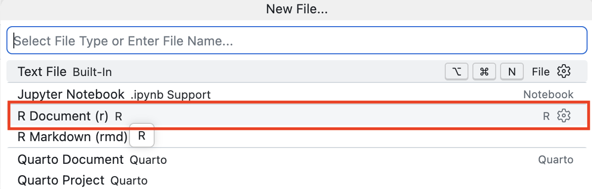
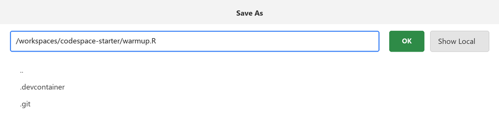
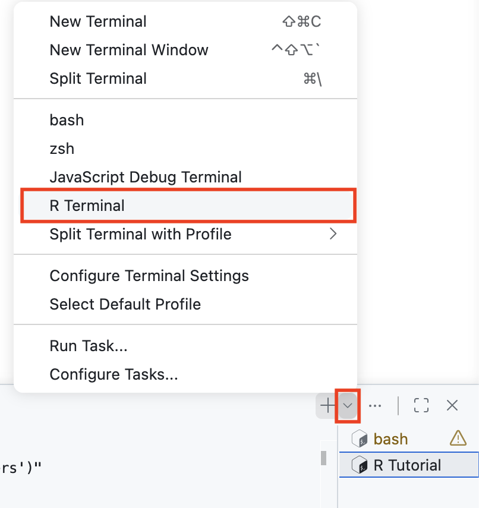
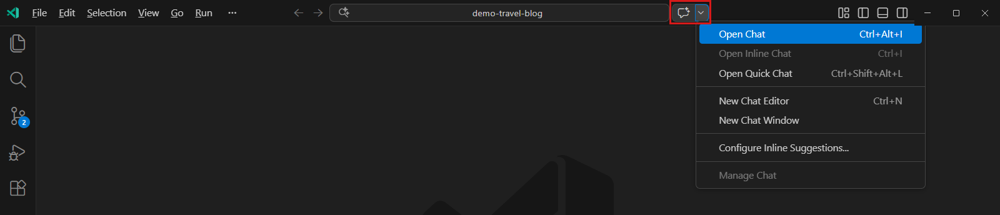
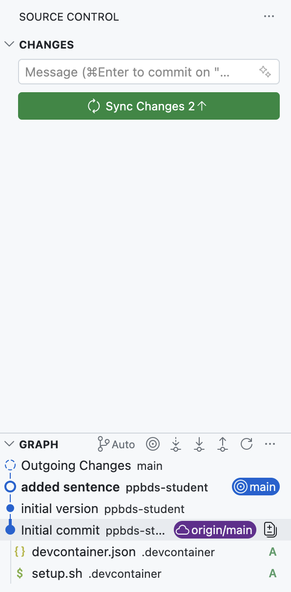
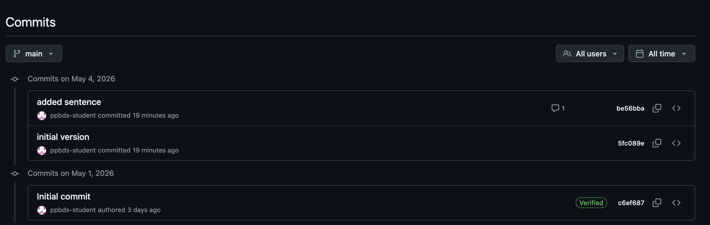

```{r setup, include = FALSE}
library(learnr)
library(tutorial.helpers)
library(knitr)

knitr::opts_chunk$set(echo = FALSE)
knitr::opts_chunk$set(out.width = '90%')
options(tutorial.exercise.timelimit = 60,
        tutorial.storage = "local")
```

```{r copy-code-chunk, child = system.file("child_documents/copy_button.Rmd", package = "tutorial.helpers")}
```

```{r info-section, child = system.file("child_documents/info_section.Rmd", package = "tutorial.helpers")}
```

## Introduction
###

This is the first tutorial you should complete after **Getting Started**. It repeats the most important setup ideas so that it can stand on its own. No prior experience is assumed. We move slowly and explain every step.


You will:

* Move around VS Code and use its Terminal tab.
* Create your own GitHub repository.
* Create and run R scripts by hand and with AI.
* Make two plots using the `diamonds` data.
* Commit your files with Git and push them to GitHub.

###

Every tutorial begins in the same place: a Codespace on the `main` branch of [`PPBDS/codespace-starter`](https://github.com/PPBDS/codespace-starter). You then start the tutorial from the R Tutorials view in VS Code. That is where you should be now.

<!-- DK: Cut or add images. -->

The tutorial itself runs in an R process displayed in a Terminal tab named something like **R Tutorial**. Leave that Terminal alone. Closing it stops the tutorial.

<!-- DK: Change all prompts and responses. Ie.

codespace-starter $ pwd
/workspaces/codespace-starter
codespace-starter $  -->

###

<!-- DK: Give URL for Codebase-starter -->

<!-- DK: Sections to have, in order

    Terminal
    Git and GitHub
        starting with connect-repo.
    Script 1
        Using Copilot (show images)
        Commit and push at end. View on web. 
    Script 2
        AI agnostic
        Commit/push at end. Maybe git log question.
    Summary
        URL for repo     -->

 <!-- DK: revisit the start of code/quarto/terminal. First, the starting info is like later tutorials that we have: "You should be in a repo called . . ."  Second, make them shorter by deleting questions you stole for introduction. -->

VS Code is split into a few parts:

* The **Activity Bar** is the row of small icons on the far left.
* The **Side Bar** is the box next to those icons. Click the Explorer icon to see your files. Click the Source Control icon to work with Git.
* The **Editor** is the big space in the middle. This is where you read and change files.
* The **Terminal** is usually at the bottom. This is where you type commands.
* The **Status Bar** is the thin bar across the very bottom.

Here is the whole VS Code window. The Explorer Side Bar is on the left. The Editor is in the middle. The Terminal is inside the red box at the bottom.

```{r}
include_graphics("images/vscode-overview.png")
```

You can make a part bigger or smaller by dragging its edge. If you close something, you can open it again by clicking its icon.

###

Most questions ask you to **Copy/Paste the Command and Response**, shortened to **CP/CR**. Copy the command you typed and the answer the Terminal gave you. Paste both into the answer box.

Your answer may look a little different from ours. That is OK. Usernames, version numbers, and the exact look of the prompt can be different. In our examples we shorten the prompt to just the folder name and a `$`, like `codespace-starter $`. Your real prompt is usually longer, but it means the same thing.

## The Terminal
###

The Terminal is a place where you type commands and the computer answers. In this section you will run a handful of simple, safe commands. Every question is just Copy/Paste the Command and Response.

###

First, make sure you can see the Terminal. It is the panel across the bottom of the window. If it is not there, open it from the menu bar: click **View**, then choose **Terminal**.

```{r}
include_graphics("images/open-terminal-menu.png")
```

You can also open it with the keyboard shortcut shown in the menu, `` Ctrl+` `` (the key just above `Tab`).

###

You want a **bash** Terminal. Look at the top-right corner of the Terminal panel. Click the small down arrow beside the `+`, then choose **bash**. The picture below shows an open bash Terminal: the **TERMINAL** tab is selected, the red box marks the `bash` label, and the `+` and down-arrow buttons for opening more Terminals sit just to its right.

```{r}
include_graphics("images/terminal-on-open.png")
```

You should now have at least two Terminal tabs: **R Tutorial**, which is busy running this tutorial, and **bash**, where you will work. Leave the **R Tutorial** tab alone.

One thing to watch for: a bash Terminal that was already open when the Codespace started shows a long prompt like

````
@davekane-student ➜ /workspaces/codespace-starter (main) $
````

with your GitHub username in place of `davekane-student`. Only a **new** bash Terminal --- one you open yourself, like you just did --- gets our short prompt: the name of the directory you are in, a space, and a dollar sign, like `codespace-starter $`. The two prompts behave identically; the short one just wastes less space. All our examples show the short prompt, so if you see the long one, open a fresh bash Terminal.

### Exercise 1

In the bash Terminal, type `pwd` and press `Enter`. You should see something like the picture below. Then CP/CR.

```{r}
include_graphics("images/pwd-example.png")
```

```{r terminal-1}
question_text(NULL,
    answer(NULL, correct = TRUE),
    allow_retry = TRUE,
    try_again_button = "Edit Answer",
    incorrect = NULL,
    rows = 3)
```

###

````
codespace-starter $ pwd
/workspaces/codespace-starter
codespace-starter $
````

`pwd` means **print working directory**. It tells you which folder you are in. Right now, you should be in the `codespace-starter` folder.

### Exercise 2

Run `ls`. CP/CR.

```{r terminal-2}
question_text(NULL,
    answer(NULL, correct = TRUE),
    allow_retry = TRUE,
    try_again_button = "Edit Answer",
    incorrect = NULL,
    rows = 3)
```

###

````
codespace-starter $ ls
codespace-starter $
````

`ls` shows the files in your folder. Nothing appears because this folder does not have any regular files yet.

### Exercise 3

Run `ls -a`. CP/CR.

```{r terminal-3}
question_text(NULL,
    answer(NULL, correct = TRUE),
    allow_retry = TRUE,
    try_again_button = "Edit Answer",
    incorrect = NULL,
    rows = 3)
```

###

````
codespace-starter $ ls -a
.  ..  .devcontainer  .git
codespace-starter $
````

The `-a` part is an **option**. It tells `ls` to show **all** files, including hidden files. Hidden file names start with a dot. Do not change anything inside the `.git` folder.

### Exercise 4

Options change what a command does. Many commands also have a `--help` option that explains how they work without doing anything.

Run:

````
ls --help
````

CP/CR. The response is long, so paste just the first several lines.

```{r terminal-4}
question_text(NULL,
    answer(NULL, correct = TRUE),
    allow_retry = TRUE,
    try_again_button = "Edit Answer",
    incorrect = NULL,
    rows = 10)
```

###

The beginning should look like:

````
codespace-starter $ ls --help
Usage: ls [OPTION]... [FILE]...
List information about the FILEs (the current directory by default).
Sort entries alphabetically if none of -cftuvSUX nor --sort is specified.
````

`--help` is a safe way to learn what a command does. It just prints a description; it never changes your files. Almost every command you meet has a `--help` option, so this is a good habit whenever you see a new one.

### Exercise 5

Now make a file by hand, just to see how it works. Open the Application Menu from the three horizontal bars at the top left. Choose `File -> New File...`.

```{r}
include_graphics("images/create-new-file.png")
```

When VS Code asks what kind of file to make, choose **R Document**.

```{r}

```

Type this single line into the new file:

````
1 + 2
````

Save the file as `warmup.R` at the top level of `codespace-starter`. Press `Cmd/Ctrl + S`; in the Save dialog, make sure the path ends in `codespace-starter/warmup.R`, then press **OK**. A black dot on an Editor tab means the file has unsaved changes; saving makes the dot disappear.

```{r}

```

In the bash Terminal, run `Rscript warmup.R`. CP/CR.

```{r terminal-5}
question_text(NULL,
    answer(NULL, correct = TRUE),
    allow_retry = TRUE,
    try_again_button = "Edit Answer",
    incorrect = NULL,
    rows = 3)
```

###

````
codespace-starter $ Rscript warmup.R
[1] 3
codespace-starter $
````

An R script is a text file containing R commands. `Rscript warmup.R` asks R to run every command in the file. The code stays in the script after it runs, so you can look at it, change it, and run it again.

### Exercise 6

Run `ls` again. CP/CR.

```{r terminal-6}
question_text(NULL,
    answer(NULL, correct = TRUE),
    allow_retry = TRUE,
    try_again_button = "Edit Answer",
    incorrect = NULL,
    rows = 3)
```

###

````
codespace-starter $ ls
warmup.R
codespace-starter $
````

Your new file now appears. The problem is that this file lives inside the `PPBDS/codespace-starter` working copy, which you do **not** own. You cannot save your work to that repository on GitHub. Closing the browser does not erase the file right away, but deleting or rebuilding the Codespace will. You need a repository that belongs to you. That is what the next section sets up.

## Git and GitHub
###

**Git** is a tool that keeps a history of your files. A **repository**, or **repo**, is a folder that Git is watching. **GitHub** is a website that keeps a copy of your repo online, so your work is safe and shareable.

The `codespace-starter` folder you have been working in is one repo, but it belongs to the course, not to you. In this section you will create your own repo, named `introduction`, and connect to it.

We give you a shortcut for this called `connect-repo.sh`. It signs you in to GitHub, creates (or finds) a repo with the name you give it, and opens that repo's folder. Later tutorials will show you the individual Git commands hiding behind this shortcut.

### Exercise 1

Run:

````
.devcontainer/connect-repo.sh introduction
````

If a sign-in message appears, follow it: open the link in your browser, authorize GitHub, then return to VS Code. The script may reload the VS Code window or ask you to open a folder. If the Explorer still shows `codespace-starter`, use `File -> Open Folder...` and open `/workspaces/introduction`.

CP/CR the useful part of the script's response. If the window reload cleared the output, paste the first prompt you see in the new `introduction` Terminal instead.

```{r github-1}
question_text(NULL,
    answer(NULL, correct = TRUE),
    allow_retry = TRUE,
    try_again_button = "Edit Answer",
    incorrect = NULL,
    rows = 8)
```

###

Your output may say that the repository was created, cloned, or was already present. All three are fine. The result is a GitHub repository named `introduction` and a folder at `/workspaces/introduction`.

The two folders now sit beside each other:

````
/workspaces/codespace-starter
/workspaces/introduction
````

The first supplied the Codespace and the tutorial. The second is yours and will hold your work. 

### Exercise 2

Open a new bash Terminal if necessary. Run `pwd`. CP/CR.

```{r github-2}
question_text(NULL,
    answer(NULL, correct = TRUE),
    allow_retry = TRUE,
    try_again_button = "Edit Answer",
    incorrect = NULL,
    rows = 3)
```

###

````
introduction $ pwd
/workspaces/introduction
introduction $
````

Stop and fix the open folder if your result still ends in `codespace-starter`. All remaining work belongs in `/workspaces/introduction`.

### Exercise 3

Run `ls -a`. CP/CR.

```{r github-3}
question_text(NULL,
    answer(NULL, correct = TRUE),
    allow_retry = TRUE,
    try_again_button = "Edit Answer",
    incorrect = NULL,
    rows = 3)
```

###

````
introduction $ ls -a
.  ..  .git
introduction $
````

The hidden `.git` directory is what defines a Git repository. Git fill it with your work as you proceed. You never use directly, or even examine, the `.git` folder.

### Exercise 4

Check your repository on GitHub.

Open a new browser tab and go to [github.com](https://github.com). Sign in with the same account if you are asked. Click your profile picture in the top-right corner, choose **Your repositories**, and find the one named **introduction**. Click it.

You are now on your repository's page. Near the top-right of the box that lists your files, there is a **Commits** link showing how many commits the repository has. The red box in the picture below marks it.

```{r}
include_graphics("images/analysis-1-gh-1.png")
```

Your repository is brand new, so it will have far fewer files than this example and only a commit or two — but the page layout and the **Commits** link are in the same place. Copy and paste the text of the **Commits** link (for example, `1 Commit`).

```{r github-4}
question_text(NULL,
    answer(NULL, correct = TRUE),
    allow_retry = TRUE,
    try_again_button = "Edit Answer",
    incorrect = NULL,
    rows = 3)
```

###

The picture shows a different repository, `04-github-1` with several files, so it has `3 Commits`. Yours might just say `1 Commit` right now. That is fine.

Seeing the repository in your browser proves two things: the repository really exists on GitHub, and it belongs to **you** (your username appears in the address bar, like `github.com/your-username/introduction`). This is the online home where your work will live. Later in this tutorial you will push files here and watch the commit count grow.

## Script 1: GitHub Copilot
###

Now you will use your first AI helper. **GitHub Copilot** is an AI assistant built right into VS Code. We start with Copilot because it is always available and works out of the box.

Open a new R Terminal from the Terminal menu. Keep the **R Tutorial** Terminal running, and use this new R Terminal for the R commands below. Click the small arrow beside the `+`, then choose **R Terminal**. The red boxes show where to click.

```{r}

```

###

Click the Chat button in the title bar, then click **Open Chat**. The red box in the picture shows the Chat button. If Copilot asks you to sign in, use the same GitHub account you used for the Codespace.

```{r}

```

Before starting any AI agent, check that its Terminal or workspace is `/workspaces/introduction`. An agent reads and writes files relative to the folder it starts in. An agent accidentally started in `codespace-starter` can create files that never show up in your `introduction` Explorer and never reach your repository.

###

AI agents may offer a **Full Access**, **Always Allow**, or similarly named mode. Do **not** use it in this course. Keep the agent in a review or permission-based mode. Read each proposed command or file change, approve it once if it makes sense, and reject or question anything surprising. Never paste passwords, tokens, private data, or secrets into an AI prompt.

### Exercise 1

Give Copilot this prompt, adjusting the wording if needed:

> Create an R script named script-1.R. It should add the integers from 1 through 10 and print the result. Run the script with Rscript and tell me the result. Do not install any packages.

Review and approve the file write and the `Rscript` command one at a time. Then, in the R Terminal, run:

````
tutorial.helpers::show_file("script-1.R")
````

CP/CR.

```{r script-1-1}
question_text(NULL,
    answer(NULL, correct = TRUE),
    allow_retry = TRUE,
    try_again_button = "Edit Answer",
    incorrect = NULL,
    rows = 8)
```

###

Your answer will vary, but the sum should be `55` and `script-1.R` should appear in Explorer. One reasonable answer is:

````
numbers <- 1:10
total <- sum(numbers)
print(total)
````

### Exercise 2

Finish the script with a plot. Ask Copilot:

> Update script-1.R so that it keeps the addition example and then makes a beautiful plot using the diamonds data set from ggplot2. Use library(tidyverse) and no other library calls or data sets. Save the plot as diamonds-1.png. Run the script and fix any errors. Do not install packages.

Review the changes and allow the agent to run the script. Then run the following in the R Terminal and CP/CR:

````
tutorial.helpers::show_file("script-1.R")
````

```{r script-1-2}
question_text(NULL,
    answer(NULL, correct = TRUE),
    allow_retry = TRUE,
    try_again_button = "Edit Answer",
    incorrect = NULL,
    rows = 18)
```

###

Here is one possible answer:

````
library(tidyverse)

numbers <- 1:10
total <- sum(numbers)
print(total)

diamonds_plot <- diamonds |>
  count(cut) |>
  ggplot(aes(x = cut, y = n, fill = cut)) +
  geom_col(show.legend = FALSE) +
  labs(
    title = "Diamonds at Every Level of Cut",
    subtitle = "Counts in the ggplot2 diamonds data set",
    x = NULL,
    y = "Number of diamonds"
  ) +
  theme_minimal(base_size = 14)

ggsave("diamonds-1.png", diamonds_plot, width = 8, height = 5)
````

This solution loads only **tidyverse**, uses only `diamonds`, assigns the plot to an object, and saves a PNG. Click `diamonds-1.png` in Explorer to inspect your own result.

### Exercise 3

Time to save your work. **Git** records a snapshot of your files, called a **commit**. A **push** sends your commits up to GitHub. Do both by hand through the Source Control view.

Click the Source Control icon (the branching icon) in the Activity Bar on the left. Your new files appear under **Changes**. Each one has a `U`, which means **untracked**: Git can see the file, but it is not yet part of any commit.

```{r}
include_graphics("images/source-control.png")
```

Now commit and push:

1. Review the files under **Changes**. Do not commit secrets, tokens, or files you do not understand.
2. Type `Add script-1 and diamonds plot` as the commit message.
3. Press **Commit**. The Codespace is set up to include all the displayed changes.
4. Press **Sync Changes** to push the commit to GitHub.

After you commit, the green button becomes **Sync Changes**, like this:

```{r}

```

When the sync finishes, view your work on the web. Open your `introduction` repository on GitHub and refresh the page. Copy/paste the file names shown on the repository's main page.

The GitHub page looks like this. This older example has a different repo name and different files, but the layout is the same.

```{r}
include_graphics("images/github-repository.png")
```

```{r script-1-3}
question_text(NULL,
    answer(NULL, correct = TRUE),
    allow_retry = TRUE,
    try_again_button = "Edit Answer",
    incorrect = NULL,
    rows = 6)
```

###

You should see at least:

````
diamonds-1.png
script-1.R
````

This GitHub page is the online copy of your work. The Codespace is where you work. The GitHub repo is where you keep and share it. If your computer stopped working right now, your commit would still be safe on GitHub.

###

Copilot is only one option. The Codespace may also provide command-line agents from Google, OpenAI, Anthropic, and other providers. These tools have different interfaces, models, limits, and account requirements, but the core workflow is the same:

1. describe the outcome you want;
2. let the AI inspect the relevant files;
3. review proposed changes and commands;
4. run or render the result;
5. inspect the result and ask for revisions.

## Script 2: AI agnostic
###

From this point forward, this course is **AI agnostic**. "Ask AI" means use whichever AI you prefer — Copilot, Antigravity, or any other agent the Codespace provides. We will generally show prompts and results, not tool-specific buttons or screenshots. 

### Exercise 1

Use any AI to complete this task:

> Create script-2.R. Choose ten positive numbers, store them in a vector, and print their sum and mean. Run the script with Rscript and fix any errors. Do not install packages.

In the R Terminal, run `tutorial.helpers::show_file("script-2.R")`. CP/CR.

```{r script-2-1}
question_text(NULL,
    answer(NULL, correct = TRUE),
    allow_retry = TRUE,
    try_again_button = "Edit Answer",
    incorrect = NULL,
    rows = 10)
```

###

One possible answer is:

````
numbers <- c(3, 5, 8, 13, 21, 34, 55, 89, 144, 233)

print(sum(numbers))
print(mean(numbers))
````

The particular numbers and results do not matter. The important result is a saved, reproducible script that runs successfully.

### Exercise 2

Finish the second script with another plot. Ask your AI:

> Update script-2.R so that it keeps the number example and then makes a beautiful plot using the diamonds data set from ggplot2. Use library(tidyverse) and no other library calls or data sets. Make a different kind of plot from the one in script-1.R, save it as diamonds-2.png, run the script, and fix any errors. Do not install packages.

In the R Terminal, run `tutorial.helpers::show_file("script-2.R")`. CP/CR.

```{r script-2-2}
question_text(NULL,
    answer(NULL, correct = TRUE),
    allow_retry = TRUE,
    try_again_button = "Edit Answer",
    incorrect = NULL,
    rows = 20)
```

###

Here is one possible plot portion:

````
library(tidyverse)

diamonds_plot <- diamonds |>
  slice_sample(n = 5000) |>
  ggplot(aes(x = carat, y = price, color = cut)) +
  geom_point(alpha = 0.35, size = 1.2) +
  scale_y_continuous(labels = scales::label_dollar()) +
  labs(
    title = "Price Rises Rapidly with Diamond Weight",
    subtitle = "A random sample of 5,000 diamonds, colored by cut",
    x = "Weight (carats)",
    y = "Price",
    color = "Cut"
  ) +
  theme_minimal(base_size = 14) +
  theme(legend.position = "bottom")

ggsave("diamonds-2.png", diamonds_plot, width = 8, height = 5)
````

### Exercise 3

Save this work too. Through the Source Control view, commit your new files with the message `Add script-2 and second diamonds plot`, then press **Sync Changes** to push.

Then, in the bash Terminal, run `git log`. CP/CR the most recent entry.

```{r script-2-3}
question_text(NULL,
    answer(NULL, correct = TRUE),
    allow_retry = TRUE,
    try_again_button = "Edit Answer",
    incorrect = NULL,
    rows = 8)
```

###

Your answer should look something like:

````
introduction $ git log
commit be56bbaedd692a6d29bba410f0a6fd5b1d844a64 (HEAD -> main, origin/main, origin/HEAD)
Author: ppbds-student <ppbds-student@users.noreply.github.com>
Date:   Thu Jul 23 16:57:38 2026 +0000

    Add script-2 and second diamonds plot
````

`git log` lists your commits, newest first. When the newest line shows both `main` and `origin/main`, your Codespace and GitHub agree on the latest commit — your push worked. You can also see the same history on GitHub by clicking the commit-count link on the repo page.

```{r}

```

## Summary
###

You used the major parts of VS Code, practiced bash commands, created and connected a repository, ran R scripts, directed AI agents, inspected their work, made plots, and used Git and GitHub.

From now on, begin course work with the same routine:

1. Start the `codespace-starter` Codespace.
2. Create or connect to the requested repository and open its folder.
3. Start whichever AI you want to use, in review mode.
4. Start the tutorial.

Future tutorials will often say only "create and connect to a repo," "ask AI," "run," or "commit and push." You now know the choices behind those instructions. We leave the choice of AI and the exact mechanics to you, but you must always review the results.

### Exercise 1

Copy and paste the URL for your `introduction` repository. This is the last question in the tutorial.

```{r summary-1}
question_text(NULL,
    answer(NULL, correct = TRUE),
    allow_retry = TRUE,
    try_again_button = "Edit Answer",
    incorrect = NULL,
    rows = 3)
```

###

````
https://github.com/ppbds-student/introduction
````

The `github.com/...` URL is the repository. A `github.dev` or `githubpreview.dev` URL points to a temporary working interface, not the repository page you should submit.

```{r download-answers, child = system.file("child_documents/download_answers.Rmd", package = "tutorial.helpers")}
```
