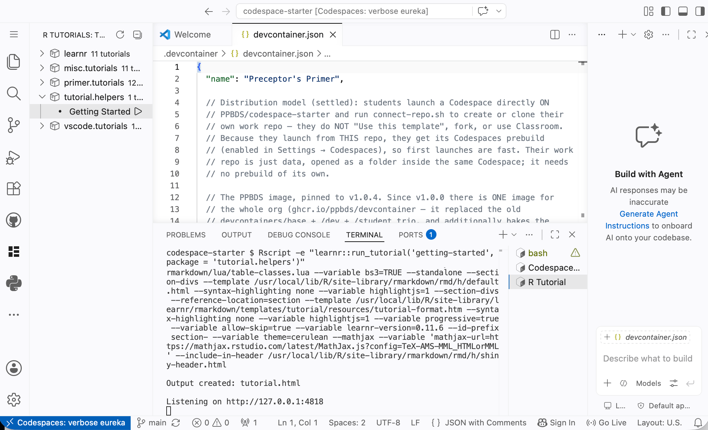
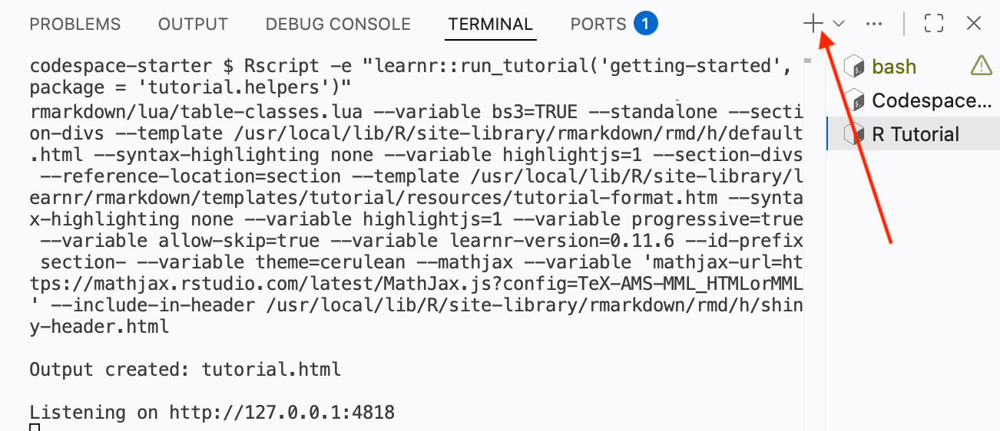
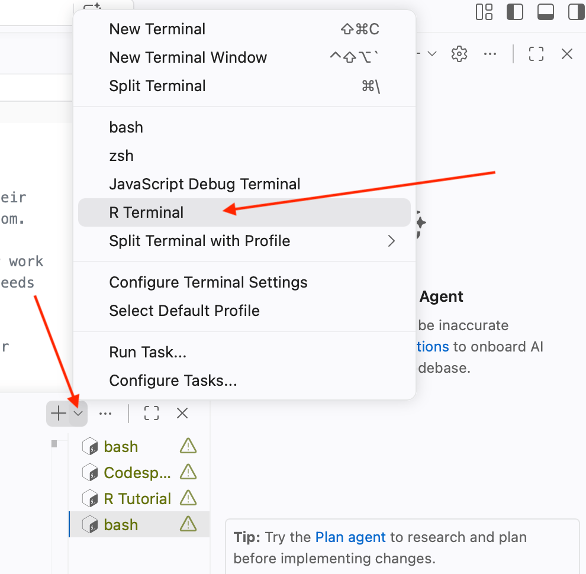
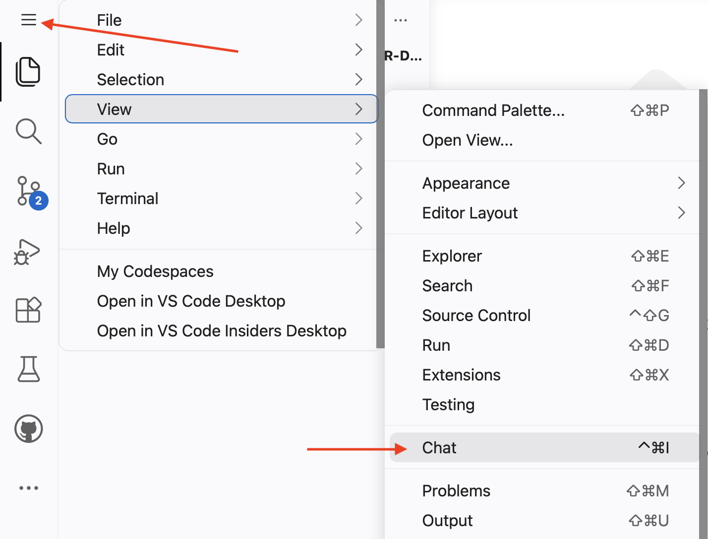
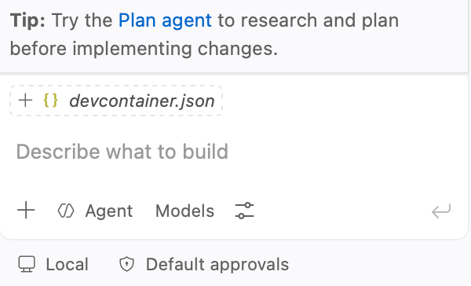
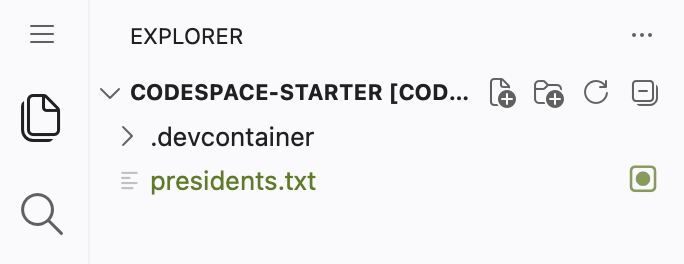
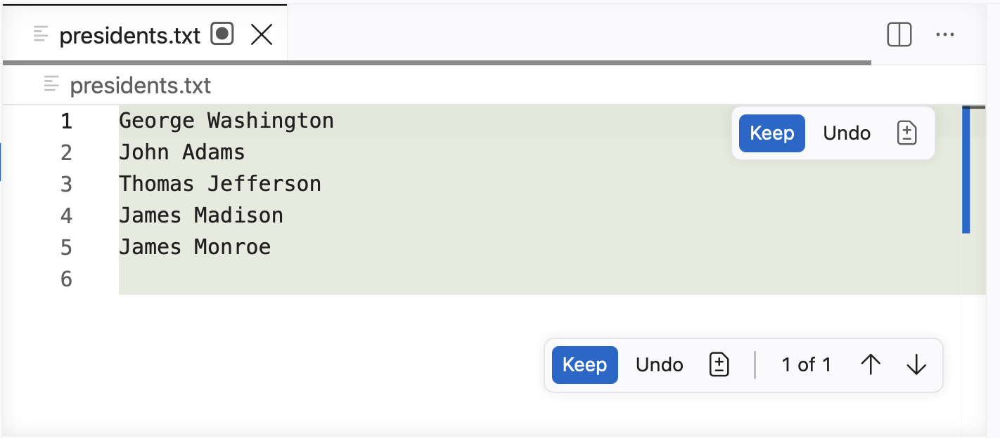
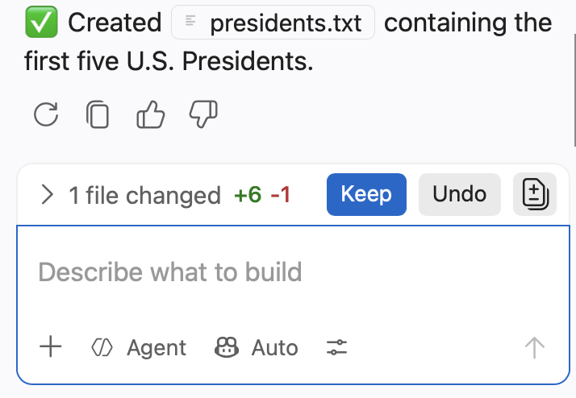
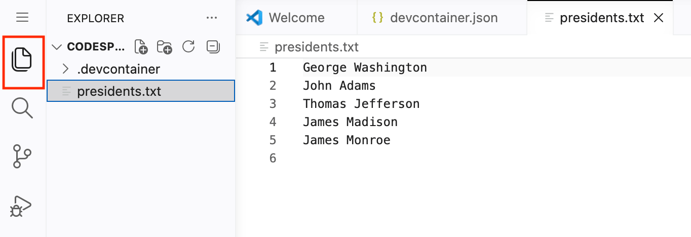
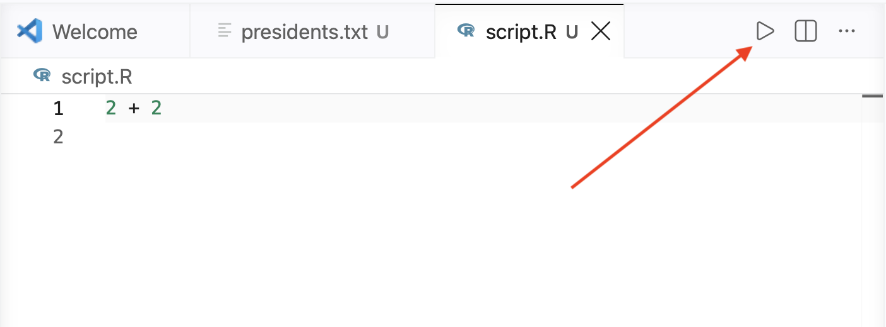



## Information
###

```{r}
#| label: information-1
#| echo: false
learnr2::student_info()
```

<!-- Get rid of the images which use dark mode. They are unreadable! -->

## Introduction
###

This tutorial, intended for beginners, tours the workspace you will use for everything that follows: the bash Terminal, the R Terminal, and [GitHub Copilot](https://github.com/copilot), an AI coding assistant, ending with the different ways to run R code. Complete it inside a [GitHub Codespace](https://github.com/features/codespaces), as set up [here](https://ppbds.github.io/primer/getting-started.html).

###

After starting the tutorial, your Codespace looks something like this:

{width=90%}

## Bash Terminal
###

The **bash Terminal** is a text-based interface in which you type commands to tell your Codespace what to do. You send a command, the terminal executes it, and it (usually) gives you something back. In this section you will practice the most common bash commands. (In the next section you will see that the R Terminal works exactly the same way.)

###

You need a bash Terminal in which to type commands. The Panel at the bottom of VS Code already shows one. To open another at any time, press the plus button (`+`) on the right side of the Panel.


{width=90%}

### Exercise 1

In the bash Terminal, run `whoami`. CP/CR.

```{r}
#| label: bash-terminal-1
#| echo: false
learnr2::question(
  "In the bash Terminal, run whoami. CP/CR.",
  type = "reflection",
  show_text = FALSE
)
```

###

```
codespace-starter $ whoami
rstudio
codespace-starter $
```

###

`whoami` prints the username of the account you are signed in as. Your Codespace is a complete computer running in the cloud, and you interact with it as the `rstudio` user. It is OK if your formatting differs from ours. What matters is that you show that you executed the command as instructed.

### Exercise 2

In the bash Terminal, run `echo $0`. ("Run" means to type the command and then press `Enter`, which is the `return` key on a Mac and the `enter` on Windows/Linux. "Execute" means the same thing is "run" in this context.)

CP/CR.

```{r}
#| label: bash-terminal-2
#| echo: false
learnr2::question(
  "In the bash Terminal, run echo $0. (\"Run\" means to type the command and then press Enter, which is the return key on a Mac and the enter on Windows/Linux. \"Execute\" means the same thing is \"run\" in this context.) CP/CR.",
  type = "reflection",
  show_text = FALSE
)
```

###

```
codespace-starter $ echo $0
/bin/bash
codespace-starter $
```

###

A "shell" is the program that reads and interprets the commands you type in a terminal. `echo $0` prints the name of the shell you are using: `/bin/bash`, the [Bash shell](https://en.wikipedia.org/wiki/Bash_(Unix_shell)). Every command you run in this bash Terminal --- starting with the `whoami` you just ran --- is interpreted by bash.

### Exercise 3

In the bash Terminal, run `pwd`.

CP/CR.

```{r}
#| label: bash-terminal-3
#| echo: false
learnr2::question(
  "In the bash Terminal, run pwd. CP/CR.",
  type = "reflection",
  show_text = FALSE
)
```

###

```
codespace-starter $ pwd
/workspaces/codespace-starter
codespace-starter $
```

###

`pwd` stands for **p**rint **w**orking **d**irectory --- the folder the shell is currently "in." GitHub Codespaces place your starting repository, which is `codebase-starter` in this case, under `/workspaces/`, so that is where you begin. Almost every command you run acts in this directory unless you tell it otherwise.

### Exercise 4

In the bash Terminal, run `ls`. (This is the lowercase letter `L` followed by the lowercase letter `S`.)

CP/CR.

```{r}
#| label: bash-terminal-4
#| echo: false
learnr2::question(
  "In the bash Terminal, run ls. (This is the lowercase letter L followed by the lowercase letter S.) CP/CR.",
  type = "reflection",
  show_text = FALSE
)
```

###

```
codespace-starter $ ls
codespace-starter $
```

###

`ls` **l**i**s**ts the files in the working directory. Notice that nothing was printed! That is because, by default, `ls` hides any file or folder whose name begins with a dot (`.`). The directory is not actually empty, as we will see next.

### Exercise 5

In the bash Terminal, run `ls -a`.

CP/CR.

```{r}
#| label: bash-terminal-5
#| echo: false
learnr2::question(
  "In the bash Terminal, run ls -a. CP/CR.",
  type = "reflection",
  show_text = FALSE
)
```

###

```
codespace-starter $ ls -a
.  ..  .devcontainer  .git
codespace-starter $
```

###

The `-a` flag (for "all") tells `ls` to reveal the hidden entries. `.` is the current directory and `..` is the directory just above it. `.git` stores the project's version history, and `.devcontainer` holds the configuration for your Codespace. A "flag" like `-a` is an option that changes how a command behaves.

### Exercise 6

In the bash Terminal, run `ls .devcontainer`.

CP/CR.

```{r}
#| label: bash-terminal-6
#| echo: false
learnr2::question(
  "In the bash Terminal, run ls .devcontainer. CP/CR.",
  type = "reflection",
  show_text = FALSE
)
```

###

```
codespace-starter $ ls .devcontainer
AGENTS.md  STUDENT_WORKFLOW.md  connect-repo.sh  devcontainer.json  welcome.sh
codespace-starter $
```

###

Giving `ls` a directory name lists what is inside that directory. The `.devcontainer` folder tells GitHub Codespaces how to build your workshop --- which version of R, Python, and Quarto to install, and which AI tools to include --- so that every student gets an identical setup.

### Exercise 7

In the bash Terminal, run `head .devcontainer/STUDENT_WORKFLOW.md`.

CP/CR.

```{r}
#| label: bash-terminal-7
#| echo: false
learnr2::question(
  "In the bash Terminal, run head .devcontainer/STUDENT_WORKFLOW.md. CP/CR.",
  type = "reflection",
  show_text = FALSE
)
```

###

```
codespace-starter $ head .devcontainer/STUDENT_WORKFLOW.md
# Student workflow

This Codespace is your **workshop** — it already has R, Python (with the
usual data-science libraries), Quarto, the AI assistants, and all the right
settings. But this `codespace-starter` repo isn't *yours*, so you won't save
your work here. Instead, you'll make your **own repo** and work in it. The
tools travel with the Codespace, so your repo needs no setup of its own.

## 1. Create or connect to your repo (one command)

codespace-starter $
```

###

`head` prints the first ten lines of a file, a quick way to peek at its contents without opening it. Because `codespace-starter` is not your own repo, you will soon learn to create your own with `connect-repo` and save your work there.

### Exercise 8

Let us make the bash Terminal "sleep" by running `sleep 5`. The `sleep 5` command pauses execution for 5 seconds.

CP/CR.

```{r}
#| label: bash-terminal-8
#| echo: false
learnr2::question(
  "Let us make the bash Terminal \"sleep\" by running sleep 5. The sleep 5 command pauses execution for 5 seconds. CP/CR.",
  type = "reflection",
  show_text = FALSE
)
```

###

```
codespace-starter $ sleep 5
codespace-starter $
```

###

Many commands do their work silently and print nothing. We can change the duration with `sleep [number]`, where the number is how many seconds the pause lasts.

### Exercise 9

Run `sleep 60` in the bash Terminal. This command makes the terminal sleep for 60 seconds. To cancel the running `sleep` command, press `Ctrl + C` on your keyboard. Do so now, before `sleep 60` finishes.

CP/CR.

```{r}
#| label: bash-terminal-9
#| echo: false
learnr2::question(
  "Run sleep 60 in the bash Terminal. This command makes the terminal sleep for 60 seconds. To cancel the running sleep command, press Ctrl + C on your keyboard. Do so now, before sleep 60 finishes. CP/CR.",
  type = "reflection",
  show_text = FALSE
)
```

###

```
codespace-starter $ sleep 60
^C
codespace-starter $
```

###

`Ctrl + C` interrupts whatever process is currently running in the terminal and returns you to the prompt; the `^C` marks where you pressed it. When a command hangs or you change your mind, `Ctrl + C` stops it.

## R Terminal
###

All the terminology associated with VS Code is confusing. The "Panel" is the bottom of the VS Code window. There are several "views" associated with the Panel, including "Output," "Ports," and "Terminal." Within the Terminal view, you can have multiple "terminals" running. Each terminal has an associated "tab" on the right side of the Panel which you can use to select that terminal. A terminal is just a window for talking to a program: a bash Terminal runs the bash shell; an R Terminal runs R. Different terminals serve different purposes.

###

So far, we have learned about the "bash Terminal," which lets you talk to the computer. The "R Terminal" lets you talk to R, the programming language you will use for data science. The two work the same way: you type a command, press `Enter`, and the terminal executes the command and gives you something back. The only real difference is the language --- bash commands like `ls` and `pwd` on the one hand, R commands like `sqrt(16)` on the other. Each exercise in this section asks you to run a one-line command and then CP/CR.

###

Create a new R Terminal by pressing the down arrow next to the plus button on the right side of the Panel Toolbar and selecting "R Terminal."


{width=90%}

###

You may need to click on the new  "R Interactive" tab at the bottom of the list of terminals in order to bring it to the top of the Panel.

### Exercise 1

In the R Terminal, run `4 + 5`.

CP/CR.

```{r}
#| label: r-terminal-1
#| echo: false
learnr2::question(
  "In the R Terminal, run 4 + 5. CP/CR.",
  type = "reflection",
  show_text = FALSE
)
```

###

```
R 4.6.1> 4 + 5
[1] 9
R 4.6.1>
```

###

At its simplest, R is a calculator. Just as the bash Terminal took `whoami` and handed back your username, the R Terminal takes `4 + 5` and hands back the result. You send a command; the terminal sends something back. The `[1]` at the start of the output is a counter telling you that the line begins with the first element of the result --- useful when a result has many values spread across several lines.

### Exercise 2

In the R Terminal, run `sqrt(16)`.

CP/CR.

```{r}
#| label: r-terminal-2
#| echo: false
learnr2::question(
  "In the R Terminal, run sqrt(16). CP/CR.",
  type = "reflection",
  show_text = FALSE
)
```

###

```
R 4.6.1> sqrt(16)
[1] 4
R 4.6.1>
```

###

`sqrt()` is a **function**. You "call" a function by writing its name followed by parentheses, placing any input --- here, `16` --- inside them. That input is called an **argument**. Almost everything you do in R involves calling functions on arguments.

### Exercise 3

In the R Terminal, run `getwd()`. This stands for **get** **w**orking **d**irectory, meaning that we want to know the directory in which the R process is currently located.

CP/CR.

```{r}
#| label: r-terminal-3
#| echo: false
learnr2::question(
  "In the R Terminal, run getwd(). This stands for get working directory, meaning that we want to know the directory in which the R process is currently located. CP/CR.",
  type = "reflection",
  show_text = FALSE
)
```

###

```
R 4.6.1> getwd()
[1] "/workspaces/codespace-starter"
R 4.6.1>
```

###

`getwd()` is the R equivalent of the bash command `pwd` you ran earlier. Here it shows that R is operating inside your Codespace at `/workspaces/codespace-starter`. Note that `getwd()` takes no arguments, but you still need the parentheses to call it.

### Exercise 4

In the R Terminal, run `R.version.string`.

CP/CR.

```{r}
#| label: r-terminal-4
#| echo: false
learnr2::question(
  "In the R Terminal, run R.version.string. CP/CR.",
  type = "reflection",
  show_text = FALSE
)
```

###

```
R 4.6.1> R.version.string
[1] "R version 4.6.1 (2026-06-24)"
R 4.6.1> 
```

###

Your version of R may differ from the example above --- that's fine, as long as it's reasonably recent. `R.version.string` is not a function call --- it has no parentheses --- but a built-in variable whose value R simply prints.

### Exercise 5

`show_file()` is a commonly used function from the **learnr2** package. It makes it easy for you to share the contents of another file with your instructor, especially a file that you have edited.

###

You can generally call a function by giving its name followed by parentheses, as with `getwd()`. However, we often prefix the function name with the name of the package in which the function is found, separated by two colons. Since `show_file()` is in the **learnr2** package, we can call it using this "double-colon" notation: `learnr2::show_file()`.

In the R Terminal, run this command:

```
learnr2::show_file(file.path(R.home(), "COPYING"), end = 7)
```

CP/CR.

```{r}
#| label: r-terminal-5
#| echo: false
learnr2::question(
  "CP/CR.",
  type = "reflection",
  show_text = FALSE
)
```

###

```{r}
#| label: r-terminal-5-answer
#| include: false
learnr2::show_file(file.path(R.home(), "COPYING"), end = 7)
```

For now, don't worry about what `R.home()` and `file.path()` are doing, although you can read about them by running `?R.home` and `?file.path` in the R Terminal. Those details are less important than seeing the intended usage of `show_file()`.

### Exercise 6

Tutorials can include written responses. You have already seen several examples. Sometimes those written answers are simply copies of commands and their results. Other times, we will ask you to write one or more sentences of prose.

Copy and paste everything from the exercise header above, beginning with "Exercise 6," through the end of this sentence into the answer box below. In other words, you are copying from this tutorial, not from the Terminal. Press "Submit Answer."

```{r}
#| label: r-terminal-6
#| echo: false
learnr2::question(
  "Copy and paste everything from the exercise header above, beginning with \"Exercise 6,\" through the end of this sentence into the answer box below. In other words, you are copying from this tutorial, not from the Terminal. Press \"Submit Answer.\"",
  type = "reflection",
  show_text = FALSE
)
```

###

Once you submit an answer, it is locked: you cannot change it. You also cannot click "Continue" until you have submitted every question above it. Don't stress! Most instructors grade tutorials on pass/fail basis, so, as long as you make an honest effort, you will do fine.

### Exercise 7

When we want to see a web page, we ask for a screenshot rather than copied text. To take one, press `Cmd + Shift + 4` on a Mac or `Win + Shift + S` on Windows, then select the part of the screen you want. Click in the answer box and press `Ctrl + V` (`Cmd + V` on a Mac) to paste it.

###

Go to [the homepage](https://ppbds.github.io/learnr2/) of the **learnr2** package and take a screenshot of the browser window from "learnr2" in the upper-left corner through the end of the first paragraph. Paste it below.

```{r}
#| label: r-terminal-7
#| echo: false
learnr2::question(
  "Go to the homepage of the learnr2 package and take a screenshot of the browser window from \"learnr2\" in the upper-left corner through the end of the first paragraph. Paste it below.",
  type = "reflection",
  allow_image = TRUE,
  show_text = FALSE
)
```

###

Your screenshot should show the package name, **learnr2**, and the paragraph that begins "learnr2 creates interactive R tutorials that run entirely in the reader's web browser."

Again, your answer never needs to match ours exactly.

## GitHub Copilot
###

Your Codespace includes **GitHub Copilot**, an AI coding assistant that can answer questions, explain code, create and edit files, and run commands for you. 

###

Copilot Chat usually opens automatically when your Codespace starts. If it is not open, click the menu button in the top-left corner, marked with a red arrow below. Select **View**, and then click **Chat**, marked with another red arrow. You can also open Chat by pressing `Cmd/Ctrl + Alt + I`.

{width=90%}

When the Copilot Chat view opens, **Agent** will probably be selected by default from mode menu near the chat box. Agent mode lets Copilot work with files and Terminals in your Codespace. If you are asked to sign in or authorize GitHub Copilot, follow the instructions on the screen. Keep the Chat view open throughout this section.

### Exercise 1

The bottom of the Chat window looks like this:

{width=90%}

In the Copilot chat box, type the following message and press `Enter`. Replace `<your-name>` with your actual name.

```
Hello! My name is <your-name>
```

Copy Copilot's response into the box below. This is the only exercise in which we ask you to copy what the AI says back. Usually, we will confirm its work by checking the file which it has edited.

```{r}
#| label: github-copilot-1
#| echo: false
learnr2::question(
  "Copy Copilot's response into the box below. This is the only exercise in which we ask you to copy what the AI says back. Usually, we will confirm its work by checking the file which it has edited.",
  type = "reflection",
  show_text = FALSE
)
```

###

```
Hello David! How can I help you today?
```

###

GitHub Copilot works like ChatGPT. You "talk" to it in plain English, and it responds. Your exact response will differ from ours --- AI does not usually give the same answer twice --- and that is fine.

### Exercise 2

Copilot can do much more than chat. In Agent mode, which is the default, it can create and edit files for you. Send this message:

```
Make a file called presidents.txt which includes the names of the first 5 US Presidents.
```

Copilot might just create the file in your working directory without checking with you. Click on the Explorer icon to check.

{width=90%}

Note the dark circle inside the box next to `presidents.txt`. A dark circle alone indicates a file that has been changed *by you* but not saved. A file created (or edited) by AI also shows a dark circle, but within a box to indicate AI involvement.

###

Or, Copilot might open the new file in the Editor and display a **Keep** button. Click **Keep** to accept the file.

{width=90%}

###

The **Keep** button may also appear in a smaller change summary near the Copilot chat box.

{width=90%}

Or maybe not. AI is changing all the time!

###

From the *R Terminal* (not the bash Terminal), run:

```
learnr2::show_file("presidents.txt")
```

CP/CR.

```{r}
#| label: github-copilot-2
#| echo: false
learnr2::question(
  "CP/CR.",
  type = "reflection",
  show_text = FALSE
)
```

###

```
George Washington
John Adams
Thomas Jefferson
James Madison
James Monroe
```

###

Click the Explorer icon at the top of the Activity Bar. The Explorer lists every file in your working directory, and `presidents.txt` should now appear there. Click on it to open the file in the Editor and see its contents directly. The Explorer is useful whenever you want to inspect a file that AI created or edited.

The Explorer icon is marked with a red square below.

{width=90%}

### Exercise 3

We are done with the presidents example. Now ask Copilot to create a very small R program. Send this message:

```
Create an R script called script.R containing only this line: 2 + 2. Do not run the script.
```

If Copilot asks you to keep or accept the file, do so. Then run this command in the R Terminal:

```
learnr2::show_file("script.R")
```

CP/CR.

```{r}
#| label: github-copilot-3
#| echo: false
learnr2::question(
  "CP/CR.",
  type = "reflection",
  show_text = FALSE
)
```

###

```
2 + 2
```

###

An R script is a plain-text file whose name ends in `.R`. Creating or opening a script does not run it. Running the script means asking R to execute the instructions saved inside it.

### Exercise 4

In the Explorer, click `script.R` to open it in the Editor. Click the triangular **Run Source** button in the upper-right corner of the Editor. Look in the R Terminal for the generated `source()` command, the line of code, and its result.

The Run Source button is marked with a red arrow below.

{width=90%}

CP/CR.

```{r}
#| label: github-copilot-4
#| echo: false
learnr2::question(
  "The Run Source button is marked with a red arrow below. CP/CR.",
  type = "reflection",
  show_text = FALSE
)
```

###

```
R 4.6.1> source("/workspaces/codespace-starter/script.R", encoding = "UTF-8", echo = TRUE)

> 2 + 2
[1] 4
R 4.6.1>
```

###

The Run Source button saves the open file and sends a `source()` command with its full path to the active R Terminal. The setting `echo = TRUE` results in each instruction being displayed before R executes it.

### Exercise 5

Make sure `script.R` is still open. Place your cursor on the line `2 + 2` and press `Cmd/Ctrl + Enter`. This runs the current line rather than sourcing the entire file.

CP/CR.

```{r}
#| label: github-copilot-5
#| echo: false
learnr2::question(
  "Make sure script.R is still open. Place your cursor on the line 2 + 2 and press Cmd/Ctrl + Enter. This runs the current line rather than sourcing the entire file. CP/CR.",
  type = "reflection",
  show_text = FALSE
)
```

###

```
R 4.6.1> 2 + 2
[1] 4
R 4.6.1>
```

###

The Editor must have focus so VS Code knows which line to send to the active R Terminal.

### Exercise 6

Keep your cursor in the `script.R` Editor and press `Cmd/Ctrl + Shift + S`. This sources the entire file with echo, just like the Run Source button. CP/CR.

```{r}
#| label: github-copilot-6
#| echo: false
learnr2::question(
  "Keep your cursor in the script.R Editor and press Cmd/Ctrl + Shift + S. This sources the entire file with echo, just like the Run Source button. CP/CR.",
  type = "reflection",
  show_text = FALSE
)
```

###

```
R 4.6.1> source("/workspaces/codespace-starter/script.R", encoding = "UTF-8", echo = TRUE)

> 2 + 2
[1] 4
R 4.6.1>
```

###

The button and the keyboard shortcut both source the saved file in your current R session. Running the current line also uses that session, but it sends only the line where your cursor is located.

### Exercise 7

Now run the script outside your open R session. Press the plus button (`+`) on the right side of the Panel to open a new bash Terminal. At the bash prompt, run:

```
Rscript script.R
```

CP/CR.

```{r}
#| label: github-copilot-7
#| echo: false
learnr2::question(
  "CP/CR.",
  type = "reflection",
  show_text = FALSE
)
```

###

```
codespace-starter $ Rscript script.R
[1] 4
codespace-starter $
```

###

`Rscript` starts a new R process, runs the file, and closes that process when the script finishes. It does not use the R session that is already open in your other Terminal.

### Exercise 8

AI can also run files for you. Return to Copilot Chat and tell your AI:

```
Run script.R
```

Copilot will usually choose a command such as `Rscript script.R`. If it asks for permission, provide it. Copilot should report the result in the Chat view. Enter that result in the box below.

```{r}
#| label: github-copilot-8
#| echo: false
learnr2::question(
  "Copilot will usually choose a command such as Rscript script.R. If it asks for permission, provide it. Copilot should report the result in the Chat view. Enter that result in the box below.",
  type = "reflection",
  show_text = FALSE
)
```

###

`4`

###

You have now run the same script five ways: with the Run Source button, with two keyboard shortcuts, by typing `Rscript` in a bash Terminal, and by asking Copilot to run the script. Asking Copilot delegates the work, but Copilot still uses commands on the computer to carry it out.

### Exercise 9

So far, `script.R` calculates `2 + 2` and displays the result, but it does not give that result a name. In R, an **object** is a name used to store a value so you can use it again. The instruction `x <- 2 + 2` creates an object named `x` and stores the value `4` in it. An object exists only in the R session where it was created.

Ask Copilot to edit and run the script:

```
Edit script.R so its only line is x <- 2 + 2. Then run it with Rscript.
```

If Copilot asks for permission, inspect and approve the command. When it finishes, return to the same R Terminal and run:

```
exists("x")
```

CP/CR.

```{r}
#| label: github-copilot-9
#| echo: false
learnr2::question(
  "CP/CR.",
  type = "reflection",
  show_text = FALSE
)
```

###

```
R 4.6.1> exists("x")
[1] FALSE
R 4.6.1>
```

###

Copilot used `Rscript`, which created `x` in a separate R process and then closed that process. Your open R session therefore reports `FALSE`. it does not know about the `x` that briefly existed in the other session.

### Exercise 10

Open `script.R` in the Editor. It should now contain `x <- 2 + 2`. Keep your cursor in the Editor and press `Cmd/Ctrl + Shift + S` to source the file in your open R session. Then run this command in the R Terminal:

```
x
```

CP/CR.

```{r}
#| label: github-copilot-10
#| echo: false
learnr2::question(
  "CP/CR.",
  type = "reflection",
  show_text = FALSE
)
```

###

```
R 4.6.1> source("/workspaces/codespace-starter/script.R", encoding = "UTF-8", echo = TRUE)

> x <- 2 + 2
R 4.6.1> x
[1] 4
R 4.6.1>
```

###

This time `x` exists because the Editor sourced `script.R` in your open R session. 

The five ways to run the script do not all use the same R session:

| Method | R session used |
|---|---|
| Click Source button | Your open R Terminal |
| `Cmd/Ctrl + Enter` | Your open R Terminal; current line only |
| `Cmd/Ctrl + Shift + S` | Your open R Terminal; entire file |
| `Rscript script.R` in bash | A new process that closes afterward |
| Ask Copilot to use `Rscript` | A new process that closes afterward |

## Summary
###

You now know how to use the bash and R Terminals, how to ask GitHub Copilot to create and edit files, and five ways to run R code. Good luck with your data science journey!

<p>
  
</p>

## Download answers

```{r}
#| label: download-answers-1
#| echo: false
learnr2::question(
  "How many minutes, approximately, did it take you to complete this
  tutorial? For example, an hour and a half would be 90 minutes.",
  type = "reflection_editable",
  validate = "integer"
)
```

###

```{r}
#| label: download-answers-2
#| echo: false
learnr2::download_answers_button(filename_prefix = "01-orientation")
```
