```{r setup, include = FALSE}
library(learnr)
library(tutorial.helpers)
library(knitr)

knitr::opts_chunk$set(echo = FALSE)
knitr::opts_chunk$set(out.width = '90%')
options(tutorial.exercise.timelimit = 60,
        tutorial.storage = "local")
```

```{r info-section, child = system.file("child_documents/info_section.Rmd", package = "tutorial.helpers")}
```

## Introduction
###

This is the first tutorial you should complete after **Workspace**. It builds directly on that tutorial, deliberately repeating its most important ideas --- repetition is how these habits stick. We move slowly and explain every step.

You will:

* Move around VS Code and work in its Terminal.
* Create your own GitHub repository.
* Create and run R scripts by hand and with AI.
* Make two plots using the `diamonds` data.
* Commit your files with Git and push them to GitHub.

###

Every tutorial begins in the same place: a Codespace on the `main` branch of [`PPBDS/codespace-starter`](https://github.com/PPBDS/codespace-starter). You then start the tutorial from the R Tutorials extension in the Activity Bar in VS Code. That is, presumably, how you got here.

```{r}
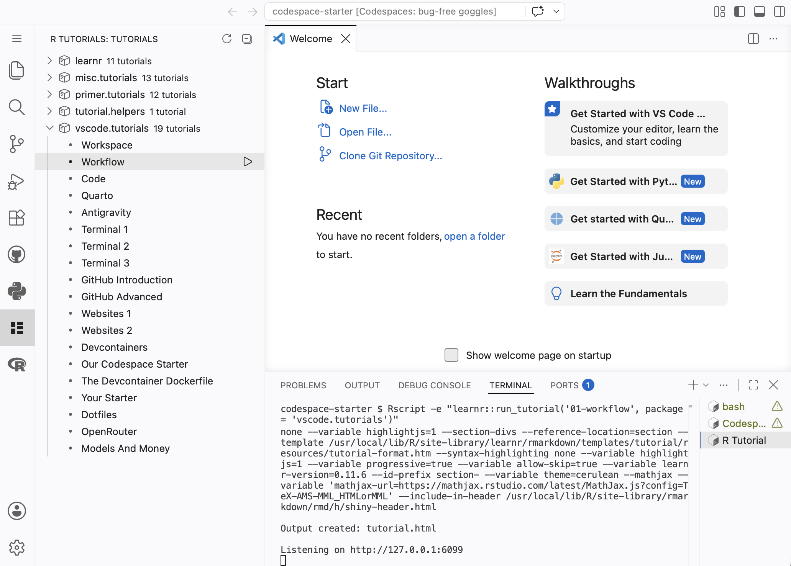
```

###

The tutorial itself runs in an R process displayed in a terminal whose tab is named something like **R Tutorial**. Leave that terminal alone. Closing it stops the tutorial.

###

VS Code is split into a few parts:

* The **Activity Bar** is the row of small icons on the far left.
* The **Side Bar** is the box next to those icons. Click the Explorer icon to see your files. Click the Source Control icon to work with Git.
* The **Editor** is the big space in the middle. This is where you read and change files.
* The **Panel** is usually at the bottom. Its most important view is the **Terminal**, where you type commands.
* The **Status Bar** is the thin bar across the very bottom.

Here is the whole VS Code window. The Explorer Side Bar is on the left. The Editor is in the middle. The Terminal is inside the red box at the bottom.

###

```{r}
include_graphics("images/vscode-overview.png")
```

You can make a part bigger or smaller by dragging its edge. If you close something, you can open it again by clicking its icon.

###

Most questions ask for you to **CP/CR** --- **C**opy/**P**aste the **C**ommand and **R**esponse --- as you have seen in earlier tutorials.

Your answer may look a little different from ours. That is OK. Usernames, version numbers, and the exact look of the prompt can be different. In our examples we shorten the prompt to just the folder name and a `$`, like `codespace-starter $`. Your real prompt may be longer, but it means the same thing.

## The Terminal
###

The Terminal is a place where you type commands and the computer answers. In this section you will run a handful of simple, safe commands. You ran several of them --- `pwd`, `ls`, `ls -a` --- in Workspace. Running them again is deliberate: these commands should live in your fingers, not your notes. Every question is just CP/CR.

###

First, make sure you can see the Terminal. It lives in the Panel across the bottom of the window. If it is not there, open it from the menu bar: click **View**, then choose **Terminal**.

```{r}
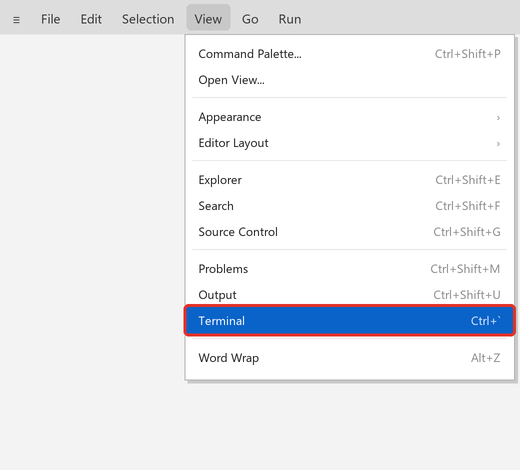
```

You can also open it with the keyboard shortcut shown in the menu, `` Ctrl + ` `` (the key just above `Tab`).

###

You want a **bash** Terminal. Look at the top-right corner of the Panel. Click the small down arrow beside the `+`, then choose **bash**. The picture below shows an open bash Terminal: the **TERMINAL** view is selected, the red box marks the **bash** tab, and the `+` and down-arrow buttons for opening more terminals sit just to its right.

```{r}
include_graphics("images/terminal-on-open.png")
```

You should now have at least two terminal tabs: **R Tutorial**, which is busy running this tutorial, and **bash**, where you will work. Leave the **R Tutorial** tab alone.

Beware: a new bash Terminal will sometimes show a long prompt like

````
@davekane-student ➜ /workspaces/codespace-starter (main) $
````

with your GitHub username in place of `davekane-student`. The exact content of your prompt is something you can control. We set up `codespace-starter` so that, by default, the prompt just shows the current directory, followed by a space and a dollar sign, like `codespace-starter $`. 

### Exercise 1

In the bash Terminal, type `pwd` and press `Enter`. You should see something like the picture below. Then CP/CR.

```{r}
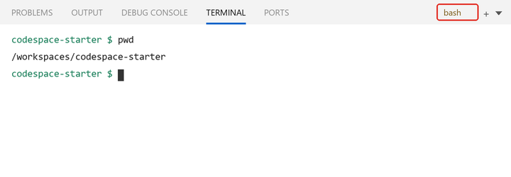
```

```{r the-terminal-1}
question_text(NULL,
    answer(NULL, correct = TRUE),
    allow_retry = TRUE,
    try_again_button = "Edit Answer",
    incorrect = NULL,
    rows = 3)
```

###

````
codespace-starter $ pwd
/workspaces/codespace-starter
codespace-starter $
````

`pwd` means **print working directory**. It tells you which folder you are in. Right now, you should be in the `codespace-starter` folder.


### Exercise 2

Options change what a command does. Many commands also have a `--help` option that explains how they work without doing anything.

Run:

````
ls --help
````

CP/CR. The response is long, so paste just the first several lines.

```{r the-terminal-2}
question_text(NULL,
    answer(NULL, correct = TRUE),
    allow_retry = TRUE,
    try_again_button = "Edit Answer",
    incorrect = NULL,
    rows = 10)
```

###

The beginning should look like:

````
codespace-starter $ ls --help
Usage: ls [OPTION]... [FILE]...
List information about the FILEs (the current directory by default).
Sort entries alphabetically if none of -cftuvSUX nor --sort is specified.
````

`--help` is a safe way to learn what a command does. It just prints a description; it never changes your files. Almost every command you meet has a `--help` option.

### Exercise 3

Let's make a file by hand, just to see how it works. Open the Application Menu from the three horizontal bars at the top left on the VS Code widnow. Choose `File -> New File...`.

```{r}
include_graphics("images/create-new-file.png")
```

When VS Code asks what kind of file to make, choose **R Document**.

```{r}
include_graphics("images/select-new-r-file.png")
```

Type this single line into the new file:

````
1 + 2
````

Add a blank line after it.

Save the file as `warmup.R` at the top level of `codespace-starter`. Press `Cmd/Ctrl + S`; in the Save dialog, make sure the path ends in `codespace-starter/warmup.R`, then press **OK**. A black dot on an Editor tab means the file has unsaved changes; saving makes the dot disappear.

```{r}
include_graphics("images/save-warmup.png")
```

Be careful. Sometimes VS Code seems to prefer a small `r` suffix. Either `r` or `R` is fine, but the file must be named exactly `warmup.R` (capital `R`) for the next step to work.

In the bash Terminal, run `Rscript warmup.R`. CP/CR.

```{r the-terminal-3}
question_text(NULL,
    answer(NULL, correct = TRUE),
    allow_retry = TRUE,
    try_again_button = "Edit Answer",
    incorrect = NULL,
    rows = 3)
```

###

````
codespace-starter $ Rscript warmup.R
[1] 3
codespace-starter $
````

An R script is a text file containing R commands. `Rscript warmup.R` asks R to run every command in the file. The code stays in the script after it runs, so you can look at it, change it, and run it again.

### Exercise 4

Run `ls` again. CP/CR.

```{r the-terminal-4}
question_text(NULL,
    answer(NULL, correct = TRUE),
    allow_retry = TRUE,
    try_again_button = "Edit Answer",
    incorrect = NULL,
    rows = 3)
```

###

````
codespace-starter $ ls
warmup.R
codespace-starter $
````

Your new file now appears. The problem is that this file lives inside the `PPBDS/codespace-starter` working copy, which you do **not** own. You cannot save your work to that repository on GitHub. Closing the browser does not erase the file right away, but deleting the Codespace will. You need a repository that belongs to you. That is what the next section sets up.

## Git and GitHub
###

**Git** is a tool that keeps a history of your files. A **repository**, or **repo**, is a folder that Git is watching. **GitHub** is a website that keeps a copy of your repo online, so your work is safe and shareable.

The `codespace-starter` folder you have been working in is one repo, but it belongs to the course, not to you. In this section you will create your own repo, named `workflow`, and connect to it.

We give you a shortcut for this called `connect-repo.sh`. It signs you in to GitHub, creates (or finds) a repo with the name you give it, and opens that repo's folder. Later tutorials will show you the individual Git commands hiding behind this shortcut.

### Exercise 1

<!-- DK: Split this up into several questions? Add an image for every step, including messages from GitHub? -->

In the bash Terminal, run:

````
.devcontainer/connect-repo.sh workflow
````

###

You should see something like this, assuming you answer `Y` to the first question:

````
codespace-starter $ .devcontainer/connect-repo.sh workflow
→ Sign in to GitHub: authorize in the browser/code prompt, then come back here.
? Authenticate Git with your GitHub credentials? Yes

! First copy your one-time code: 5887-E310
Press Enter to open https://github.com/login/device in your browser... 
````

Your code will be different from this one, and different each time. You should copy the entire one-time code. You will then be able to just paste the whole thing in at once, when GitHub asks for it. 

Press `Enter` to open the link in your browser, authorize GitHub, then return to VS Code. 

```{r}
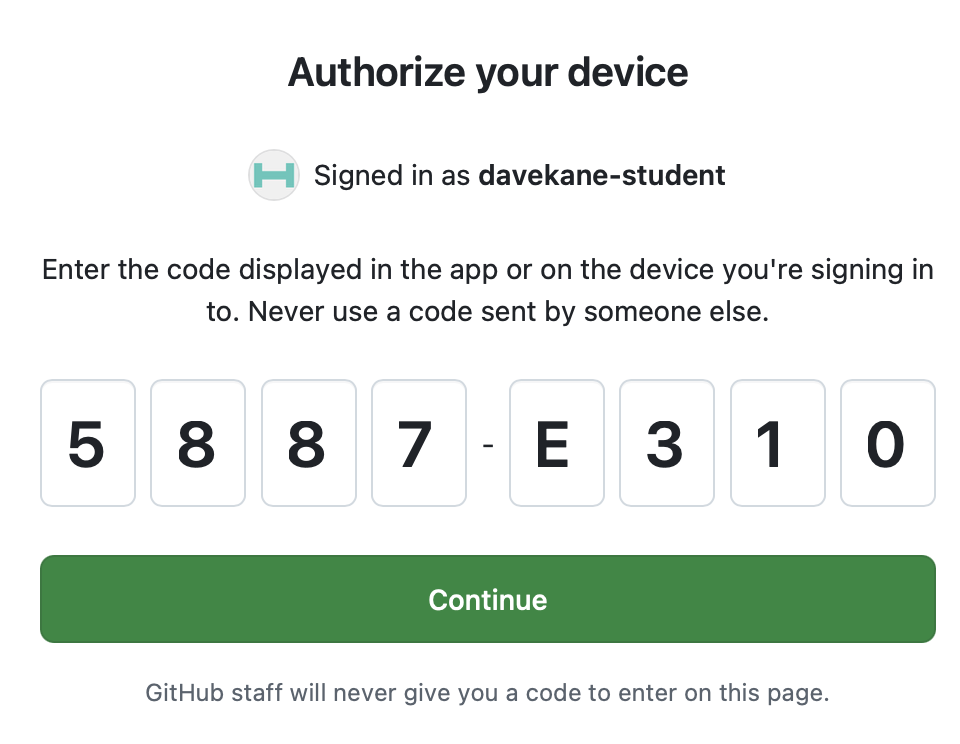
```

###

Note that the browser may open up what appears to be a new version of this tutorial. In truth, it is just a new window onto the same tutorial. Delete one of these tutorial tabs. It does not matter which one.

###

Run `ls`. CP/CR.

```{r git-and-github-1}
question_text(NULL,
    answer(NULL, correct = TRUE),
    allow_retry = TRUE,
    try_again_button = "Edit Answer",
    incorrect = NULL,
    rows = 8)
```

###

```
workflow $ ls
AGENTS.md
workflow $ 
```

The result of `connect-repo.sh` is a GitHub repository named `workflow` and a folder at `/workspaces/workflow`.

###

The two folders now sit beside each other:

````
/workspaces/codespace-starter
/workspaces/workflow
````

The first supplied the Codespace and the tutorial. The second is yours and will hold your work. 

### Exercise 2

Open a new bash Terminal if necessary. Run `pwd`. CP/CR.

```{r git-and-github-2}
question_text(NULL,
    answer(NULL, correct = TRUE),
    allow_retry = TRUE,
    try_again_button = "Edit Answer",
    incorrect = NULL,
    rows = 3)
```

###

````
workflow $ pwd
/workspaces/workflow
workflow $
````

##

If your result still ends in `codespace-starter`, you have a problem. If the Explorer still shows `codespace-starter`, use `File -> Open Folder...` and open `/workspaces/workflow`. The reload will stop this tutorial. That is OK! Restart it the same way you started it: click **R Tutorials** in the Activity Bar, find this tutorial under **vscode.tutorials**, and click the arrow to launch it. All of your saved answers will still be there.

### Exercise 3

Run `ls -a`. CP/CR.

```{r git-and-github-3}
question_text(NULL,
    answer(NULL, correct = TRUE),
    allow_retry = TRUE,
    try_again_button = "Edit Answer",
    incorrect = NULL,
    rows = 3)
```

###

````
workflow $ ls -a
.  ..  AGENTS.md  .git
workflow $ 
````

The hidden `.git` directory is what defines a Git repository. Git fills it with your work as you proceed. You never use directly, or even examine, the `.git` folder.

`AGENTS.md` is a file we created which tries to guide AI in how best to help beginners. Check it out, if you like! If you don't like it, you can delete it and tell your AI to ignore it. 

### Exercise 4

Check your repository on GitHub.

Open a new browser tab and go to [github.com](https://github.com). Sign in with the same account if you are asked. Click your profile picture in the top-right corner, choose **Your repositories**.

```{r}
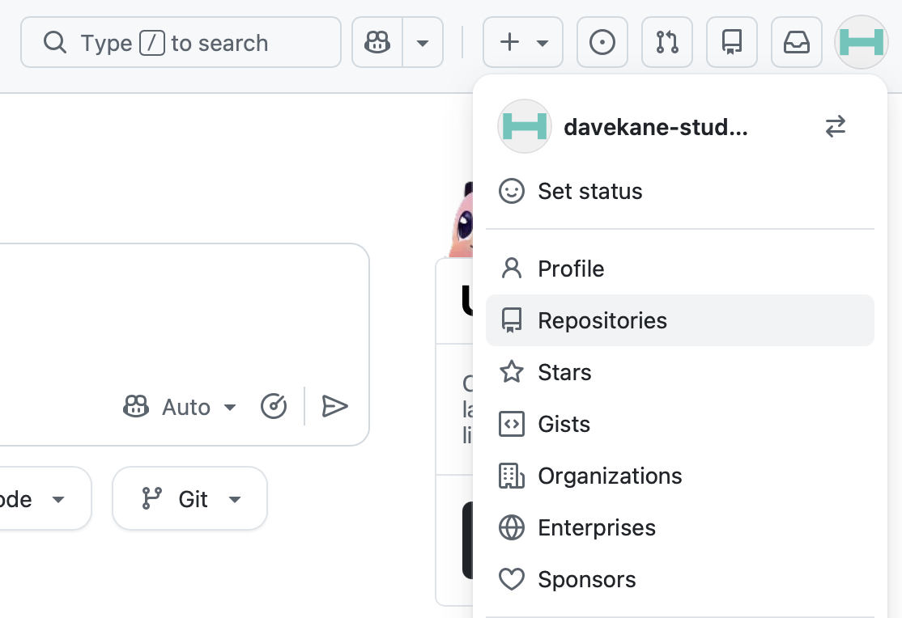
```

###

Find the repo named **workflow**. Click it.

```{r}
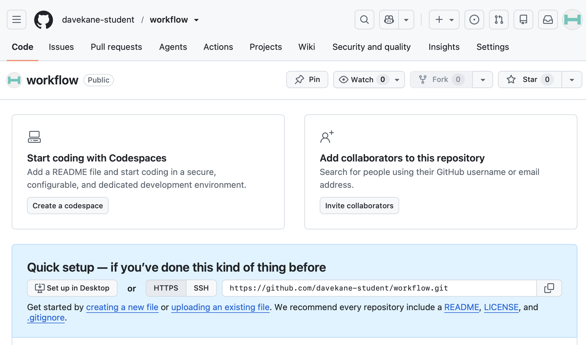
```

This is your repository's page. There is nothing going on yet because we have not made any changes.

###

Go back to the bash Terminal in your Codespace and run `git status`. CP/CR.


```{r git-and-github-4}
question_text(NULL,
    answer(NULL, correct = TRUE),
    allow_retry = TRUE,
    try_again_button = "Edit Answer",
    incorrect = NULL,
    rows = 8)
```

###

```
workflow $ git status
On branch main

No commits yet

Untracked files:
  (use "git add <file>..." to include in what will be committed)
        AGENTS.md

nothing added to commit but untracked files present (use "git add" to track)
workflow $ 
```

Seeing the repository in your browser proves two things: the repository really exists on GitHub, and it belongs to **you** (your username appears in the address bar, like `github.com/your-username/workflow`). This is the online home where your work will live. 

## Script 1: GitHub Copilot
###

You met **GitHub Copilot** --- the AI assistant built right into VS Code --- in the Workspace tutorial, where it wrote small files for you. We use Copilot here because it is always available and works out of the box.

Open a new R Terminal by clicking the small arrow beside the `+` in the top-right corner of the Panel, then choosing **R Terminal**. (The new terminal's tab is labeled **R Interactive**.) 

Keep the **R Tutorial** terminal running, and use this new R Terminal for the R commands below. You may need to select the **R Interactive** terminal by clicking on it in order to move it to the front.

###

If the Chat window --- normally the secondary sidebar on the right of the VS Code main screen --- is not open, open it now by clicking the "Toggle Secondary Sidebar" icon in the top-right corner of the window. 

```{r}
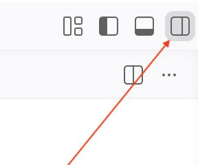
```


Before starting any AI agent, check that its Terminal or workspace is `/workspaces/workflow`. An agent reads and writes files relative to the folder it starts in. An agent accidentally started in `codespace-starter` can create files that never show up in your `workflow` Explorer and never reach your repository.


### Exercise 1

Give Copilot this prompt, adjusting the wording if needed:

> Create an R script named script-1.R. It should add the integers from 1 through 10 and print the result. Run the script with Rscript and tell me the result. Do not install any packages.

Review and approve the creation of `script-1.R` and the `Rscript` command one at a time. Then, in the bash Terminal, run:

````
cat script-1.R
````

`cat` prints a file's contents in the Terminal. It is the quickest way to show us --- and any AI you are working with --- exactly what is in a file. You will use it constantly.

CP/CR.

```{r script-1-github-copilot-1}
question_text(NULL,
    answer(NULL, correct = TRUE),
    allow_retry = TRUE,
    try_again_button = "Edit Answer",
    incorrect = NULL,
    rows = 8)
```

###

Your answer will vary, but the sum should be `55` and `script-1.R` should appear in Explorer. One reasonable answer is:

````
numbers <- 1:10
total <- sum(numbers)
print(total)
````

### Exercise 2

The Copilot interface and default changes all the time, like everything associated with AI. So, these images may be out of date. However, it is likely that the Explorer shows you something like this:

```{r}
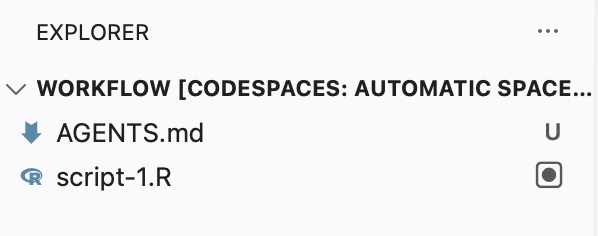
```

###

The black dot surrounded by the square next to `script-1.R` indicates a file that has been created/edited by an AI but not yet saved. To save it, you will need to take some action, like selecting "Keep":

```{r}
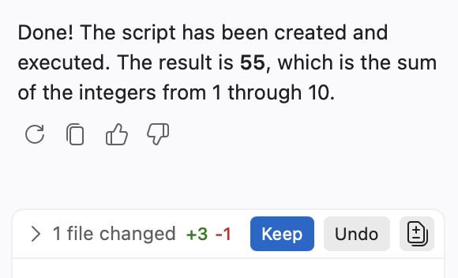
```

###

Doing so, makes the black-dot-square disappear. It should be replaced with a `U` to indicate that the file is **untracked** by Git. 

In the bash Terminal, run `ls`. CP/CR.


```{r script-1-github-copilot-2}
question_text(NULL,
    answer(NULL, correct = TRUE),
    allow_retry = TRUE,
    try_again_button = "Edit Answer",
    incorrect = NULL,
    rows = 18)
```

###

```
workflow $ ls
AGENTS.md  script-1.R
workflow $ 
```

The file is now saved, but it is not yet part of your repository. You will add it to the repository later. 

### Exercise 3

Finish the script with a plot. Ask Copilot:

> Update script-1.R so that it keeps the addition example and then makes a beautiful plot using the diamonds data set from ggplot2. Use library(tidyverse) and no other library calls or data sets. Save the plot as diamonds-1.png. Run the script and fix any errors. Do not install packages.

You should see something like:

```{r}
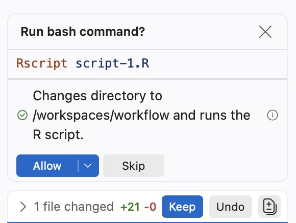
```


Keep the changes and allow the agent to run the script. Then run the following in the bash Terminal and CP/CR:

````
cat script-1.R
````

```{r script-1-github-copilot-3}
question_text(NULL,
    answer(NULL, correct = TRUE),
    allow_retry = TRUE,
    try_again_button = "Edit Answer",
    incorrect = NULL,
    rows = 18)
```

###

Here is one possible answer:

````
library(tidyverse)

numbers <- 1:10
total <- sum(numbers)
print(total)

diamonds_plot <- diamonds |>
  count(cut) |>
  ggplot(aes(x = cut, y = n, fill = cut)) +
  geom_col(show.legend = FALSE) +
  labs(
    title = "Diamonds at Every Level of Cut",
    subtitle = "Counts in the ggplot2 diamonds data set",
    x = NULL,
    y = "Number of diamonds"
  ) +
  theme_minimal(base_size = 14)

ggsave("diamonds-1.png", diamonds_plot, width = 8, height = 5)
````

This solution loads only **tidyverse**, uses only `diamonds`, assigns the plot to an object, and saves a PNG. Click `diamonds-1.png` in Explorer to inspect your own result.

### Exercise 4

Time to save your work. **Git** records a snapshot of your files, called a **commit**. A **push** sends your commits up to GitHub. Do both by hand through the Source Control view.

Click the Source Control icon (the branching icon) in the Activity Bar on the left. Your new files appear under **Changes**. (Don't worry about `AGENTS.md`. We created this file to help with teaching.) Each one has a `U`, which means **untracked**: Git can see the file, but it is not yet part of any commit.

```{r}
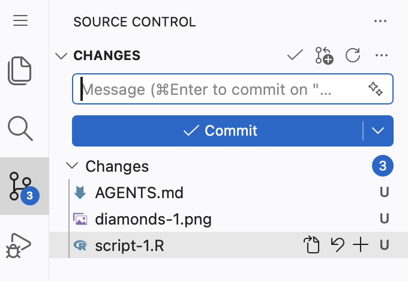
```

Now commit and push:

1. Review the files under **Changes**. Do not commit secrets, tokens, or files you do not understand.
2. Type `Add script-1 and diamonds plot` as the commit message.
3. Press **Commit**. The Codespace is set up to include all the displayed changes.
4. Press **Publish Branch** to push the commit to GitHub.

###

When the sync finishes, view your work on the web. Open your `workflow` repository on GitHub and refresh the page. 

The GitHub page looks like this. 

```{r}
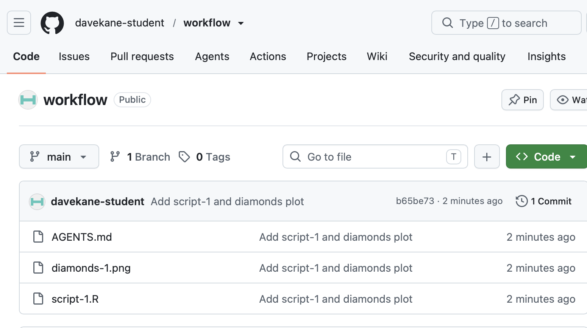
```

###

From the bach Terminal, run `git log`. CP/CR.    

```{r script-1-github-copilot-4}
question_text(NULL,
    answer(NULL, correct = TRUE),
    allow_retry = TRUE,
    try_again_button = "Edit Answer",
    incorrect = NULL,
    rows = 6)
```

###

You should see at least:

````
workflow $ git log
commit b65be73dbdf149c48b4cbc177e9d0a996caa6797 (HEAD -> main, origin/main)
Author: davekane-student <dave.kane+student@gmail.com>
Date:   Thu Aug 13 05:44:10 2026 +0000

    Add script-1 and diamonds plot
workflow $ 
````

This GitHub repo is the online copy of your work. The Codespace is where you work. The GitHub repo is where you keep and share it. If your computer stopped working right now, your commit would still be safe on GitHub.

###

Copilot is only one option. The Codespace may also provide command-line agents from Google, OpenAI, Anthropic, and other providers. These tools have different interfaces, models, limits, and account requirements, but the core workflow is the same:

1. describe the outcome you want;
2. let the AI inspect the relevant files;
3. review proposed changes and commands;
4. run or render the result;
5. inspect the result and ask for revisions.

## Script 2: AI agnostic
###

From this point forward, we are **AI agnostic**. "Ask AI" means use whichever AI you prefer — Copilot, Antigravity, or any other agent the Codespace provides. We will generally show prompts and results, not tool-specific buttons or screenshots. 

### Exercise 1

Use any AI to complete this task:

> Create script-2.R. Choose ten positive numbers, store them in a vector, and print their sum and mean. Run the script with Rscript and fix any errors. Do not install packages.

In the bash Terminal, run `cat script-2.R`. CP/CR.

```{r script-2-ai-agnostic-1}
question_text(NULL,
    answer(NULL, correct = TRUE),
    allow_retry = TRUE,
    try_again_button = "Edit Answer",
    incorrect = NULL,
    rows = 10)
```

###

One possible answer is:

````
numbers <- c(5, 12, 8, 23, 15, 7, 19, 11, 31, 9)

sum_result <- sum(numbers)
mean_result <- mean(numbers)

print(paste("Vector:", paste(numbers, collapse = ", ")))
print(paste("Sum:", sum_result))
print(paste("Mean:", mean_result))
````

The particular numbers and results do not matter. The important result is a saved, reproducible script that runs successfully.

### Exercise 2

Finish the second script with another plot. Ask your AI:

> Update script-2.R so that it deletes the number example and then makes a beautiful plot using the diamonds data set from ggplot2. Use library(tidyverse) and no other library calls or data sets. Make a different kind of plot from the one in script-1.R, save it as diamonds-2.png, run the script, and fix any errors. Do not install packages.

Note how confusing your screen can become!

```{r}
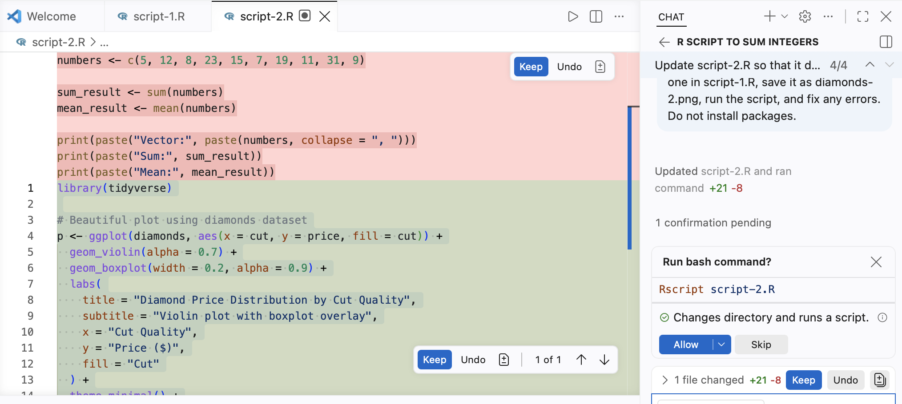
```

* The black-dot-square next to `script-2.R` in the Explorer view indicates a file that has been created/edited by an AI but not yet saved. 

* The black-dot-square also appears next to `script-2.R` in the name of the tab in the Editor.

* To save `script-2.R`, you will need to take some action, like selecting "Keep". VS Code wants you to do that, so it offers 3 (!) different "Keep" buttons, all of which do the same thing. 

* The red shaded portion of `script-2.R` in the Editor indicates code that the AI wants to remove. The green shaded portion indicates code that the AI wants to add. 

* Click any one of the "Keep" buttons to save the file. Both black-dot-squares should disappear. The one in the Explorer should be replaced with a `U` to indicate that the file is **untracked** by Git.

* The AI is asking your permission to run the script using `Rscript script-2.R` in the bash Terminal. You can approve or reject that command. If you approve, the AI will run the script and show you the result. If you reject it, you can run the script yourself in the bash Terminal. As you get more experienced, you will tell the AI to stop asking you for permission to do every little thing. 

###

In the bash Terminal, run `cat script-2.R`. CP/CR.

```{r script-2-ai-agnostic-2}
question_text(NULL,
    answer(NULL, correct = TRUE),
    allow_retry = TRUE,
    try_again_button = "Edit Answer",
    incorrect = NULL,
    rows = 20)
```

###

Here is one possible plot:

````
library(tidyverse)

diamonds_plot <- diamonds |>
  slice_sample(n = 5000) |>
  ggplot(aes(x = carat, y = price, color = cut)) +
  geom_point(alpha = 0.35, size = 1.2) +
  scale_y_continuous(labels = scales::label_dollar()) +
  labs(
    title = "Price Rises Rapidly with Diamond Weight",
    subtitle = "A random sample of 5,000 diamonds, colored by cut",
    x = "Weight (carats)",
    y = "Price",
    color = "Cut"
  ) +
  theme_minimal(base_size = 14) +
  theme(legend.position = "bottom")

ggsave("diamonds-2.png", diamonds_plot, width = 8, height = 5)
````

### Exercise 3

Save this work too. Through the Source Control view, commit your new files with the message `Add script-2 and second diamonds plot`

```{r}
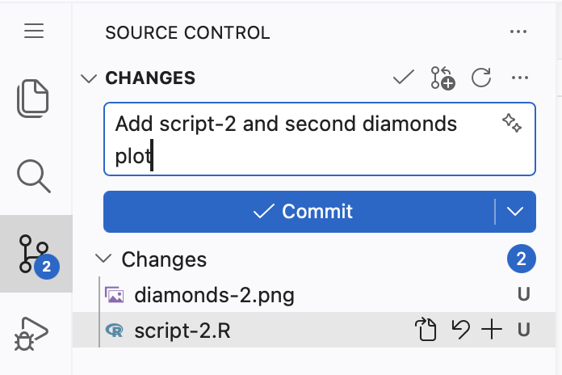
```

Then press **Sync Changes 1** to push.

```{r}
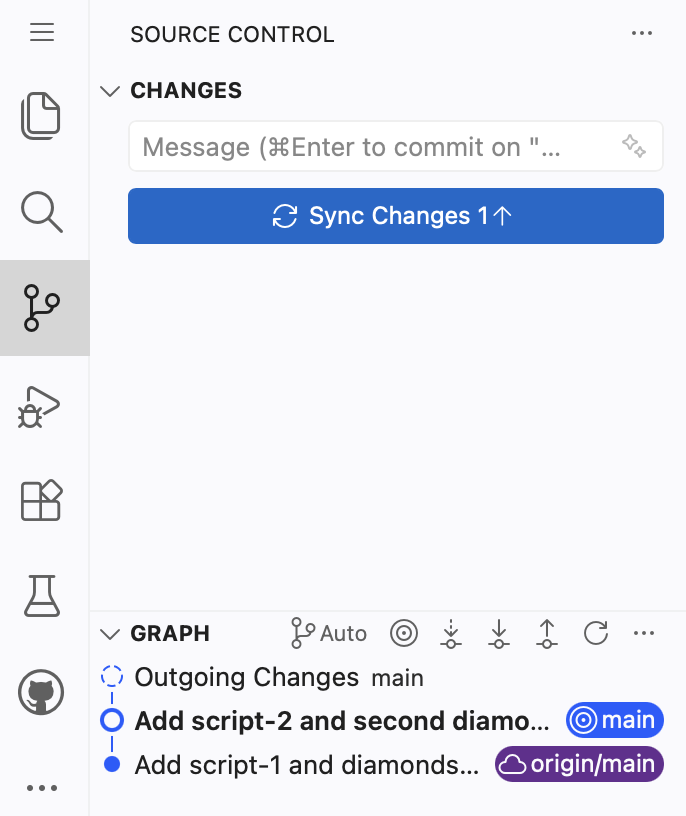
```

The `1` in "Sync Changes 1" indicates that you have one commit to push. This label is "Sync Changes" rather than "Publish Branch" because you have already pushed once. The first push is always "Publish Branch". Subsequent pushes are "Sync Changes".

###

In the bash Terminal, run `git log -1`. CP/CR.

```{r script-2-ai-agnostic-3}
question_text(NULL,
    answer(NULL, correct = TRUE),
    allow_retry = TRUE,
    try_again_button = "Edit Answer",
    incorrect = NULL,
    rows = 8)
```

###

Your answer should look something like:

````
workflow $ git log -1
commit 757d4dfd030339a67d164b0c846c5152c559a544 (HEAD -> main, origin/main)
Author: davekane-student <dave.kane+student@gmail.com>
Date:   Thu Aug 13 06:21:02 2026 +0000

    Add script-2 and second diamonds plot
workflow $ 
````

`git log -1` shows the last commit. When the top line shows both `main` and `origin/main`, your Codespace and GitHub agree on the latest commit — your push worked. You can also see the same history on GitHub.

## Summary
###

You used the major parts of VS Code, practiced bash commands, created and connected a repository, ran R scripts, directed AI agents, inspected their work, made plots, and used Git and GitHub.

From now on, begin course work with the same routine:

1. Start the `codespace-starter` Codespace.
2. Use `connect-repo.sh` to create and connect with a new repo, generally given the same name as the tutorial which you are about to start.
3. Start whichever AI you want to use, in review mode. GitHub Copilot is always available, but you may prefer another agent. 
4. Start the tutorial.

Future tutorials will often say only "create and connect to a repo," "ask AI," "run," or "commit and push." You now know the choices behind those instructions. We leave the choice of AI and the exact mechanics to you, but you must always review the results.

### Exercise 1

Copy and paste the URL for your `workflow` repository. This is the last question in the tutorial.

```{r summary-1}
question_text(NULL,
    answer(NULL, correct = TRUE),
    allow_retry = TRUE,
    try_again_button = "Edit Answer",
    incorrect = NULL,
    rows = 3)
```

###

````
https://github.com/davekane-student/workflow
````

The `github.com/...` URL is the repository. A `github.dev` or `githubpreview.dev` URL points to a temporary working interface, not the repository page you should submit.

```{r download-answers, child = system.file("child_documents/download_answers.Rmd", package = "tutorial.helpers")}
```
