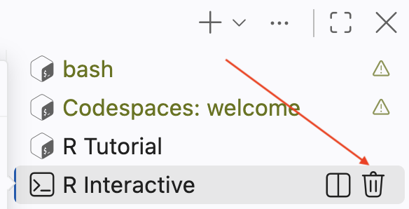
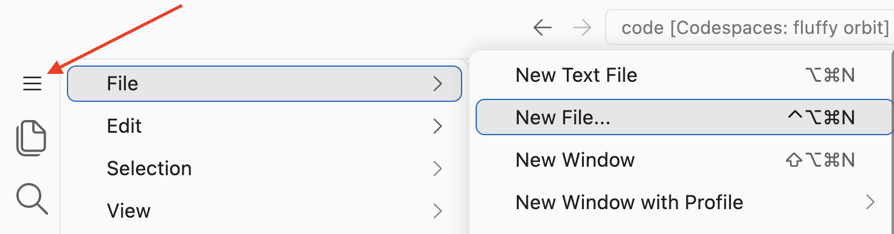
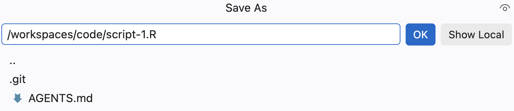
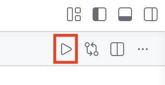

```{r setup, include = FALSE}
library(learnr)
library(tutorial.helpers)
library(tidyverse)
library(knitr)

knitr::opts_chunk$set(echo = FALSE)
knitr::opts_chunk$set(out.width = '90%')
options(tutorial.exercise.timelimit = 60,
        tutorial.storage = "local")
```

```{r info-section, child = system.file("child_documents/info_section.Rmd", package = "tutorial.helpers")}
```

## Introduction
###

This tutorial teaches you how to use [**Codespaces**](https://github.com/features/codespaces) with [**R**](https://www.r-project.org/about.html) scripts. It assumes that you have completed the "Workspace" tutorial.

This tutorial includes some information from [*R for Data Science (2e)*](https://r4ds.hadley.nz/) by Hadley Wickham, Mine Çetinkaya-Rundel, and Garrett Grolemund.

###

You should be doing this tutorial in a repo called `code`. Recall from the Workflow tutorial: a repo is a folder that Git watches, with a copy kept on GitHub. If your Explorer already shows a `code` folder, you are all set. If it shows `codespace-starter`, the next two exercises will get you connected. Either way, they only take a minute.

### Exercise 1

Open a new bash Terminal. Run `pwd`. CP/CR.

```{r introduction-1}
question_text(NULL,
    answer(NULL, correct = TRUE),
    allow_retry = TRUE,
    try_again_button = "Edit Answer",
    incorrect = NULL,
    rows = 3)
```

###

You will see one of two answers. Either you are already in your repo:

````
code $ pwd
/workspaces/code
code $
````

or you are still in the course's folder:

````
codespace-starter $ pwd
/workspaces/codespace-starter
codespace-starter $
````

###

If your result ends in `code`, you are all set --- **do not run the connect-repo commands in the next exercise**; just do its last step. If it ends in `codespace-starter`, the next exercise connects you.

### Exercise 2

**Skip this paragraph --- do not run these commands --- if `pwd` showed `/workspaces/code`.** Otherwise, run these two commands, one at a time:

````
cd /workspaces/codespace-starter
.devcontainer/connect-repo.sh code
````

The `connect-repo` script lives in `codespace-starter`, so the first command moves you there; running the script from anywhere else fails. If a sign-in message appears, follow it: open the link in your browser, authorize GitHub, then return to VS Code. The script may reload the VS Code window or ask you to open a folder. If the Explorer still shows `codespace-starter`, use `File -> Open Folder...` and open `/workspaces/code`. The reload will stop this tutorial. That is OK! Restart it the same way you started it: click **R Tutorials** in the Activity Bar, find this tutorial under **vscode.tutorials**, and click the arrow to launch it. All of your saved answers will still be there.

**Everyone**: open a new bash Terminal and run `pwd`. CP/CR.

```{r introduction-2}
question_text(NULL,
    answer(NULL, correct = TRUE),
    allow_retry = TRUE,
    try_again_button = "Edit Answer",
    incorrect = NULL,
    rows = 3)
```

###

````
code $ pwd
/workspaces/code
code $
````

Stop and fix the open folder if your result still ends in `codespace-starter`. All work in this tutorial belongs in `/workspaces/code`.

###

Your repo lives in two places: this folder and `github.com`. `connect-repo` created (or found) both. The `codespace-starter` folder still sits beside yours at `/workspaces/codespace-starter` --- it belongs to the course Everything you make in this tutorial will be kept.

###

After starting the tutorial, your R Terminal is "busy" running the tutorial. It will be labeled "R Tutorial" in the top right of the Panel. 

You will want to run R commands while completing the tutorial. You can do this in a second R Terminal. Click the small down arrow in the top right of the Panel, next to the `+` button. From the drop-down menu, select **R Terminal**.

```{r}
include_graphics("images/new-r-terminal.png")
```

Now, you have a fresh R Terminal where you can run commands. You can switch between terminals by clicking their tabs on the right side of the Panel, such as **bash** or **R Tutorial**, to bring a different terminal into view. (The tab for the R Terminal you just opened is labeled **R Interactive**.)

## Checking your setup
###

Again, you should have completed the "Workspace" tutorial. If not, this section may be difficult.

### Exercise 1

At the R Terminal, type `show_file()`. CP/CR.

```{r checking-your-setup-1}
question_text(NULL,
	answer(NULL, correct = TRUE),
	allow_retry = TRUE,
	try_again_button = "Edit Answer",
	incorrect = NULL,
	rows = 3)
```

###

````
Error in `show_file()`:
! could not find function "show_file"
````

###

Going forward, we will not include boilerplate like "Your answer should look like this." Instead, you can assume that any quote directly after a question is our answer to the question.

In this case, the error occurs because we have not yet loaded the **tutorial.helpers** package, where `show_file()` is located. If we had specified the package as part of the function call, as with `tutorial.helpers::show_file()`, R would have found the function.

### Exercise 2

Load the **tutorial.helpers** package into your R Terminal using the `library()` function.

Run `search()` in the R Terminal to see the libraries that you have currently loaded.

CP/CR.

```{r checking-your-setup-2}
question_text(NULL,
	answer(NULL, correct = TRUE),
	allow_retry = TRUE,
	try_again_button = "Edit Answer",
	incorrect = NULL,
	rows = 5)
```

###

````
✗ R 4.6.1> library(tutorial.helpers)
R 4.6.1> search()
 [1] ".GlobalEnv"               "package:tutorial.helpers" "tools:vscode"            
 [4] "package:stats"            "package:graphics"         "package:grDevices"       
 [7] "package:utils"            "package:datasets"         "package:methods"         
[10] "Autoloads"                "package:base"            
R 4.6.1> 
````

The string "package:tutorial.helpers" should be in the output. Don't worry if your answer does not match our answer exactly, either in this question or in any other question.

### Exercise 3

At the R Terminal, run:

````
show_file(file.path(R.home(), "COPYING"), end = 7)
````

```{r checking-your-setup-3}
question_text(NULL,
	answer(NULL, correct = TRUE),
	allow_retry = TRUE,
	try_again_button = "Edit Answer",
	incorrect = NULL,
	rows = 8)
```

###

````
                    GNU GENERAL PUBLIC LICENSE
                       Version 2, June 1991

 Copyright (C) 1989, 1991 Free Software Foundation, Inc.
                       51 Franklin St, Fifth Floor, Boston, MA  02110-1301  USA
 Everyone is permitted to copy and distribute verbatim copies
 of this license document, but changing it is not allowed.
````

###

This command would have failed if we had not loaded the **tutorial.helpers** package already.

### Exercise 4

To restart R, close the current R Terminal by pressing the trash icon in the menu sidebar. Then, open a new R Terminal.

```{r}

```

Run the `show_file()` command from the previous exercise again. (Press the up arrow in the R Terminal to bring back a command you ran earlier.) CP/CR.

```{r checking-your-setup-4}
question_text(NULL,
	answer(NULL, correct = TRUE),
	allow_retry = TRUE,
	try_again_button = "Edit Answer",
	incorrect = NULL,
	rows = 3)
```

###

````
R 4.6.1> show_file(file.path(R.home(), "COPYING"), end = 7)
Error in show_file(file.path(R.home(), "COPYING"), end = 7) :
  could not find function "show_file"
````

###

It failed, even though it had just worked before. The reason is that, whenever you restart R, you get a "clean slate," with nothing but the default packages loaded.

### Exercise 5

In the R Terminal, run `library(tutorial.helpers)` again. CP/CR.

```{r checking-your-setup-5}
question_text(NULL,
	answer(NULL, correct = TRUE),
	allow_retry = TRUE,
	try_again_button = "Edit Answer",
	incorrect = NULL,
	rows = 3)
```

###

````
R 4.6.1> library(tutorial.helpers)
R 4.6.1>
````

Loading some packages prints a bunch of messages to the R Terminal. But most packages, like **tutorial.helpers**, print nothing.

### Exercise 6

Load the **tidyverse** package into your R Terminal using the `library()` function.

CP/CR.

```{r checking-your-setup-6}
question_text(NULL,
    answer(NULL, correct = TRUE),
    allow_retry = TRUE,
    try_again_button = "Edit Answer",
    incorrect = NULL,
    rows = 12)
```

###

````
R 4.6.1> library(tidyverse)
── Attaching core tidyverse packages ──────────────────────── tidyverse 2.0.0 ──
✔ dplyr     1.2.1     ✔ readr     2.2.0
✔ forcats   1.0.1     ✔ stringr   1.6.0
✔ ggplot2   4.0.3     ✔ tibble    3.3.1
✔ lubridate 1.9.5     ✔ tidyr     1.3.2
✔ purrr     1.2.2     
── Conflicts ────────────────────────────────────────── tidyverse_conflicts() ──
✖ dplyr::filter() masks stats::filter()
✖ dplyr::lag()    masks stats::lag()
ℹ Use the conflicted package (<http://conflicted.r-lib.org/>) to force all conflicts to become errors
R 4.6.1> 
````

The **tidyverse** package is warning us about various conflicts. Don't worry about those conflicts for now.

## Script 1
###

It is difficult to type more than a few lines of code into the R Terminal at once. One solution is to use [R scripts](https://r4ds.hadley.nz/workflow-scripts.html#scripts), files that contain a permanent copy of our code.

### Exercise 1

Create a new R script, as you learned in the Workflow tutorial: `File -> New File ...` from the Application Menu (see red arrow).

```{r}

```

Select `R Document`. 

Type two lines into the file: `5 + 5` on the first, `6 * 3` on the second. Save it as `script-1.R`, inside the `code` repo. 


```{r}

```

Be careful of the suffix for R script files. Either `.R` or `.r` is acceptable, but the file should have one of those suffixes and you need to pay attention to the case. 

The default directory that VS Code suggests when saving is not necessarily where you should save. Be intentional.

###

In the R Terminal, run:

````
tutorial.helpers::show_file("script-1.R")
````

CP/CR.

```{r script-1-1}
question_text(NULL,
	answer(NULL, correct = TRUE),
	allow_retry = TRUE,
	try_again_button = "Edit Answer",
	incorrect = NULL,
	rows = 3)
```

###

````
✗ R 4.6.1> tutorial.helpers::show_file("script-1.R")
5 + 5
6 * 3
R 4.6.1> 
````

###

You might have gotten this warning:

````
Warning message:
In readLines("script-1.R") : incomplete final line found on 'script-1.R'
````

This means that your file needs a blank line at the end. As a rule of thumb, it is always a good idea to have the last line of any text file be blank.

R scripts are permanent copies of your code. You can save them and also work with them interactively.

### Exercise 2

You met the Source button and its keyboard shortcuts in the Workspace tutorial. Practice them again now --- the goal is to make them habit.

Press the **Source** button in the top-right corner of the Editor. (We will sometimes shorten the instruction "press the Source button" to just "source" the script.)

```{r}

```

CP/CR.

```{r script-1-2}
question_text(NULL,
    answer(NULL, correct = TRUE),
    allow_retry = TRUE,
    try_again_button = "Edit Answer",
    incorrect = NULL,
    rows = 8)
```

###

````
R 4.6.1> source("/workspaces/code/script-1.R", encoding = "UTF-8", echo = TRUE)

> 5 + 5
[1] 10

> 6 * 3
[1] 18
R 4.6.1>
````

###

This sends every line of the file to the R Terminal. Without the `echo = TRUE` argument, the code is run silently, and you only see the results. With `echo = TRUE`, you see both the code and its results --- exactly what you would see if you copied each line into the R Terminal yourself. 

<!-- DK: Should be a new question. -->

Using the keyboard shortcut `Cmd/Ctrl + Shift + S` does the same thing. Try it! Keyboard shortcuts are quicker and more professional than clicking buttons.

### Exercise 3

Instead of sourcing the entire file, we can execute (or "run") just part of it. In `script-1.R`, place your cursor on the same line as `6 * 3` and press `Cmd/Ctrl + Enter`. Then highlight both lines and press `Cmd/Ctrl + Enter` again. CP/CR.

```{r script-1-3}
question_text(NULL,
    answer(NULL, correct = TRUE),
    allow_retry = TRUE,
    try_again_button = "Edit Answer",
    incorrect = NULL,
    rows = 5)
```

###

You should get:

````
R 4.6.1> 6 * 3
[1] 18
R 4.6.1> 5 + 5
+  6 * 3
[1] 10
[1] 18
R 4.6.1>
````

###

**Run is not the same thing as Source.** With Run, you are just copying and pasting some of the lines from the script to the R Terminal. With Source, you are copying and pasting *all* the lines. `Cmd/Ctrl + Enter` is "smart" in two ways. First, if you highlight more than one line of code, it will execute all the code in that area. Second, even if nothing is highlighted, if the line with the cursor is part of a block of code that extends over multiple lines --- like creating a plot --- it will execute all the code in that block.

### Exercise 4

Go back to the first line in your R script. Change `5 + 5` to `x <- 5 + 5`, thereby creating an object named `x` with a value of 10. Save the file. Source the file, either by pressing the "Source" triangle or with `Cmd/Ctrl+ Shift + S`. CP/CR.

```{r script-1-4}
question_text(NULL,
	answer(NULL, correct = TRUE),
	allow_retry = TRUE,
	try_again_button = "Edit Answer",
	incorrect = NULL,
	rows = 3)
```

###

Your answer should look like this:

````
R 4.6.1> source("/workspaces/code/script-1.R", encoding = "UTF-8", echo = TRUE)

> x <- 5 + 5

> 6 * 3
[1] 18
R 4.6.1> 
````

###

Note how the `x <- 5 + 5` is executed (and echoed) but nothing is printed. The assignment operator, `<-`, does not generate a return value.

### Exercise 5

In the R Terminal, run `ls()`. CP/CR.

```{r script-1-5}
question_text(NULL,
    answer(NULL, correct = TRUE),
    allow_retry = TRUE,
    try_again_button = "Edit Answer",
    incorrect = NULL,
    rows = 2)
```

###

````
R 4.6.1> ls()
[1] "x"
R 4.6.1> 
````

###

`ls()` returns a list of objects present in your environment.

<!-- DK: Should be a separate question. -->

In this case, the object `x`, which has a value of 10, exists in your workspace. You can confirm this by typing `x` at the R Terminal and pressing `Enter`.

````
> x
[1] 10
>
````

### Exercise 6

<!-- DK: Should we really be doing this by hand so early? -->

`script-1.R` exists only in this Codespace. Recall from the Workflow tutorial: a **commit** is a snapshot of your work, and a **push** copies that snapshot to GitHub. Let's do both. In a bash Terminal, run these three commands, one at a time:

````
git add script-1.R
git commit -m "Add script-1"
git push
````

CP/CR.

```{r script-1-6}
question_text(NULL,
    answer(NULL, correct = TRUE),
    allow_retry = TRUE,
    try_again_button = "Edit Answer",
    incorrect = NULL,
    rows = 8)
```

###

````
code $ git add script-1.R
code $ git commit -m "Add script-1"
[main 1a2b3c4] Add script-1
 1 file changed, 3 insertions(+)
 create mode 100644 script-1.R
code $ git push
Enumerating objects: 4, done.
Counting objects: 100% (4/4), done.
Writing objects: 100% (3/3), 310 bytes | 310.00 KiB/s, done.
To https://github.com/your-username/code.git
   9d8c7b6..1a2b3c4  main -> main
code $
````

###

Your script now exists in two places: this Codespace and GitHub. Professionals keep their work in the cloud because laptops --- and Codespaces --- fail.

### Exercise 7

In the Workflow tutorial, you read `git log`'s full output, one multi-line entry per commit. Professionals more often use the compact form. Run `git log --oneline`. CP/CR.

```{r script-1-7}
question_text(NULL,
    answer(NULL, correct = TRUE),
    allow_retry = TRUE,
    try_again_button = "Edit Answer",
    incorrect = NULL,
    rows = 4)
```

###

````
code $ git log --oneline
1a2b3c4 (HEAD -> main, origin/main) Add script-1
9d8c7b6 Initial commit
code $
````

###

`--oneline` gives one line per commit: a shortened commit ID and the message. This compact history is the form you will glance at most often. You learned to read the `(HEAD -> main, origin/main)` marker in the Workflow tutorial --- when the newest commit carries both names, your Codespace and GitHub agree.

## Script 2
###

Let's create a plot like this one:

```{r diamond-hist}
hist_p <- ggplot(data = diamonds,
                 mapping = aes(x = carat)) +
  geom_histogram(bins = 100,
                 color = "white") +
  scale_y_continuous(labels = scales::comma_format()) +
  labs(title = "Histogram of Carat (Weight) among 50,000 Diamonds",
       subtitle = "Carats just at or above meaningful numbers are very common",
       x = "Carat",
       y = "Number",
       caption = "diamonds dataset from ggplot2 package")

hist_p
```

### Exercise 1

Click `File -> New File ... -> R File`. At the top of the Editor, the file should be called *`Untitled-1`* (or something similar).

###

Use the shortcut `Cmd/Ctrl + S` to save the script. Let's call this file `script-2.R`. The `.R` suffix is not always added automatically. Make sure it is there.

In the R Terminal, run `list.files()`. CP/CR.

```{r script-2-1}
question_text(NULL,
    answer(NULL, correct = TRUE),
    allow_retry = TRUE,
    try_again_button = "Edit Answer",
    incorrect = NULL,
    rows = 2)
```

###

````
> list.files()
[1] "script-1.R" "script-2.R"
````

Save your scripts, with informative names, in the folder. Edit them and run them line by line or in their entirety. Restart R frequently to make sure you have captured everything in your scripts.


### Exercise 2

Restart your R session by deleting your current R Terminal and opening a new one.

From the R Terminal, run `list.files()`. CP/CR.

```{r script-2-2}
question_text(NULL,
	answer(NULL, correct = TRUE),
	allow_retry = TRUE,
	try_again_button = "Edit Answer",
	incorrect = NULL,
	rows = 3)
```

###

```
R 4.6.1 exited (preparing for restart)
R 4.6.1 restarted.
> list.files()
[1] "script-1.R" "script-2.R"
>
```

The two files we had from before --- `script-1.R` and `script-2.R` --- still exist. Our work, if we have saved it, is preserved even when R or the Codespace restarts.

### Exercise 3

From the R Terminal, run `ls()`. CP/CR.

```{r script-2-3}
question_text(NULL,
	answer(NULL, correct = TRUE),
	allow_retry = TRUE,
	try_again_button = "Edit Answer",
	incorrect = NULL,
	rows = 3)
```

###

````
> ls()
character(0)
>
````

`x` is gone! The environment --- the place in the computer where R creates and uses objects --- is cleaned, by default, each time R restarts. This is a good thing. For our work to be "reproducible," we want to be able to start from nothing except our code and raw data.

You first saw this in Workspace, when the `x` created by Copilot's `Rscript` never appeared in your open R session: every R process has its own environment, and a restarted R Terminal is a new process.

### Exercise 4

At the top of `script-2.R`, type

````
library(tidyverse)
````

You will see, in the top bar of the Editor, that the file name `script-2.R` has a black dot next to it. This indicates that there are unsaved changes in the file.

###

Run the entire file with `Cmd/Ctrl + Enter`. Note how much material --- the "Attaching core tidyverse packages" and so on --- is produced in the R Terminal.

###

Run `search()` in the R Terminal. CP/CR.

```{r script-2-4}
question_text(NULL,
    answer(NULL, correct = TRUE),
    allow_retry = TRUE,
    try_again_button = "Edit Answer",
    incorrect = NULL,
    rows = 2)
```

###

This function returns a list of loaded packages. This should include the string `package:tidyverse`.

### Exercise 5

Skip a line and add a comment to the file: a one-sentence description of one of your recent meals, preceded by a hash (`#`). For example:

````
# Had an OK filet mignon at Cheesecake Factory.
````

Save the file.

In the R Terminal, run:

````
tutorial.helpers::show_file("script-2.R")
````

CP/CR.


```{r script-2-5}
question_text(NULL,
    answer(NULL, correct = TRUE),
    allow_retry = TRUE,
    try_again_button = "Edit Answer",
    incorrect = NULL,
    rows = 2)
```

###

````
library(tidyverse)

# Had an OK filet mignon at Cheesecake Factory.
````

###

Did you remember to have a blank line at the end of the file? If not, you got a warning. Always have a blank line at the end of any text file.

###

Comments begin with a hash (also known as a "pound sign"): `#`. R will ignore everything on the line to the right of the hash. When reading code, you should be able to answer three questions about every line: **what** is it doing, **how** is it doing it, and **why** is it being done. The what and the how can be deduced from the code itself. The why cannot --- use comments for that, and keep them up-to-date when the code changes.

````
# This is an example of a poor comment:
x <- x + 1    # Increment x

# This is an example of a good comment:
x <- x + 1    # Account for borders
````


### Exercise 6

In the Workflow tutorial, you asked AI for *a* nice plot --- any nice plot. This time the job is different: match this exact one, and run the code yourself, line by line.

```{r}
hist_p
```

Skip a line after your comment. Ask AI to recreate this chart in `script-2.R` --- describe it in words, or show AI the image itself. Advice you should feel free to give to the AI:

* The `title` should mention the key variables. Those are, after all, the subjects of the plot.

* The `subtitle` should provide the key takeaway, the one sentence that you want viewers to remember.

* The `caption` should mention the data source.

Run the script interactively, line by line, using `Cmd/Ctrl + Enter`. If there are problems, show AI the errors and let it fix them. It will probably take a few iterations to get something close.

In the R Terminal, run:

````
tutorial.helpers::show_file("script-2.R")
````

CP/CR.

```{r script-2-6}
question_text(NULL,
    answer(NULL, correct = TRUE),
    allow_retry = TRUE,
    try_again_button = "Edit Answer",
    incorrect = NULL,
    rows = 12)
```

###

````
library(tidyverse)

# Had an OK filet mignon at Cheesecake Factory.
ggplot(data = diamonds,
       mapping = aes(x = carat)) +
  geom_histogram(bins = 100,
                 color = "white") +
  scale_y_continuous(labels = scales::comma_format()) +
  labs(title = "Histogram of Carat (Weight) among 50,000 Diamonds",
       subtitle = "Carats just at or above meaningful numbers are very common",
       x = "Carat",
       y = "Count",
       caption = "diamonds dataset from ggplot2 package")
````

###

Your AI's code will differ from ours; what matters is the result. In many ways, the `subtitle` is the most important part of any graphic. People are busy. You cannot expect them to study your plot closely. Help them by highlighting the one key lesson, the one fact that you hope people will remember. Spell it out clearly.

### Exercise 7

Now we have the code that creates a plot in `script-2.R`. How do we use this plot for other things? Right now, we have to run `script-2.R` every time we want to see the plot, which is inconvenient.

###

We can use the `ggsave()` function. Type `?ggsave` in the R Terminal. This will open the help page for `ggsave()`. Copy and paste the description from the help page into the space below.

```{r script-2-7}
question_text(NULL,
    answer(NULL, correct = TRUE),
    allow_retry = TRUE,
    try_again_button = "Edit Answer",
    incorrect = NULL,
    rows = 5)
```

`ggsave()` is used to save a plot as an individual file that is separate from the code that created the plot. In this case, we will use the PNG format.

### Exercise 8

Tell AI to save your plot as an image file: assign the plot to an object named `hist_p`, and then use `ggsave()`, setting `plot` to `hist_p` and `file` to `"diamonds.png"`. Run the script.

In the R Terminal, run `list.files()`. CP/CR.

```{r script-2-8}
question_text(NULL,
    answer(NULL, correct = TRUE),
    allow_retry = TRUE,
    try_again_button = "Edit Answer",
    incorrect = NULL,
    rows = 3)
```

###

````
> list.files()
[1] "diamonds.png" "script-1.R"   "script-2.R"
>
````

###

You should see the `diamonds.png` file, which contains your plot. Click it in the Explorer to open it in the Editor. If the title text flows out of the image, tell AI the image looks cramped and let it adjust the `ggsave()` sizing arguments, like `scale`.

## Summary
###

You have made more files since your first push --- `script-2.R` and `diamonds.png`. Let's send them all to GitHub.

### Exercise 1

In a bash Terminal, run these three commands, one at a time:

````
git add .
git commit -m "Finish code tutorial"
git push
````

CP/CR.

```{r summary-1}
question_text(NULL,
    answer(NULL, correct = TRUE),
    allow_retry = TRUE,
    try_again_button = "Edit Answer",
    incorrect = NULL,
    rows = 10)
```

###

````
code $ git add .
code $ git commit -m "Finish code tutorial"
[main 5d6e7f8] Finish code tutorial
 2 files changed, 28 insertions(+)
 create mode 100644 diamonds.png
 create mode 100644 script-2.R
code $ git push
Enumerating objects: 7, done.
Counting objects: 100% (7/7), done.
Writing objects: 100% (5/5), 128.40 KiB | 12.84 MiB/s, done.
To https://github.com/your-username/code.git
   1a2b3c4..5d6e7f8  main -> main
code $
````

###

`git add .` stages every changed file at once, rather than naming one file as you did before. Committing in sensible batches, each with a clear message, is the professional habit. Nearly every tutorial from now on ends this way: commit and push.

### Exercise 2

In your browser, go to your `code` repository on github.com, as you learned in the Workflow tutorial. Confirm that `script-1.R`, `script-2.R`, and `diamonds.png` are all listed. Copy/paste the URL of your repository.

```{r summary-2}
question_text(NULL,
    answer(NULL, correct = TRUE),
    allow_retry = TRUE,
    try_again_button = "Edit Answer",
    incorrect = NULL,
    rows = 3)
```

###

````
https://github.com/your-username/code
````

###

This URL is the permanent, shareable home of your work --- it outlives this Codespace. Note the Commits link near the top of the file listing: it now records the history you built, from the initial commit through your final push.

###

This tutorial taught you how to use [**Codespaces**](https://github.com/features/codespaces) with [**R**](https://www.r-project.org/about.html) scripts. It assumed that you have some knowledge of R code, perhaps at the level of the "Introduction" tutorial from the [**r4ds.tutorials**](https://ppbds.github.io/r4ds.tutorials/) package. It included some information from [*R for Data Science (2e)*](https://r4ds.hadley.nz/) by Hadley Wickham, Mine Çetinkaya-Rundel, and Garrett Grolemund.


```{r download-answers, child = system.file("child_documents/download_answers.Rmd", package = "tutorial.helpers")}
```
