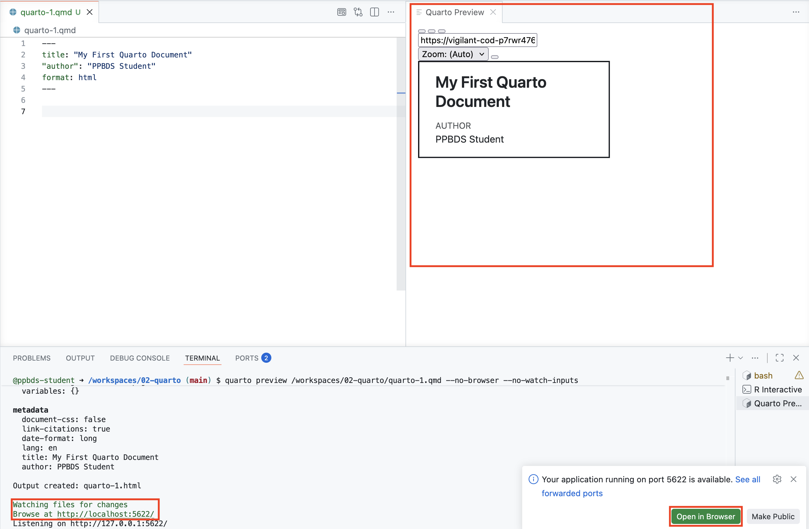
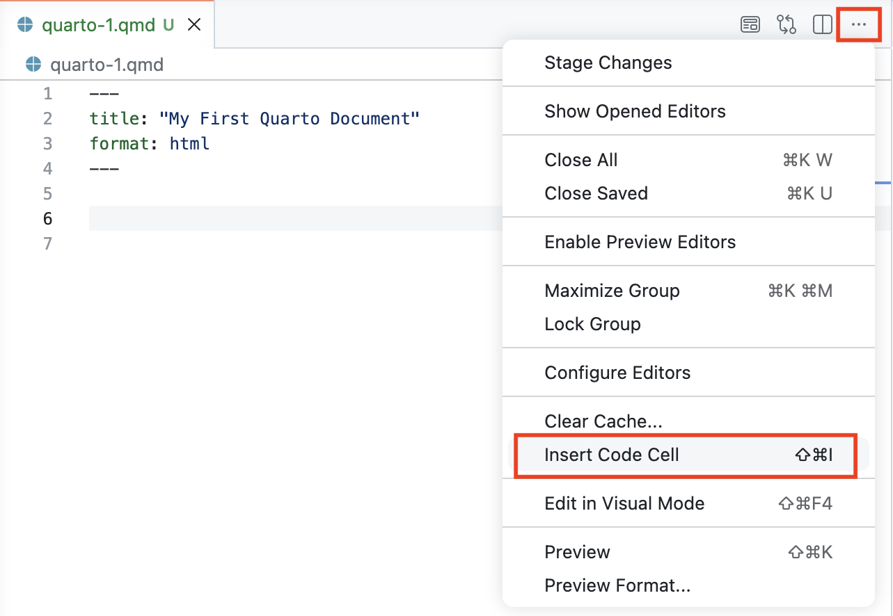
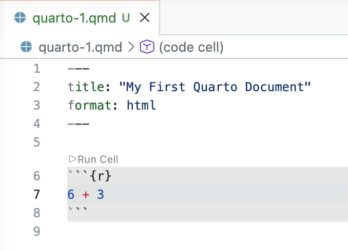
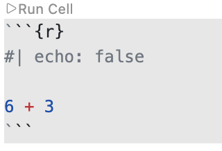

```{r setup, include = FALSE}
library(learnr)
library(tutorial.helpers)
library(tidyverse)
library(knitr)
knitr::opts_chunk$set(echo = FALSE)
knitr::opts_chunk$set(out.width = '90%')
options(tutorial.exercise.timelimit = 60, 
        tutorial.storage = "local")
```

```{r info-section, child = system.file("child_documents/info_section.Rmd", package = "tutorial.helpers")}
```

## Introduction
### 

This tutorial covers how to create Quarto documents using Visual Studio Code in [GitHub Codespaces](https://github.com/features/codespaces). For help with setting this up, see [Getting Started](https://ppbds.github.io/primer/getting-started.html). Some material is from [*R for Data Science (2e)*](https://r4ds.hadley.nz/) by Hadley Wickham, Mine Çetinkaya-Rundel, and Garrett Grolemund.

You should be running this tutorial from a Codespace created from the [Codespace starter](https://github.com/PPBDS/codespace-starter). You may reuse the Codespace that you used for the Code tutorial.

###

You should be doing this tutorial in a repo called `quarto`. Recall from the Workflow tutorial: a repo is a folder that Git watches, with a copy kept on GitHub. If your Explorer already shows a `quarto` folder, you are all set. If it shows something else --- `codespace-starter`, or the `code` repo from the last tutorial --- the next two exercises will get you connected. Either way, they only take a minute.

### Exercise 1

Open a new bash Terminal. Run `pwd`. CP/CR.

```{r introduction-1}
question_text(NULL,
    answer(NULL, correct = TRUE),
    allow_retry = TRUE,
    try_again_button = "Edit Answer",
    incorrect = NULL,
    rows = 3)
```

###

You will see one of two answers. Either you are already in your repo:

````
quarto $ pwd
/workspaces/quarto
quarto $
````

or you are somewhere else, like the course's folder:

````
codespace-starter $ pwd
/workspaces/codespace-starter
codespace-starter $
````

###

If your result ends in `quarto`, you are all set --- **do not run the connect-repo commands in the next exercise**; just do its last step. Otherwise, the next exercise connects you.

### Exercise 2

**Skip this paragraph --- do not run these commands --- if `pwd` showed `/workspaces/quarto`.** Otherwise, run these two commands, one at a time:

````
cd /workspaces/codespace-starter
.devcontainer/connect-repo.sh quarto
````

The `connect-repo` script lives in `codespace-starter`, so the first command moves you there; running the script from anywhere else --- including the `code` repo from the last tutorial --- fails. If a sign-in message appears, follow it: open the link in your browser, authorize GitHub, then return to VS Code. The script may reload the VS Code window or ask you to open a folder. If the Explorer does not show `quarto`, use `File -> Open Folder...` and open `/workspaces/quarto`. The reload will stop this tutorial. That is OK! Restart it the same way you started it: click **R Tutorials** in the Activity Bar, find this tutorial under **vscode.tutorials**, and click the arrow to launch it. All of your saved answers will still be there.

**Everyone**: open a new bash Terminal and run `pwd`. CP/CR.

```{r introduction-2}
question_text(NULL,
    answer(NULL, correct = TRUE),
    allow_retry = TRUE,
    try_again_button = "Edit Answer",
    incorrect = NULL,
    rows = 3)
```

###

````
quarto $ pwd
/workspaces/quarto
quarto $
````

Stop and fix the open folder if your result does not end in `quarto`. All work in this tutorial belongs in `/workspaces/quarto`.

###

Going forward, every tutorial will begin by assuming that you are already in a repo named after the tutorial. The repo name is the tutorial's title, all in lower case, with spaces replaced by dashes. This tutorial is titled "Quarto", so its repo is `quarto`. A tutorial titled "Terminal 1" is associated with a repo named `terminal-1`. We will no longer walk you through `connect-repo` --- you know how to create and connect to a repo, and we will assume that you have done so.

## Quarto 1
### 

Quarto is a file format for making dynamic documents with R and other languages, like Python. To learn more about Quarto and how to use it, check out the [official webpage](https://quarto.org/). Quarto is the successor technology to [R Markdown](https://rmarkdown.rstudio.com/). This section introduces Quarto documents.


### Exercise 1

Click `File -> New File ...` in the Application Menu (the three-horizontal-line icon) at the top left of your screen. Select `Quarto Document` from the drop-down menu.

The top of the new document is called the YAML header. It should look like:

```
---
title: "Untitled"
format: html
---
```

Change the title to “My First Quarto Document”.

Run `list.files()` in the R Terminal. CP/CR.

```{r quarto-1-1}
question_text(NULL,
    answer(NULL, correct = TRUE),
    allow_retry = TRUE,
    try_again_button = "Edit Answer",
    incorrect = NULL,
    rows = 2)
```

### 

````
> list.files()
character(0)
>
````

Since we have not saved the file yet, it does not appear in this listing.

Quarto is a command line interface tool, not an R package. Therefore, its commands are largely run in a bash Terminal. As you work through this tutorial, and use Quarto in the future, you should refer to the [Quarto documentation](https://quarto.org/). Of course, in the modern world, we can also ask an AI when we have a problem.

### Exercise 2

Save the Quarto document with `File -> Save`. You can also use the shortcut `Cmd/Ctrl + S`.

Name the file `quarto-1.qmd`.

Now that the document is saved, run:

````
tutorial.helpers::show_file("quarto-1.qmd", end = 4)
````

CP/CR.

```{r quarto-1-2}
question_text(NULL,
    answer(NULL, correct = TRUE),
    allow_retry = TRUE,
    try_again_button = "Edit Answer",
    incorrect = NULL,
    rows = 6)
```

###

````
---
title: "My First Quarto Document"
format: html
---
````

###

A Quarto file uses `qmd` as its extension, where those initials stand for **Q**uarto **M**arkdown **D**ocument. We will often say *QMD*, in the same way that we use *PNG* for some image files. The argument `end = 4` causes just the first four lines of the file to be printed. Note that there is no necessary connection between the **title** of a Quarto document --- “My First Quarto Document” --- and the **name** of the file, `quarto-1.qmd`.

###

Here is an example of a Quarto file:


````{verbatim, echo=TRUE}
---
title: "My First Quarto Document"
author: "Your Name"
format: html
---

## Quarto

Quarto enables you to weave together content and executable code into a finished document. To learn more about Quarto, see <https://quarto.org>.

## Running Code

When you click the **Render** button, a document will be generated that includes both content and the output of embedded code. You can embed code like this:

```{r}
1 + 1
```

You can add options to executable code like this:

```{r}
#| echo: false
2 * 2
```

The `echo: false` option disables the printing of code (only output is displayed).
````

### 

As you can see, a lot of the text is regular plain text, not code. However, there are code chunks (denoted by triple backticks on both ends, \`\`\`[code here]\`\`\`) that allow us to execute code when the document is "rendered." To "render" a Quarto document is to transform it into an HTML, PDF, DOCX, or other output file format while also running any embedded code. Here's an example of an R code chunk:

<pre><code>```{r}
1+1
```</code></pre>

Quarto documents use Markdown, an easy-to-write plain text format that can contain chunks of embedded code. These code chunks can be written in many languages, including R and Python. Code chunks allow you to use a programming language to create plots and other graphics.

### 

The [YAML header](https://bookdown.org/yihui/rmarkdown-cookbook/rmarkdown-anatomy.html) is everything between the dashed lines at the top of the file, including the dashed lines themselves. It holds "metadata" about the document, things like the title and the author. `format: html` means that the document will be rendered as an HTML file.

### Exercise 3

To "render" our Quarto document, use the shortcut `Cmd/Ctrl + Shift + K`. Your screen should look something like this:

```{r}

```

This command splits the Editor and opens a new tab titled "Quarto Preview" on the right. This displays the rendered document. It's often better to preview the document in a separate browser window. To do this, either click the green "Open in Browser" button in the bottom right, or `Cmd/Ctrl + click` the green URL in the bottom left. You can close the "Quarto Preview" viewer in the editor and still view the preview in the browser, if you prefer.

###

Professionals don't click buttons. They save time by using keyboard shortcuts!

Under the hood, this shortcut opens a new bash Terminal titled "Quarto Preview". There, it executes the `quarto preview` command. You don't need to worry about this now; just use `Cmd/Ctrl + Shift + K` to preview your Quarto documents.

###

Run `list.files()`. CP/CR.

```{r quarto-1-3}
question_text(NULL,
	answer(NULL, correct = TRUE),
	allow_retry = TRUE,
	try_again_button = "Edit Answer",
	incorrect = NULL,
	rows = 3)
```

### 

```
R 4.6.1> list.files()
[1] "quarto-1_files" "quarto-1.html"  "quarto-1.qmd"  
R 4.6.1> 
```

In the Explorer, you should see a new file, `quarto-1.html`. This is the file created by rendering. The Browser/Viewer tab in the Secondary Side Bar should also display the file.

### 

You should also see a new directory: `quarto-1_files`. Anytime you render a Quarto document, you create a directory like this, with the same name as the file, without the extension, plus `_files`. Quarto uses this directory to store intermediate work products associated with the creation of the associated output file.

### Exercise 4

The HTML document created from a QMD file will, by default, show both the code and the results generated by that code. This is the magic of Quarto. We can easily document and reproduce our work.

Add a couple of blank lines to the bottom of `quarto-1.qmd`. Then, add an R code chunk by selecting the `More Actions ...` button --- the three dots in the top-right of the editor. 

```{r}

```

Then, choose `Insert Code Cell`, selecting `r` from the list of options. Within the code cell, add `6 + 3`.

```{r}

```

You can also insert a code cell with the shortcut key: `Cmd/Ctrl + Shift + i`. 

Save the file. Render it again.

In the R Terminal, run:

````
tutorial.helpers::show_file("quarto-1.qmd", pattern = "6")
````

CP/CR.


```{r quarto-1-4}
question_text(NULL,
	answer(NULL, correct = TRUE),
	allow_retry = TRUE,
	try_again_button = "Edit Answer",
	incorrect = NULL,
	rows = 17)
```

###

````
6 + 3
````

###

This should return a single character vector with `"6 + 3"`, the line that you added to the code cell.

Strictly speaking, you did not need to save the file before rendering it. The `preview` command saves the file automatically. Nevertheless, you should make a habit of saving your work before running it. (If you come across some software that *doesn't* autosave upon running, you'll be running old code and wondering why something still doesn't work when you just fixed it.)

###

If you can no longer see the preview file, you can usually view it by checking the text that was printed in the Terminal when you rendered the QMD. That text will include something like this:

````
Watching files for changes
Browse at http://localhost:3807/
````

Paste that URL into a browser, or `Cmd + click` it, and you will be able to see the HTML. In my case, the URL is `http://localhost:3807/`; yours will be different.

### Exercise 5

Delete the first code cell. Add `This is my first Markdown text.` two lines below the YAML header. Save the file.

In the R Terminal, run:

````
tutorial.helpers::show_file("quarto-1.qmd")
````

CP/CR.

```{r quarto-1-5}
question_text(NULL,
	answer(NULL, correct = TRUE),
	allow_retry = TRUE,
	try_again_button = "Edit Answer",
	incorrect = NULL,
	rows = 3)
```

###

````
---
title: "My First Quarto Document"
author: "Your Name"
format: html
---

This is my first Markdown text.
````

###

This should return your entire Quarto document. If you do not have an empty line at the end of your file, you will get a warning message like this:

<span style="color: red;">
Warning message:
In readLines("quarto-1.qmd") :
  incomplete final line found on 'quarto-1.qmd'
</span>

The solution is to add an empty line to the end of the file. This is (almost) always a good idea! Don't be stingy with whitespace.

### Exercise 6

In Quarto documents, you can use [Markdown syntax](https://quarto.org/docs/authoring/markdown-basics.html). You can use this to create **bold** or *italic* text (and even text that's both ***bold and italic***), and headers.

### 

Replace the one sentence already in `quarto-1.qmd` with `## My Header`. Skip a line and add this text. 

````
You can do a lot of cool things in Quarto like **bold** and *italic* text.
````

Render the file again. Does everything look good in the Viewer/browser?

### 

In the R Terminal, run:

````
tutorial.helpers::show_file("quarto-1.qmd")
````

CP/CR.


```{r quarto-1-6}
question_text(NULL,
    answer(NULL, correct = TRUE),
    allow_retry = TRUE,
    try_again_button = "Edit Answer",
    incorrect = NULL,
    rows = 6)
```

###

````
---
title: "My First Quarto Document"
author: "Your Name"
format: html
---

## My Header

You can do a lot of cool things in Quarto like **bold** and *italic* text.
````

###

You can find a full list of Markdown formatting styles and commands [here](https://www.markdownguide.org/basic-syntax/).

To encourage the use of shortcut keys going forward, we will start using them directly in our instructions to you. So, instead of writing "Render the document," we will write `Cmd/Ctrl + Shift + K`.

Strictly speaking, the underlying command being issued is the "Preview" command, which both renders the QMD once and then also continues to watch for any changes in the QMD, re-rendering as needed.

### Exercise 7

So far you have viewed your rendered document in the "Quarto Preview" pane inside VS Code. There is a second way to view it, and it is the one you will rely on in later tutorials: the **Live Server** extension, which opens the HTML file in its own browser tab and refreshes it automatically whenever the file changes.

In the Explorer (the file tree on the left side of VS Code), find `quarto-1.html`. Right-click it and select **"Open with Live Server"**.

```{r}
include_graphics("images/live-server.png")
```

This opens `quarto-1.html` in a new browser tab served through your Codespace. The URL will look something like `https://[codespace-name]-5500.app.github.dev/quarto-1.html`.

Copy/paste that URL below.

```{r quarto-1-7}
question_text(NULL,
	answer(NULL, correct = TRUE),
	allow_retry = TRUE,
	try_again_button = "Edit Answer",
	incorrect = NULL,
	rows = 3)
```

###

````
https://congenial-chainsaw-wv757pv4pp67cpw-5500.app.github.dev/quarto-1.html
````

Keep this tab open. Every time `quarto-1.html` is updated in your Codespace --- whether you re-render with `Cmd/Ctrl + Shift + K` or run `quarto render` yourself --- the tab will refresh automatically.

###

Live Server is a VS Code extension that hosts HTML files so they can be viewed in a browser and reloads the page whenever a file changes. This is necessary in a Codespace because the files live on a remote computer and cannot be opened directly in a browser.

###

Why learn two ways to view your work? The "Quarto Preview" pane is quick and lives right inside the editor. Live Server gives you a real browser tab that behaves exactly like the published web page your readers will eventually see --- which is why the later tutorials lean on it. Either one shows you the rendered HTML; use whichever you prefer.

## Quarto 2
### 

Restart your R session. Open a new R Terminal and close your old one.

Let's create another Quarto document so that we can explore how to include R code within the document.

### Exercise 1

Follow the same procedure as last time to create a new Quarto document. `File -> New File... -> Quarto Document`. Use "My Second Quarto Document" as the title and add your name as the author. Save the document as `quarto-2.qmd`. `Cmd/Ctrl + Shift + K`.

Run `list.files()`. CP/CR.

```{r quarto-2-1}
question_text(NULL,
	answer(NULL, correct = TRUE),
	allow_retry = TRUE,
	try_again_button = "Edit Answer",
	incorrect = NULL,
	rows = 3)
```

### 

The listing should include `quarto-2.qmd`, `quarto-2.html`, and the `quarto-2_files` directory.

### Exercise 2

Add a code cell by using the shortcut key combination: `Cmd/Ctrl + Shift + I`. (In other words, on the Mac, the shortcut key is `Cmd + Shift + I` while on Windows it is `Ctrl + Shift + I`.)

The newly created code cell will be empty.

Save the file.

In the R Terminal, run:

````
tutorial.helpers::show_file("quarto-2.qmd")
````

CP/CR.

```{r quarto-2-2}
question_text(NULL,
    answer(NULL, correct = TRUE),
    allow_retry = TRUE,
    try_again_button = "Edit Answer",
    incorrect = NULL,
    rows = 6)
```

###

<pre><code>---
title: "My Second Quarto Document"
author: "Your Name"
format: html
---

&#96;&#96;&#96;{r}
&#96;&#96;&#96;
</code></pre>

###

Note the curly braces `{}` at the top of the chunk, with an `r` inside. The `r` indicates that Quarto should use R to run the code.

In this tutorial, we will only include R code within our code chunks. But code chunks can have any programming language in them, from common ones like Python, Java, and C, to esoteric ones like INTERCAL and Whitespace. All you need to do is indicate the language in the curly braces, e.g., `{py}`, `{ruby}`, et cetera.

### Exercise 3

Put `2 * 2` within the code chunk. `Cmd/Ctrl + Shift + K`. Copy and paste the entire rendered document, below. (This allows us to confirm that your file rendered correctly.)

```{r quarto-2-3}
question_text(NULL,
	answer(NULL, correct = TRUE),
	allow_retry = TRUE,
	try_again_button = "Edit Answer",
	incorrect = NULL,
	rows = 8)
```

### 

It is OK if your response does not look exactly like ours. But here is what we got:

````
My Second Quarto Document
2 * 2

[1] 4
````

We see both the code itself and the result of the code. This is an example of a "reproducible" analysis. We can re-render the document anytime we like, thereby confirming our results.

### Exercise 4

You can add options to code chunks. In Quarto, code chunk options are always preceded by `#|`, pronounced "hash-pipe", followed by an option/value pair, separated by a colon. A chunk can have several options; each belongs on its own line, and the order does not matter.

Add two options above the `2 * 2` calculation: `#| echo: false` and `#| label: calculation`.

```{r}

```

`Cmd/Ctrl + Shift + K`. Copy/paste the HTML below.

```{r quarto-2-4}
question_text(NULL,
	answer(NULL, correct = TRUE),
	allow_retry = TRUE,
	try_again_button = "Edit Answer",
	incorrect = NULL,
	rows = 6)
```

###

````
My Second Quarto Document
[1] 4
````

`echo: false` prevents the code, but not the results, from appearing in the finished file. Use this when writing reports aimed at people who don’t want to see the underlying R code, which is the vast majority of people you will ever write for. The `label` option, by contrast, has no effect on the output at all; labels are for organizing your work. Keep them short but evocative, with dashes (`-`) rather than underscores or spaces.

### Exercise 5

Delete the current code chunk. Add a new one. In this new code chunk, put `library(tidyverse)`. `Cmd/Ctrl + Shift + K`. A message about "Attaching core tidyverse packages" should appear in the HTML file. Copy/paste the contents of the rendered file below.


```{r quarto-2-5}
question_text(NULL,
	answer(NULL, correct = TRUE),
	allow_retry = TRUE,
	try_again_button = "Edit Answer",
	incorrect = NULL,
	rows = 12)
```

### 

````
My Second Quarto Document
library(tidyverse)

── Attaching core tidyverse packages ──────────────────────── tidyverse 2.0.0 ──
✔ dplyr     1.1.4     ✔ readr     2.1.5
✔ forcats   1.0.0     ✔ stringr   1.5.1
✔ ggplot2   3.5.2     ✔ tibble    3.2.1
✔ lubridate 1.9.4     ✔ tidyr     1.3.1
✔ purrr     1.0.4     
── Conflicts ────────────────────────────────────────── tidyverse_conflicts() ──
✖ dplyr::filter() masks stats::filter()
✖ dplyr::lag()    masks stats::lag()
ℹ Use the conflicted package (<http://conflicted.r-lib.org/>) to force all conflicts to become errors
````

We will include the **tidyverse** package in almost every Quarto document that we create. In fact, the top of most Quarto documents includes a code chunk that loads all the packages that we use in the analysis.

### Exercise 6

Add `#| message: false` to the code chunk. `Cmd/Ctrl + Shift + K`. Copy/paste the entire rendered file below.

```{r quarto-2-6}
question_text(NULL,
	answer(NULL, correct = TRUE),
	allow_retry = TRUE,
	try_again_button = "Edit Answer",
	incorrect = NULL,
	rows = 5)
```

### 

````
My Second Quarto Document
library(tidyverse)
````

We want to make our Quarto files beautiful. That means we will almost always "mask" ugly messages like this. Our readers don't care about such a**R**cana. They care about our analysis.

### Exercise 7

Instead of setting `echo: false` chunk by chunk, we can set it once for the whole document. Add

````
execute:
  echo: false
````

to the bottom of the YAML header. Make sure `echo: false` is indented with two spaces. `Cmd/Ctrl + Shift + K`. The rendered file should now be empty except for the title: every chunk still runs, but no code appears.

###

YAML is very fussy about formatting. Let's confirm this by breaking it: edit the YAML header so that `echo: false` is no longer indented. `Cmd/Ctrl + Shift + K`.

Copy/paste the error that appears.

```{r quarto-2-7}
question_text(NULL,
	answer(NULL, correct = TRUE),
	allow_retry = TRUE,
	try_again_button = "Edit Answer",
	incorrect = NULL,
	rows = 7)
```

###

````
Error

Validation of YAML front matter failed.
In file quarto-2.qmd
(line 5, columns 1--8) Field "execute" has empty value but it must instead be an object
4: format: html
5: execute:
          ~
6: echo: false

Render failed due to invalid YAML.
````

###

Indent `echo: false` again. `Cmd/Ctrl + Shift + K` to confirm that everything works. Any code chunk option that applies to most or all chunks belongs in the YAML header under `execute:`; an option for just one or two chunks stays in those chunks, preceded by `#|`.

### Exercise 8

Add another code chunk option: `label: setup`. Don't forget to preface it with the hash-pipe: `#|`. It is conventional to label the code chunk that loads libraries and takes care of other housekeeping as the "setup" code chunk.

`Cmd/Ctrl + Shift + K`. Copy/paste the HTML below.

```{r quarto-2-8}
question_text(NULL,
	answer(NULL, correct = TRUE),
	allow_retry = TRUE,
	try_again_button = "Edit Answer",
	incorrect = NULL,
	rows = 3)
```

### 

You are generally free to label your chunk however you like, but there is one chunk name that imbues special behavior: `setup`. When you’re in a notebook mode, the chunk named `setup` will be run automatically once, before any other code is run.

Chunk labels cannot be duplicated. Each chunk label must be unique.

### Exercise 9

**Important Point**: There are two different "worlds" that we are dealing with. First is the world of the Quarto document, the QMD file. Second are the worlds of the R Terminals. **These worlds only connect when we connect them**. Something written in a Quarto document --- or an R script --- is not, by default, part of an R Terminal session. The world of an R Terminal session includes only the commands executed in that terminal.

### 

Right now, the **tidyverse** package has not been loaded into the current R session. To load it, you must run the code chunk. To do so, first place your cursor inside the code chunk. Then, you have multiple options, including:

* `Cmd/Ctrl + Shift + Enter` will run all the code in the code chunk.

* `Cmd/Ctrl + Enter` will run just the code at the line in which the cursor is located.

* Press the small triangle --- labeled "Run Cell" --- directly above the code chunk. This runs all the code in the chunk/cell. (Again, the terms cell and chunk are used interchangeably.)

Run the code chunk. Then, run `pull(mtcars, 1)` in the R Terminal. CP/CR.

```{r quarto-2-9}
question_text(NULL,
	answer(NULL, correct = TRUE),
	allow_retry = TRUE,
	try_again_button = "Edit Answer",
	incorrect = NULL,
	rows = 3)
```

### 

If you run this command without running `library(tidyverse)` in the R Terminal, you will get an error about not finding the "pull" function. The fact that `library(tidyverse)` exists in the QMD, and that you have "used" it there by rendering the document, has no bearing on the world of the R Terminal.

### Exercise 10

Let's create the following scatterplot in our Quarto document:

```{r}
scat_p <- ggplot(data = iris,
                 mapping = aes(x = Sepal.Width,
                               y = Sepal.Length,
                              color = Species)) +
  geom_point() +
  labs(title = "Measurements for Different Species of Iris",
       subtitle = "Virginica has the longest sepals",
        x = "Sepal Width",
        y = "Sepal Length",
       caption = "Fisher (1936)")
scat_p
```

### 

Create a new code chunk. 

Use AI to recreate the chart you see above using R. You can describe it in words, or even use the image of the chart itself. Then paste the code you get back into your new code chunk.

### 

Preview the file. You should now see your R code (since we did not set `echo: false`) as well as your plot.
In the R Terminal, run:

````
tutorial.helpers::show_file("quarto-2.qmd", chunk = "Last")
````

CP/CR.

```{r quarto-2-10}
question_text(NULL,
    answer(NULL, correct = TRUE),
    allow_retry = TRUE,
    try_again_button = "Edit Answer",
    incorrect = NULL,
    rows = 10)
```

###

````
ggplot(data = iris,
       mapping = aes(x = Sepal.Width,
                     y = Sepal.Length,
                     color = Species)) +
  geom_point() +
  labs(title = "Measurements for Different Species of Iris",
       subtitle = "Virginica has the longest sepals",
       x = "Sepal Width",
       y = "Sepal Length",
       caption = "Fisher (1936)")
````

###

AI code is not perfect! A new piping character, `|>`, was introduced to replace `%>%`. But AI often uses the older version. If your AI used `%>%`, tell it to replace those characters with the newer `|>`. This can help "teach" your AI to write better code for you.

###

One more warning about AI code: **you should never include `install.packages()` in a Quarto document or R script that you share.** Generative AI tools will often suggest this. It is inconsiderate to hand off code that could change someone else's computer if they are not careful. Just having the `library()` command in the document tells us everything we need to know.

<!-- Need to decide whether to teach manual formatting, VS Code format document, or Air. If Air is installed/configured in Codespaces, this is a natural place to introduce it. -->

## Cleanup
###

Before moving on, delete the practice files you created in this tutorial. They were exercises, not work worth keeping. In the final section, you will make a document worth keeping.

### Exercise 1

In the R Terminal, run `unlink(list.files(), recursive = TRUE)` to delete all files and directories in your `quarto` repo. Then run `list.files()` to confirm the directory is empty. CP/CR.

```{r cleanup-1}
question_text(NULL,
    answer(NULL, correct = TRUE),
    allow_retry = TRUE,
    try_again_button = "Edit Answer",
    incorrect = NULL,
    rows = 3)
```

###

````
R 4.6.1> unlink(list.files(), recursive = TRUE)
R 4.6.1> list.files()
character(0)
R 4.6.1>
````

`character(0)` means the vector is empty --- there are no files left in your `quarto` repo. The `recursive = TRUE` argument is needed here because `unlink()` must also remove the `_files` directories created when rendering Quarto documents. (`unlink()` does not touch hidden files, so the `.git` directory --- the repo itself --- survives.)

## Publishing
###

A rendered HTML file in your Codespace can be seen by nobody but you. In this final section you will make one more Quarto document --- a keeper this time --- and publish it to the web, where anyone can see it.

### Exercise 1

Create a new Quarto document. The title is "Diamonds". You are the author. Add

````
execute:
  echo: false
````

to the YAML header. Save the file as `analysis.qmd`.

Add a `setup` code chunk which loads **tidyverse**, with `#| message: false`. Then add a second code chunk. As you did with the iris scatterplot, use AI to produce code for a beautiful graphic --- this time using the `diamonds` tibble --- and put that code in the second chunk.

This time, render from the **bash Terminal**, the way later tutorials always will:

````
quarto render analysis.qmd
````

Then, in the Explorer, right-click `analysis.html` and choose **Open with Live Server**. Keep that tab open --- it refreshes every time you render.

In the R Terminal, run:

````
tutorial.helpers::show_file("analysis.qmd")
````

CP/CR.

```{r publishing-1}
question_text(NULL,
    answer(NULL, correct = TRUE),
    allow_retry = TRUE,
    try_again_button = "Edit Answer",
    incorrect = NULL,
    rows = 15)
```

###

<pre><code>---
title: "Diamonds"
author: "Your Name"
format: html
execute:
  echo: false
---

&#96;&#96;&#96;{r}
#| label: setup
#| message: false
library(tidyverse)
&#96;&#96;&#96;

&#96;&#96;&#96;{r}
ggplot(diamonds, aes(x = price)) +
  geom_histogram(bins = 50)
&#96;&#96;&#96;
</code></pre>

###

Your plot code will differ from ours --- AI rarely writes the same code twice, and that is fine. This shape --- a YAML header, a `setup` chunk that loads libraries, then work chunks --- is the skeleton of every analysis document you will make from now on.

###

`quarto render` and `Cmd/Ctrl + Shift + K` are cousins. The shortcut runs `quarto preview`, which renders once and then keeps watching your file, re-rendering on every save. `quarto render` does one render and stops. The loop you just used --- edit, `quarto render`, glance at the refreshed Live Server tab --- is the one every data science tutorial from here on assumes.

### Exercise 2

Look at the Source Control icon in the Activity Bar --- the one that looks like a branching line. Its badge shows how many files have changed. The number is large, because rendering created `analysis_files`, a directory with many files inside.

Create a new file named `.gitignore` --- note the leading dot --- containing this single line:

````
*_files
````

Save it, and watch the badge drop.

In the R Terminal, run `tutorial.helpers::show_file(".gitignore")`. CP/CR.

```{r publishing-2}
question_text(NULL,
    answer(NULL, correct = TRUE),
    allow_retry = TRUE,
    try_again_button = "Edit Answer",
    incorrect = NULL,
    rows = 3)
```

###

````
*_files
````

###

Git tracks changes to the files in your repository, but files that can be *regenerated* from your source do not belong in the history. The `_files` directory is rebuilt at every render, so we tell Git to ignore it. The `*` makes the rule cover any rendered document, not just `analysis.qmd`.

### Exercise 3

Commit and push your work. In the bash Terminal, run these three commands, one at a time:

````
git add .
git commit -m "Diamonds analysis"
git push
````

CP/CR.

```{r publishing-3}
question_text(NULL,
    answer(NULL, correct = TRUE),
    allow_retry = TRUE,
    try_again_button = "Edit Answer",
    incorrect = NULL,
    rows = 10)
```

###

````
quarto $ git add .
quarto $ git commit -m "Diamonds analysis"
[main 4f2a9c1] Diamonds analysis
 3 files changed, 25 insertions(+)
 create mode 100644 .gitignore
 create mode 100644 analysis.html
 create mode 100644 analysis.qmd
quarto $ git push
Enumerating objects: 6, done.
Counting objects: 100% (6/6), done.
Writing objects: 100% (5/5), 4.21 KiB | 4.21 MiB/s, done.
To https://github.com/your-username/quarto.git
   8b3d0e7..4f2a9c1  main -> main
quarto $
````

###

Note what is **not** in the commit: `analysis_files` never appears, because of your `.gitignore`. A commit is a snapshot; a push copies it to GitHub. Professionals keep their work in the cloud because laptops --- and Codespaces --- fail.

### Exercise 4

An HTML file in your repo on GitHub is still not a web page. [GitHub Pages](https://pages.github.com/) solves this: it serves files from your repository as a public website, with a real URL you can share.

In the bash Terminal, run `quarto publish gh-pages analysis.qmd`. Respond with "Y" when it asks whether you want to publish. (This might take a minute.) CP/CR.

```{r publishing-4}
question_text(NULL,
    answer(NULL, correct = TRUE),
    allow_retry = TRUE,
    try_again_button = "Edit Answer",
    incorrect = NULL,
    rows = 12)
```

###

````
quarto $ quarto publish gh-pages analysis.qmd
? Publish site to https://your-username.github.io/quarto/ using gh-pages? (Y/n) › Yes
Rendering for publish:

[1/1] analysis.qmd
Switched to a new branch 'gh-pages'
[gh-pages (root-commit) 0e5631c] Initializing gh-pages branch
remote: Create a pull request for 'gh-pages' on GitHub by visiting:
remote:      https://github.com/your-username/quarto/pull/new/gh-pages
To https://github.com/your-username/quarto.git
 * [new branch]      HEAD -> gh-pages
Published to https://your-username.github.io/quarto/analysis.html
quarto $
````

###

`quarto publish` put the rendered HTML on a separate Git "branch" called `gh-pages`, keeping it apart from your source on `main`. GitHub Pages then serves that branch as a website. GitHub Pages is one host among several --- [Netlify](https://www.netlify.com/) and [Quarto Pub](https://quartopub.com/) are popular alternatives.

### Exercise 5

The publish command printed (and may have opened in your browser) the address of your page. It can take a minute or two for the page to appear. Copy/paste the URL of your published page.

```{r publishing-5}
question_text(NULL,
    answer(NULL, correct = TRUE),
    allow_retry = TRUE,
    try_again_button = "Edit Answer",
    incorrect = NULL,
    rows = 3)
```

###

````
https://your-username.github.io/quarto/analysis.html
````

###

That page is live on the internet --- anyone you send the URL to can read it. This loop --- edit, render, publish --- is how nearly every later tutorial ends: with a piece of work anyone in the world can see.

## Summary
###

This tutorial covered how to create [Quarto documents](https://docs.posit.co/ide/user/ide/guide/documents/quarto-project.html#creating-new-documents) using [GitHub Codespaces](https://github.com/features/codespaces), finishing with a document published to the web via GitHub Pages. Some material was from [*R for Data Science (2e)*](https://r4ds.hadley.nz/) by Hadley Wickham, Mine Çetinkaya-Rundel, and Garrett Grolemund.


```{r download-answers, child = system.file("child_documents/download_answers.Rmd", package = "tutorial.helpers")}
```
