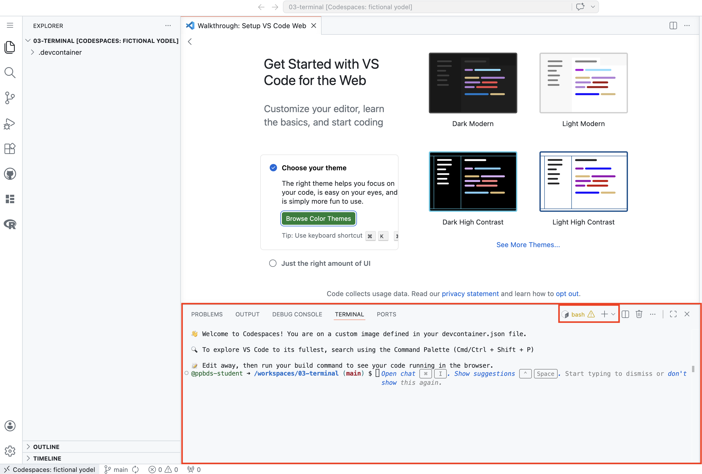
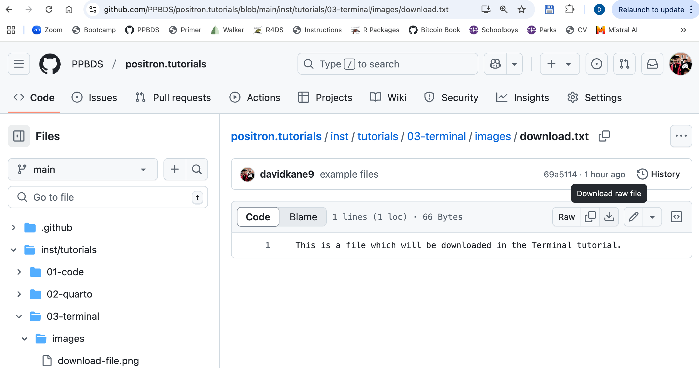
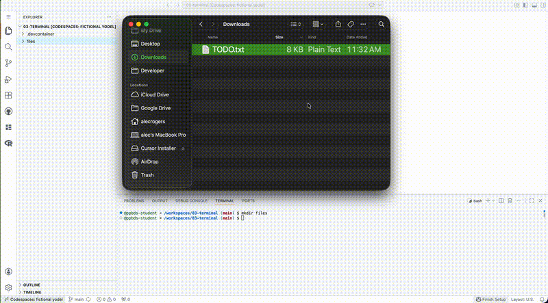
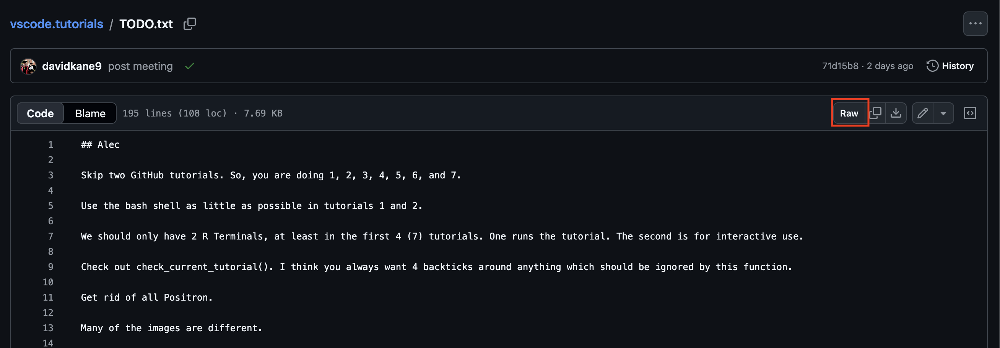

```{r setup, include = FALSE}
library(learnr)
library(tutorial.helpers)
library(tidyverse)
library(knitr)

library(pkgbuild)

knitr::opts_chunk$set(echo = FALSE)
knitr::opts_chunk$set(out.width = '90%')
options(tutorial.exercise.timelimit = 60,
        tutorial.storage = "local")
```


```{r info-section, child = system.file("child_documents/info_section.Rmd", package = "tutorial.helpers")}
```

<!-- Change to show that you are in the 03-terminal-1 repo, presumably. -->


<!-- Which to move to terminal-2? -->

<!-- Add to Files? -->

<!-- Explain more often that these are all programs that spit out stuff, which can often be chained together or just allowed to dump. -->

<!-- Mention Rscript and python -e. -->

<!-- Change the prompt in the answers to be the one we now use. -->

<!-- Some diagrams which show directory structure would be nice. -->

<!-- DK: Add a test which checks that the files which are downloaded exist. -->

<!-- Add a brief discussion of environment variables? -->

<!-- Consider adding a third files download exercise and/or making the current one more like the actual work that students do on this topic, which generally involves an R project, making data/ directory, putting a new file there and so on. -->

<!-- Could have test cases which confirm that these commands match what I think they should, I think. -->

<!-- Maybe add some material about running programs like Rscript. -->

<!-- Tutorial is too long. Need to cut. Probably best to cut from the end since students never use special characters anymore.-->

## Introduction
###

This tutorial introduces the structure and uses of the bash Terminal from within VS Code running on GitHub Codespaces. When most people use the word "terminal," they are referring to something like the bash Terminal, or some other shell which allows us to "talk" with the computer directly.

The older, more general term for the terminal is the "command line." All modern operating systems provide a command line, which sophisticated users can use to modify files and directories with commands like `pwd`, `ls`, `echo`, `mkdir`, `mv`, `rm`, and `cd`. We also discuss regular expressions as well as some of the metacharacters (like `*`, `^`, and `$`) from which they are constructed.

Some material is from [*R for Data Science (2e)*](https://r4ds.hadley.nz/) by Hadley Wickham, Mine Çetinkaya-Rundel, and Garrett Grolemund.

## Terminal
###

The lower section of the VS Code window is the "Panel," which is composed of a collection of "views," including Outputs, Problems, and Terminal. Another term for "view" is "tab."

The Terminal view or tab is, by far, the part of the Panel which we use most often. We employ terminals to talk directly with the computer. Different types of terminals use different languages to do this. The initial terminal uses the Bash language.

```{r}

```

### Exercise 1

Hit the `Enter` key (i.e, the `return` key on Mac or the `enter` key on Windows) two times in the Terminal to see what happens. The Terminal has a string of characters called the **prompt**. After a command has been executed, a prompt appears on a new line to let you know that the Terminal is ready for a new command. Copy and paste the three prompt lines from the Terminal as your answer below. We do a lot of **c**opy/**p**asting of **c**ommands/**r**esponses, so we abbreviate those instructions as CP/CR.

```{r terminal-1}
question_text(NULL,
    answer(NULL, correct = TRUE),
    allow_retry = TRUE,
    try_again_button = "Edit Answer",
    incorrect = NULL,
    rows = 3)
```

###

Your answer should look something like:

````
codespace-starter $
codespace-starter $
codespace-starter $
````

The prompt is the name of the directory you are currently in --- `codespace-starter` --- followed by a space and a dollar sign. The dollar sign indicates the end of the prompt; you type commands after it. (If you are working on your own computer rather than in a Codespace, your prompt will look different. Default prompts vary from computer to computer.)

###

The prompt acts as a quick way to tell you where you are on the computer. The Terminal is sensitive to your current folder location, so keep this in mind.

###

You only get this short prompt in a bash Terminal which you open yourself. A Terminal that was already open when the Codespace started shows GitHub's long default prompt, something like:

````
@davekane-student ➜ /workspaces/codespace-starter (main) $
````

with your GitHub username in place of `davekane-student`. The two prompts behave identically. All our examples show the short prompt, so if you see the long one, open a new bash Terminal.

### Exercise 2

Let's figure out the location of the folder we are currently in. (Note that the terms "folder" and "directory" mean the same thing.) To see your current location within your computer, type the command `pwd` (**p**resent **w**orking **d**irectory) in the Terminal. Hit the `Enter`.

Going forward, we will instruct you to "run" a given command. You do this by typing the command at the prompt and then hitting `Enter`.

CP/CR.

```{r terminal-2}
question_text(NULL,
    answer(NULL, correct = TRUE),
    allow_retry = TRUE,
    try_again_button = "Edit Answer",
    incorrect = NULL,
    rows = 3)
```

###

Your answer should look something like mine:

````
codespace-starter $ pwd
/workspaces/codespace-starter
codespace-starter $
````

The `pwd` command prints the full path to your current working directory. When in more complex file systems, the prompt usually only shows a shorter reminder of your location.

### Exercise 3

Let's see a **l**i**s**t of what is in our working directory, where we are currently located. Run `ls`. Note that this is the letter "L" and the letter "S", both in lowercase. It is not the number "1". CP/CR.

```{r terminal-3}
question_text(NULL,
    answer(NULL, correct = TRUE),
    allow_retry = TRUE,
    try_again_button = "Edit Answer",
    incorrect = NULL,
    rows = 3)
```

###

<!-- DK: Need an answer, here and elsewhere. -->

If you do not give it any more information, `ls` assumes that you want a list of what is in your current working directory.

### Exercise 4

Let's **m**a**k**e a **dir**ectory called `example`. Run `mkdir example`. Run `ls` to confirm that the new directory exists inside the current working directory. CP/CR.

```{r terminal-4}
question_text(NULL,
    answer(NULL, correct = TRUE),
    allow_retry = TRUE,
    try_again_button = "Edit Answer",
    incorrect = NULL,
    rows = 3)
```

###

`mkdir` creates an empty directory. We --- and most other people --- use the terms "folder" and "directory" interchangeably.

### Exercise 5

Move into the `example` directory by running `cd example`. Run `pwd`. CP/CR.


```{r terminal-5}
question_text(NULL,
	answer(NULL, correct = TRUE),
	allow_retry = TRUE,
	try_again_button = "Edit Answer",
	incorrect = NULL,
	rows = 3)
```

###

Your answer should look like:

````
codespace-starter $ mkdir example
codespace-starter $ cd example
example $ pwd
/workspaces/codespace-starter/example
example $
````

The `example` directory is one level below the directory in which you started.

### Exercise 6

Let's create a file called `my.txt`. Run `echo "" > my.txt`.

Run `ls` to confirm that the new file exists inside the current directory. CP/CR.

```{r terminal-6}
question_text(NULL,
    answer(NULL, correct = TRUE),
    allow_retry = TRUE,
    try_again_button = "Edit Answer",
    incorrect = NULL,
    rows = 3)
```

###

````
example $ echo "" > my.txt
example $ ls
my.txt
example $
````

`echo "" > my.txt` creates an empty file. `echo` just repeats whatever follows, which is an empty quote in this case. `>`, which we will discuss more later, redirects whatever comes before it into whatever comes after it.


### Exercise 7

Make a copy of `my.txt` called `my_2.txt` by using the `cp` command. That is, run `cp my.txt my_2.txt`. Confirm that this worked by running `ls`. CP/CR.

```{r terminal-7}
question_text(NULL,
	answer(NULL, correct = TRUE),
	allow_retry = TRUE,
	try_again_button = "Edit Answer",
	incorrect = NULL,
	rows = 3)
```

###

Your answer should look like:

````
example $ cp my.txt my_2.txt
example $ ls
my_2.txt  my.txt
example $
````

### Exercise 8

We rename files with the `mv` command, which is derived from **m**o**v**e. The first argument is the file we want to rename, and the second argument is the new name.

Rename `my.txt` to `fake.txt` by running `mv my.txt fake.txt`. Run `ls` to confirm. CP/CR.

```{r terminal-8}
question_text(NULL,
    answer(NULL, correct = TRUE),
    allow_retry = TRUE,
    try_again_button = "Edit Answer",
    incorrect = NULL,
    rows = 3)
```

###

Your answer should look like:

````
example $ mv my.txt fake.txt
example $ ls
fake.txt  my_2.txt
example $
````

###

From the computer's point of view, **renaming** a file is the same thing as **moving** a file. In fact, moving is more general since it allows us to change both the name *and* the location of a file.

### Exercise 9

Let's **r**e**m**ove the file `fake.txt`. Run `rm fake.txt`. Run `ls` to confirm. CP/CR.

```{r terminal-9}
question_text(NULL,
    answer(NULL, correct = TRUE),
    allow_retry = TRUE,
    try_again_button = "Edit Answer",
    incorrect = NULL,
    rows = 3)
```

###

Your answer should look like:

````
example $ rm fake.txt
example $ ls
my_2.txt
example $
````

Be careful with the `rm` command in the Terminal. Unlike moving files to Trash on your computer, it is (usually) irreversible.

### Exercise 10

We want to remove the `example` directory. But we can't do that while we are "located" in that directory. That is, the computer is aware that our Terminal process --- the entity that is executing our commands like `ls` and `cp` --- is currently working from the `example` directory.

Run `cd ..`. The "dot-dot" symbol --- `..` --- references the directory that contains the current directory. Run `pwd` to confirm. CP/CR.

```{r terminal-10}
question_text(NULL,
	answer(NULL, correct = TRUE),
	allow_retry = TRUE,
	try_again_button = "Edit Answer",
	incorrect = NULL,
	rows = 3)
```

###

Your answer should look like:

````
example $ cd ..
codespace-starter $ pwd
/workspaces/codespace-starter
codespace-starter $
````

Again, note how the prompt changed because we moved directories. The `..` symbol --- two periods --- always indicates the directory one level up, i.e., the directory in which `example` is located.

### Exercise 11

Run `rm -r example` to remove the directory `example`. Then run `ls` to confirm. CP/CR.

```{r terminal-11}
question_text(NULL,
    answer(NULL, correct = TRUE),
    allow_retry = TRUE,
    try_again_button = "Edit Answer",
    incorrect = NULL,
    rows = 3)
```

````
codespace-starter $ rm -r example
codespace-starter $ ls
codespace-starter $
````

`-r` is an **option** that allows us to delete a directory. The `r` stands for **r**ecursive because, in order to delete a directory, you must also (recursively) delete every directory and file within that directory.

It is good to clean up. Don't leave junk files lying around.

## Paths
###

You will practice using paths both inside and outside the current working directory. You will learn a few shortcuts to make this easier.

### Exercise 1

By default, the Terminal in VS Code starts in `/workspaces/codespace-starter`, the root folder of this Codespace.

Run `pwd` to show your current working directory. CP/CR.

```{r paths-1}
question_text(NULL,
    answer(NULL, correct = TRUE),
    allow_retry = TRUE,
    try_again_button = "Edit Answer",
    incorrect = NULL,
    rows = 3)
```

###

The Activity Bar on the left side of VS Code includes several buttons. When you click one of these buttons, a view opens next to the Activity Bar. Pressing the button again closes that view.

The top button is the Explorer. Pressing it opens the Explorer pane, also called Project Explorer. This functions like the Mac Finder or the Windows Explorer.

### Exercise 2

Use `mkdir` to make a directory named `paths` inside your current working directory. CP/CR.

```{r paths-2}
question_text(NULL,
    answer(NULL, correct = TRUE),
    allow_retry = TRUE,
    try_again_button = "Edit Answer",
    incorrect = NULL,
    rows = 3)
```

###

The new directory is created directly inside the working directory.

### Exercise 3

Let's **c**hange the working **d**irectory to `paths`. Run `cd paths`. Run `pwd` to confirm that you have changed the working directory. CP/CR.

```{r paths-3}
question_text(NULL,
    answer(NULL, correct = TRUE),
    allow_retry = TRUE,
    try_again_button = "Edit Answer",
    incorrect = NULL,
    rows = 3)
```

###

Your answer should look something like:

````
codespace-starter $ cd paths
paths $ pwd
/workspaces/codespace-starter/paths
paths $
````

Note how the prompt changed after I ran the `cd paths` command. Before, the prompt showed `codespace-starter` because that was the current working directory. Using `cd` changed the current working directory to `paths`, causing the prompt to change as well.

### Exercise 4

Use `mkdir` to make a directory called `lessons` inside `paths` by running `mkdir lessons`. Confirm that this worked by running `ls`. CP/CR.

```{r paths-4}
question_text(NULL,
    answer(NULL, correct = TRUE),
    allow_retry = TRUE,
    try_again_button = "Edit Answer",
    incorrect = NULL,
    rows = 3)
```

###

````
paths $ mkdir lessons
paths $ ls
lessons
paths $
````

Because we have changed working directories, the `lessons` directory is created inside the `paths` directory. It is the only object in the `paths` directory.

### Exercise 5

Make a directory within `lessons` called `fruits` by running `mkdir lessons/fruits`.

Run `ls lessons` to check to see if `fruits` exists inside the `lessons` directory. CP/CR.

```{r paths-5}
question_text(NULL,
    answer(NULL, correct = TRUE),
    allow_retry = TRUE,
    try_again_button = "Edit Answer",
    incorrect = NULL,
    rows = 3)
```

###

````
paths $ mkdir lessons/fruits
paths $ ls lessons/
fruits
paths $
````

###

We could not, as before, simply give `fruits` as an argument to `mkdir` because then the directory would be created directly inside `paths`, the current working directory, rather than within `lessons`. To refer to a location other than the working directory, we need to use a **path**, which describes the location directory by directory. The path above is called a **relative path** because it uses the working directory as its starting point.

### Exercise 6

Let's change our working directory to `fruits`. Run `cd lessons/fruits`.

As you are typing this command, type only the `f` in `fruits` and then press the tab key (twice may be necessary on some computers). Pressing tab autocompletes the name of a file or directory.

CP/CR.

```{r paths-6}
question_text(NULL,
    answer(NULL, correct = TRUE),
    allow_retry = TRUE,
    try_again_button = "Edit Answer",
    incorrect = NULL,
    rows = 3)
```

###

Get in the habit of using the tab key. Avoid typing whenever possible. Be lazy!

### Exercise 7

Use `echo "" >` to make a text file inside `fruits`, named `pineapple.txt`. Recall that your current location --- i.e., your working directory --- is now `fruits`. So, to make a new file within `fruits`, you just need `echo "" > pineapple.txt`. Run `ls` to confirm. CP/CR.

```{r paths-7}
question_text(NULL,
    answer(NULL, correct = TRUE),
    allow_retry = TRUE,
    try_again_button = "Edit Answer",
    incorrect = NULL,
    rows = 3)
```

###

````
fruits $ echo "" > pineapple.txt
fruits $ ls
pineapple.txt
fruits $
````
###

`pineapple.txt` is still a relative path, but since the file is directly inside the assumed starting point, i.e., the working directory, the name of the file is all we need. If we had used `lessons/fruits/apple.txt`, as we would have had to do if our working directory were `paths`, we would have gotten an error because those directories would not be recognized from our actual starting point of `fruits`.

Read this paragraph again. No skimming!

### Exercise 8

Use `echo` to make two more text files inside `fruits`, named `pear.txt` and `does-not-belong`. That is, run `echo "" > pear.txt & echo "" > does-not-belong`. Confirm by running `ls`. CP/CR.

```{r paths-8}
question_text(NULL,
    answer(NULL, correct = TRUE),
    allow_retry = TRUE,
    try_again_button = "Edit Answer",
    incorrect = NULL,
    rows = 3)
```

###

````
fruits $ echo "" > pear.txt & echo "" > does-not-belong
fruits $ ls
does-not-belong pear.txt        pineapple.txt
fruits $
````

The `&` symbol tells the operating system to run both the command that came before it and the command that comes after it.

### Exercise 9

Let's change our working directory to `lessons`. Run `cd ..` to go to the folder immediately above the working directory. Use `pwd` to confirm that you are in the right directory. CP/CR.

```{r paths-9}
question_text(NULL,
    answer(NULL, correct = TRUE),
    allow_retry = TRUE,
    try_again_button = "Edit Answer",
    incorrect = NULL,
    rows = 3)
```

Your answer should look like this:

````
fruits $ cd ..
lessons $ pwd
/workspaces/codespace-starter/paths/lessons
lessons $
````

###

`..` is shorthand for the directory immediately above the current working directory.

### Exercise 10

Use `mkdir` to make a directory within `lessons`, named `tbd`. Run `ls` to confirm. CP/CR.

```{r paths-10}
question_text(NULL,
    answer(NULL, correct = TRUE),
    allow_retry = TRUE,
    try_again_button = "Edit Answer",
    incorrect = NULL,
    rows = 3)
```

###

````
lessons $ mkdir tbd
lessons $ ls
fruits  tbd
lessons $
````

In the same way that `..` refers to the directory above the current directory, `.` --- a single period --- refers to the current directory.

### Exercise 11

Use `mv` to **m**o**v**e the file `does-not-belong` from the `fruits` directory to the `tbd` directory by running `mv fruits/does-not-belong tbd`. Run `ls tbd` to confirm.

CP/CR.

```{r paths-11}
question_text(NULL,
	answer(NULL, correct = TRUE),
	allow_retry = TRUE,
	try_again_button = "Edit Answer",
	incorrect = NULL,
	rows = 3)
```

###

````
lessons $ mv fruits/does-not-belong tbd
lessons $ ls tbd
does-not-belong
lessons $
````

###

We can act on files that are not in the working directory as long as we provide a path --- either relative, as here, or absolute --- to those files. In this case, neither `mv` nor `ls` is acting on the current directory. Instead, they are acting on lower directories: `fruits` and `tbd`.

### Exercise 12

Use `cd` to change the working directory up to `paths` by running `cd ..`. Confirm with `pwd`. Use `mv` and the `.` shorthand to move the directory `tbd` directly inside of `paths` by running `mv lessons/tbd .`. Confirm with `ls`. CP/CR.

```{r paths-12}
question_text(NULL,
    answer(NULL, correct = TRUE),
    allow_retry = TRUE,
    try_again_button = "Edit Answer",
    incorrect = NULL,
    rows = 3)
```

###

````
lessons $ cd ..
paths $ pwd
/workspaces/codespace-starter/paths
paths $ mv lessons/tbd .
paths $ ls
lessons tbd
paths $
````

When using `mv`, there is no difference between moving a directory and moving a file. A command like `mv lessons/tbd .` seems like a bit of witchcraft. But all it really says is to move (`mv`) the `tbd` directory (which is located in the `lessons` directory) to here (`.`), meaning to the current directory.

### Exercise 13

Move up one more directory, back to the original working directory, by running `cd ..`. Confirm with `pwd`. Run `rm -r paths` to remove all the directories and files that we have been working with. CP/CR.

```{r paths-13}
question_text(NULL,
    answer(NULL, correct = TRUE),
    allow_retry = TRUE,
    try_again_button = "Edit Answer",
    incorrect = NULL,
    rows = 3)
```

###

````
paths $ cd ..
codespace-starter $ pwd
/workspaces/codespace-starter
codespace-starter $ rm -r paths
codespace-starter $
````

###

In olden times, professional programmers would spend a lot of time learning the various options for commands like `rm`. Now, we just ask ChatGPT or a similar tool.

<!-- Could have them ask ChatGPT to do something and then do it. -->

## Important symbols
###

We have seen two important symbols --- `..` and `.` --- already. This section will explore those along with `~`. The most common English terms for these symbols are "dot" for `.`, "dot dot" for `..`, and "tilde" for `~`. The `.` symbol indicates the current directory. The `..` symbol is for the directory one level above the current directory. The `~` symbol is for your "home" directory.

### Exercise 1

Use `mkdir symbols` to create a new directory called `symbols`. `cd` into that directory by running `cd symbols`. Confirm the change with `pwd`. Confirm that the directory is empty by running `ls`.

CP/CR.

```{r important-symbols-1}
question_text(NULL,
	answer(NULL, correct = TRUE),
	allow_retry = TRUE,
	try_again_button = "Edit Answer",
	incorrect = NULL,
	rows = 3)
```

###

````
codespace-starter $ mkdir symbols
codespace-starter $ cd symbols
symbols $ pwd
/workspaces/codespace-starter/symbols
symbols $ ls
symbols $
````

The more practice we get with command-line commands --- often called "shell" commands --- the easier it is to string together several of them in a row.

### Exercise 2

But is the `symbols` directory really empty? Run `ls -a` to check. The `-` indicates an option to the `ls` command. The `a` option tells `ls` to return *a*ll the members of the directory.

CP/CR.

```{r important-symbols-2}
question_text(NULL,
	answer(NULL, correct = TRUE),
	allow_retry = TRUE,
	try_again_button = "Edit Answer",
	incorrect = NULL,
	rows = 3)
```

###

Your answer should look like:

````
symbols $ ls -a
.       ..
symbols $
````

Every directory, even an "empty" one, includes `.` and `..`. The `.` is a link to the current directory, i.e., to the `symbols` directory in which we are currently located. The `..` is a link to the directory one level up, which is `/workspaces/codespace-starter` in my case.

### Exercise 3

Run `ls ..` to examine the contents of the directory one level above the current directory. CP/CR.

```{r important-symbols-3}
question_text(NULL,
	answer(NULL, correct = TRUE),
	allow_retry = TRUE,
	try_again_button = "Edit Answer",
	incorrect = NULL,
	rows = 3)
```

###

My answer looks like this:

````
symbols $ ls ..
symbols
symbols $
````

At this point in the tutorial, `symbols` is the only item in `codespace-starter`. `ls ..` lets you view the contents of the parent directory without navigating away from where you are.

### Exercise 4

Run `ls ../..` to examine the contents of the directory two levels above the current directory. CP/CR.

```{r important-symbols-4}
question_text(NULL,
	answer(NULL, correct = TRUE),
	allow_retry = TRUE,
	try_again_button = "Edit Answer",
	incorrect = NULL,
	rows = 3)
```

###

My answer looks like this:

````
symbols $ ls ../..
codespace-starter
symbols $
````

Your answer may look different if your Codespace includes other folders inside `/workspaces`.

### Exercise 5

Run `pwd` again. This returns the current working directory. Note that the return value is an **absolute path**. It tells you exactly where you --- meaning your Terminal session or instance --- are located on your computer.

```{r important-symbols-5}
question_text(NULL,
	answer(NULL, correct = TRUE),
	allow_retry = TRUE,
	try_again_button = "Edit Answer",
	incorrect = NULL,
	rows = 3)
```

###

My answer looks like this:

````
symbols $ pwd
/workspaces/codespace-starter/symbols
symbols $
````

The absolute path for my current working directory breaks down into these components.

* The starting `/` indicates the root, or origin, of the file system. There is no directory higher than the root directory.

* `workspaces`, which is where GitHub Codespaces stores workspace folders.

* `codespace-starter`, which is the name of the folder in which I started this tutorial, followed by `symbols`, which is the directory we just created.

### Exercise 6

Run `cd` without any argument. Doing so changes your current directory to your home directory because that is the default behavior for `cd`. Run `pwd` to confirm where you are. CP/CR.

```{r important-symbols-6}
question_text(NULL,
    answer(NULL, correct = TRUE),
    allow_retry = TRUE,
    try_again_button = "Edit Answer",
    incorrect = NULL,
    rows = 3)
```

My answer looks like this:

````
symbols $ cd
~ $ pwd
/home/rstudio
~ $
````

In Codespaces, the home directory is usually `/home/rstudio`. Note how, after we run `cd`, the prompt changes to report `~` as the current working directory. `~` is the symbol for the current user's home directory.

### Exercise 7

Use `cd`, along with the full path to the `symbols` directory that you determined above, to change the working directory back to the `symbols` directory. Run `pwd` to confirm. CP/CR.

```{r important-symbols-7}
question_text(NULL,
    answer(NULL, correct = TRUE),
    allow_retry = TRUE,
    try_again_button = "Edit Answer",
    incorrect = NULL,
    rows = 3)
```

###

````
~ $ cd /workspaces/codespace-starter/symbols
symbols $ pwd
/workspaces/codespace-starter/symbols
symbols $
````

This is an example of using an absolute path to change locations.

### Exercise 8

Run `ls ~`. The list should be identical to the list you generated above in the home directory. Because the home directory is used in the absolute path of so many files, its path --- generally something like `/home/rstudio` in Codespaces --- can be written with the shorthand `~`, which is a tilde, pronounced "TIL-duh." CP/CR.


```{r important-symbols-8}
question_text(NULL,
    answer(NULL, correct = TRUE),
    allow_retry = TRUE,
    try_again_button = "Edit Answer",
    incorrect = NULL,
    rows = 3)
```

###

The shorthands we have learned so far, `.`, `..`, and `~`, stand for the paths to the corresponding directories. They are not specific to any function and can be used in any situation where the text of the relevant path could be used.

### Exercise 9

Confirm that you are currently located in the `symbols` directory by running `pwd`. Run `cd ..` to move one directory up, out of the `symbols` directory. Delete the `symbols` directory with `rm -rf symbols`. CP/CR.

```{r important-symbols-9}
question_text(NULL,
	answer(NULL, correct = TRUE),
	allow_retry = TRUE,
	try_again_button = "Edit Answer",
	incorrect = NULL,
	rows = 3)
```

###

Your answer should look like:

````
symbols $ pwd
/workspaces/codespace-starter/symbols
symbols $ cd ..
codespace-starter $ rm -rf symbols
codespace-starter $
````

Note that `rm -rf symbols` and `rm -rf symbols/`, with the trailing slash, have the same effect. Except in unusual circumstances, including (or not including) the trailing slash in the name of a directory does not matter.

## Options
###

Options modify the behavior of command-line functions like `ls`, as we saw with `ls -a` above.

### Exercise 1

Use `pwd` to confirm that you are in your default working directory. Make a directory directly inside the working directory, named `options`, by running `mkdir options`. `cd` into `options`. Run `ls` to confirm that it is empty. CP/CR.


```{r options-1}
question_text(NULL,
    answer(NULL, correct = TRUE),
    allow_retry = TRUE,
    try_again_button = "Edit Answer",
    incorrect = NULL,
    rows = 3)
```

###

````
codespace-starter $ pwd
/workspaces/codespace-starter
codespace-starter $ mkdir options
codespace-starter $ cd options/
options $ ls
options $
````

Note how easy it is to string together several commands in order to accomplish our goals.

### Exercise 2

Add a text file to the `options` directory, named `.my-hidden.txt` --- make sure to include the `.` at the front of the file name --- by running `echo "" > .my-hidden.txt`. CP/CR.

```{r options-2}
question_text(NULL,
    answer(NULL, correct = TRUE),
    allow_retry = TRUE,
    try_again_button = "Edit Answer",
    incorrect = NULL,
    rows = 3)
```

###

Other than `.`, avoid using special characters or spaces anywhere in file names. These are difficult to work with in the Terminal.

### Exercise 3

Run `ls` to look for the file you created. CP/CR.

```{r options-3}
question_text(NULL,
	answer(NULL, correct = TRUE),
	allow_retry = TRUE,
	try_again_button = "Edit Answer",
	incorrect = NULL,
	rows = 3)
```

###

Your answer should be something like:

````
options $ ls
options $
````

If you did the previous exercise correctly, you should **not** see the new file. This is because we prefixed the name with `.`, which hides the file from normal view. Files whose name begins with a `.` are called "hidden" files for this reason.

### Exercise 4

Run `ls -a`. Using the **option** `-a`, you should be able to see **a**ll the files in the directory. CP/CR.


```{r options-4}
question_text(NULL,
    answer(NULL, correct = TRUE),
    allow_retry = TRUE,
    try_again_button = "Edit Answer",
    incorrect = NULL,
    rows = 3)
```

###

Options are preceded by a `-` and come before the argument. Your answer should look like:

````
options $ ls -a
.               ..              .my-hidden.txt
options $
````

The `.` file refers to the `options` directory itself. The `..` refers to the directory in which the `options` directory is located. Every directory has both a `.` and a `..` file inside it, but we only see those files if we use the `-a` option.

###

Hidden files live all over your computer.

### Exercise 5

The **environment variable** `HOME` represents the path to your home directory. Type and enter `echo $HOME` to make sure we are telling you the truth.

CP/CR.

```{r options-5}
question_text(NULL,
    answer(NULL, correct = TRUE),
    allow_retry = TRUE,
    try_again_button = "Edit Answer",
    incorrect = NULL,
    rows = 3)
```

###

Your answer should look like:

````
options $ echo $HOME
/home/rstudio
options $
````

### Exercise 6

Run `ls $HOME`. This should generate a list of the items in your home directory.

CP/CR.

```{r options-6}
question_text(NULL,
    answer(NULL, correct = TRUE),
    allow_retry = TRUE,
    try_again_button = "Edit Answer",
    incorrect = NULL,
    rows = 3)
```

###

There are many different environment variables. You can also make your own. My answer looks like:

````
options $ ls $HOME
Downloads
options $
````

Don't worry about the details of these files. Our main point is that environment variables are very handy because they make it easy to refer to a specific location on a computer, like where R is installed, even though the absolute path to this location is different on every person's computer.

### Exercise 7

In the Terminal, run `ls -l $HOME` so that we can see more information in a **l**ong list.

CP/CR.

```{r options-7}
question_text(NULL,
    answer(NULL, correct = TRUE),
    allow_retry = TRUE,
    try_again_button = "Edit Answer",
    incorrect = NULL,
    rows = 3)
```

###

My answer looks like this:

````
options $ ls -l $HOME
total 4
drwxr-xr-x 2 codespace codespace 4096 Apr 30 12:00 Downloads
options $
````

In a long list, names are in the last column and file type is in the first. If the string in the first column begins with `d`, it is a **d**irectory; if it begins with `-`, it is a file; if it begins with `l`, it is a **l**ink to another file or directory on the computer. The middle columns give, from left to right, the number of files, author, permission, file size (in bytes), and the date/time last modified.

### Exercise 8

Let's download a copy of the `AUTHORS` document from the R source code. It is available at:

````
https://github.com/wch/r-source/blob/trunk/doc/AUTHORS
````

Press the "Download raw file" button. This should place a copy of the file in your `Downloads` directory. At the Terminal, run `ls ~/Downloads/A*`. If this command does not work for you, use AI to figure out a command that does.

CP/CR.

```{r options-8}
question_text(NULL,
    answer(NULL, correct = TRUE),
    allow_retry = TRUE,
    try_again_button = "Edit Answer",
    incorrect = NULL,
    rows = 3)
```

My answer looks like this:

````
options $ ls ~/Downloads/A*
/home/rstudio/Downloads/AUTHORS.txt
options $
````

Note how my computer has added a `.txt` suffix to the file. Your computer might or might not do the same. Many operating systems think that every file should have a suffix that describes what it is, and so they add one if it is not present.

### Exercise 9

Move the `AUTHORS` file to the current directory, which is `options`, using `mv`. Check with `ls` to confirm that it worked. CP/CR.

```{r options-9}
question_text(NULL,
	answer(NULL, correct = TRUE),
	allow_retry = TRUE,
	try_again_button = "Edit Answer",
	incorrect = NULL,
	rows = 3)
```

###

For me, this looks like:

````
options $ mv /home/rstudio/Downloads/AUTHORS.txt .
options $ ls
AUTHORS.txt
options $
````

Like `mv`, `cp` can change a file name; if the destination file name is omitted, both commands retain the original name by default.

### Exercise 10

Let's view just the initial lines of `AUTHORS.txt`. Run `head AUTHORS.txt`. CP/CR.

```{r options-10}
question_text(NULL,
    answer(NULL, correct = TRUE),
    allow_retry = TRUE,
    try_again_button = "Edit Answer",
    incorrect = NULL,
    rows = 3)
```

###

Now you know how R got its name. If your operating system did not add `.txt` as a suffix, then you should just use `AUTHORS` in this command and those that follow.

### Exercise 11

Let's view more than just the initial 10 lines. The option `-n` allows you to specify the number of initial lines you want to see. Run `head -n 18 AUTHORS.txt`. CP/CR.

```{r options-11}
question_text(NULL,
    answer(NULL, correct = TRUE),
    allow_retry = TRUE,
    try_again_button = "Edit Answer",
    incorrect = NULL,
    rows = 20)
```

###

The option `-n` takes an argument that allows `head` to display any number of initial lines.

### Exercise 12

Use the command `tail` and the same `-n` option to view the last 15 lines by running `tail -n 15 AUTHORS.txt`. CP/CR.


```{r options-12}
question_text(NULL,
    answer(NULL, correct = TRUE),
    allow_retry = TRUE,
    try_again_button = "Edit Answer",
    incorrect = NULL,
    rows = 20)
```

###

If the argument of `-n` is greater than the number of lines in the file, `head` or `tail` will just print the whole file.

### Exercise 13

Let's view the whole file at once. Run `cat AUTHORS.txt`. CP/CR.

```{r options-13}
question_text(NULL,
    answer(NULL, correct = TRUE),
    allow_retry = TRUE,
    try_again_button = "Edit Answer",
    incorrect = NULL,
    rows = 25)
```

###

`cat` stands for con**cat**enate, which means "to chain together." While it is often used on a single text file, the command can take two arguments and print the files together.

### Exercise 14

Run `cat -n AUTHORS.txt`. Notice that `-n` has no argument. CP/CR.


```{r options-14}
question_text(NULL,
    answer(NULL, correct = TRUE),
    allow_retry = TRUE,
    try_again_button = "Edit Answer",
    incorrect = NULL,
    rows = 20)
```

###

`cat -n` prints the text file with line numbers.

### Exercise 15

Let's make our own text file. Start by running `echo`, which takes a quoted string such as "Your First and Last Name Here" as its argument. This "echoes" the argument by printing it in the next line of the Terminal. CP/CR.

```{r options-15}
question_text(NULL,
    answer(NULL, correct = TRUE),
    allow_retry = TRUE,
    try_again_button = "Edit Answer",
    incorrect = NULL,
    rows = 3)
```

###

For me, this looks like:

````
options $ echo "David Kane"
David Kane
options $
````

`echo` can also take a string that is not in quotes as its argument.

### Exercise 16

We can use `>` to redirect the output of `echo` from the Terminal to a text file. Run `echo "Your First and Last Name Here" > test.txt`. Then use `ls` to see if the file `test.txt` exists within your working directory. Then use `cat` to read this file. After you have confirmed that the file contains your name, use `rm` to remove `test.txt`. CP/CR.

```{r options-16}
question_text(NULL,
    answer(NULL, correct = TRUE),
    allow_retry = TRUE,
    try_again_button = "Edit Answer",
    incorrect = NULL,
    rows = 8)
```

###

That is a lot of steps! An important goal of this tutorial is to teach you to be *comfortable* at the command line. My answer looks like:

````
options $ echo "David Kane" > test.txt
options $ ls
AUTHORS.txt     test.txt
options $ cat test.txt
David Kane
options $ rm test.txt
options $
````

### Exercise 17

`>` can be used to redirect the output of any command, not just `echo`. Let's try to make a new text file in `options` with just the first 25 lines of `AUTHORS.txt` called `AUTHORS-fake`. Run `head -n 25 AUTHORS.txt > AUTHORS-fake`. Run `ls` to confirm that it worked. CP/CR.


```{r options-17}
question_text(NULL,
    answer(NULL, correct = TRUE),
    allow_retry = TRUE,
    try_again_button = "Edit Answer",
    incorrect = NULL,
    rows = 3)
```

###

````
options $ head -n 25 AUTHORS.txt > AUTHORS-fake
options $ ls
AUTHORS-fake    AUTHORS.txt
options $
````

### Exercise 18

Using `>>`, whose syntax is the same as `>`, we can append output to an existing document. Use `echo` and `>>` to append your name to the list in `AUTHORS-fake`. That is, run (with your name in place of mine):

````
echo "David Kane" >> AUTHORS-fake
````

Confirm by running `tail AUTHORS-fake`. CP/CR.


```{r options-18}
question_text(NULL,
    answer(NULL, correct = TRUE),
    allow_retry = TRUE,
    try_again_button = "Edit Answer",
    incorrect = NULL,
    rows = 10)
```

###

My answer looks like:

````
options $ echo "David Kane" >> AUTHORS-fake
options $ tail AUTHORS-fake
Thomas Lumley
Martin Maechler
Sebastian Meyer
Paul Murrell
Martyn Plummer
Brian Ripley
Deepayan Sarkar
Duncan Temple Lang
Luke Tierney
David Kane
options $
````

Like `>`, `>>` is not limited to `echo`, but can be used to append the output of any command.


### Exercise 19

Run `cd ..` to change your directory to the directory in which you started the tutorial. Run `rm -r options` to remove the `options` directory. CP/CR.

```{r options-19}
question_text(NULL,
    answer(NULL, correct = TRUE),
    allow_retry = TRUE,
    try_again_button = "Edit Answer",
    incorrect = NULL,
    rows = 3)
```

###

Your answer should look like:

````
options $ cd ..
codespace-starter $ rm -r options
codespace-starter $
````

As usual, note how the prompt changes from `options $` to `codespace-starter $` as we move from the `options` directory to the directory from which we started this tutorial.


## Files
###

Downloading files and moving them to a sensible location is a core skill for data scientists.

### Exercise 1

Confirm your location with `pwd`. Run `mkdir files` to create a temporary directory in which to work. `cd` to that directory with `cd files`. Confirm that it is empty with `ls`. CP/CR.

```{r files-1}
question_text(NULL,
	answer(NULL, correct = TRUE),
	allow_retry = TRUE,
	try_again_button = "Edit Answer",
	incorrect = NULL,
	rows = 3)
```

###

````
codespace-starter $ pwd
/workspaces/codespace-starter
codespace-starter $ mkdir files
codespace-starter $ cd files/
files $ ls
files $
````

We often, as here, move to the directory in which we will be working. But we could have stayed in the starting directory, which is `/workspaces/codespace-starter` for me, and then worked from there using `files/` in the commands to come.

### Exercise 2

In your browser, go to `https://github.com/PPBDS/vscode.tutorials`.

This is the location for the R package that contains this tutorial. Click on the `TODO.txt` file, which should bring you to this URL:

`https://github.com/PPBDS/vscode.tutorials/blob/main/TODO.txt`.

Click on the "Download raw file" symbol to download the `TODO.txt` file to your computer. Most computers have a `Downloads` directory.

```{r}

```

Find the location of the file using Finder (Mac) or File Explorer (Windows). You'll need to know where this file exists on your computer in order to upload it to your Codespace. Back in your Codespace, drag and drop `TODO.txt` into the `files` directory in the Explorer.



Run `ls` to confirm that you have moved `TODO.txt` to the correct directory. CP/CR.

```{r files-2}
question_text(NULL,
	answer(NULL, correct = TRUE),
	allow_retry = TRUE,
	try_again_button = "Edit Answer",
	incorrect = NULL,
	rows = 3)
```


### Exercise 3

Delete the file by running `rm TODO.txt`.

Alternatively, you can upload the file this way:

1. Right-click the `files` directory. The option to `paste` will appear. Don't click this.

2. Then left-click the `files` directory. A drop-down menu will appear.

3. Select `Upload` from the menu.

4. Select `TODO.txt` from the file selection window.


Run `ls` to confirm that you have moved `TODO.txt` to the correct directory. CP/CR.

```{r files-3}
question_text(NULL,
	answer(NULL, correct = TRUE),
	allow_retry = TRUE,
	try_again_button = "Edit Answer",
	incorrect = NULL,
	rows = 3)
```

### Exercise 4

Delete the file by running `rm TODO.txt`.

Now, instead of downloading `TODO.txt` to your machine and uploading it to your Codespace, you'll download this file directly from GitHub using the `curl` command. First, we'll return to the GitHub webpage where this file is located:

````
https://github.com/PPBDS/vscode.tutorials/blob/main/TODO.txt
````

The URL above links to a webpage, but for our `curl` command, we want the link to download the raw text file. To get this from the webpage, press the "Raw" button in the top right.

```{r}

```

This will bring you to a page that displays the raw text file. Copy the URL in your address bar. It should begin with: `https://raw.githubusercontent.com/`.

Back in your Codespace, run the following command while in your `files` directory, replacing `URL` with the URL you found. 

````
curl -O URL
````

Run `ls` to confirm that the file has been downloaded. CP/CR.


```{r files-4}
question_text(NULL,
	answer(NULL, correct = TRUE),
	allow_retry = TRUE,
	try_again_button = "Edit Answer",
	incorrect = NULL,
	rows = 5)
```

###

My answer looks like this:

````
files $ curl -O https://raw.githubusercontent.com/PPBDS/vscode.tutorials/refs/heads/main/TODO.txt
  % Total    % Received % Xferd  Average Speed   Time    Time     Time  Current
                                 Dload  Upload   Total   Spent    Left  Speed
100  7876  100  7876    0     0   111k      0 --:--:-- --:--:-- --:--:--  111k
files $ ls
TODO.txt
files $
````

###

`curl` downloads the file from the URL. The `-O` option names the downloaded file with its **O**riginal name: `TODO.txt`.

### Exercise 5

Go one level up with `cd ..`. Delete the `files` directory with `rm -r files`. CP/CR.

```{r files-5}
question_text(NULL,
	answer(NULL, correct = TRUE),
	allow_retry = TRUE,
	try_again_button = "Edit Answer",
	incorrect = NULL,
	rows = 5)
```

###

Your answer should look like:

````
files $ cd ..
codespace-starter $ rm -r files/
codespace-starter $
````


## Summary
###

This tutorial introduced the structure and uses of the Terminal from within VS Code running on GitHub Codespaces.

The older, more general term for the terminal is the "command line." All modern operating systems provide a command line, which sophisticated users can use to modify files and directories with commands like `pwd`, `ls`, `echo`, `mkdir`, `mv`, `rm`, and `cd`. Some material is from [*R for Data Science (2e)*](https://r4ds.hadley.nz/) by Hadley Wickham, Mine Çetinkaya-Rundel, and Garrett Grolemund.

Learn more about the command line and related topics by reading [*The Unix Workbench*](https://seankross.com/the-unix-workbench/) by Sean Kross.

```{r download-answers, child = system.file("child_documents/download_answers.Rmd", package = "tutorial.helpers")}
```
