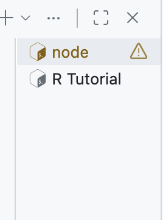
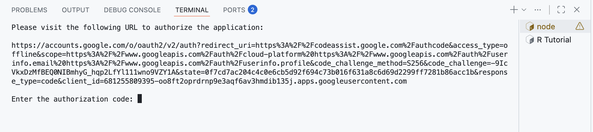
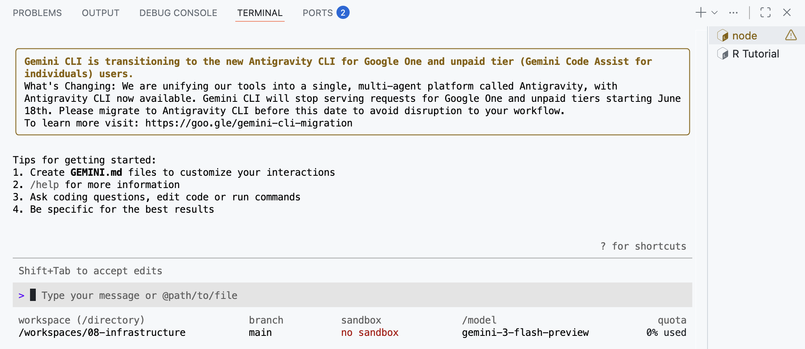
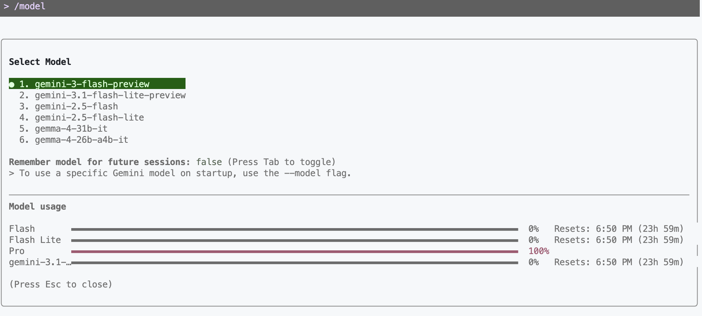
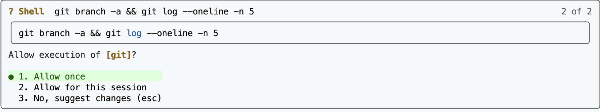
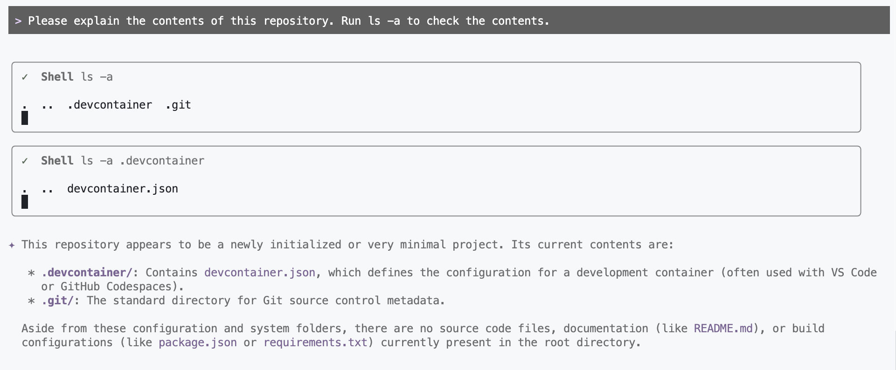
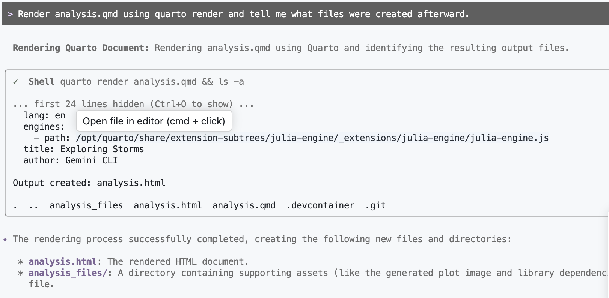
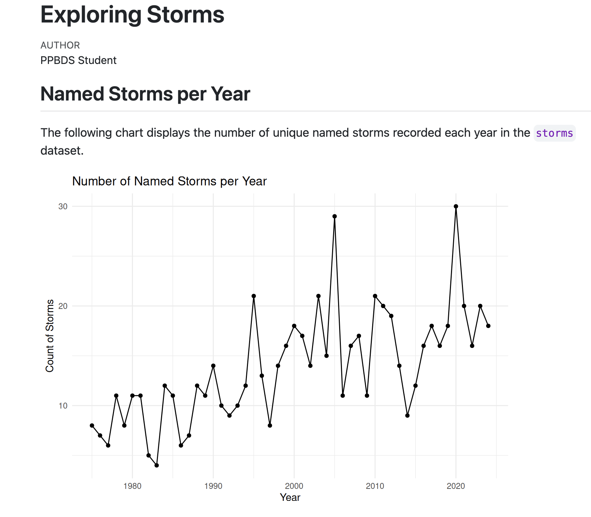
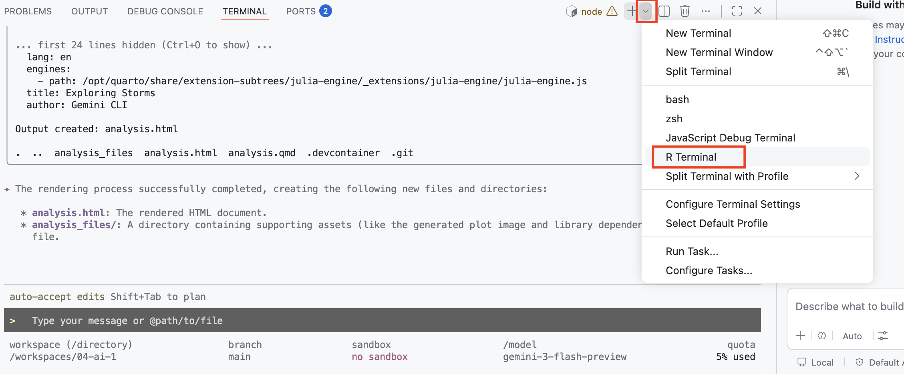

```{r setup, include = FALSE}
library(learnr)
library(tutorial.helpers)
library(knitr)
library(tidyverse)
library(nycflights13)

knitr::opts_chunk$set(echo = FALSE)
knitr::opts_chunk$set(out.width = '90%')
options(tutorial.exercise.timelimit = 60,
        tutorial.storage = "local")
```

```{r info-section, child = system.file("child_documents/info_section.Rmd", package = "tutorial.helpers")}
```

<!-- DK: Ought to replace `flights` examination with `storms` examination. -->

<!-- DK: Change default answers prompt. -->

<!-- DK: Check the that antigravity produces the same responses as gemini. -->

<!-- DK: Need to change sign in workflow to use Google Cloud and get the right project name. Or, better, to cover both cases. -->

<!-- DK: Do weird characters like &#96;&#96;&#96; show up correctly? -->

<!-- Fix Antigravity CLI links -->

<!-- Fix ending since you actually know Git. -->

<!-- DL: Replace or delete a lot of the images, which are Gemini. -->

## Introduction
###

You have used GitHub Copilot.  The [Antigravity CLI](DK: ) another terminal-based assistant that can read your files, run commands in the terminal, and write new files directly, asking your permission at each step. In this tutorial you will set it up and use it to explore a project and to create and render a Quarto analysis. A second section then reinforces the core `analysis.qmd` workflow: one working chunk per artifact, iterative rewrites, and caching.

You should be doing this tutorial in a repo named `antigravity`. If you are not, create one and connect to it, as you learned in earlier tutorials.

## Antigravity CLI
###

The [Antigravity CLI](DK: Fix) is a free, open AI assistant built by Google that runs in your terminal. Unlike a web chat interface, it can take actions on your behalf: reading files, running terminal commands, and writing new files. Each time it wants to take an action, it asks for your permission first, at least by default.

### Exercise 1

Start the Antigravity CLI by running `agy` in the bash Terminal. It will ask whether you want to connect and whether you trust the current working directory --- answer yes to both.

CP/CR the first several lines of terminal output --- enough to show the authentication prompt and the `>` prompt that appears after you successfully log in.

```{r gemini-cli-1}
question_text(NULL,
	answer(NULL, correct = TRUE),
	allow_retry = TRUE,
	try_again_button = "Edit Answer",
	incorrect = NULL,
	rows = 10)
```

###

````
antigravity $ agy
? Do you want to connect to Antigravity? Yes
? Do you trust the files in this folder? Yes

╭─────────────────────────────────────────────────────╮
│  Welcome to Antigravity CLI                              │
│  Your AI-powered terminal assistant                 │
╰─────────────────────────────────────────────────────╯

To get started, authenticate with your Google account.
Visit the URL below, sign in, and paste the code here.

https://accounts.google.com/o/oauth2/auth?...

>
````

You may notice that VS Code renames the terminal tab from "bash" to "node" once Antigravity starts. This is because the Antigravity CLI is built on [Node.js](https://nodejs.org/en/about), and VS Code detects this and updates the tab name.


```{r}

```

### Exercise 2

It will then ask you to authenticate with your Google account. You will see a URL printed in the terminal. 

```{r}

```

Open that URL in your browser, sign in with your Google account, and copy the authorization code that appears on the page. Paste it back into the terminal and press `Enter`. Then, Copy and Paste the tips to get started which will appear once Antigravity is done authenticating.


```{r gemini-cli-2}
question_text(NULL,
	answer(NULL, correct = TRUE),
	allow_retry = TRUE,
	try_again_button = "Edit Answer",
	incorrect = NULL,
	rows = 5)
```

###

```{r}

```

###

This uses [OAuth 2.0](https://oauth.net/2/), the same standard behind "Sign in with Google" buttons --- you grant a temporary permission token rather than sharing your password. The token is saved in this Codespace, but a new Codespace will require a fresh sign-in.

### Exercise 3

You are now inside the Antigravity CLI interactive session. The `>` prompt means Antigravity is waiting for your input. Type `/help` and press `Enter` to see the list of available commands.

CP/CR.

```{r gemini-cli-3}
question_text(NULL,
	answer(NULL, correct = TRUE),
	allow_retry = TRUE,
	try_again_button = "Edit Answer",
	incorrect = NULL,
	rows = 18)
```

###

````
> /help

Available commands:
  /help              Show this help message
  /quit or /exit     Exit the Antigravity CLI
  /model             Show or change the current model
  /stats session     Show usage statistics for this session
  /stats model       Show model token limits and current usage
  /clear             Clear the current conversation history
  /chat              List and restore saved chats
...
>
````

Note that your output may be different than what is shown here, as the Antigravity CLI adds new commands regularly.

###

Slash commands control the program itself, not Antigravity --- the command `/help` tells the *program* to print its options, while a plain sentence talks to *Antigravity*. For factual session data like usage statistics, always use slash commands rather than asking Antigravity, which will only guess.

### Exercise 4

Type `/model` to see which Antigravity model is currently active. CP/CR.

```{r gemini-cli-4}
question_text(NULL,
	answer(NULL, correct = TRUE),
	allow_retry = TRUE,
	try_again_button = "Edit Answer",
	incorrect = NULL,
	rows = 4)
```

###

```{r}

```

You may see something different here depending on your Antigravity CLI version — that's fine, don't worry about it.

###

The Antigravity model family has several tiers: **Pro** for complex reasoning and coding tasks, **Flash** for speed and lower usage. You can switch mid-session with `/model model-name` if you want to save your daily limit for simpler work or use a more powerful model.

### Exercise 5

Ask Antigravity to describe what files are in the repository. Type something like:

```
Please explain the contents of this repository. Run ls -a to check the contents.
```

Antigravity will display a **tool authorization prompt** before running commands. It should look something like this:

```{r}

```

Press `1` or hit enter where it says allow once to allow the command to run. You could press `2` to allow Antigravity to run the same command without asking again in this session. CP/CR the authorization prompt and Antigravity's response.


```{r gemini-cli-5}
question_text(NULL,
	answer(NULL, correct = TRUE),
	allow_retry = TRUE,
	try_again_button = "Edit Answer",
	incorrect = NULL,
	rows = 15)
```

###

```{r}

```

Antigravity decomposes your prompt into tool calls dynamically --- the exact commands it runs depend on how it interprets your request, so what you see may differ from the example. The authorization step keeps you in control regardless of which commands it chooses.

### Exercise 6

Ask Antigravity to create an `analysis.qmd` file, set up the way you learned in the Quarto tutorial. Tell it you want:

- A YAML header with the title `"Exploring Storms and Flights"` and your name as author
- `execute: echo: false` in the YAML
- A setup chunk loading `library(tidyverse)`, with `#| message: false`
- A plot using the `storms` dataset from **dplyr** --- for example, a line chart showing the number of named storms per year

Allow the file to be written when Antigravity asks for permission. CP/CR the tool authorization and Antigravity's explanation of what it created.

```{r gemini-cli-6}
question_text(NULL,
	answer(NULL, correct = TRUE),
	allow_retry = TRUE,
	try_again_button = "Edit Answer",
	incorrect = NULL,
	rows = 12)
```

###


````
> Create an analysis.qmd with a title, author, execute echo false, a setup chunk loading tidyverse with message false, and a ggplot2 plot using a built-in dataset.

╔ Tool Use: write_file ════════════════════╗
║  Path: analysis.qmd                      ║
╚══════════════════════════════════════════╝

Allow this tool call? (1=once, 2=always, n=no): 1

✔ Created analysis.qmd

I've created `analysis.qmd` with:
- YAML header titled "Exploring Storms and Flights" and `execute: echo: false`
- Setup chunk loading `library(tidyverse)` with `#| message: false`
- A line chart showing the number of named storms per year using the `storms` dataset

>
````

###

When you ask Antigravity to create a file, it generates the entire contents in one step and writes it for you. Instead of typing the YAML header, chunk settings, and library calls yourself, you describe what you want and refine the result --- editing is almost always faster than composing from scratch.

### Exercise 7

Still inside Antigravity, ask it to render `analysis.qmd` for you. Type something like:

```
Render analysis.qmd using quarto render and tell me what files were created afterward.
```

Antigravity will issue two tool calls: one to render the document and one to list the resulting files. Press `y` for each. CP/CR the output.

```{r gemini-cli-7}
question_text(NULL,
	answer(NULL, correct = TRUE),
	allow_retry = TRUE,
	try_again_button = "Edit Answer",
	incorrect = NULL,
	rows = 15)
```

###

```{r}

```

###

Antigravity ran two commands to answer one question, using the result of each step to decide what to do next. This is what makes it an AI *agent* --- it takes actions and reasons about results, rather than just producing text.

### Exercise 8

Let's view the rendered file in a browser, the way you learned in the Quarto tutorial: in the Explorer, find `analysis.html`, right-click it, and select **"Open with Live Server"**.

```{r}
include_graphics("images/live-server.png")
```

This opens `analysis.html` in a new browser tab served through your Codespace. The URL will look something like `https://[codespace-name]-5500.app.github.dev/analysis.html`.

Copy/paste that URL below.

```{r gemini-cli-8}
question_text(NULL,
	answer(NULL, correct = TRUE),
	allow_retry = TRUE,
	try_again_button = "Edit Answer",
	incorrect = NULL,
	rows = 3)
```

###

````
https://congenial-chainsaw-wv757pv4pp67cpw-5500.app.github.dev/analysis.html
````

Keep this tab open. Every time `analysis.html` is updated in your Codespace --- whether by Antigravity or by running `quarto render` yourself --- the tab will automatically refresh.

###

Your rendered file should look something like this:

```{r}

```

###

You met Live Server in the Quarto tutorial; nothing here is new except that an agent, rather than you, is triggering the renders.

### Exercise 9

Ask Antigravity: Add a plot to a new code chunk in `analysis.qmd` using the `storms` dataset. Visualize something like a boxplot showing the distribution of wind speeds by storm category. Include a meaningful title and subtitle, and then render the file.

After Antigravity finishes, check your Live Server tab --- it should have refreshed automatically to show the plot. Open a new R Terminal. 

```{r}

```

Then, in the new R Terminal, run:

```
tutorial.helpers::show_file("analysis.qmd", chunk = "Last")
```

CP/CR.

```{r gemini-cli-9}
question_text(NULL,
	answer(NULL, correct = TRUE),
	allow_retry = TRUE,
	try_again_button = "Edit Answer",
	incorrect = NULL,
	rows = 20)
```

###

```{r gemini-cli-9-test}
#| echo: true
storms |>
  filter(!is.na(category)) |>
  mutate(category = as.factor(category)) |>
  ggplot(aes(x = category, y = wind, fill = category)) +
  geom_boxplot() +
  labs(
    title = "Distribution of Wind Speeds by Storm Category",
    subtitle = "Higher categories correspond to significantly higher median wind speeds",
    x = "Storm Category",
    y = "Wind Speed (knots)",
    fill = "Category"
  ) +
  theme_minimal() +
  theme(legend.position = "none")
```

Your answer will be different from ours, but it should show **ggplot2** code using the `storms` dataset --- something like a boxplot of wind speed by storm category. The chunk should not have `#| echo: true` --- since you set `execute: echo: false` in the YAML header, all chunks use that setting by default.

###

When Antigravity adds a plot and re-renders, two things happen automatically: Quarto updates `analysis.html`, and Live Server detects the change and refreshes your browser. This loop --- ask Antigravity, render, view --- is the same workflow you would use throughout a real project.

### Exercise 10

In the Quarto tutorial you wrote a `.gitignore` by hand. This time, delegate the job: ask Antigravity to create a `.gitignore` file suitable for a Quarto R project. Type something like:

```
Create a .gitignore file.
```

Run `show_file(".gitignore")` in the R Terminal. CP/CR.

```{r gemini-cli-10}
question_text(NULL,
	answer(NULL, correct = TRUE),
	allow_retry = TRUE,
	try_again_button = "Edit Answer",
	incorrect = NULL,
	rows = 12)
```

###

````
*_files/
````

###

Same principle as in the Quarto tutorial: if a file can be *regenerated* from your source, it doesn't belong in the commit history. The agent may write a more thorough `.gitignore` than your hand-made one --- extra patterns are harmless. Delegating housekeeping files like this is the normal workflow from now on.

### Exercise 11

Before moving on, let's deliberately quit and restart Antigravity to see what happens to the conversation history. Type `/quit`.

Now run `agy` to start a fresh session. Once you're at the `>` prompt, ask:

```
What have we done in this project so far?
```

Without reading any files, Antigravity will have no memory of the previous session. Allow it to read the repo and watch it reconstruct the context from the filesystem.

CP/CR Antigravity's full response.

```{r gemini-cli-11}
question_text(NULL,
	answer(NULL, correct = TRUE),
	allow_retry = TRUE,
	try_again_button = "Edit Answer",
	incorrect = NULL,
	rows = 15)
```

###

````
Based on the current state of the repository, the project is in its early stages. Here is a summary of what has been done:

   1. Initial Setup: The project has been initialized with a basic Quarto structure, including a .devcontainer for development and a .gitignore file.
   2. Storms Analysis: You have created analysis.qmd, which uses R and the tidyverse to explore the storms dataset. It currently includes:
       * Named Storms per Year: A line and point plot showing the count of unique named storms from year to year.
       * Wind Speed Distribution: A boxplot visualizing how wind speeds vary across different storm categories.
   3. Output Generation: The analysis has been rendered into analysis.html.

  There are no other project-specific instructions (GEMINI.md) or memory records yet. Would you like to continue the analysis or add new features to this report?
````

###

Antigravity's **conversation history** is gone the moment you type `/quit`, but the **files on disk** are permanent --- this is why it can pick up where you left off after a restart just by reading the files. The `/chat save <name>` command lets you preserve a conversation so you can resume it later with `/chat resume <name>`.

## Antigravity in tutorials
###

In future tutorials you will spend most of your time prompting an AI agent to edit `analysis.qmd`, as well as rendering, and inspecting the resulting HTML. This section introduces key aspects of creating `analysis.qmd` files including: maintaining one working chunk per final artifact, iteratively rewriting that chunk to keep only necessary code, managing code chunk outputs in your rendered file, and caching results. Throughout this section we will explicitly tell you to use AI. In future tutorials, use of AI is simply assumed.

### Exercise 1

In the R Terminal, run:

```
show_file("analysis.qmd")
```

CP/CR.

```{r gemini-in-tutorials-1}
question_text(NULL,
	answer(NULL, correct = TRUE),
	allow_retry = TRUE,
	try_again_button = "Edit Answer",
	incorrect = NULL,
	rows = 25)
```

###

<pre><code>---
title: "Exploring Storms and Flights"
author: "PPBDS Student"
format: html
execute:
  echo: false
---

&#96;&#96;&#96;{r}
#| include: false
suppressPackageStartupMessages(library(tidyverse))
&#96;&#96;&#96;

## Named Storms per Year

The following chart displays the number of unique named storms recorded each year in the `storms` dataset.

&#96;&#96;&#96;{r}
storms |>
  distinct(year, name) |>
  count(year) |>
  ggplot(aes(x = year, y = n)) +
  geom_line() +
  geom_point() +
  labs(
    title = "Number of Named Storms per Year",
    x = "Year",
    y = "Count of Storms"
  ) +
  theme_minimal()
&#96;&#96;&#96;

## Wind Speed Distribution by Category

This boxplot shows the distribution of maximum wind speeds for each category of storm. It highlights how intensity increases across the categories defined in the dataset.

&#96;&#96;&#96;{r}
storms |>
  filter(!is.na(category)) |>
  mutate(category = as.factor(category)) |>
  ggplot(aes(x = category, y = wind, fill = category)) +
  geom_boxplot() +
  labs(
    title = "Distribution of Wind Speeds by Storm Category",
    subtitle = "Higher categories correspond to significantly higher median wind speeds",
    x = "Storm Category",
    y = "Wind Speed (knots)",
    fill = "Category"
  ) +
  theme_minimal() +
  theme(legend.position = "none")
&#96;&#96;&#96;
</code></pre>

###

Keep chunks clean as you work. Code chunks should contain clean code that we'd like to keep or should be the working chunk in which we are iteratively rewriting as we do our work.

### Exercise 2

Ask Antigravity to consolidate `analysis.qmd` so it contains only the setup chunk and the named-storms-per-year line chart. Delete any other chunks. Render. In the R Terminal, run `show_file("analysis.qmd")`. CP/CR.

Throughout this tutorial we will often say "ask Antigravity to" when we want you to use AI.

```{r gemini-in-tutorials-2}
question_text(NULL,
	answer(NULL, correct = TRUE),
	allow_retry = TRUE,
	try_again_button = "Edit Answer",
	incorrect = NULL,
	rows = 20)
```

###

<pre><code>---
title: "Exploring Storms and Flights"
author: "PPBDS Student"
format: html
execute:
  echo: false
---

&#96;&#96;&#96;{r}
#| include: false
suppressPackageStartupMessages(library(tidyverse))
&#96;&#96;&#96;

## Named Storms per Year

The following chart displays the number of unique named storms recorded each year in the `storms` dataset.

&#96;&#96;&#96;{r}
storms |>
  distinct(year, name) |>
  count(year) |>
  ggplot(aes(x = year, y = n)) +
  geom_line() +
  geom_point() +
  labs(
    title = "Number of Named Storms per Year",
    x = "Year",
    y = "Count of Storms"
  ) +
  theme_minimal()
&#96;&#96;&#96;
</code></pre>

###

Each code chunk should produce **one** final artifact --- either cleaned data or a plot. A chunk that mixes exploratory steps with its final output needs to be cleaned up.

###

Sometimes a code chunk takes a long time to run. We can **cache** a code chunk to save its results and avoid re-running it on subsequent renders.

### Exercise 3

Add `#| cache: true` to the storms chunk. Render. In the bash Terminal, run `ls`. CP/CR.

```{r gemini-in-tutorials-3}
question_text(NULL,
	answer(NULL, correct = TRUE),
	allow_retry = TRUE,
	try_again_button = "Edit Answer",
	incorrect = NULL,
	rows = 5)
```

###

Your answer should look something like:

````
antigravity $ ls
analysis.html  analysis_cache  analysis_files  analysis.qmd
antigravity $
````

###

Caching is a render-time feature. The first render writes the chunk's result to disk. Later renders skip re-running the chunk and load from disk instead. `analysis_cache/` appearing in `ls` confirms it is wired up.

### Exercise 4

Ask Antigravity to add `analysis_cache` to `.gitignore`. Note that the Source Control badge count in VS Code has increased because the cache directory is now visible to git --- adding `analysis_cache` to `.gitignore` makes it drop back. In the R Terminal, run `show_file(".gitignore")`. CP/CR.

```{r gemini-in-tutorials-4}
question_text(NULL,
	answer(NULL, correct = TRUE),
	allow_retry = TRUE,
	try_again_button = "Edit Answer",
	incorrect = NULL,
	rows = 6)
```

###

````
*_files/
analysis_cache
````

###

Cache files are regenerated from source and do not belong in git. Rule of thumb: if a file can be (easily) recreated from other components, do not commit it.

### Exercise 5

Ask Antigravity to add a **new chunk** at the bottom of `analysis.qmd` that prints the `flights` dataset. Render. In the R Terminal, run `show_file("analysis.qmd", chunk = "Last")`. CP/CR.

```{r gemini-in-tutorials-5}
question_text(NULL,
	answer(NULL, correct = TRUE),
	allow_retry = TRUE,
	try_again_button = "Edit Answer",
	incorrect = NULL,
	rows = 4)
```

###

```{r gemini-in-tutorials-5-test}
#| echo: true
flights
```

###

`flights` is a dataset from the **nycflights13** package with 336,776 rows --- every flight that departed from one of New York City's three airports (JFK, LGA, EWR) in 2013, with departure and arrival times, delays, carrier, destination, and more.

### Exercise 6

Ask Antigravity to update the last chunk to pipe `flights` through `glimpse()`. Render and inspect the output. In the R Terminal, run `show_file("analysis.qmd", chunk = "Last")`. CP/CR.

```{r gemini-in-tutorials-6}
question_text(NULL,
	answer(NULL, correct = TRUE),
	allow_retry = TRUE,
	try_again_button = "Edit Answer",
	incorrect = NULL,
	rows = 5)
```

###

```{r gemini-in-tutorials-6-test}
#| echo: true
flights |> 
glimpse()
```

###

`glimpse()` gives a column-level overview of a dataset --- every variable name, its type, and a few example values on one screen. Use this and/or other similar functions like `summary()` to initially explore any unfamiliar dataset.

### Exercise 7

Ask Antigravity to update the working chunk to filter `flights` to `origin == "JFK"` and select `dep_delay`, `arr_delay`, and `carrier`. Leave the result as the final expression so it prints. Render. In the R Terminal, run `show_file("analysis.qmd", chunk = "Last")`. CP/CR.

```{r gemini-in-tutorials-7}
question_text(NULL,
	answer(NULL, correct = TRUE),
	allow_retry = TRUE,
	try_again_button = "Edit Answer",
	incorrect = NULL,
	rows = 6)
```

###

```{r gemini-in-tutorials-7-test}
#| echo: true
flights |>
  filter(origin == "JFK") |>
  select(dep_delay, arr_delay, carrier)
```

###

The pipe `|>` passes the left side's result directly to the next function. Reading it as "and then" helps: take `flights`, **and then** keep only JFK departures, **and then** keep these three columns. The result prints because the final expression is a value, not an assignment.

### Exercise 8

Ask Antigravity to save the filtered tibble to a variable called `flights_jfk` instead of printing it directly. Render and notice the table disappears from the HTML. In the R Terminal, run `show_file("analysis.qmd", chunk = "Last")`. CP/CR.

```{r gemini-in-tutorials-8}
question_text(NULL,
	answer(NULL, correct = TRUE),
	allow_retry = TRUE,
	try_again_button = "Edit Answer",
	incorrect = NULL,
	rows = 6)
```

###

```{r gemini-in-tutorials-8-test}
#| echo: true
flights_jfk <- flights |>
  filter(origin == "JFK") |>
  select(dep_delay, arr_delay, carrier)
```

###

Assignment captures the result silently --- a chunk that only uses `<-` to assign a value to an object produces no output in the render. A blank section in the HTML is not an error; it means the chunk built an object without displaying it.

### Exercise 9

Ask Antigravity to add a line to the chunk that prints `flights_jfk`. Render and confirm the table reappears. In the R Terminal, run `show_file("analysis.qmd", chunk = "Last")`. CP/CR.

```{r gemini-in-tutorials-9}
question_text(NULL,
	answer(NULL, correct = TRUE),
	allow_retry = TRUE,
	try_again_button = "Edit Answer",
	incorrect = NULL,
	rows = 8)
```

###

```{r gemini-in-tutorials-9-test}
#| echo: true
flights_jfk <- flights |>
  filter(origin == "JFK") |>
  select(dep_delay, arr_delay, carrier)

flights_jfk
```

###

Calling a variable by name on the last line of a chunk is all it takes to print it. Ending a data-preparation chunk with the variable name is a standard way to confirm its shape before building a plot.

### Exercise 10

Ask Antigravity to add a new code chunk with a **ggplot2** scatter plot of `dep_delay` vs. `arr_delay`, colored by `carrier`. Render. In the R Terminal, run `show_file("analysis.qmd", chunk = "Last")`. CP/CR.

```{r gemini-in-tutorials-10}
question_text(NULL,
	answer(NULL, correct = TRUE),
	allow_retry = TRUE,
	try_again_button = "Edit Answer",
	incorrect = NULL,
	rows = 10)
```

###

```{r gemini-in-tutorials-10-test}
#| echo: true
ggplot(flights_jfk, aes(x = dep_delay, y = arr_delay, color = carrier)) +
  geom_point(alpha = 0.1) +
  labs(title = "Departure vs. Arrival Delay for JFK Flights",
       x = "Departure Delay (min)", y = "Arrival Delay (min)")
```

###

Chunks in the same document share an R session --- `flights_jfk` is created in the first chunk and available to the second without redefining it. The two-chunk pattern here --- one to prepare data, one to plot it --- is a common pattern.

### Exercise 11

In the R Terminal, run `show_file("analysis.qmd")`. CP/CR.

```{r gemini-in-tutorials-11}
question_text(NULL,
	answer(NULL, correct = TRUE),
	allow_retry = TRUE,
	try_again_button = "Edit Answer",
	incorrect = NULL,
	rows = 30)
```

###

Your answer should look something like:

<pre><code>---
title: "Exploring Storms and Flights"
author: Your Name
execute:
  echo: false
---

&#96;&#96;&#96;{r}
#| message: false
suppressPackageStartupMessages(library(tidyverse))
library(nycflights13)
&#96;&#96;&#96;

&#96;&#96;&#96;{r}
#| cache: true
storms |>
  count(year) |>
  ggplot(aes(x = year, y = n)) +
  geom_line() +
  labs(title = "Named Storms per Year", x = "Year", y = "Number of Storms")
&#96;&#96;&#96;

&#96;&#96;&#96;{r}
flights_jfk <- flights |>
  filter(origin == "JFK") |>
  select(dep_delay, arr_delay, carrier)

flights_jfk
&#96;&#96;&#96;

&#96;&#96;&#96;{r}
ggplot(flights_jfk, aes(x = dep_delay, y = arr_delay, color = carrier)) +
  geom_point(alpha = 0.1) +
  labs(title = "Departure vs. Arrival Delay for JFK Flights",
       x = "Departure Delay (min)", y = "Arrival Delay (min)")
&#96;&#96;&#96;
</code></pre>

###

From here on, using AI to write your analysis code is always the assumed approach --- you will describe a goal, let the agent write the code (generally in a working code chunk), render, and inspect the result.

## Git with Antigravity
###

Now that the project has real files, let's save the work with Git. Rather than just telling you the commands, we'll use Antigravity to explain the Git workflow. Using AI to understand what you are doing --- not just to do it --- is a powerful learning strategy.

### Exercise 1

Ask Antigravity to check the Git status and explain what the output means:

```
Run git status and explain what each part of the output means.
```

Press `y`, 1, or hit Enter on allow once to allow the shell command. CP/CR the full response including Antigravity's explanation.

```{r git-with-gemini-1}
question_text(NULL,
	answer(NULL, correct = TRUE),
	allow_retry = TRUE,
	try_again_button = "Edit Answer",
	incorrect = NULL,
	rows = 18)
```

###

Your answer should look something like:

````
> Run git status and explain what each part of the output means.

╔ Tool Use: run_shell ══════════════════╗
║  Command: git status                  ║
╚═══════════════════════════════════════╝

Allow this tool call? [y/n/a]: y

Output:
On branch main
Your branch is up to date with 'origin/main'.

Untracked files:
  (use "git add <file>..." to include in what will be committed)
        .gitignore
        analysis.html
        analysis.qmd

nothing added to commit but untracked files present

Here's what this means:
- "On branch main" — you are working on the main branch.
- "Your branch is up to date" — your local branch matches the GitHub copy.
- "Untracked files" — Git has noticed these files but is not monitoring them yet. They will not be included in any commit until you explicitly add them with `git add`.

>
````

###

`git status` shows your branch, **staged** changes (added to the next commit), and **untracked** files (noticed by Git but not yet included). Smart commit in `codespace-starter` handles staging automatically --- just press the "Commit" button.

You may notice that `analysis.html` does not appear in your `git status` output. This can happen if the `.gitignore` Antigravity created includes `*.html`, which tells Git to ignore all HTML files. If this happens, you can use `git add -f analysis.html` to force Git to track it anyway.

### Exercise 2

Ask Antigravity to explain the difference between `git add` and `git commit`, and to provide the exact command to commit all three files with a good message:

```
Explain the difference between git add and git commit. Then give me the exact command to commit .gitignore, analysis.qmd, and analysis.html with a descriptive message.
```

CP/CR Antigravity's full response.

```{r git-with-gemini-2}
question_text(NULL,
	answer(NULL, correct = TRUE),
	allow_retry = TRUE,
	try_again_button = "Edit Answer",
	incorrect = NULL,
	rows = 20)
```

###

Antigravity should explain that `git add` moves files into the **staging area**, a holding zone where you prepare which changes to include before committing. `git commit` then takes everything in the staging area and permanently records it in the project's history. A typical response will include commands like:

```
git add .gitignore analysis.qmd analysis.html
git commit -m "initial version with analysis and gitignore"
```

###

The two-step design lets you choose exactly which files go into each commit --- useful when you want to record related changes separately with different messages. In `codespace-starter`, the Source Control sidebar handles both steps at once, but knowing they are separate matters when collaborating on larger projects.

### Exercise 3

Open the Source Control sidebar (the branch icon in the Activity Bar). You should see `.gitignore`, `analysis.qmd`, and `analysis.html` listed as changes. Type a commit message in the message box at the top, then click the **Commit** button. Because smart commit is enabled in the devcontainer, clicking Commit will stage and commit all changes in one step --- no `git add` required.

Then, in a separate bash Terminal, run:

```
git log --oneline
```

CP/CR.

```{r git-with-gemini-3}
question_text(NULL,
	answer(NULL, correct = TRUE),
	allow_retry = TRUE,
	try_again_button = "Edit Answer",
	incorrect = NULL,
	rows = 6)
```

###

Your answer should look something like:

````
antigravity $ git log --oneline
a3b8c21 (HEAD -> main) initial version with analysis and gitignore
e3b01ee Initial commit
antigravity $
````

The `(HEAD -> main)` indicator confirms your local branch is current, but the missing `origin/main` means this commit hasn't been pushed to GitHub yet. Pushing is what sends it there and makes it visible to others.

### Exercise 4

Ask Antigravity to improve the storms-per-year chart. Type something like:

```
Update the storms-per-year chart in analysis.qmd to be a stacked area chart showing the count of each storm type per year. Filter to just tropical depressions, tropical storms, and hurricanes. Use a color scale that goes from light blue for tropical depressions through orange for tropical storms to dark red for hurricanes. Re-render the file when done.
```

Press `y` to authorize each tool call. Once the Live Server tab has refreshed and you are happy with the result, ask Antigravity to handle the entire Git workflow:

```
Please commit analysis.qmd and analysis.html with a good message, and push to GitHub.
```

Press `y` to authorize each tool call as Antigravity works through the steps. CP/CR the complete output.

```{r git-with-gemini-4}
question_text(NULL,
	answer(NULL, correct = TRUE),
	allow_retry = TRUE,
	try_again_button = "Edit Answer",
	incorrect = NULL,
	rows = 20)
```

###

Your output should look something like:

````
> Please commit analysis.qmd and analysis.html with a good message, and push to GitHub.

╔ Tool Use: run_shell ═══════════════════════════════════════╗
║  Command: git add analysis.qmd analysis.html               ║
╚════════════════════════════════════════════════════════════╝
Allow this tool call? [y/n/a]: y

╔ Tool Use: run_shell ══════════════════════════════════════════════╗
║  Command: git commit -m "convert to stacked area chart by storm type" ║
╚══════════════════════════════════════════════════════════════════╝
Allow this tool call? [y/n/a]: y

╔ Tool Use: run_shell ════════════════════════╗
║  Command: git push origin main              ║
╚═════════════════════════════════════════════╝
Allow this tool call? [y/n/a]: y

✔ Done! Your changes have been committed and pushed to GitHub.

>
````

###

Antigravity issued three separate tool calls --- `git add`, `git commit`, and `git push` --- mapping directly to the three stages of staging, recording, and sharing. In Exercise 3 you ran these yourself using the Source Control sidebar; here you delegated them to gemini.

### Exercise 5

Still in Antigravity, type `/stats session` and then `/stats model`. CP/CR both outputs.

```{r git-with-gemini-5}
question_text(NULL,
	answer(NULL, correct = TRUE),
	allow_retry = TRUE,
	try_again_button = "Edit Answer",
	incorrect = NULL,
	rows = 18)
```

###

Your output should look something like:

````
> /stats session

Session Statistics:
  Messages:           14
  Tool calls made:    10
  Tool calls allowed: 10
  Input tokens:       ~18,400
  Output tokens:      ~5,100
  Total tokens:       ~23,500

> /stats model

Model: gemini-2.5-pro
  Context window:    1,000,000 tokens
  Free tier limit:   1,000,000 tokens/day
  Used today:        ~23,500 tokens
  Remaining:         ~976,500 tokens

>
````

###

AI models have **context windows** --- a limit on how much text they can process in one session. Antigravity's are very large (up to 1 million tokens), but `/stats` lets you track usage in real time; on the free tier, your daily limit resets every day.


## Summary
###

This tutorial introduced the [Antigravity CLI](DK: fix) as an AI *agent* --- a terminal-based assistant that reads your files, runs commands, and writes files on your behalf, asking permission at each step. You authenticated with your Google account, let Antigravity explore the repository, and used it to create and render a Quarto analysis. You then practiced the core `analysis.qmd` workflow: maintaining one working chunk per artifact, iteratively rewriting it, suppressing output, and caching results.

### Exercise 1

Quit Antigravity with `/quit` if you haven't already. From the bash Terminal, run `quarto render analysis.qmd` to regenerate the HTML. Then, in the R Terminal, run:

```
tutorial.helpers::show_file("analysis.qmd")
```

CP/CR.

```{r summary-1}
question_text(NULL,
	answer(NULL, correct = TRUE),
	allow_retry = TRUE,
	try_again_button = "Edit Answer",
	incorrect = NULL,
	rows = 30)
```

###

It should look something like this --- a YAML header with `execute: echo: false`, a setup chunk loading the **tidyverse**, and the stacked-area storm chart Antigravity built. Your plotting code will differ:

<pre><code>---
title: "Exploring Storms"
author: "PPBDS Student"
execute:
  echo: false
---

&#96;&#96;&#96;{r}
suppressPackageStartupMessages(library(tidyverse))
&#96;&#96;&#96;

&#96;&#96;&#96;{r}
storms |>
  filter(status %in% c("tropical depression", "tropical storm", "hurricane")) |>
  count(year, status) |>
  ggplot(aes(x = year, y = n, fill = status)) +
  geom_area() +
  scale_fill_manual(values = c("tropical depression" = "lightblue",
                               "tropical storm" = "orange",
                               "hurricane" = "darkred")) +
  labs(title = "Atlantic Storms by Type per Year",
       x = "Year",
       y = "Number of Storms",
       fill = "Storm Type")
&#96;&#96;&#96;</code></pre>

###

You did not write any of this code yourself --- you described the goal and Antigravity produced it. The skill you practiced is reviewing what the agent wrote and confirming that it does what you asked.

### Exercise 2

Publish your rendered QMD to GitHub Pages. In the bash Terminal, run:

```
quarto publish gh-pages analysis.qmd
```

Respond with `Y` when prompted. Copy/paste the resulting URL below.

```{r summary-2}
question_text(NULL,
	answer(NULL, correct = TRUE),
	allow_retry = TRUE,
	try_again_button = "Edit Answer",
	incorrect = NULL,
	rows = 3)
```

###

```
https://ppbds-student.github.io/antigravity/
```

GitHub Pages takes a minute or two to deploy after `quarto publish` runs. If the link doesn't load immediately, wait and refresh.

### Exercise 3

Commit and push any remaining uncommitted files. Copy/paste the URL to your GitHub repo.

```{r summary-3}
question_text(NULL,
	answer(NULL, correct = TRUE),
	allow_retry = TRUE,
	try_again_button = "Edit Answer",
	incorrect = NULL,
	rows = 3)
```

###

Other AI coding tools include [Claude Code](https://claude.ai/claude-code) (Anthropic), [GitHub Copilot](https://github.com/features/copilot) (Microsoft), and [Cursor](https://cursor.sh/) (Anysphere). The workflow is the same across all of them: describe what you want, review the result, and iterate.


```{r download-answers, child = system.file("child_documents/download_answers.Rmd", package = "tutorial.helpers")}
```

