```{r setup, include = FALSE}
library(learnr)
library(tutorial.helpers)
library(knitr)
library(tidyverse)

knitr::opts_chunk$set(echo = FALSE)
knitr::opts_chunk$set(out.width = '90%')
options(tutorial.exercise.timelimit = 60,
        tutorial.storage = "local")
```

```{r info-section, child = system.file("child_documents/info_section.Rmd", package = "tutorial.helpers")}
```

<!-- DK: Change default answers prompt. -->

<!-- DK: Check that antigravity produces the same responses as gemini. -->

<!-- Fix ending since you actually know Git. -->

<!-- Replace or delete a lot of the images, which are Gemini. -->

## Introduction
###

You have used GitHub Copilot.  The [Antigravity CLI](https://antigravity.google/product/antigravity-cli) is another terminal-based assistant that can read your files, run commands in the terminal, and write new files directly, asking your permission at each step. In this tutorial you will set it up and use it to explore a project and to create and render a Quarto analysis. Later sections then reinforce the core `analysis.qmd` workflow: one working chunk per artifact, iterative rewrites, and caching.

You should be doing this tutorial in a repo named `antigravity`. If you are not, create one and then connect to it. You may need to restart this tutorial after you do so.

## Antigravity CLI
###

The [Antigravity CLI](https://antigravity.google/product/antigravity-cli) is an AI assistant from Google that runs in your terminal. Unlike a web chat interface, it can take actions on your behalf: reading files, running terminal commands, and writing new files. Each time it wants to take an action, it asks for your permission first, at least by default.

### Exercise 1

Start the Antigravity CLI by running `agy` in the bash Terminal. Select "Use a Google Cloud Project"


```{r}
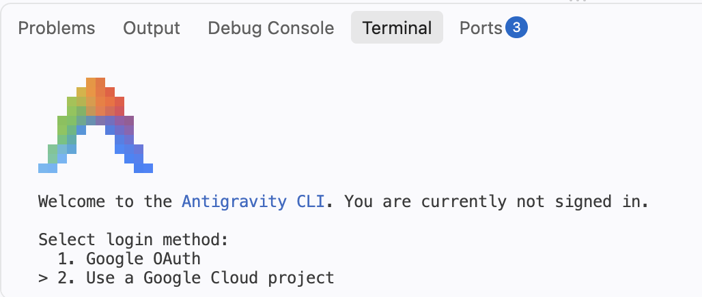
```

and hit `Enter`. New College of Florida is providing some funding for your use of Antigravity. But, after the course is over, you can get the same sort of access for $20 or so per month. (If you are not an NCF student, choose the plain "Google 0Auth" option instead and use your own Google account; the rest of the tutorial works the same.) Select "Continue with Google Cloud."

```{r}
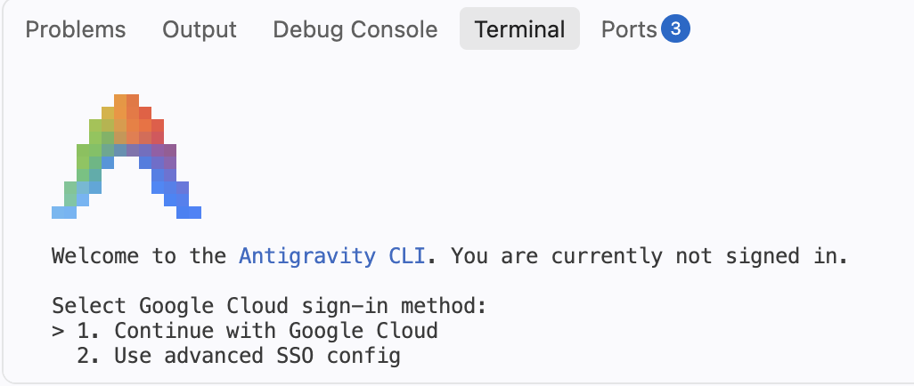
```

NCF has set up a Google Cloud Project for us. The resulting authentication screen is a bit overwhelming.

```{r}
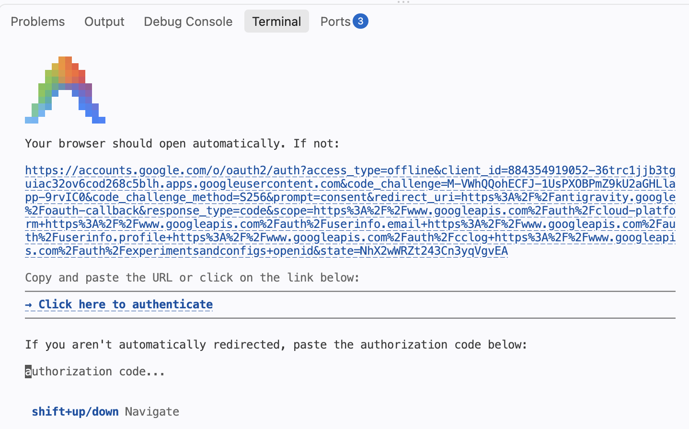
```

The basic idea is that Google needs to ensure that we have the right to use this account. Your next step is to `Cmd/Ctrl + Click` that big URL. 

```{r}
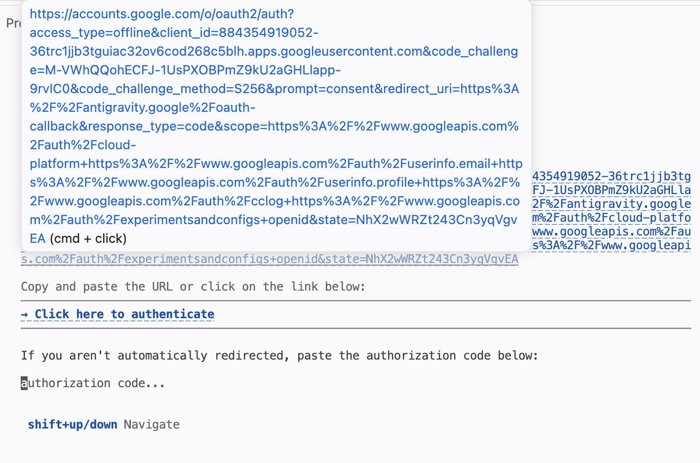
```

Doing so will probably bring up this screen. Obviously, you should click "Open."

```{r}
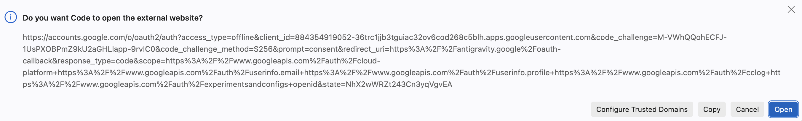
```

The next step might ask you to confirm your Google account. **You must use your NCF email account.**

As Google changes things, this sequence of images won't match exactly what you see. Common sense should get you through it all. The most important step is choosing "Use a Google Cloud Project" at the start.

Eventually, Google will give you a verification code.

```{r}
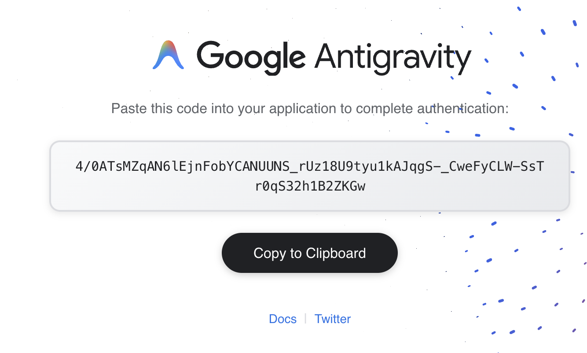
```

Copy that code and go back to the authorization window in your terminal. You may want to expand the Panel upward so that you can better see what is happening. Either way, you paste in the code where the cursor left you by default.

```{r}
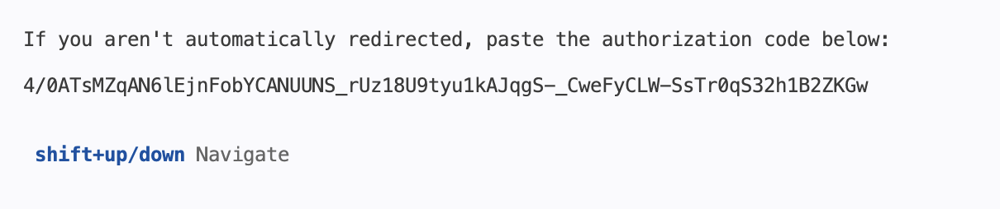
```

You will now be asked for your Google Cloud Project ID. Enter `techne-fall-2026` and hit `Enter`. 

```{r}
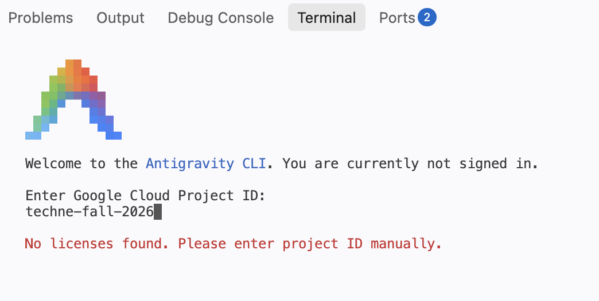
```

<!-- DK: Image is for `us`. -->

You will then be asked to select a region. Select `global` and hit `Enter`. 

```{r}
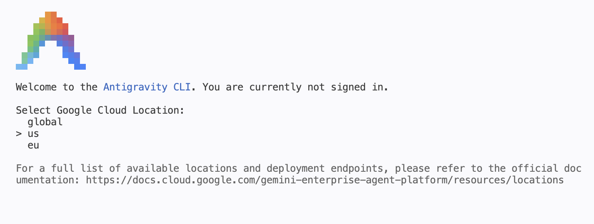
```

You will then be asked a series of questions. These are just two more examples. In general, you just select the defaults.

```{r}
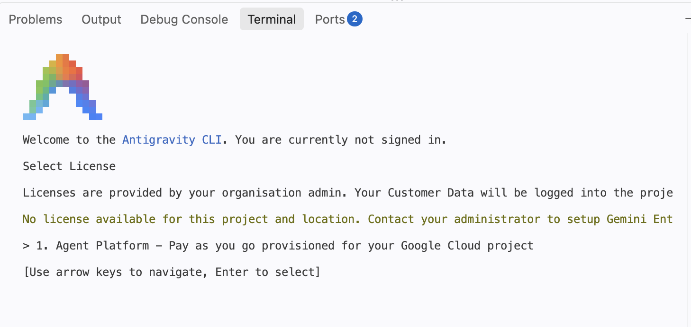
```

```{r}
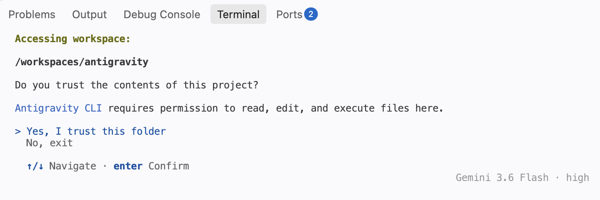
```


When you are done, CP/CR the first several lines of terminal output --- enough to show the `>` prompt that appears after you successfully log in.

```{r antigravity-cli-1}
question_text(NULL,
	answer(NULL, correct = TRUE),
	allow_retry = TRUE,
	try_again_button = "Edit Answer",
	incorrect = NULL,
	rows = 10)
```

###

````
antigravity $ agy


      ▄▀▀▄        Antigravity CLI 1.1.11
     ▀▀▀▀▀▀       dakane@ncf.edu
    ▀▀▀▀▀▀▀▀      Gemini 3.6 Flash (High)
   ▄▀▀    ▀▀▄     /workspaces/antigravity
  ▄▀▀      ▀▀▄

───────────────────────────────────────────────────────────────────────────────────────────────────
>
───────────────────────────────────────────────────────────────────────────────────────────────────
? for shortcuts                                                             Gemini 3.6 Flash · high
````

Again, you mostly just accepted the defaults. The main exceptions were "Use a Google Cloud Project" at the beginning and then the project ID `techne-fall-2026`. 

### Exercise 2

You are now inside the Antigravity CLI interactive session. The `>` prompt means Antigravity is waiting for your input. Type `/help` and press `Enter`.

CP/CR.

```{r antigravity-cli-2}
question_text(NULL,
	answer(NULL, correct = TRUE),
	allow_retry = TRUE,
	try_again_button = "Edit Answer",
	incorrect = NULL,
	rows = 18)
```

###

````
>
───────────────────────────────────────────────────────────────────────────────────────────
Antigravity CLI   general    commands    shortcuts   (←/→ or tab to cycle)
Antigravity CLI understands your codebase, makes edits with your permission,
and executes commands — right from your terminal.

Version 1.1.11
dakane@ncf.edu
Workspace:      /workspaces/antigravity
Project Config: ~/.gemini/config/projects/default-cli-project.json
Log File:       ~/.gemini/antigravity-cli/log/cli-20260820_140552.log

Quick Reference
  /  Type / to see available commands

Keyboard: ↑/↓ Navigate  ←/→ Switch View  esc Close
````

Note that your output may be different than what is shown here. In the world of AI tools, things change all the time.

Note that you need to click the `esc` (escape) key to exit the help screen and return to the `>` prompt. You can also use the up and down arrow keys to scroll through previous commands.

###

Slash commands control the program itself. The command `/help` tells the *program* to print its options, while a plain sentence talks to *Antigravity*. For factual session data like usage statistics, always use slash commands rather than asking Antigravity, which will only guess.

### Exercise 3

After hitting the escape key to get access to the prompt again, type `/model` to see which Antigravity model is currently active. CP/CR.

```{r antigravity-cli-3}
question_text(NULL,
	answer(NULL, correct = TRUE),
	allow_retry = TRUE,
	try_again_button = "Edit Answer",
	incorrect = NULL,
	rows = 4)
```

###

````
>
───────────────────────────────────────────────────────────────────────────────────────────
Switch Model

> Gemini 3.6 Flash (current)
  Gemini 3.5 Flash
  Gemini 3.1 Pro

  Effort  ◂        ●━━━━━━━━━━━━━━●━━━━━━━━━━━━━━◉        ▸
                  low          medium          high      
            Deepest reasoning for complex problems — slower but strongest

Keyboard: ↑/↓ Navigate  ←/→ Effort  enter Select  esc Go Back

                                                                    Gemini 3.6 Flash · high
````

Again, to exit this view, hit the escape key. 

###

The Antigravity model family has several tiers which vary in terms of speed and cost.

### Exercise 4

Ask Antigravity to describe what files are in the repository. Type something like:

```
Please explain the contents of this repository. Run ls -a to check the contents.
```

###

I get this:

````
> Please explain the contents of this repository. Run ls -a to check the contents.

▸ Thought for 18s, 299 tokens
  Exploring Repository Contents
  I'll check the repository contents using ls -a to see what files and directories are
  present.

● Bash(ls -la) (ctrl+o to expand)

Command
───────────────────────────────────────────────────────────────────────────────────────────

Requesting permission for:
   ls -la

Do you want to proceed?
> 1. Yes
  2. Yes, and always allow in this conversation for commands that start with 'ls'
  3. Yes, and always allow for commands that start with 'ls' (Persist to settings.json)
  4. No

  ↑/↓ Navigate · tab Amend · ctrl+g edit/expand command
esc to cancel                                                       Gemini 3.6 Flash · high
````


Select `2`. (If your screen looks different, just select the option that allows Antigravity to run `ls` without asking again.) CP/CR the output.


```{r antigravity-cli-4}
question_text(NULL,
	answer(NULL, correct = TRUE),
	allow_retry = TRUE,
	try_again_button = "Edit Answer",
	incorrect = NULL,
	rows = 15)
```

###

````
> Please explain the contents of this repository. Run ls -a to check the contents.

▸ Thought for 18s, 299 tokens
  Exploring Repository Contents
  I'll check the repository contents using ls -a to see what files and directories are
  present.

● Bash(ls -la) (ctrl+o to expand)

▸ Thought for 9s, 122 tokens
  Reviewing Repository Contents
  Here is what is currently in this repository:

  1. AGENTS.md – A configuration file containing rules and guidelines for AI assistants
  helping out in this course (covering R, Quarto, tidyverse, and data-science workflow
  conventions).
  2. .git – The hidden directory where Git tracks version control history for your
  project.

  It looks like a fresh workspace ready for your analysis files or Quarto (.qmd)
  documents! What are you working on today?
````

Antigravity decomposes your prompt into tool calls dynamically --- the exact commands it runs depend on how it interprets your request, so what you see may differ from the example. 

### Exercise 5

Escape again. Now ask Antigravity to create an `analysis.qmd` file, set up the way you learned in the Quarto tutorial. Tell it you want:

- A YAML header with the title `"Exploring Storms"` and your name as author.
- `execute: echo: false` in the YAML.
- A setup chunk loading `library(tidyverse)`, with `#| message: false`.
- A plot using the `storms` dataset from **dplyr** --- for example, a line chart showing the number of named storms per year.
- To not render `analysis.qmd` yet.

To be honest, I just copy/pasted the above. AI is smart enough to work with this.

###

Allow the file to be written when Antigravity asks for permission. Along the way, you may also be asked questions like this:

````
Thought for 1s, 380 tokens
  Refining YAML Header

● Bash(git config user.name) (ctrl+o to expand)

Command
──────────────────────────────────────────────────────────────────────────────────────────────────────

Requesting permission for:
   git config user.name

Do you want to proceed?
  1. Yes
> 2. Yes, and always allow in this conversation for commands that start with 'git config'
  3. Yes, and always allow for commands that start with 'git config' (Persist to settings.json)
  4. No

  ↑/↓ Navigate · tab Amend · ctrl+g edit/expand command
esc to cancel                                                                  Gemini 3.6 Flash · high                                                    Gemini 3.6 Flash · high
````

Use your best judgment.

CP/CR Antigravity's explanation of what it created.

```{r antigravity-cli-5}
question_text(NULL,
	answer(NULL, correct = TRUE),
	allow_retry = TRUE,
	try_again_button = "Edit Answer",
	incorrect = NULL,
	rows = 12)
```

###

AI is always changing and, even when it is not changing, it is non-deterministic. Your output may differ from ours. The important thing is that you have an `analysis.qmd` file with a YAML header, a setup chunk, and a plot of named storms per year.

````
ListDir(/workspaces/antigravity) (ctrl+o to expand)

▸ Thought for 1s, 318 tokens
  Developing Analysis Quarto
● Create(/workspaces/antigravity/analysis.qmd) (ctrl+o to expand)

  I have created analysis.qmd in your project workspace.

  It includes:

  • YAML header with title "Exploring Storms", author "davekane-student", and execute: echo: false
  • Setup chunk loading tidyverse with #| message: false
  • R chunk generating a line plot of named storms per year using base pipe |> and ggplot2

  As requested, I have held off on rendering the document. Let me know when you'd like to render or
  make any adjustments!

──────────────────────────────────────────────────────────────────────────────────────────────────────
>
──────────────────────────────────────────────────────────────────────────────────────────────────────
? for shortcuts                                                                Gemini 3.6 Flash · high
````

###

When you ask Antigravity to create a file, it generates the entire contents in one step and writes it for you. Instead of typing the YAML header, chunk settings, and library calls yourself, you describe what you want and refine the result --- editing is almost always faster than composing from scratch.

### Exercise 6

Ask AI to render the `analysis.qmd`. Type something like:

```
Render analysis.qmd using quarto render and tell me what files were created afterward.
```

Antigravity may issue two tool calls: one to render the document and one to list the resulting files. Press `y` for each. CP/CR the output.

```{r antigravity-cli-6}
question_text(NULL,
	answer(NULL, correct = TRUE),
	allow_retry = TRUE,
	try_again_button = "Edit Answer",
	incorrect = NULL,
	rows = 15)
```

###

````
> Render analysis.qmd using quarto render and tell me what files were created afterward.
● Bash(quarto render analysis.qmd) (ctrl+o to expand)

▸ Thought for 1s, 111 tokens
  Monitoring Task Progress

● ManageTask(status b8b8c62b-3daa-4518-add4-8c57703f589d/task-12)
● Schedule(10s: Check if quarto render finished) (ctrl+o to expand)

  I have started rendering analysis.qmd using quarto render. It is currently processing in the
  background, and I will report back as soon as it completes.

● ManageTask(status b8b8c62b-3daa-4518-add4-8c57703f589d/task-12)
● Schedule(15s: Check if render task-12 finished) (ctrl+o to expand)

  The render command is currently executing chunk execution and plot rendering. I will notify you
  as soon as it completes.

● ListDir(/workspaces/antigravity) (ctrl+o to expand)

  The rendering completed successfully!

  ### Created Files / Folders:

  1. **analysis.html** — The HTML output generated from your .qmd file.
  2. **analysis_files** — A directory containing supporting site assets (such as HTML/CSS
  dependencies and generated plot figures).

  You can preview analysis.html using the Live Server extension in VS Code.
````

###

Antigravity ran two commands to answer one question, using the result of each step to decide what to do next. This is what makes it an AI *agent* --- it takes actions and reasons about results, rather than just producing text.

### Exercise 7

Let's view the rendered file in a browser, the way you learned in the Quarto tutorial: in the Explorer, find `analysis.html`, right-click (or two-finger click) it, and select **"Open with Live Server"**.

```{r}
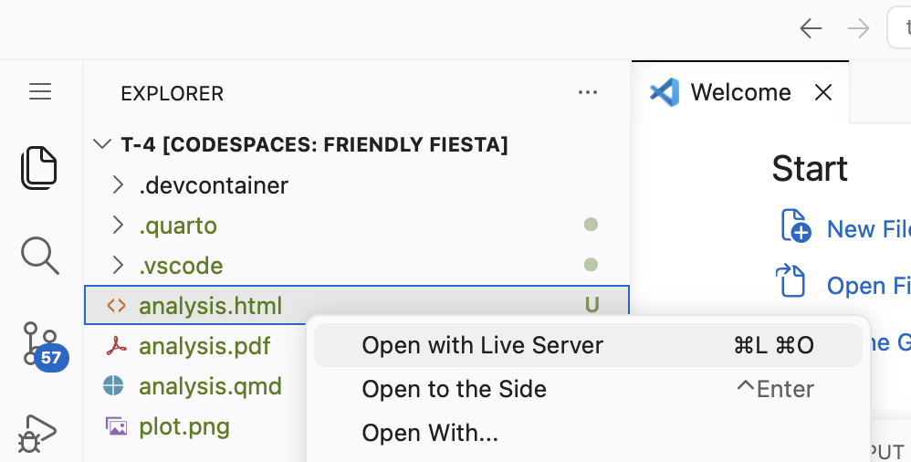
```

This will generally open a view of the entire directory, with all the generated files and folders.

```{r}
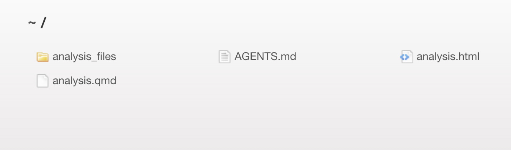
```

You can then open `analysis.html` in a new browser tab served through your Codespace. The URL will look something like `https://[codespace-name]-5500.app.github.dev/analysis.html`.

Copy/paste that URL below.

```{r antigravity-cli-7}
question_text(NULL,
	answer(NULL, correct = TRUE),
	allow_retry = TRUE,
	try_again_button = "Edit Answer",
	incorrect = NULL,
	rows = 3)
```

###

````
https://congenial-chainsaw-wv757pv4pp67cpw-5500.app.github.dev/analysis.html
````

Keep this tab open. Every time `analysis.html` is updated in your Codespace --- whether by Antigravity or by running `quarto render` yourself --- the tab will automatically refresh.

###

Your code and rendered graphic should look something like this:

```{r}
#| echo: true

storms |> 
  distinct(year, name) |> 
  count(year) |> 
  ggplot(aes(x = year, y = n)) +
    geom_line() +
    geom_point() +
    labs(
      title = "Number of Named Storms per Year",
      x = "Year",
      y = "Number of Storms"
    ) +
    theme_minimal()
```

###

You met Live Server in the Quarto tutorial; nothing here is new except that an agent, rather than you, is triggering the renders.

### Exercise 8

Ask Antigravity: Add a plot to a new code chunk in `analysis.qmd` using the `storms` dataset. Visualize something like a boxplot showing the distribution of wind speeds by storm category. Include a meaningful title and subtitle, and then render the file.

Antogravity might ask:

````
  shift+tab to auto-approve file edits
Accept this file edit?
> 1. Yes, accept this change
  2. No, reject this change

  ↑/↓ Navigate · tab Amend · f full diff
esc to cancel                            Gemini 3.6 Flash · high
````

Obviously, you should accept.

If Antigravity does not render the file, ask it to. After Antigravity finishes, check your Live Server tab --- it should have refreshed automatically to show the plot. However, if you are viewing the HTML in a browser, you will probably have to refresh the tab.

Open a new R Terminal, if you don't have one open already. 

```
tutorial.helpers::show_file("analysis.qmd", chunk = "Last")
```

CP/CR.

```{r antigravity-cli-8}
question_text(NULL,
	answer(NULL, correct = TRUE),
	allow_retry = TRUE,
	try_again_button = "Edit Answer",
	incorrect = NULL,
	rows = 20)
```

###

````
storms |> 
  drop_na(category) |> 
  ggplot(aes(x = factor(category), y = wind, fill = factor(category))) +
    geom_boxplot(show.legend = FALSE, alpha = 0.7) +
    labs(
      title = "Distribution of Wind Speeds by Storm Category",
      subtitle = "Maximum sustained wind speed (knots) across Saffir-Simpson categories",
      x = "Storm Category",
      y = "Wind Speed (knots)"
    ) +
    theme_minimal()
````

Your answer will be different from ours, but it should show **ggplot2** code using the `storms` dataset --- something like a boxplot of wind speed by storm category. The chunk should not have `#| echo: true` --- since you set `execute: echo: false` in the YAML header, all chunks use that setting by default.

###

When Antigravity adds a plot and re-renders, two things happen automatically: Quarto updates `analysis.html`, and Live Server detects the change and refreshes your browser, although you may need to refresh the tab.

This loop --- ask Antigravity, render, view --- is the same workflow you would use throughout a real project.

### Exercise 9

In the Quarto tutorial you wrote a `.gitignore` by hand. This time, delegate the job: ask Antigravity to create a `.gitignore` file suitable for a Quarto R project. Type something like:

```
Create a .gitignore file suitable for a Quarto R project. Include common R and Quarto files that should not be tracked by Git.
```

In the bash Terminal, run `cat .gitignore`. CP/CR.

```{r antigravity-cli-9}
question_text(NULL,
	answer(NULL, correct = TRUE),
	allow_retry = TRUE,
	try_again_button = "Edit Answer",
	incorrect = NULL,
	rows = 12)
```

###

````
# History files
.Rhistory
.RData
.Ruserdata

# Example code in working directory
.Rapp.history

# User-specific files
.Rproj.user/

# Quarto execution artifacts
.quarto/
*_files/
*_cache/

# OS generated files
.DS_Store
Thumbs.db
````

###

Same principle as in the Quarto tutorial: if a file can be *regenerated* from your source, it doesn't belong in the commit history. Delegating housekeeping files like this to AI is the normal workflow from now on.


## Working Code Chunk
###

Real analysis is exploratory. Before we can build anything worth publishing, we poke at the data: print it, check its columns, count things, filter it down. Rather than scattering those attempts across many chunks, we keep **one working code chunk** at the bottom of the document and rewrite it over and over.

In working with AI, it is smart to maintain one working chunk per final artifact, iteratively rewriting that chunk to keep only necessary code, managing code chunk outputs in your rendered file, and caching results. Throughout this section we will explicitly tell you to use AI. In future tutorials, use of AI is simply assumed.

### Exercise 1

Ask Antigravity to edit `analysis.qmd` so it contains only the setup chunk and the named-storms-per-year line chart. Delete any other chunks. Render. 

Refresh Live Sever. Copy/paste the most recent messages from Antigravity.

```{r working-code-chunk-1}
question_text(NULL,
	answer(NULL, correct = TRUE),
	allow_retry = TRUE,
	try_again_button = "Edit Answer",
	incorrect = NULL,
	rows = 20)
```

###

````
  I've removed the extra boxplot chunk from analysis.qmd so only the setup chunk and the named storms per year line
  plot remain.

  I am currently running quarto render analysis.qmd in the background to update the HTML output.

▸ Thought for 3s, 122 tokens
  Analyzing Task Completion
  analysis.qmd has been updated and rendered successfully to analysis.html.

  You can view the updated page using Live Server, or commit and push your changes to save your work.

──────────────────────────────────────────────────────────────────────────────────────────────────────────────────────────
>
──────────────────────────────────────────────────────────────────────────────────────────────────────────────────────────
? for shortcuts                                                                                    Gemini 3.7 Flash · high
````

###

Each code chunk should produce **one** final artifact --- either cleaned data or a plot. A chunk that mixes exploratory steps with its final output needs to be cleaned up.

### Exercise 2

Ask Antigravity to add a **new chunk** at the bottom of `analysis.qmd` that prints the `storms` dataset. Render. 

In the R Terminal, run `show_file("analysis.qmd", chunk = "Last")`. 

CP/CR.

```{r working-code-chunk-2}
question_text(NULL,
	answer(NULL, correct = TRUE),
	allow_retry = TRUE,
	try_again_button = "Edit Answer",
	incorrect = NULL,
	rows = 4)
```

###

```{r working-code-chunk-2-test}
#| echo: true
storms
```

###

`storms` comes from **dplyr**, so `library(tidyverse)` is all the document needs. It contains every six-hour observation of Atlantic tropical storms since 1975: each row records one storm's position, wind speed, and air pressure at a single moment, so a hurricane that lasts a week accounts for dozens of rows.

###

Printing a raw tibble like this would never remain a published document. That is fine --- the working chunk's output is for *you*, not your readers, and we will clean it up before publishing.

### Exercise 3

Ask Antigravity to update the last chunk to pipe `storms` through `glimpse()`. Render and inspect the output. 

In the R Terminal, run `show_file("analysis.qmd", chunk = "Last")`. 

CP/CR.

```{r working-code-chunk-3}
question_text(NULL,
	answer(NULL, correct = TRUE),
	allow_retry = TRUE,
	try_again_button = "Edit Answer",
	incorrect = NULL,
	rows = 5)
```

###

```{r working-code-chunk-3-test}
#| echo: true
storms |>
  glimpse()
```

###

`glimpse()` gives a column-level overview of a dataset --- every variable name, its type, and a few example values on one screen. Use this and/or other similar functions like `summary()` to initially explore any unfamiliar dataset.

### Exercise 4

Ask Antigravity to update the working chunk to count the observations in `storms` by `status`. Render. 

In the R Terminal, run `show_file("analysis.qmd", chunk = "Last")`. 

CP/CR.

```{r working-code-chunk-4}
question_text(NULL,
	answer(NULL, correct = TRUE),
	allow_retry = TRUE,
	try_again_button = "Edit Answer",
	incorrect = NULL,
	rows = 5)
```

###

```{r working-code-chunk-4-test}
#| echo: true
storms |>
  count(status)
```

###

`count()` tallies how many rows fall into each value of a variable. Because each row of `storms` is a six-hour observation, these numbers measure *time spent* at each status, not the number of storms. That distinction is why the chart at the top of our document pipes through `distinct(year, name)` before counting storms per year.

### Exercise 5

Ask Antigravity to update the working chunk to filter `storms` to observations with `year >= 2000` and select the `year`, `name`, `status`, `wind`, and `pressure` columns. Leave the result as the final expression so it prints. Render. 

In the R Terminal, run `show_file("analysis.qmd", chunk = "Last")`. 

CP/CR.

```{r working-code-chunk-5}
question_text(NULL,
	answer(NULL, correct = TRUE),
	allow_retry = TRUE,
	try_again_button = "Edit Answer",
	incorrect = NULL,
	rows = 6)
```

###

```{r working-code-chunk-5-test}
#| echo: true
storms |>
  filter(year >= 2000) |>
  select(year, name, status, wind, pressure)
```

###

The pipe `|>` passes the left side's result directly to the next function. Reading it as "and then" helps: take `storms`, **and then** keep only observations since 2000, **and then** keep these five columns. The result prints because the final expression is a value, not an assignment.

## Cache
###

Our exploration has settled on the data we want: observations since 2000, five columns. The next steps are to save that data in an object which later chunks can use, and then to **cache** the chunk that builds it, so that later renders can skip re-running it.

### Exercise 1

Ask Antigravity to save the filtered tibble to a variable called `storms_recent` instead of printing it directly. Render. Notice the table disappears from the HTML. 

In the R Terminal, run `show_file("analysis.qmd", chunk = "Last")`. 

CP/CR.

```{r cache-1}
question_text(NULL,
	answer(NULL, correct = TRUE),
	allow_retry = TRUE,
	try_again_button = "Edit Answer",
	incorrect = NULL,
	rows = 6)
```

###

```{r cache-1-test}
#| echo: true
storms_recent <- storms |>
  filter(year >= 2000) |>
  select(year, name, status, wind, pressure)
```

###

Assignment captures the result silently --- a chunk that only uses `<-` to assign a value to an object produces no output in the render. A blank section in the HTML is not an error; it means the chunk built an object without displaying it.

### Exercise 2

Add `#| cache: true` to the `storms_recent` code chunk by hand. That is, open `analysis.qmd` in the Editor. Add that line to the top of the `storms_recent` code chunk. Render. 

In the bash Terminal, run `ls`. 

CP/CR.

```{r cache-2}
question_text(NULL,
	answer(NULL, correct = TRUE),
	allow_retry = TRUE,
	try_again_button = "Edit Answer",
	incorrect = NULL,
	rows = 5)
```

###

Your answer should look something like:

````
antigravity $ ls
AGENTS.md  analysis_cache  analysis_files  analysis.html  analysis.qmd
antigravity $ 
````

###

Caching is a render-time feature. The first render writes the chunk's result to disk. Later renders skip re-running the chunk and load from disk instead. `analysis_cache/` appearing via `ls` confirms it is wired up. 

Data preparation is the natural chunk to cache: in real projects it is often the slow part --- downloading files, joining tables, fitting models --- and its result rarely changes. 

### Exercise 3

Ask Antigravity to add `analysis_cache` to `.gitignore`. Note that the Source Control badge count in VS Code has increased because the cache directory is now visible to git --- adding `analysis_cache` to `.gitignore` makes it drop back. 

In the bash Terminal, run `cat .gitignore`. 

CP/CR.

```{r cache-3}
question_text(NULL,
	answer(NULL, correct = TRUE),
	allow_retry = TRUE,
	try_again_button = "Edit Answer",
	incorrect = NULL,
	rows = 12)
```

###

````
antigravity $ cat .gitignore
# History files
.Rhistory
.RData
.Ruserdata

# Example code in working directory
.Rapp.history

# User-specific files
.Rproj.user/

# Quarto execution artifacts
.quarto/
*_files/
*_cache/

# OS generated files
.DS_Store
Thumbs.db
antigravity $ 
````

###

Cache files are regenerated from source and do not belong in git. Rule of thumb: if a file can be (easily) recreated from other components, do not commit it.

## Plotting
###

`storms_recent` is built and cached, but nothing is displayed. Now we want a plot --- a new artifact, and therefore a **new** working code chunk at the bottom of the document. We will iterate on it until the plot is worth publishing.

### Exercise 1

Ask Antigravity to add a new code chunk with a **ggplot2** scatter plot of `pressure` vs. `wind`, using `storms_recent`. Render. 

In the R Terminal, run `tutorial.helpers::show_file("analysis.qmd", chunk = "Last")`. 

CP/CR.

```{r plotting-1}
question_text(NULL,
	answer(NULL, correct = TRUE),
	allow_retry = TRUE,
	try_again_button = "Edit Answer",
	incorrect = NULL,
	rows = 6)
```

###

```{r plotting-1-test}
#| label: plot-pressure-wind
storms_recent |> 
  ggplot(aes(x = wind, y = pressure)) +
  geom_point(alpha = 0.5) +
  labs(
    title = "Pressure vs. Wind Speed",
    x = "Wind Speed (knots)",
    y = "Pressure (millibars)"
  ) +
  theme_minimal()
```

###

Chunks in the same document share an R session --- `storms_recent` is created in the cached chunk and available to this one without being redefined. The two-chunk pattern here --- one to prepare data, one to plot it --- is a common pattern. And even this bare first draft shows the key fact about storms: the lower the central air pressure, the faster the wind.

### Exercise 2

The first version of a plot is rarely the last. Ask Antigravity to improve the working chunk: color the points by `status`, make them semi-transparent so overlapping observations show, and add a meaningful title, subtitle, and axis labels. Render and check the Live Server tab. 

In the R Terminal, run `show_file("analysis.qmd", chunk = "Last")`. 

CP/CR.

```{r plotting-2}
question_text(NULL,
	answer(NULL, correct = TRUE),
	allow_retry = TRUE,
	try_again_button = "Edit Answer",
	incorrect = NULL,
	rows = 12)
```

###

```{r plotting-2-test}
#| echo: true
ggplot(storms_recent, aes(x = wind, y = pressure, color = status)) +
  geom_point(alpha = 0.3) +
  labs(
    title = "Wind Speed and Air Pressure in Atlantic Storms",
    subtitle = "Stronger storms combine faster winds with lower pressure",
    x = "Wind Speed (knots)",
    y = "Air Pressure (millibars)",
    color = "Status"
  )
```

Your answer will be different from ours, but it should color by `status`, use transparency, and carry real labels.

###

This is what iterating in a working chunk looks like: you never retyped the plot, you described the changes. When the Live Server tab shows a plot you are happy with, iteration is over --- the chunk stops being a scratchpad and becomes the document's final artifact. We are ready to publish.

### Exercise 3

In the bash Terminal, run `cat analysis.qmd`. CP/CR.

```{r plotting-3}
question_text(NULL,
	answer(NULL, correct = TRUE),
	allow_retry = TRUE,
	try_again_button = "Edit Answer",
	incorrect = NULL,
	rows = 30)
```

###

Your answer should look something like:

<pre><code>---
title: "Exploring Storms"
author: "PPBDS Student"
format: html
execute:
  echo: false
---

&#96;&#96;&#96;{r}
#| include: false
suppressPackageStartupMessages(library(tidyverse))
&#96;&#96;&#96;

## Named Storms per Year

The following chart displays the number of unique named storms recorded each year in the `storms` dataset.

&#96;&#96;&#96;{r}
storms |>
  distinct(year, name) |>
  count(year) |>
  ggplot(aes(x = year, y = n)) +
  geom_line() +
  geom_point() +
  labs(
    title = "Number of Named Storms per Year",
    x = "Year",
    y = "Count of Storms"
  ) +
  theme_minimal()
&#96;&#96;&#96;

&#96;&#96;&#96;{r}
#| cache: true
storms_recent <- storms |>
  filter(year >= 2000) |>
  select(year, name, status, wind, pressure)
&#96;&#96;&#96;

&#96;&#96;&#96;{r}
ggplot(storms_recent, aes(x = wind, y = pressure, color = status)) +
  geom_point(alpha = 0.3) +
  labs(
    title = "Wind Speed and Air Pressure in Atlantic Storms",
    subtitle = "Stronger storms combine faster winds with lower pressure",
    x = "Wind Speed (knots)",
    y = "Air Pressure (millibars)",
    color = "Status"
  )
&#96;&#96;&#96;
</code></pre>

###

From here on, using AI to write your analysis code is always the assumed approach --- you will describe a goal, let the agent write the code (generally in a working code chunk), render, and inspect the result.

## Git with Antigravity
###

Now that the project has real files, let's save the work with Git. Rather than just telling you the commands, we'll use Antigravity to explain the Git workflow. Using AI to understand what you are doing --- not just to do it --- is a powerful learning strategy.

### Exercise 1

Ask Antigravity to check the Git status and explain what the output means:

```
Run git status and explain what each part of the output means.
```

Press `y`, 1, or hit Enter on allow once to allow the shell command. CP/CR the full response, including Antigravity's explanation.

```{r git-with-antigravity-1}
question_text(NULL,
	answer(NULL, correct = TRUE),
	allow_retry = TRUE,
	try_again_button = "Edit Answer",
	incorrect = NULL,
	rows = 18)
```

###

Your answer should look something like:

````
> Run git status and explain what each part of the output means.

╔ Tool Use: run_shell ══════════════════╗
║  Command: git status                  ║
╚═══════════════════════════════════════╝

Allow this tool call? [y/n/a]: y

Output:
On branch main
Your branch is up to date with 'origin/main'.

Untracked files:
  (use "git add <file>..." to include in what will be committed)
        .gitignore
        analysis.html
        analysis.qmd

nothing added to commit but untracked files present

Here's what this means:
- "On branch main" — you are working on the main branch.
- "Your branch is up to date" — your local branch matches the GitHub copy.
- "Untracked files" — Git has noticed these files but is not monitoring them yet. They will not be included in any commit until you explicitly add them with `git add`.

>
````

###

`git status` shows your branch, **staged** changes (added to the next commit), and **untracked** files (noticed by Git but not yet included). Smart commit in `codespace-starter` handles staging automatically --- just press the "Commit" button.

You may notice that `analysis.html` does not appear in your `git status` output. This can happen if the `.gitignore` Antigravity created includes `*.html`, which tells Git to ignore all HTML files. If this happens, you can use `git add -f analysis.html` to force Git to track it anyway.

### Exercise 2

Ask Antigravity to explain the difference between `git add` and `git commit`, and to provide the exact command to commit all three files with a good message:

```
Explain the difference between git add and git commit. Then give me the exact command to commit .gitignore, analysis.qmd, and analysis.html with a descriptive message.
```

CP/CR Antigravity's full response.

```{r git-with-antigravity-2}
question_text(NULL,
	answer(NULL, correct = TRUE),
	allow_retry = TRUE,
	try_again_button = "Edit Answer",
	incorrect = NULL,
	rows = 20)
```

###

Antigravity should explain that `git add` moves files into the **staging area**, a holding zone where you prepare which changes to include before committing. `git commit` then takes everything in the staging area and permanently records it in the project's history. A typical response will include commands like:

```
git add .gitignore analysis.qmd analysis.html
git commit -m "initial version with analysis and gitignore"
```

###

The two-step design lets you choose exactly which files go into each commit --- useful when you want to record related changes separately with different messages. In any repo derived from `codespace-starter`, the Source Control sidebar handles both steps at once, but knowing they are separate matters when collaborating on larger projects.

### Exercise 3

Open the Source Control sidebar (the branch icon in the Activity Bar). You should see `.gitignore`, `analysis.qmd`, and `analysis.html` listed as changes. Type a commit message in the message box at the top, then click the **Commit** button. Because smart commit is enabled in the devcontainer, clicking Commit will stage and commit all changes in one step --- no `git add` required.

Then, in a separate bash Terminal, run:

```
git log --oneline
```

CP/CR.

```{r git-with-antigravity-3}
question_text(NULL,
	answer(NULL, correct = TRUE),
	allow_retry = TRUE,
	try_again_button = "Edit Answer",
	incorrect = NULL,
	rows = 6)
```

###

Your answer should look something like:

````
antigravity $ git log --oneline
a3b8c21 (HEAD -> main) initial version with analysis and gitignore
e3b01ee Initial commit
antigravity $
````

The `(HEAD -> main)` indicator confirms your local branch is current, but the missing `origin/main` means this commit hasn't been pushed to GitHub yet. Pushing is what sends it there and makes it visible to others.

### Exercise 4

Ask Antigravity to improve the storms-per-year chart. Type something like:

```
Update the storms-per-year chart in `analysis.qmd` to be a stacked area chart showing the count of each storm type per year. Filter to just tropical depressions, tropical storms, and hurricanes. Use a color scale that goes from light blue for tropical depressions through orange for tropical storms to dark red for hurricanes. Re-render the file when done.
```

Press `y` to authorize each tool call. Once the Live Server tab has refreshed and you are happy with the result, ask Antigravity to handle the entire Git workflow:

```
Please commit analysis.qmd and analysis.html with a good message, and push to GitHub.
```

Press `y` to authorize each tool call as Antigravity works through the steps. CP/CR the complete output.

```{r git-with-antigravity-4}
question_text(NULL,
	answer(NULL, correct = TRUE),
	allow_retry = TRUE,
	try_again_button = "Edit Answer",
	incorrect = NULL,
	rows = 20)
```

###

Your output should look something like:

````
> Please commit analysis.qmd and analysis.html with a good message, and push to GitHub.

╔ Tool Use: run_shell ═══════════════════════════════════════╗
║  Command: git add analysis.qmd analysis.html               ║
╚════════════════════════════════════════════════════════════╝
Allow this tool call? [y/n/a]: y

╔ Tool Use: run_shell ══════════════════════════════════════════════╗
║  Command: git commit -m "convert to stacked area chart by storm type" ║
╚══════════════════════════════════════════════════════════════════╝
Allow this tool call? [y/n/a]: y

╔ Tool Use: run_shell ════════════════════════╗
║  Command: git push origin main              ║
╚═════════════════════════════════════════════╝
Allow this tool call? [y/n/a]: y

✔ Done! Your changes have been committed and pushed to GitHub.

>
````

###

Antigravity issued three separate tool calls --- `git add`, `git commit`, and `git push` --- mapping directly to the three stages of staging, recording, and sharing. In Exercise 3 you ran these yourself using the Source Control sidebar; here you delegated them to Antigravity.


## Summary
###

This tutorial introduced the [Antigravity CLI](https://antigravity.google/product/antigravity-cli) as an AI *agent* --- a terminal-based assistant that reads your files, runs commands, and writes files on your behalf, asking permission at each step. You authenticated with your Google account, let Antigravity explore the repository, and used it to create and render a Quarto analysis. You then practiced the core `analysis.qmd` workflow: maintaining one working chunk per artifact, iteratively rewriting it, suppressing output, and caching results.

### Exercise 1

Quit Antigravity with `/quit` if you haven't already. From the bash Terminal, run `quarto render analysis.qmd` to regenerate the HTML. Then, still in the bash Terminal, run:

```
cat analysis.qmd
```

CP/CR.

```{r summary-1}
question_text(NULL,
	answer(NULL, correct = TRUE),
	allow_retry = TRUE,
	try_again_button = "Edit Answer",
	incorrect = NULL,
	rows = 30)
```

###

It should look something like this --- a YAML header with `execute: echo: false`, a setup chunk loading the **tidyverse**, the stacked-area storm chart Antigravity built, the cached `storms_recent` chunk, and your wind-and-pressure plot. Your plotting code will differ:

<pre><code>---
title: "Exploring Storms"
author: "PPBDS Student"
execute:
  echo: false
---

&#96;&#96;&#96;{r}
suppressPackageStartupMessages(library(tidyverse))
&#96;&#96;&#96;

&#96;&#96;&#96;{r}
storms |>
  filter(status %in% c("tropical depression", "tropical storm", "hurricane")) |>
  count(year, status) |>
  ggplot(aes(x = year, y = n, fill = status)) +
  geom_area() +
  scale_fill_manual(values = c("tropical depression" = "lightblue",
                               "tropical storm" = "orange",
                               "hurricane" = "darkred")) +
  labs(title = "Atlantic Storms by Type per Year",
       x = "Year",
       y = "Number of Storms",
       fill = "Storm Type")
&#96;&#96;&#96;

&#96;&#96;&#96;{r}
#| cache: true
storms_recent <- storms |>
  filter(year >= 2000) |>
  select(year, name, status, wind, pressure)
&#96;&#96;&#96;

&#96;&#96;&#96;{r}
ggplot(storms_recent, aes(x = wind, y = pressure, color = status)) +
  geom_point(alpha = 0.3) +
  labs(
    title = "Wind Speed and Air Pressure in Atlantic Storms",
    subtitle = "Stronger storms combine faster winds with lower pressure",
    x = "Wind Speed (knots)",
    y = "Air Pressure (millibars)",
    color = "Status"
  )
&#96;&#96;&#96;</code></pre>

###

You did not write any of this code yourself --- you described the goal and Antigravity produced it. The skill you practiced is reviewing what the agent wrote and confirming that it does what you asked.

### Exercise 4

Publish your rendered QMD to GitHub Pages. In the bash Terminal, run:

```
quarto publish gh-pages analysis.qmd
```

Respond with `Y` when prompted. Copy/paste the resulting URL below.

```{r plotting-4}
question_text(NULL,
	answer(NULL, correct = TRUE),
	allow_retry = TRUE,
	try_again_button = "Edit Answer",
	incorrect = NULL,
	rows = 3)
```

###

```
https://ppbds-student.github.io/antigravity/analysis.html
```

GitHub Pages takes a minute or two to deploy after `quarto publish` runs. If the link doesn't load immediately, wait and refresh.

### Exercise 5

Commit and push any remaining uncommitted files. Copy/paste the URL to your GitHub repo.

```{r plotting-5}
question_text(NULL,
	answer(NULL, correct = TRUE),
	allow_retry = TRUE,
	try_again_button = "Edit Answer",
	incorrect = NULL,
	rows = 3)
```

###

Other AI coding tools include [Claude Code](https://claude.ai/claude-code) (Anthropic), [GitHub Copilot](https://github.com/features/copilot) (Microsoft), and [Cursor](https://cursor.sh/) (Anysphere). The workflow is the same across all of them: describe what you want, review the result, and iterate.


```{r download-answers, child = system.file("child_documents/download_answers.Rmd", package = "tutorial.helpers")}
```
