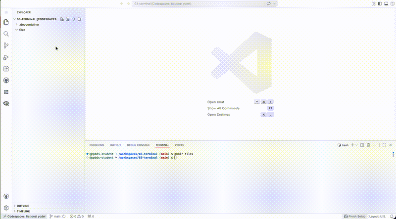

```{r setup, include = FALSE}
library(learnr)
library(tutorial.helpers)
library(knitr)

knitr::opts_chunk$set(echo = FALSE)
knitr::opts_chunk$set(out.width = '90%')
options(tutorial.exercise.timelimit = 60,
        tutorial.storage = "local")
```

```{r info-section, child = system.file("child_documents/info_section.Rmd", package = "tutorial.helpers")}
```

## Introduction
###

This tutorial builds on Terminal 1. There you learned the core verbs --- `pwd`, `ls`, `mkdir`, `cp`, `mv`, `rm`, and `cd` --- along with paths and redirection. Here we cover the rest of what a working data scientist does at the command line: command options, environment variables, looking inside files, moving files into and out of a Codespace, and running programs --- both R scripts and Python scripts.

In the age of AI, you will *read* far more shell commands than you write: your AI agents run them constantly, and your job is to understand what you are approving. Keep that frame in mind throughout.

###

You should be doing this tutorial in a repo named `terminal-2`. If you are not, create one and then connect to it. You may need to restart this tutorial after you do so.

## Options
###

Options modify the behavior of command-line programs, as you saw with `ls -a` and `rm -r` in Terminal 1.

### Exercise 1

Use `pwd` to confirm that you are in your default working directory. Make a directory named `options` with `mkdir options`. `cd` into it. Run `ls` to confirm that it is empty. CP/CR.

```{r options-1}
question_text(NULL,
    answer(NULL, correct = TRUE),
    allow_retry = TRUE,
    try_again_button = "Edit Answer",
    incorrect = NULL,
    rows = 5)
```

###

````
terminal-2 $ pwd
/workspaces/terminal-2
terminal-2 $ mkdir options
terminal-2 $ cd options/
options $ ls
options $
````

Note how easy it is to string together several commands in order to accomplish our goals.

### Exercise 2

You have *seen* hidden files with `ls -a`. Now make one. Run `echo "" > .my-hidden.txt` --- the leading `.` in the file name is what hides it. Then run `ls`, and then `ls -a`. CP/CR.

```{r options-2}
question_text(NULL,
    answer(NULL, correct = TRUE),
    allow_retry = TRUE,
    try_again_button = "Edit Answer",
    incorrect = NULL,
    rows = 6)
```

###

````
options $ echo "" > .my-hidden.txt
options $ ls
options $ ls -a
.               ..              .my-hidden.txt
options $
````

###

Plain `ls` shows nothing; `ls -a` reveals the file. Any file whose name starts with a `.` is "hidden" --- which is exactly how `.gitignore` and the `.git` directory stay out of your way. Other than the leading `.`, avoid special characters and spaces in file names.

### Exercise 3

An **environment variable** is a named value that the shell carries around. The variable `HOME` holds the path to your home directory. Run `echo $HOME`. CP/CR.

```{r options-3}
question_text(NULL,
    answer(NULL, correct = TRUE),
    allow_retry = TRUE,
    try_again_button = "Edit Answer",
    incorrect = NULL,
    rows = 3)
```

###

````
options $ echo $HOME
/home/rstudio
options $
````

###

The `$` prefix means "the value of." Environment variables let commands refer to locations and settings that differ from computer to computer --- `$HOME` is `/home/rstudio` in our Codespaces but something else on your laptop. You will see agents use variables like `$HOME` and `$PATH` all the time.

### Exercise 4

Run `ls -l $HOME`. The `-l` option asks for a **l**ong list. CP/CR.

```{r options-4}
question_text(NULL,
    answer(NULL, correct = TRUE),
    allow_retry = TRUE,
    try_again_button = "Edit Answer",
    incorrect = NULL,
    rows = 4)
```

###

````
options $ ls -l $HOME
total 4
drwxr-xr-x 2 rstudio rstudio 4096 Apr 30 12:00 Downloads
options $
````

###

In a long list, names are in the last column and file type is in the first: a leading `d` means **d**irectory, a leading `-` means file, a leading `l` means **l**ink. The middle columns give permissions, owner, size in bytes, and the date last modified. When an agent runs `ls -l` in a transcript, this is what it is reading.

### Exercise 5

So far you have only *read* environment variables. Now set one. Run `export FAVORITE_ANIMAL=duck`, then `echo $FAVORITE_ANIMAL`. CP/CR.

```{r options-5}
question_text(NULL,
    answer(NULL, correct = TRUE),
    allow_retry = TRUE,
    try_again_button = "Edit Answer",
    incorrect = NULL,
    rows = 4)
```

###

````
options $ export FAVORITE_ANIMAL=duck
options $ echo $FAVORITE_ANIMAL
duck
options $
````

###

`export` stores a name and a value in the shell's environment, right next to `HOME` and `PATH`. Note the syntax: no spaces around the `=`, no `$` when setting, `$` when reading.

### Exercise 6

Where does that variable live? Find out: open a **new** bash Terminal (the `+` in the top-right corner of the Panel). In that new terminal, run `echo $FAVORITE_ANIMAL`. CP/CR.

```{r options-6}
question_text(NULL,
    answer(NULL, correct = TRUE),
    allow_retry = TRUE,
    try_again_button = "Edit Answer",
    incorrect = NULL,
    rows = 3)
```

###

````
terminal-2 $ echo $FAVORITE_ANIMAL

terminal-2 $
````

###

A blank line. The variable is gone --- and note that this is *not* an error. Bash treats a variable nobody has set as the empty string, so `echo` printed nothing and finished happily.

An `export` belongs to the one shell you typed it in. The new terminal is a new shell, started fresh, and it has never heard of `FAVORITE_ANIMAL`. This matters more than it looks: later in the course you will store an API key --- a kind of password --- in an environment variable, and this per-terminal behavior is the first thing that will bite you if you forget it.

Close the new terminal (the trash-can icon) and click back to your original tab, which is still sitting in `options` with the variable still set.

## Looking inside files
###

Before you trust a file --- especially one an AI just wrote --- look inside it. These are the commands for doing that quickly, without opening an editor.

### Exercise 1

Download a copy of the `AUTHORS` document from the R source code. Run:

````
curl -O https://raw.githubusercontent.com/wch/r-source/refs/heads/trunk/doc/AUTHORS
````

Recall from Terminal 1 that the `-O` option names the downloaded file with its **O**riginal name. Then run `ls`. CP/CR.

```{r looking-inside-files-1}
question_text(NULL,
    answer(NULL, correct = TRUE),
    allow_retry = TRUE,
    try_again_button = "Edit Answer",
    incorrect = NULL,
    rows = 6)
```

###

````
options $ curl -O https://raw.githubusercontent.com/wch/r-source/refs/heads/trunk/doc/AUTHORS
  % Total    % Received % Xferd  Average Speed   Time    Time     Time  Current
                                 Dload  Upload   Total   Spent    Left  Speed
100  2831  100  2831    0     0  31261      0 --:--:-- --:--:-- --:--:-- 31106
options $ ls
AUTHORS
options $
````

###

`curl` fetches a URL from the internet --- here, a raw text file straight from GitHub. No browser needed.

### Exercise 2

Run `head AUTHORS`. CP/CR.

```{r looking-inside-files-2}
question_text(NULL,
    answer(NULL, correct = TRUE),
    allow_retry = TRUE,
    try_again_button = "Edit Answer",
    incorrect = NULL,
    rows = 10)
```

###

Your output should begin something like:

````
options $ head AUTHORS
R was initially written by Robert Gentleman and Ross Ihaka---also known as
"R & R" of the Statistics Department of the University of Auckland.

Since mid-1997 there has been a core group with write access to the R
source, currently consisting of
````

###

`head` prints the first ten lines of a file --- and now you know how R got its name. A quick `head` is the fastest way to see what kind of file you are dealing with.

### Exercise 3

Run `tail -n 5 AUTHORS`. The `-n` option, with its argument `5`, controls how many final lines you see. CP/CR.

```{r looking-inside-files-3}
question_text(NULL,
    answer(NULL, correct = TRUE),
    allow_retry = TRUE,
    try_again_button = "Edit Answer",
    incorrect = NULL,
    rows = 8)
```

###

Your output shows the last five lines of the file. `tail` is `head`'s mirror image. Together they let you sample a file's top and bottom in a second --- which is often all you need to decide whether it is the file you think it is.

### Exercise 4

Run `cat -n AUTHORS`. CP/CR just the first 10 or so lines of the output.

```{r looking-inside-files-4}
question_text(NULL,
    answer(NULL, correct = TRUE),
    allow_retry = TRUE,
    try_again_button = "Edit Answer",
    incorrect = NULL,
    rows = 12)
```

###

`cat` prints an entire file; the `-n` option adds line numbers. (`cat` stands for con**cat**enate --- given two files, it prints them together.) For a short file, `cat` beats opening an editor. For a long one, `head` and `tail` are kinder to your screen.

You will also see agents use `sed` (edit text in a stream) and `awk` (slice columns from text). You do not need to write those --- you need to not be scared of them when they scroll past. Recognize the name, and if a command matters, ask AI or `--help` what it does.

### Exercise 5

For a file too long for `cat` but that you want to actually read, there is `less`, a **pager**. Run `less AUTHORS`. The file takes over the Terminal: press the space bar to page down, the arrow keys to scroll, and `q` to **q**uit. Do all three, then CP/CR whatever your Terminal shows after quitting.

```{r looking-inside-files-5}
question_text(NULL,
    answer(NULL, correct = TRUE),
    allow_retry = TRUE,
    try_again_button = "Edit Answer",
    incorrect = NULL,
    rows = 3)
```

###

````
options $ less AUTHORS
options $
````

###

Not much to paste --- when you quit, `less` puts the screen back the way it was. That is the point of a pager: it shows without touching.

Remember `q`. Other programs open a pager *for* you without asking: `git log`, `gh`, and the manual pages all dump long output into `less`. If your Terminal ever seems stuck displaying a file, with a `:` or `(END)` at the bottom, you are in a pager --- press `q` and you are free.

### Exercise 6

One more inspection command, and it may be the most important one for working with AI: `diff`, which shows how two files differ. Build a second file that differs by one line, then compare. Run these commands, one at a time:

````
cp AUTHORS AUTHORS-edited
echo "Preceptor also helped." >> AUTHORS-edited
diff AUTHORS AUTHORS-edited
````

CP/CR.

```{r looking-inside-files-6}
question_text(NULL,
    answer(NULL, correct = TRUE),
    allow_retry = TRUE,
    try_again_button = "Edit Answer",
    incorrect = NULL,
    rows = 6)
```

###

````
options $ cp AUTHORS AUTHORS-edited
options $ echo "Preceptor also helped." >> AUTHORS-edited
options $ diff AUTHORS AUTHORS-edited
39a40
> Preceptor also helped.
options $
````

Your line numbers may differ.

###

Read the output: `39a40` means "after line 39 of the first file, line 40 of the second file was **a**dded," and the `>` marks a line that exists only in the second file. Lines only in the *first* file would get `<`. Two identical files produce no output at all --- silence means "same."

This is the skill underneath auditing AI work: an agent edits a file, and `diff` shows you exactly what changed and nothing else. In the GitHub tutorials you will meet `git diff`, which applies this same idea to your whole repo's history.

Clean up: run `rm AUTHORS-edited`.

## Files in and out
###

Downloading files and moving them to a sensible location is a core skill for data scientists. Sometimes you download data by hand and must upload it from your `Downloads` folder to your Codespace. Sometimes you need to upload an image for an AI to look at. Here is how files get in and out.

### Exercise 1

Confirm your location with `pwd` --- you should still be in `options`; if not, `cd` there. In your browser, go to:

````
https://github.com/PPBDS/vscode.tutorials/blob/main/TODO.txt
````

Click the "Download raw file" symbol to download `TODO.txt` to your computer's `Downloads` folder.

```{r}
knitr::include_graphics("images/download-file.png")
```

Then, back in your Codespace, drag and drop `TODO.txt` from your computer's file manager (Finder on Mac, File Explorer on Windows) into the `options` directory in the Explorer.


Run `ls` to confirm that it arrived. CP/CR.

```{r files-in-and-out-1}
question_text(NULL,
    answer(NULL, correct = TRUE),
    allow_retry = TRUE,
    try_again_button = "Edit Answer",
    incorrect = NULL,
    rows = 3)
```

###

````
options $ ls
AUTHORS  TODO.txt
options $
````

###

The file made a round trip: from GitHub to your computer's `Downloads`, then up into the Codespace. Remember that your Codespace is a different computer --- files on your laptop are not in your Codespace until you put them there.

### Exercise 2

Delete the file by running `rm TODO.txt`. There is a second way to upload:

1. Left-click the `options` directory in the Explorer so it is selected.

2. Right-click it. A drop-down menu will appear.

3. Select `Upload...` from the menu.

4. Select `TODO.txt` from the file selection window.



Run `ls` to confirm. CP/CR.

```{r files-in-and-out-2}
question_text(NULL,
    answer(NULL, correct = TRUE),
    allow_retry = TRUE,
    try_again_button = "Edit Answer",
    incorrect = NULL,
    rows = 3)
```

###

````
options $ rm TODO.txt
options $ ls
AUTHORS  TODO.txt
options $
````

###

Drag-and-drop and the `Upload...` menu do the same thing. This matters more than you might think: you will sometimes need to hand-download data from a website that requires clicking, or upload an image you want an AI to imitate --- and this is the only road from your laptop into the Codespace.

### Exercise 3

Now practice the realistic version of this workflow --- the one every data science project starts with. Run these commands, one at a time:

````
cd /workspaces/terminal-2
mkdir data
curl -o data/penguins.csv https://raw.githubusercontent.com/allisonhorst/palmerpenguins/main/inst/extdata/penguins.csv
````

The lowercase `-o` option, unlike `-O`, lets you choose the downloaded file's name --- including a path, so the file lands directly in `data/`. Then run `head -n 3 data/penguins.csv`. CP/CR.

```{r files-in-and-out-3}
question_text(NULL,
    answer(NULL, correct = TRUE),
    allow_retry = TRUE,
    try_again_button = "Edit Answer",
    incorrect = NULL,
    rows = 8)
```

###

````
terminal-2 $ head -n 3 data/penguins.csv
species,island,bill_length_mm,bill_depth_mm,flipper_length_mm,body_mass_g,sex,year
Adelie,Torgersen,39.1,18.7,181,3750,male,2007
Adelie,Torgersen,39.5,17.6,186,3181,female,2007
````

Your numbers may differ slightly; what matters is a header row of column names followed by rows of data.

###

Make a `data/` directory, fetch a file into it, `head` it to confirm it is what you expect: this exact sequence opens nearly every data science project you will ever do, whether you type it or an AI agent does. The first line of a CSV file names the columns; every following line is one observation.

### Exercise 4

Your repo now has files scattered across several directories. When you know a file's name but not where you put it, `find` is the answer. From `/workspaces/terminal-2`, run `find . -name AUTHORS` and then `find . -name penguins.csv`. CP/CR.

```{r files-in-and-out-4}
question_text(NULL,
    answer(NULL, correct = TRUE),
    allow_retry = TRUE,
    try_again_button = "Edit Answer",
    incorrect = NULL,
    rows = 5)
```

###

````
terminal-2 $ find . -name AUTHORS
./options/AUTHORS
terminal-2 $ find . -name penguins.csv
./data/penguins.csv
terminal-2 $
````

###

`find` searches a directory --- here `.`, the current one --- and everything beneath it, printing the path of every match. Where `ls` shows you one directory at a time, `find` sweeps the whole tree.

Watch for it in agent transcripts: `find` is one of the first commands an AI runs in an unfamiliar project, because it answers "what is here and where?" in one stroke. In Terminal 3, wildcards will let you search for patterns --- every `.csv` file, say --- instead of exact names.

## Running programs
###

You have been running programs all along --- `ls`, `curl`, and `git` are programs. But data scientists also run programs *they* (or their AI agents) just wrote: R scripts and Python scripts. AI agents constantly create small scripts on the fly and run them; this section teaches you to read what is happening when they do.

### Exercise 1

Make a one-line R script and run it, as you did back in the Workspace tutorial. Run these commands, one at a time:

````
echo 'print(2 + 2)' > add.R
Rscript add.R
````

CP/CR.

```{r running-programs-1}
question_text(NULL,
    answer(NULL, correct = TRUE),
    allow_retry = TRUE,
    try_again_button = "Edit Answer",
    incorrect = NULL,
    rows = 4)
```

###

````
terminal-2 $ echo 'print(2 + 2)' > add.R
terminal-2 $ Rscript add.R
[1] 4
terminal-2 $
````

###

`Rscript` starts a fresh R process, runs the file, prints the result, and exits. Nothing is left running --- and nothing you define in the script exists afterward, as you saw with the vanishing `x` in Workspace.

### Exercise 2

You do not even need a file. Run:

````
Rscript -e 'sqrt(144)'
````

CP/CR.

```{r running-programs-2}
question_text(NULL,
    answer(NULL, correct = TRUE),
    allow_retry = TRUE,
    try_again_button = "Edit Answer",
    incorrect = NULL,
    rows = 3)
```

###

````
terminal-2 $ Rscript -e 'sqrt(144)'
[1] 12
terminal-2 $
````

###

The `-e` option means "**e**valuate this expression." AI agents use this form constantly --- to check that a package is installed, to peek at a data file, to test one line of code --- because it needs no file and cleans up after itself. When you see `Rscript -e '...'` scroll past in an agent transcript, this is all it is.

### Exercise 3

Now the same thing in Python. Run these commands, one at a time:

````
echo 'print(2 + 2)' > add.py
python add.py
````

CP/CR.

```{r running-programs-3}
question_text(NULL,
    answer(NULL, correct = TRUE),
    allow_retry = TRUE,
    try_again_button = "Edit Answer",
    incorrect = NULL,
    rows = 4)
```

###

````
terminal-2 $ echo 'print(2 + 2)' > add.py
terminal-2 $ python add.py
4
terminal-2 $
````

###

You just ran your first Python program. Note the small difference in output: R printed `[1] 4` (R results are vectors, and `[1]` indexes them); Python printed a plain `4`. Same idea, different language --- a script is a text file, and an interpreter runs it.

### Exercise 4

Python's version of `-e` is `-c` (for **c**ommand). Run:

````
python -c 'print(2 ** 10)'
````

CP/CR.

```{r running-programs-4}
question_text(NULL,
    answer(NULL, correct = TRUE),
    allow_retry = TRUE,
    try_again_button = "Edit Answer",
    incorrect = NULL,
    rows = 3)
```

###

````
terminal-2 $ python -c 'print(2 ** 10)'
1024
terminal-2 $
````

###

`**` is Python's power operator (R uses `^`). Agents mix R and Python freely --- checking something with `python -c` here, `Rscript -e` there --- choosing whichever tool fits. You need to recognize both forms.

### Exercise 5

Where do these programs live? Run `which Rscript` and then `which python`. CP/CR.

```{r running-programs-5}
question_text(NULL,
    answer(NULL, correct = TRUE),
    allow_retry = TRUE,
    try_again_button = "Edit Answer",
    incorrect = NULL,
    rows = 5)
```

###

````
terminal-2 $ which Rscript
/usr/local/bin/Rscript
terminal-2 $ which python
/opt/venv/bin/python
terminal-2 $
````

###

Look closely: these are different kinds of places. `Rscript` lives in `/usr/local/bin` --- R is installed **system-wide**, one copy for the whole machine. But `python` lives in `/opt/venv/bin` --- inside a **virtual environment** (a "venv"): a private, self-contained Python installation with its own packages. In our Codespaces, running an R script and running a Python script are genuinely different arrangements under the hood.

### Exercise 6

How does the shell know to use *that* `python`? Run `echo $PATH`. CP/CR.

```{r running-programs-6}
question_text(NULL,
    answer(NULL, correct = TRUE),
    allow_retry = TRUE,
    try_again_button = "Edit Answer",
    incorrect = NULL,
    rows = 4)
```

###

````
terminal-2 $ echo $PATH
/opt/venv/bin:/usr/local/sbin:/usr/local/bin:/usr/sbin:/usr/bin:/sbin:/bin
terminal-2 $
````

Your exact list may differ. What matters is what comes first.

###

`PATH` is an environment variable holding an ordered list of directories. When you type a command, the shell searches those directories left to right and runs the first match. Because `/opt/venv/bin` comes **first**, plain `python` always means the venv's Python --- no setup, no activation. That is a deliberate choice baked into our Codespace image.

### Exercise 7

Who built that venv? Run `uv --version`. CP/CR.

```{r running-programs-7}
question_text(NULL,
    answer(NULL, correct = TRUE),
    allow_retry = TRUE,
    try_again_button = "Edit Answer",
    incorrect = NULL,
    rows = 3)
```

###

````
terminal-2 $ uv --version
uv 0.11.23
terminal-2 $
````

Your version number may differ.

###

[uv](https://docs.astral.sh/uv/) is a fast, modern tool for managing Python environments and packages. When our Codespace image was built, uv created the venv (`uv venv /opt/venv`) and installed a locked list of data science packages into it (`uv pip install`). This is the big cultural difference between the two languages: there is usually **one R** on a machine, with packages in a shared library --- but there are often **many Pythons**, each project carrying its own venv so its packages cannot conflict with another project's. Tools like uv exist to manage that. When you see an agent run `uv pip install ...` or `uv run ...`, it is working inside this system.

### Exercise 8

Prove the venv came stocked. Run:

````
python -c 'import pandas; print(pandas.__version__)'
````

Then clean up your scripts: run `rm add.R add.py`. CP/CR.

```{r running-programs-8}
question_text(NULL,
    answer(NULL, correct = TRUE),
    allow_retry = TRUE,
    try_again_button = "Edit Answer",
    incorrect = NULL,
    rows = 4)
```

###

````
terminal-2 $ python -c 'import pandas; print(pandas.__version__)'
2.2.3
terminal-2 $ rm add.R add.py
terminal-2 $
````

Your version number may differ.

###

**pandas** is Python's rough equivalent of the tidyverse's data-manipulation tools, and it was already installed --- along with **numpy**, **matplotlib**, **seaborn**, **scikit-learn**, and the rest of the standard Python data science stack --- because uv baked them into the venv when the image was built. On a random laptop, `python -c 'import pandas'` might fail with `ModuleNotFoundError`; in our Codespaces it just works. That difference --- and knowing it exists --- is most of what you need to understand about Python environments for now.

### Exercise 9

One more program you already rely on: `quarto`, the tool that rendered your documents in the Quarto tutorial, is an ordinary command-line program like `Rscript` and `python`. Run `quarto check`. CP/CR the first ten or so lines.

```{r running-programs-9}
question_text(NULL,
    answer(NULL, correct = TRUE),
    allow_retry = TRUE,
    try_again_button = "Edit Answer",
    incorrect = NULL,
    rows = 10)
```

###

Your output should begin something like:

````
terminal-2 $ quarto check
Quarto 1.10.18
[✓] Checking environment information...
[✓] Checking versions of quarto binary dependencies...
      Pandoc version 3.4.0: OK
      Dart Sass version 1.70.0: OK
      Deno version 1.46.3: OK
[✓] Checking Quarto installation......OK
````

Your version numbers will differ.

###

`quarto check` inspects the whole Quarto installation --- the rendering engines, R, Python --- and reports what works. It is the first thing to run (or to let an AI run) when rendering breaks mysteriously. The larger point: `Cmd/Ctrl + Shift + K` was never magic. It runs this same `quarto` program, which you can drive yourself --- and the Websites tutorials will do exactly that, with `quarto create`, `quarto preview`, and `quarto publish`.

### Exercise 10

Every program on this machine is a file that someone marked as runnable. See what that means. Run these commands, one at a time:

````
echo 'echo "I am a program."' > hello.sh
./hello.sh
chmod +x hello.sh
./hello.sh
````

CP/CR.

```{r running-programs-10}
question_text(NULL,
    answer(NULL, correct = TRUE),
    allow_retry = TRUE,
    try_again_button = "Edit Answer",
    incorrect = NULL,
    rows = 8)
```

###

````
terminal-2 $ echo 'echo "I am a program."' > hello.sh
terminal-2 $ ./hello.sh
bash: ./hello.sh: Permission denied
terminal-2 $ chmod +x hello.sh
terminal-2 $ ./hello.sh
I am a program.
terminal-2 $
````

###

Two lessons in one transcript. First, `Permission denied`: a fresh file is just text, even if it contains commands. `chmod +x` sets the **executable bit** --- the `x` you saw in `ls -l`'s permission strings --- and only then will the shell run it. A script that exists but was never `chmod`ed is a classic silent failure, and it will come up again in a later tutorial.

Second, the `./` prefix: your current directory is deliberately *not* on `$PATH` (a security choice --- imagine a malicious `ls` planted in a folder you `cd` into), so you must point at the script explicitly.

Clean up: run `rm hello.sh`.

## Summary
###

This tutorial covered command options, environment variables (reading `$HOME` and `$PATH`, setting your own with `export`, and why an `export` dies with its terminal), looking inside files with `head`, `tail`, `cat`, the `less` pager, and `diff`, finding files with `find`, moving files in and out of a Codespace (drag-and-drop, `Upload...`, and `curl` into a `data/` directory), and running programs: `Rscript` and `Rscript -e` for R, `python` and `python -c` for Python, `quarto check` for Quarto, and your own `hello.sh` --- once `chmod +x` marked it executable. You also saw how our Codespaces arrange the two languages differently --- R installed system-wide, Python in a uv-built virtual environment at `/opt/venv` that comes first on `$PATH`, stocked with the data science stack.

You will type some of these commands yourself. But mostly you will *read* them, in the transcripts of AI agents working on your behalf --- and now you can.

```{r download-answers, child = system.file("child_documents/download_answers.Rmd", package = "tutorial.helpers")}
```
