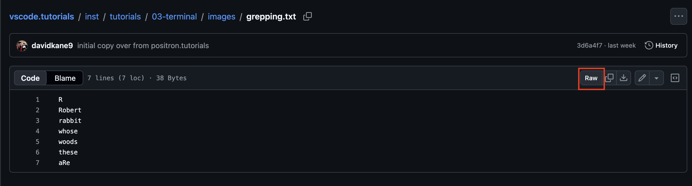

```{r setup, include = FALSE}
library(learnr)
library(tutorial.helpers)
library(tidyverse)
library(knitr)

library(pkgbuild)

knitr::opts_chunk$set(echo = FALSE)
knitr::opts_chunk$set(out.width = '90%')
options(tutorial.exercise.timelimit = 60,
        tutorial.storage = "local")
```


```{r info-section, child = system.file("child_documents/info_section.Rmd", package = "tutorial.helpers")}
```

<!-- Explain more often that these are all programs that spit out stuff, which can often be chained together or just allowed to dump. -->

<!-- Mention Rscript and python -e. -->

<!-- Add a brief discussion of environment variables? -->

<!-- Could have test cases which confirm that these commands match what I think they should, I think. -->


## Introduction
###

This tutorial builds on Terminal 1 and Terminal 2. You know the core bash commands, paths, options, and how programs run. Here we cover three final topics: **wildcards**, which match many file names at once using metacharacters like `*`; **grep**, which searches for patterns *inside* files; and **pipes**, which chain programs together. These are the grammar of the compound commands you will constantly read --- and approve or reject --- when AI agents work on your behalf.

Some material is from [*R for Data Science (2e)*](https://r4ds.hadley.nz/) by Hadley Wickham, Mine Çetinkaya-Rundel, and Garrett Grolemund.

###

You should be doing this tutorial in a repo named `terminal-3`. If you are not, create one and connect to it, as you learned in earlier tutorials.

## Wildcards
###

You will learn how to search for files by using **wildcards** to form **regular expressions**.

### Exercise 1

Use `pwd` to confirm that you are in your default working directory. Use `mkdir` to create a directory named `wildcards`. CP/CR.

```{r wildcards-1}
question_text(NULL,
    answer(NULL, correct = TRUE),
    allow_retry = TRUE,
    try_again_button = "Edit Answer",
    incorrect = NULL,
    rows = 3)
```

###

````
terminal-3 $ pwd
/workspaces/terminal-3
terminal-3 $ mkdir wildcards
terminal-3 $
````

The `mkdir` command does not produce any output. To confirm that it had the desired effect, you could run `ls`.

### Exercise 2

Change your working directory to `wildcards` using `cd`. Confirm the change with `pwd`. CP/CR.

```{r wildcards-2}
question_text(NULL,
	answer(NULL, correct = TRUE),
	allow_retry = TRUE,
	try_again_button = "Edit Answer",
	incorrect = NULL,
	rows = 3)
```

###

````
terminal-3 $ cd wildcards/
wildcards $ pwd
/workspaces/terminal-3/wildcards
wildcards $
````

Note how the prompt changed after we switched directories.

Keep track of your current location. There is a difference between being in the directory above `wildcards` and being inside of `wildcards`. Right now, you are inside `wildcards`.

### Exercise 3

Using `echo`, make three text files named `hat.txt`, `cat.txt`, and `ate.txt` by running:

````
echo "" > hat.txt & echo "" > cat.txt & echo "" > ate.txt
````

Confirm that you have done so by running `ls`. (No worries if you make a mistake. Just fix it by removing the misnamed file.)

CP/CR.

```{r wildcards-3}
question_text(NULL,
    answer(NULL, correct = TRUE),
    allow_retry = TRUE,
    try_again_button = "Edit Answer",
    incorrect = NULL,
    rows = 5)
```

###

````
wildcards $ echo "" > hat.txt & echo "" > cat.txt & echo "" > ate.txt
[1] 59474
[2] 59475
[1]  - done       echo "" > hat.txt
[2]  + done       echo "" > cat.txt
wildcards $ ls
ate.txt cat.txt hat.txt
wildcards $
````

If you are curious about how those commands work, use AI to explore them. The more you interact with AI, the better.

### Exercise 4

Terminal commands allow the use of **wildcards**. A wildcard `*` represents zero or more of any character, and it is used to work with similarly named files as a group.

###

Let's generate a list of all our files whose names contain the letter `a`. First, try to run `ls a`. You will get an error message --- "No such file or directory" --- because there is no file named `a` in the working directory. CP/CR.

```{r wildcards-4}
question_text(NULL,
    answer(NULL, correct = TRUE),
    allow_retry = TRUE,
    try_again_button = "Edit Answer",
    incorrect = NULL,
    rows = 3)
```

###

````
wildcards $ ls a
ls: cannot access 'a': No such file or directory
wildcards $
````

Although we have been using `ls` to return all the contents of a directory, `ls` can also take a name as an argument, as above.

### Exercise 5

Let's try again. Run `ls a*`. The only return will be `ate.txt`. Because you put `*` after `a`, `ls` returns only files that begin with `a`. The "star" wildcard --- `*` --- matches anything. CP/CR.

```{r wildcards-5}
question_text(NULL,
    answer(NULL, correct = TRUE),
    allow_retry = TRUE,
    try_again_button = "Edit Answer",
    incorrect = NULL,
    rows = 3)
```

###

````
wildcards $ ls a*
ate.txt
wildcards $
````

Although `*` will match strings of any length, its positioning matters. `a*` is not the same thing as `*a`. The first matches any string (i.e., any filename) that starts with `a`. The second matches any filename that ends with `a`.

### Exercise 6

Now run `ls *a*`. This should return all three files. CP/CR.

```{r wildcards-6}
question_text(NULL,
    answer(NULL, correct = TRUE),
    allow_retry = TRUE,
    try_again_button = "Edit Answer",
    incorrect = NULL,
    rows = 3)
```

###

````
wildcards $ ls *a*
ate.txt cat.txt hat.txt
wildcards $
````

Note that these **regular expressions** are case-sensitive. A regular expression is a pattern that you can use for many purposes, including as a search criterion.

### Exercise 7

Make a list of all the files with names, before the suffix, that end in `t` by running `ls *t.*`. CP/CR.

```{r wildcards-7}
question_text(NULL,
    answer(NULL, correct = TRUE),
    allow_retry = TRUE,
    try_again_button = "Edit Answer",
    incorrect = NULL,
    rows = 3)
```

###

````
wildcards $ ls *t.*
cat.txt hat.txt
wildcards $
````

This should return `hat.txt` and `cat.txt`. Read this regular expression --- `*t.*` --- as matching any string that includes a `t` followed directly by a period, regardless of any characters before or after. `ate.txt` is not matched because the `t` and the `.` are separated by `e`.

### Exercise 8

Save the output of our list of all the file names that contain `a` to a new file named `afiles.txt`. Keep pressing the **up** arrow key to navigate through your previous commands until you get to the command you used above: `ls *a*`. Then add `> afiles.txt` afterward and run the command. That is, you are running `ls *a* > afiles.txt`.

Then, run `ls` to confirm that it worked.

CP/CR.

```{r wildcards-8}
question_text(NULL,
    answer(NULL, correct = TRUE),
    allow_retry = TRUE,
    try_again_button = "Edit Answer",
    incorrect = NULL,
    rows = 3)
```

###

````
wildcards $ ls *a* > afiles.txt
wildcards $ ls
afiles.txt      ate.txt         cat.txt         hat.txt
wildcards $
````

You can use your `up` and `down` arrow keys to navigate command history. The `>` symbol redirects the result of the left-hand command into the specified file.

### Exercise 9

Wildcards can be used with more than `ls`. Let's move `hat.txt` and `cat.txt` together into one directory.

First, make a new directory called `seuss` within the `wildcards` directory, where you are currently located.

Run `ls` to confirm. CP/CR.

```{r wildcards-9}
question_text(NULL,
    answer(NULL, correct = TRUE),
    allow_retry = TRUE,
    try_again_button = "Edit Answer",
    incorrect = NULL,
    rows = 3)
```

###

Your answer should look like:

````
wildcards $ mkdir seuss
wildcards $ ls
afiles.txt      ate.txt         cat.txt         hat.txt         seuss
wildcards $
````

The `wildcards` directory, in which you are currently located, now includes five items, one of which is the `seuss` directory.

### Exercise 10

Run `ls -l`. CP/CR.

```{r wildcards-10}
question_text(NULL,
	answer(NULL, correct = TRUE),
	allow_retry = TRUE,
	try_again_button = "Edit Answer",
	incorrect = NULL,
	rows = 3)
```

###

````
wildcards $ ls -l
total 16
-rw-r--r-- 1 codespace codespace 24 Apr 30 12:00 afiles.txt
-rw-r--r-- 1 codespace codespace  1 Apr 30 12:00 ate.txt
-rw-r--r-- 1 codespace codespace  1 Apr 30 12:00 cat.txt
-rw-r--r-- 1 codespace codespace  1 Apr 30 12:00 hat.txt
drwxr-xr-x 2 codespace codespace 4096 Apr 30 12:00 seuss
wildcards $
````

The `-l` option provides a **l**ong-format listing of the contents of the directory, including information about the type of content (file versus directory) and creation dates/times. The leading `d` in the line for `seuss` indicates that it is a directory.

### Exercise 11

Run `ls *t.*`. CP/CR.

```{r wildcards-11}
question_text(NULL,
	answer(NULL, correct = TRUE),
	allow_retry = TRUE,
	try_again_button = "Edit Answer",
	incorrect = NULL,
	rows = 3)
```

###

````
wildcards $ ls *t.*
cat.txt hat.txt
wildcards $
````

Before moving or otherwise acting on a group of files, we often want to ensure that we have the correct group. Running `ls` with the appropriate regular expression is an easy way to test.

### Exercise 12

Use the previous command (since we have confirmed that it generates the list of files we want to move), but replace `ls` with `mv` and then add `seuss`, which indicates where we want to move the files. In other words, run `mv *t.* seuss`. CP/CR.

```{r wildcards-12}
question_text(NULL,
	answer(NULL, correct = TRUE),
	allow_retry = TRUE,
	try_again_button = "Edit Answer",
	incorrect = NULL,
	rows = 3)
```

###

````
wildcards $ mv *t.* seuss
wildcards $
````

The `mv` command, like `mkdir`, does not produce any output. You need to check by hand to ensure it has done what you wanted.

### Exercise 13

Run `ls -R`. CP/CR.

```{r wildcards-13}
question_text(NULL,
	answer(NULL, correct = TRUE),
	allow_retry = TRUE,
	try_again_button = "Edit Answer",
	incorrect = NULL,
	rows = 3)
```

###

Your answer should look like:

````
wildcards $ ls -R
afiles.txt      ate.txt         seuss

./seuss:
cat.txt hat.txt
wildcards $
````

The `-R` option to the `ls` command stands for **r**ecursive. We see not simply the contents of the current directory (two files and the `seuss` directory) but also the contents of the `seuss` directory itself.

### Exercise 14

Use `cd ..` to move out of the `wildcards` directory, one level up. Run `pwd`. CP/CR.

```{r wildcards-14}
question_text(NULL,
	answer(NULL, correct = TRUE),
	allow_retry = TRUE,
	try_again_button = "Edit Answer",
	incorrect = NULL,
	rows = 3)
```

###

````
wildcards $ cd ..
terminal-3 $ pwd
/workspaces/terminal-3
terminal-3 $
````

In order to delete a directory, you cannot be located within that directory. We want to delete (that is, "remove") the `wildcards` directory since we always want to --- at least for this tutorial --- clean up any temporary files/directories that we have created.

### Exercise 15

Run `rm wildcards`. That command will fail because `wildcards` is a directory. You can't just `rm` directories in the same way that you `rm` files. Instead, you need to use `rm -r`, where the `-r` indicates **r**ecursive. Run `rm -r wildcards`. CP/CR.

```{r wildcards-15}
question_text(NULL,
	answer(NULL, correct = TRUE),
	allow_retry = TRUE,
	try_again_button = "Edit Answer",
	incorrect = NULL,
	rows = 3)
```

###

````
terminal-3 $ rm wildcards
rm: cannot remove 'wildcards': Is a directory
terminal-3 $ rm -rf wildcards/
terminal-3 $
````

Note that both `wildcards` and `wildcards/` refer to the same entity, the `wildcards` directory. The Terminal often "adds" a forward slash (`/`) to the end of directory names to indicate that the object is a directory, not simply a file.

## grep
###

In a previous section, we used **wildcards** to generate lists of file names that matched a specific pattern. In this section, we will use `grep` to look for words *inside* files. The idea of matching patterns carries over to `grep`.

### Exercise 1

Make a directory called `grepping` using `mkdir`. Run `ls`. CP/CR.

```{r grep-1}
question_text(NULL,
    answer(NULL, correct = TRUE),
    allow_retry = TRUE,
    try_again_button = "Edit Answer",
    incorrect = NULL,
    rows = 3)
```

###

We call this folder `grepping` rather than `grep` because you should not use a command, like `grep`, as the name of a file or a directory. It is possible to do this, just like it is possible to jump off a bridge. But in both cases, you will probably regret it.

### Exercise 2

`cd` into the `grepping` directory. Run this command:

```
echo hat.txt > files.txt & echo cat.txt >> files.txt & echo ate.txt >> files.txt & echo "" >> files.txt
```

The trick with this command is that `>` redirects the results into a file, deleting anything already in the file, while `>>` appends to an existing file. So, we are creating `files.txt` line by line.

Run `cat files.txt`. CP/CR.

```{r grep-2}
question_text(NULL,
	answer(NULL, correct = TRUE),
	allow_retry = TRUE,
	try_again_button = "Edit Answer",
	incorrect = NULL,
	rows = 3)
```

###

When I run this, I see:

````
terminal-3 $ cd grepping
grepping $ echo hat.txt > files.txt & echo cat.txt >> files.txt & echo ate.txt >> files.txt & echo "" >> files.txt
[1] 98048
[2] 98049
[3] 98050
[1]    done       echo hat.txt > files.txt
[3]  + done       echo ate.txt >> files.txt
[2]  + done       echo cat.txt >> files.txt
grepping $ cat files.txt
hat.txt
cat.txt
ate.txt
grepping $
````

This shows how three different commands can be run from one command line.

The extra `""` at the end of the command ensures that there is a blank line at the end of the file, which is always a good idea when working with text files.

### Exercise 3

Let's search the text file for lines containing the letter "a". Run `grep a files.txt`. CP/CR.

```{r grep-3}
question_text(NULL,
    answer(NULL, correct = TRUE),
    allow_retry = TRUE,
    try_again_button = "Edit Answer",
    incorrect = NULL,
    rows = 3)
```

###

````
grepping $ grep a files.txt
hat.txt
cat.txt
ate.txt
grepping $
````

Remember to use the *tab* key to take advantage of auto-completion. Don't type! Tab complete!

This should return all three lines from the file, which are the names of the three files we created earlier in the tutorial. The blank line is not returned because it does not include an `a`.

`grep` is used to search for a string of characters within a text file. When it finds a match, it prints the line. You can put the regular expression, in this case `a`, in quotes, but that is not required.

### Exercise 4

Let's search through `files.txt` for lines that begin with the letter "a". Run `grep ^a files.txt`. CP/CR.

```{r grep-4}
question_text(NULL,
    answer(NULL, correct = TRUE),
    allow_retry = TRUE,
    try_again_button = "Edit Answer",
    incorrect = NULL,
    rows = 3)
```

###

````
grepping $ grep ^a files.txt
ate.txt
grepping $
````

`^` is put at the beginning of a regular expression to indicate that the expression must occur at the beginning of a line. A dollar sign --- `$` --- at the end of a regular expression indicates that the expression must occur at the end of the line.

### Exercise 5

Now, we'll download another text file. You can view the file on the following webpage:

````
https://github.com/PPBDS/vscode.tutorials/blob/main/inst/tutorials/06-terminal-3/images/grepping.txt
````
Then navigate to the URL for the raw text file.

```{r}

```

Copy the URL in your address bar. It should begin with `https://raw.githubusercontent.com/`.

Back in your Codespace, run `cd ..` to return to `terminal-3`. Then run the following command, replacing `URL` with the URL for the raw file:

````
curl -o grepping/grepping.txt URL
````

Then run `ls grepping` to verify that the file has been downloaded to the correct location.

CP/CR.

```{r grep-5}
question_text(NULL,
	answer(NULL, correct = TRUE),
	allow_retry = TRUE,
	try_again_button = "Edit Answer",
	incorrect = NULL,
	rows = 3)
```

###

My answer looks like:

````
terminal-3 $ curl -o grepping/grepping.txt https://raw.githubusercontent.com/PPBDS/vscode.tutorials/refs/heads/main/inst/tutorials/06-terminal-3/images/grepping.txt
  % Total    % Received % Xferd  Average Speed   Time    Time     Time  Current
                                 Dload  Upload   Total   Spent    Left  Speed
100    38  100    38    0     0    455      0 --:--:-- --:--:-- --:--:--   457
terminal-3 $ ls grepping
files.txt  grepping.txt
terminal-3 $
````

There are now two files in `grepping`: `files.txt` and `grepping.txt`.

###

The `-o` (lowercase "o") option lets you specify the **o**utput name. By renaming, we can place the downloaded file in any file path. In this case, we rename the downloaded file to `grepping.txt` and place it in the `grepping` directory.

### Exercise 6

Move back into the `grepping` directory with `cd grepping`. Then run `wc grepping.txt`. The `wc` command stands for **w**ord **c**ount. CP/CR.

```{r grep-6}
question_text(NULL,
	answer(NULL, correct = TRUE),
	allow_retry = TRUE,
	try_again_button = "Edit Answer",
	incorrect = NULL,
	rows = 3)
```

###

````
terminal-3 $ cd grepping
grepping $ wc grepping.txt
       7       7      38 grepping.txt
grepping $
````

The first number returned by `wc` is the number of lines in the file. The second is the total number of words. The third is the number of characters. In this case, the number of lines is the same as the number of words.

### Exercise 7

Use `grep` to search `grepping.txt` for lines that contain `R`. That is, run:

`grep R grepping.txt`

CP/CR.

```{r grep-7}
question_text(NULL,
    answer(NULL, correct = TRUE),
    allow_retry = TRUE,
    try_again_button = "Edit Answer",
    incorrect = NULL,
    rows = 3)
```

###

````
grepping $ grep R grepping.txt
R
Robert
aRe
grepping $
````

`aRe` is included because the pattern `R` matches any line that includes an `R`, regardless of where that `R` is on the line.

### Exercise 8

Use `grep` and `^` to search `grepping.txt` for lines that **begin** with `R`. That is, run:

`grep ^R grepping.txt`

CP/CR.

```{r grep-8}
question_text(NULL,
    answer(NULL, correct = TRUE),
    allow_retry = TRUE,
    try_again_button = "Edit Answer",
    incorrect = NULL,
    rows = 3)
```

###

````
grepping $ grep ^R grepping.txt
R
Robert
grepping $
````

`^` and `$` are called metacharacters. It is often useful to put quotes around a regular expression that includes metacharacters.

### Exercise 9

Use `grep` and `$` to search `grepping.txt` for lines that end with `e`. That is, run:

`grep e$ grepping.txt`

CP/CR.

```{r grep-9}
question_text(NULL,
    answer(NULL, correct = TRUE),
    allow_retry = TRUE,
    try_again_button = "Edit Answer",
    incorrect = NULL,
    rows = 3)
```

###

````
grepping $ grep e$ grepping.txt
whose
these
aRe
grepping $
````

`egrep` is an even more powerful version of `grep`. Learning more about `egrep` is beyond the scope of this tutorial.

## Pipes
###

Every command you have met is a program that reads text and spits out text. The **pipe** symbol --- `|` --- connects them: it feeds the output of one program straight into the next. Pipes are everywhere in the commands AI agents run, so you need to read them fluently. We are still in the `grepping` directory.

### Exercise 1

Run `cat grepping.txt | wc -l`. CP/CR.

```{r pipes-1}
question_text(NULL,
    answer(NULL, correct = TRUE),
    allow_retry = TRUE,
    try_again_button = "Edit Answer",
    incorrect = NULL,
    rows = 3)
```

###

````
grepping $ cat grepping.txt | wc -l
4
grepping $
````

###

`cat` printed the file, but instead of landing on your screen, the output flowed through the pipe into `wc -l`, which counted its lines. `wc -l grepping.txt` gives the same count --- many commands can read either from a file or from a pipe.

### Exercise 2

Run `grep t.txt$ grepping.txt | wc -l`. CP/CR.

```{r pipes-2}
question_text(NULL,
    answer(NULL, correct = TRUE),
    allow_retry = TRUE,
    try_again_button = "Edit Answer",
    incorrect = NULL,
    rows = 3)
```

###

````
grepping $ grep t.txt$ grepping.txt | wc -l
2
grepping $
````

###

A filter feeding a counter: `grep` kept only the lines ending in `t.txt` (`hat.txt` and `cat.txt` --- not `ate.txt`, which ends in `e.txt`), and `wc -l` counted the survivors. Read pipelines left to right, one program at a time.

### Exercise 3

Pipelines can be as long as you like. Run `cat grepping.txt | grep ^a | wc -l`. CP/CR.

```{r pipes-3}
question_text(NULL,
    answer(NULL, correct = TRUE),
    allow_retry = TRUE,
    try_again_button = "Edit Answer",
    incorrect = NULL,
    rows = 3)
```

###

````
grepping $ cat grepping.txt | grep ^a | wc -l
1
grepping $
````

###

Print the file, keep lines starting with `a` (just `ate.txt`), count them. You will meet real pipelines like this soon: in the OpenRouter tutorial, you will run `aider --list-models openrouter/ | grep ':free'` --- a program that lists hundreds of AI models, piped through `grep` to keep only the free ones. You can now read that command before you run it.

A related symbol is `&&`, which chains commands *sequentially*: `mkdir data && cd data` means "make the directory **and then**, if that worked, move into it." Pipes pass text between programs; `&&` just runs one program after another.

### Exercise 4

One more pipeline --- this one about safety. Run `rm --help | grep -w force`. CP/CR.

```{r pipes-4}
question_text(NULL,
    answer(NULL, correct = TRUE),
    allow_retry = TRUE,
    try_again_button = "Edit Answer",
    incorrect = NULL,
    rows = 3)
```

###

````
grepping $ rm --help | grep -w force
  -f, --force           ignore nonexistent files and arguments, never prompt
grepping $
````

###

You just used a pipe to interrogate a dangerous command: `--help` (safe, remember, from the Introduction tutorial) printed `rm`'s documentation, and `grep` pulled out the one line you cared about. So `rm -rf` means: delete **r**ecursively, **f**orcing past every safeguard, never prompting. When an AI agent asks to run a command, read it before approving. Check three things: what is `rm` (or `mv`, or `>`) actually targeting; does any path point outside your repo; and does the command download-and-run code (a pattern like `curl ... | sh`). Approving an agent's command means exactly what typing it yourself means.

### Exercise 5

Use `cd ..` to change the working directory to the directory that is one level above your current location. This should be the default working directory from which we started. Run `pwd`. CP/CR.

```{r pipes-5}
question_text(NULL,
    answer(NULL, correct = TRUE),
    allow_retry = TRUE,
    try_again_button = "Edit Answer",
    incorrect = NULL,
    rows = 3)
```

###

````
grepping $ cd ..
terminal-3 $ pwd
/workspaces/terminal-3
terminal-3 $
````

This tutorial uses `/workspaces/terminal-3` as the default working directory.

### Exercise 6

Use `rm -r` to remove `grepping`. CP/CR.

```{r pipes-6}
question_text(NULL,
    answer(NULL, correct = TRUE),
    allow_retry = TRUE,
    try_again_button = "Edit Answer",
    incorrect = NULL,
    rows = 3)
```

###

````
terminal-3 $ rm -r grepping
terminal-3 $
````

It is always a good idea to clean up after yourself. As the sign says when taking a hike in the forest: "Take only photos. Leave only footprints."


## Summary
###

This tutorial covered **wildcards**, **grep**, and **pipes**, and through them your first **regular expressions** --- patterns built from metacharacters like `*`, `^`, and `$` that match file names and text. You will rarely type these yourself in the age of AI, but you will constantly *read* them in the commands your AI agents run, and knowing what they mean is how you audit that work before approving it. Some material is from [*R for Data Science (2e)*](https://r4ds.hadley.nz/) by Hadley Wickham, Mine Çetinkaya-Rundel, and Garrett Grolemund.

Learn more about the command line and related topics by reading [*The Unix Workbench*](https://seankross.com/the-unix-workbench/) by Sean Kross.

```{r download-answers, child = system.file("child_documents/download_answers.Rmd", package = "tutorial.helpers")}
```
