```{r setup, include = FALSE}
library(learnr)
library(tutorial.helpers)
library(knitr)

library(tidyverse)
library(usethis)
library(gitcreds)

knitr::opts_chunk$set(echo = FALSE)
knitr::opts_chunk$set(out.width = '90%')
options(tutorial.exercise.timelimit = 60, 
        tutorial.storage = "local")
```

```{r info-section, child = system.file("child_documents/info_section.Rmd", package = "tutorial.helpers")}
```

## Introduction
### 

This tutorial covers [Git](https://git-scm.com/), a program for keeping track of changes in your code, and [GitHub](https://github.com/), the leading platform for storing your code in the cloud. Some material is from [*R for Data Science (2e)*](https://r4ds.hadley.nz/) by Hadley Wickham, Mine Çetinkaya-Rundel, and Garrett Grolemund. 

The most useful references for Git/GitHub are [*Happy Git and GitHub for the useR*](https://happygitwithr.com/) and [*Pro Git*](https://git-scm.com/book/en/v2). Refer to these for questions and further learning. Or use AI!

## Using Git
### 

GitHub is an online drive for all your R code and projects. In the professional world, what you have in your GitHub account is often more important than what you have on your resume. It is a verifiable demonstration of your abilities.

Until now, `connect-repo` has done all the GitHub work for you. In this tutorial we open that black box: you will read the commands it runs, run the important ones yourself --- creating, wiring, and deleting a repo by hand --- and learn to read what Git is telling you about your files.

[Git](https://en.wikipedia.org/wiki/Git) is "software for tracking changes in any set of files, usually used for coordinating work among programmers collaboratively developing source code during software development."

### Exercise 1

You should be doing this tutorial in a repo named `github-introduction`. If you are not, create one and connect to it, as you learned in earlier tutorials.

Copy and paste the URLs for:

1. Your `github-introduction` repository on GitHub. Find it under **Your repositories**, as you learned in the Introduction tutorial.

2. This Codespace --- the address in your browser's address bar, ending in `.github.dev`.

```{r using-git-1}
question_text(NULL,
	answer(NULL, correct = TRUE),
	allow_retry = TRUE,
	try_again_button = "Edit Answer",
	incorrect = NULL,
	rows = 5)
```

###

Your answer should look something like:

````
https://github.com/ppbds-student/github-introduction
https://congenial-chainsaw-wv757pv4pp67cpw.github.dev/
````

###

Notice the two URLs look quite different. Your repo URL (`github.com/...`) is where your code lives — think of it as the filing cabinet. Your Codespace URL (`*.github.dev`) is where you work on that code — the desk you sit at to open, edit, and run files. The filing cabinet exists permanently on GitHub; the desk is spun up on demand and shut down when you're done.

### Exercise 2

At the bash Terminal, run `pwd`. CP/CR.

```{r using-git-2}
question_text(NULL,
	answer(NULL, correct = TRUE),
	allow_retry = TRUE,
	try_again_button = "Edit Answer",
	incorrect = NULL,
	rows = 3)
```

###

Your answer should look like:

````
github-introduction $ pwd
/workspaces/github-introduction
github-introduction $
````

You should be in a directory named `github-introduction`. `connect-repo` created it, side by side with `codespace-starter`, under `/workspaces`.

### Exercise 3

At the Terminal, run `ls`. CP/CR.

```{r using-git-3}
question_text(NULL,
	answer(NULL, correct = TRUE),
	allow_retry = TRUE,
	try_again_button = "Edit Answer",
	incorrect = NULL,
	rows = 3)
```

###

Your answer should look like:

````
github-introduction $ ls
AGENTS.md
github-introduction $
````

The only visible file is `AGENTS.md`, which `connect-repo` copied in when it created the repo. It holds guidance for AI assistants working with you in this course --- agents read instruction files like this from the folder they run in.

### Exercise 4

At the Terminal, run `ls -a`. The `a` option tells `ls` to show all directories and files, including hidden ones, which start with a dot (`.`). CP/CR.

```{r using-git-4}
question_text(NULL,
	answer(NULL, correct = TRUE),
	allow_retry = TRUE,
	try_again_button = "Edit Answer",
	incorrect = NULL,
	rows = 3)
```

###

Your answer should look like:

````
github-introduction $ ls -a
.  ..  .git  AGENTS.md
github-introduction $
````

`.` refers to the current directory. `..` stands for the parent directory. These two links are present in (almost) every directory on your computer.

`.git` is a hidden directory used by the program Git to keep track of all the files in your project. 

Unless you have a good reason, you should never mess with the contents of a hidden directory like `.git`.

### Exercise 5

Time to open the black box. The `connect-repo` script has a `--help` option that explains --- without running anything --- every command it issues. Run:

````
/workspaces/codespace-starter/.devcontainer/connect-repo.sh --help
````

Read the whole thing. Then CP/CR the numbered steps (1 through 4).

```{r using-git-5}
question_text(NULL,
	answer(NULL, correct = TRUE),
	allow_retry = TRUE,
	try_again_button = "Edit Answer",
	incorrect = NULL,
	rows = 20)
```

###

The key part of the output:

````
  1. ACT AS YOU, NOT AS THE CODESPACE
         unset GITHUB_TOKEN GH_TOKEN
     A Codespace starts with a built-in token that can only touch
     codespace-starter and can't create repos. Clearing it makes `gh` and
     `git` use YOUR GitHub login instead.

  2. SIGN IN TO GITHUB AS YOURSELF (once per Codespace)
         gh auth login --hostname github.com --git-protocol https --web
     Opens a browser sign-in. Click Authorize, then come back.

  3. MAKE `git push` AUTHENTICATE AS YOU
         git config --global credential.helper store
     Stores your token so pushes go out as you, not as the built-in
     Codespace token.

  4. CREATE A NEW REPO, OR CONNECT TO ONE THAT EXISTS
     New repo on your account (doesn't exist yet):
         gh repo create <name> --public --clone
     Existing repo:
         gh repo clone <name>
     Either way you end up with the repo at /workspaces/<name>.
````

###

There is no magic here --- the script says so itself. `connect-repo` is a convenience wrapper around a handful of commands, and `--help` is the same convention you met with `ls --help` in the Introduction tutorial: a safe way to learn what a program does without running it. The two programs doing the real work are `git` (tracking changes) and `gh`, GitHub's official command-line program (talking to github.com). You will now run the important commands yourself.

### Exercise 6

Start with identity. Run `gh auth status`. CP/CR.

```{r using-git-6}
question_text(NULL,
	answer(NULL, correct = TRUE),
	allow_retry = TRUE,
	try_again_button = "Edit Answer",
	incorrect = NULL,
	rows = 8)
```

###

````
github-introduction $ gh auth status
github.com
  ✓ Logged in to github.com account your-username
  - Active account: true
  - Git operations protocol: https
  - Token: gho_************************************
  - Token scopes: 'gist', 'read:org', 'repo', 'workflow'
````

###

This is steps 1--3 of the script, already done: when you first ran `connect-repo`, it signed you in, and every `gh` and `git` command since has acted as *you*. Note the **token scopes** line --- the list of powers your login carries. `repo` means you can create and push to repositories. Remember this list; it matters in a few exercises. When an AI agent pushes code for you, it is using exactly these credentials.

### Exercise 7

Now step 4, by hand. Let's create a throwaway repo --- we will delete it shortly. Run these commands, one at a time:

````
cd /workspaces
gh repo create scratch-repo --public --clone
````

Then run `ls`. CP/CR.

```{r using-git-7}
question_text(NULL,
	answer(NULL, correct = TRUE),
	allow_retry = TRUE,
	try_again_button = "Edit Answer",
	incorrect = NULL,
	rows = 8)
```

###

````
github-introduction $ cd /workspaces
workspaces $ gh repo create scratch-repo --public --clone
✓ Created repository your-username/scratch-repo on github.com
  https://github.com/your-username/scratch-repo
Cloning into 'scratch-repo'...
warning: You appear to have cloned an empty repository.
workspaces $ ls
codespace-starter  github-introduction  scratch-repo
workspaces $
````

###

One command did two jobs: it created the filing cabinet on GitHub, and `--clone` copied it down to a local folder. The "empty repository" warning is expected --- a brand-new repo has no commits yet. This single command is the heart of `connect-repo`. Every repo you have made this course --- `introduction`, `code`, `quarto`, all of them --- was born exactly this way.

### Exercise 8

How does the local folder know which GitHub repo it belongs to? Run:

````
cd scratch-repo
git remote -v
````

CP/CR.

```{r using-git-8}
question_text(NULL,
	answer(NULL, correct = TRUE),
	allow_retry = TRUE,
	try_again_button = "Edit Answer",
	incorrect = NULL,
	rows = 5)
```

###

````
workspaces $ cd scratch-repo
scratch-repo $ git remote -v
origin  https://github.com/your-username/scratch-repo (fetch)
origin  https://github.com/your-username/scratch-repo (push)
scratch-repo $
````

###

`origin` is Git's conventional nickname for the copy of your repo on GitHub. This is the wiring: when you push, Git sends commits to `origin`; when you pull, it fetches from `origin`. The clone set this up automatically. When something goes wrong with pushing --- and someday it will --- `git remote -v` is the first thing to check: it tells you where Git *thinks* your work is going.

### Exercise 9

We don't need `scratch-repo`. Try to delete it from the command line. Run `gh repo delete scratch-repo`. CP/CR whatever happens --- including a refusal.

```{r using-git-9}
question_text(NULL,
	answer(NULL, correct = TRUE),
	allow_retry = TRUE,
	try_again_button = "Edit Answer",
	incorrect = NULL,
	rows = 5)
```

###

````
scratch-repo $ gh repo delete scratch-repo
X This API operation needs the "delete_repo" scope. To request it, run:  gh auth refresh -h github.com -s delete_repo
scratch-repo $
````

Your exact message may differ. The point is the refusal.

###

Look back at the token scopes from Exercise 6: `delete_repo` was not among them. Deleting a repository is so destructive --- the history, the issues, the published site, all gone, unrecoverable --- that your everyday credentials deliberately lack the power. You *could* grant it with the `gh auth refresh` command shown, and the command-line route is occasionally useful. But don't. The normal way to delete a repo is the website, which forces you to slow down.

### Exercise 10

Delete `scratch-repo` from the website. Go to its page on GitHub (`https://github.com/your-username/scratch-repo`), click **Settings** in the top menu, and scroll all the way to the bottom, to the **Danger Zone**. Click **Delete this repository**, and follow the prompts --- GitHub will make you type the repository's full name to confirm.

Then, back in the Terminal, confirm it is gone and clean up the local clone. Run these commands, one at a time:

````
cd /workspaces
gh repo view scratch-repo
rm -rf scratch-repo
ls
cd github-introduction
````

CP/CR.

```{r using-git-10}
question_text(NULL,
	answer(NULL, correct = TRUE),
	allow_retry = TRUE,
	try_again_button = "Edit Answer",
	incorrect = NULL,
	rows = 8)
```

###

````
scratch-repo $ cd /workspaces
workspaces $ gh repo view scratch-repo
GraphQL: Could not resolve to a Repository with the name 'your-username/scratch-repo'. (repository)
workspaces $ rm -rf scratch-repo
workspaces $ ls
codespace-starter  github-introduction
workspaces $ cd github-introduction
github-introduction $
````

###

Two lessons. First, the Danger Zone's type-the-full-name ritual is friction by design: irreversible actions should be hard to do absentmindedly. You will delete repos fairly often --- abandoned experiments, practice work, wrongly named projects --- so remember where this lives: **Settings, bottom of the page**. Second, notice that deleting the repo on GitHub did *not* delete the local clone: the filing cabinet and the desk are separate, and we had to `rm -rf` the folder ourselves. The same is true in reverse --- deleting a local folder never touches GitHub.

### Exercise 11

At the Terminal, create a new Quarto document. From the three horizontal bar icon in the Activity Bar, select `File -> New File...`, then select `Quarto Document` from the drop-down menu. This opens the new file in the Editor.

```{r}
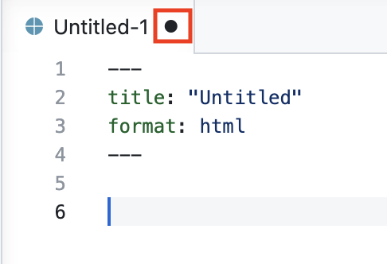
```

Notice how there is a black dot in the `analysis-1.qmd` tab in the Editor. This indicates that the file is unsaved.

Change the title to "Analysis 1" and add your name as the author. Save the file with `Cmd/Ctrl + S` as `analysis-1.qmd`.

```{r}
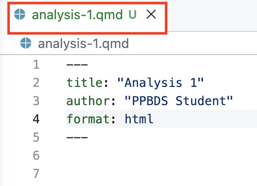
```

Notice how after saving, the `analysis-1.qmd` tab in the Editor is now green with a "U". This indicates that the file is saved, but the file is **U**ntracked by Git.

Then run `cat analysis-1.qmd`.

CP/CR.

```{r using-git-11}
question_text(NULL,
	answer(NULL, correct = TRUE),
	allow_retry = TRUE,
	try_again_button = "Edit Answer",
	incorrect = NULL,
	rows = 3)
```

###

You should have something like this:

````
github-introduction $ cat analysis-1.qmd 
---
title: "Analysis 1"
author: "PPBDS Student"
format: html
---

github-introduction $
````


### Exercise 12

Click the Source Control button in the Activity Bar. This opens the Source Control pane, which is an interface to using Git and GitHub.

```{r}
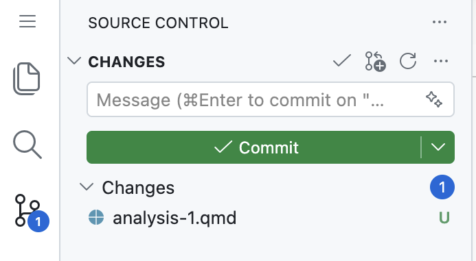
```

The top part of the pane shows the files that have been added or modified. This is Git telling you what it thinks has changed. Again, the "U" at the end of the line for `analysis-1.qmd` indicates that Git has noticed the file but that it is **U**ntracked.

Render `analysis-1.qmd` with `Cmd/Ctrl + Shift + K`.

The Terminal tab is filled with a bunch of commands. Copy/paste the last few lines.

```{r using-git-12}
question_text(NULL,
	answer(NULL, correct = TRUE),
	allow_retry = TRUE,
	try_again_button = "Edit Answer",
	incorrect = NULL,
	rows = 6)
```

###

Your answer should look like:

````
metadata
  document-css: false
  link-citations: true
  date-format: long
  lang: en
  
Output created: analysis-1.html

Watching files for changes
Browse at http://localhost:7383/
````

### Exercise 13

The VS Code window has changed quite a bit. The Viewer tab has appeared, showing the HTML. The Source Control pane now includes many new files. The Terminal tab is not showing a prompt.


We can stop the preview of `analysis-1.qmd` by pressing `Ctrl + c` on your keyboard in the Terminal. Once we do, the Viewer tab is empty, so we can close the entire Secondary Activity Bar.

From the Terminal, run `ls`. CP/CR.

```{r using-git-13}
question_text(NULL,
	answer(NULL, correct = TRUE),
	allow_retry = TRUE,
	try_again_button = "Edit Answer",
	incorrect = NULL,
	rows = 6)
```

###

Your answer should look like:

````
github-introduction $ ls
analysis-1_files  analysis-1.html  analysis-1.qmd
github-introduction $ 
````

The bottom part of the Source Control pane shows the history of changes in this repo.

### Exercise 14

Look more closely at the Source Control pane:

```{r}
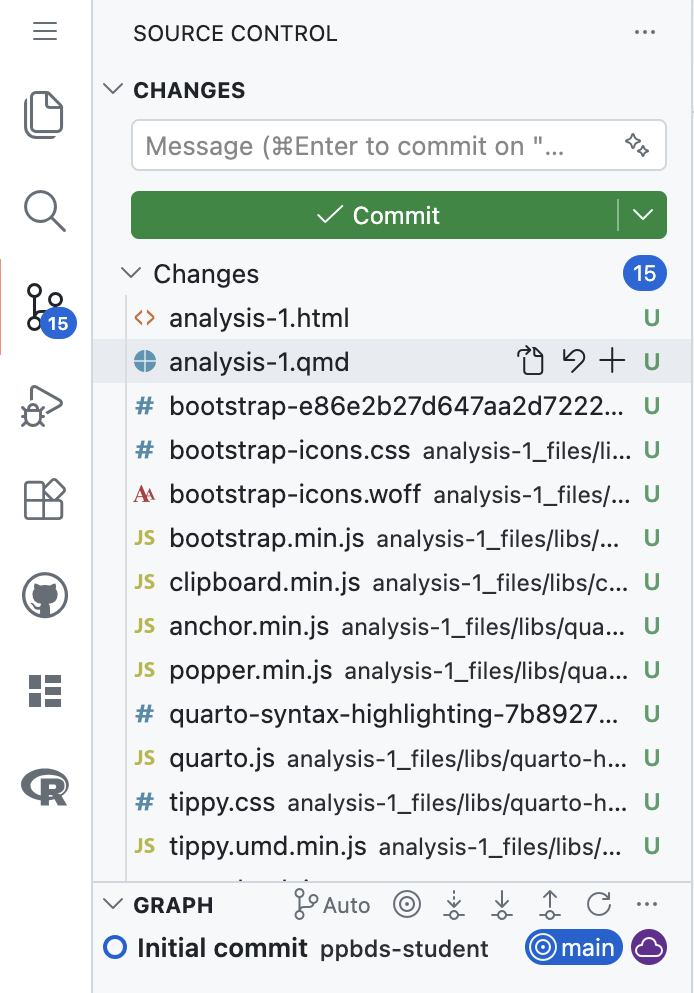
```

We have many new files, like `analysis-1.html`, created when we rendered `analysis-1.qmd`. They have "U" indicators because, according to Git, they are **U**ntracked. Many of these files are weird and confusing. It turns out that all these files live in the `analysis-1_files` directory.

From the Terminal, run `ls -R analysis-1_files`. The `-R` option means **r**ecursive. CP/CR.


```{r using-git-14}
question_text(NULL,
	answer(NULL, correct = TRUE),
	allow_retry = TRUE,
	try_again_button = "Edit Answer",
	incorrect = NULL,
	rows = 3)
```

###

Your answer should look like:

````
github-introduction $ ls -R analysis-1_files
analysis-1_files:
libs

analysis-1_files/libs:
bootstrap  clipboard  quarto-html

analysis-1_files/libs/bootstrap:
bootstrap-e86e2b27d647aa2d7222437750a2ec6e.min.css  bootstrap-icons.css  bootstrap-icons.woff  bootstrap.min.js

analysis-1_files/libs/clipboard:
clipboard.min.js

analysis-1_files/libs/quarto-html:
anchor.min.js  popper.min.js  quarto-syntax-highlighting-7b89279ff1a6dce999919e0e67d4d9ec.css  tippy.css
axe            quarto.js      tabsets                                                          tippy.umd.min.js

analysis-1_files/libs/quarto-html/axe:
axe-check.js

analysis-1_files/libs/quarto-html/tabsets:
tabsets.js
github-introduction $ 
````

Whenever you render a document using Quarto, it creates a directory called `base-name-of-your-file_files`. Since the base name of `analysis-1.qmd` is `analysis-1`, the new directory is `analysis-1_files`. This directory is filled with the programs, information, and other files that helped turn `analysis-1.qmd` into `analysis-1.html`. This is mostly confusing stuff that we should ignore. In fact, we usually don't even want it monitored by Git or stored on GitHub.

### Exercise 15

From the three horizontal bar icon, `File -> New Text File`. Save this new file as `.gitignore`. (Don't forget the leading period.) 

From the Terminal, run `ls -a`. CP/CR.

```{r using-git-15}
question_text(NULL,
	answer(NULL, correct = TRUE),
	allow_retry = TRUE,
	try_again_button = "Edit Answer",
	incorrect = NULL,
	rows = 3)
```

###

Your answer should look like:

````
github-introduction $ ls -a
.  ..  analysis-1_files  analysis-1.html  analysis-1.qmd  .devcontainer  .git  .gitignore
github-introduction $ 
````

Because `.gitignore` begins with a `.`, it is a hidden file. It would not appear if we just used `ls`. Note that the Source Control pane now shows a new file, `.gitignore` with an associated "U", meaning it is also untracked.

### Exercise 16

The purpose of the `.gitignore` file is to specify the files and directories that **Git** should **ignore**. Add a new line to the file, `analysis-1_files`, followed by an empty line. Save your changes.

From the Terminal, run `cat .gitignore`. CP/CR.

```{r using-git-16}
question_text(NULL,
	answer(NULL, correct = TRUE),
	allow_retry = TRUE,
	try_again_button = "Edit Answer",
	incorrect = NULL,
	rows = 3)
```

###

Your answer should look like:

````
github-introduction $ cat .gitignore
analysis-1_files
github-introduction $ 
````

The `analysis-1_files` line in `.gitignore` tells Git to ignore the `analysis-1_files` directory and everything in it.

Note the change in the Source Control pane!

```{r}
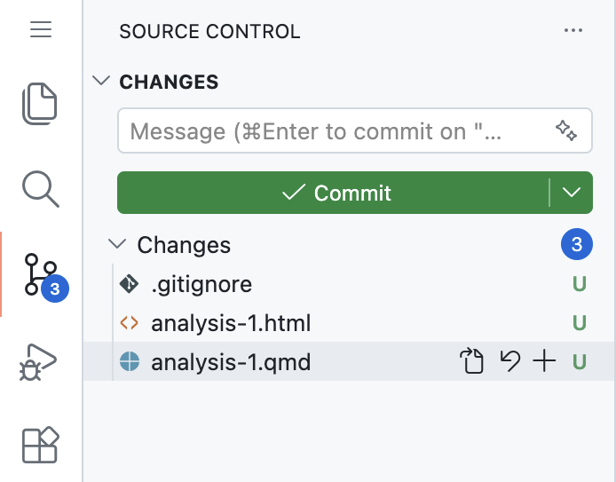
```

Now, according to Git, there have been only four changes to the repo. (Of course, there have been more changes, but Git is ignoring anything that resides in `analysis-1_files`.) Four files --- `analysis-1.qmd`, `analysis-1.html`, `.gitignore`, and `AGENTS.md` --- are untracked (U).


### Exercise 17

In the box above the "Commit" button, add "initial version" as your commit comment. Press the "Commit" button. You will see a dialog box like this:

```{r}
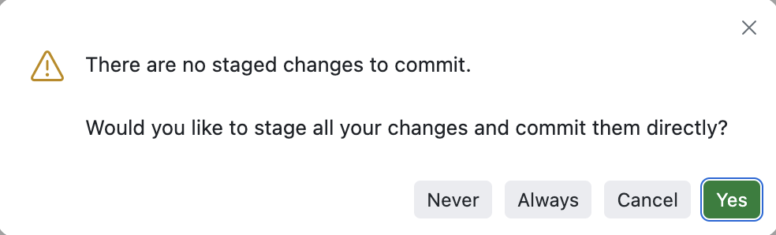
```

Press "Yes". In the future, you might click on "Always" so that this dialog stops appearing. It will be months, at least, before you make active use of staging in your Git workflow.

From the Terminal, run `git log`. CP/CR.

```{r using-git-17}
question_text(NULL,
	answer(NULL, correct = TRUE),
	allow_retry = TRUE,
	try_again_button = "Edit Answer",
	incorrect = NULL,
	rows = 5)
```

###

Your answer should look like this:

````
github-introduction $ git log
commit e6e05d17847846e0fda9ceedb9cce3b58fd0a024 (HEAD -> main)
Author: ppbds-student <acrogers362+ppbds-student@gmail.com>
Date:   Fri May 1 19:22:33 2026 +0000

    initial version
````

`git log` generates a record --- a "log" --- of all the Git actions we have taken. There is exactly one commit. Remember the "empty repository" warning when you created `scratch-repo` by hand? Your `github-introduction` repo was born the same way --- empty --- and this commit, which adds `analysis-1.qmd`, `analysis-1.html`, `.gitignore`, and `AGENTS.md`, is the first entry in its history.

### Exercise 18

Return to editing `analysis-1.qmd`. Add a line beginning with your actual name: "[Your name] is a data maestro!" Make sure there is a blank line at the end of the document, and save.

Run `cat analysis-1.qmd`. CP/CR.

```{r using-git-18}
question_text(NULL,
	answer(NULL, correct = TRUE),
	allow_retry = TRUE,
	try_again_button = "Edit Answer",
	incorrect = NULL,
	rows = 5)
```


###

Your answer should look something like this:

````
github-introduction $ cat analysis-1.qmd
---
title: "Analysis 1"
author: "PPBDS Student"
format: html
---

PPBDS student is a data maestro!
github-introduction $ 
````


### Exercise 19

Within the Source Control pane, press the "Open File" button for `analysis-1.qmd`, which is the first of four symbols to the right of the file name. 

```{r}
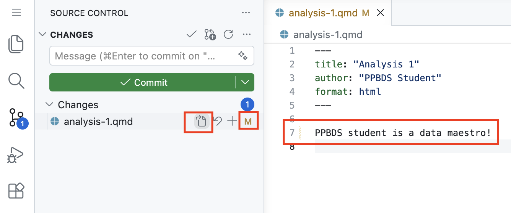
```

Notice how there is now an orange "M" next to the file name. This indicates that Git is now tracking the file's changes and that it has been **M**odified.

Hold your cursor over the symbol (a curved arrow) next to the "Open File" button. What is the name for this button?

```{r using-git-19}
question_text(NULL,
	message = "Discard Changes",
	answer(NULL, correct = TRUE),
	allow_retry = FALSE,
	incorrect = NULL,
	rows = 6)
```

###

Clicking this button gets rid of any changes made since the last time you told Git to save them. 

### Exercise 20

Hold your cursor over the symbol --- `+`, a plus sign --- next to the "Discard Changes" button. What is the name for this button?

```{r using-git-20}
question_text(NULL,
	message = "Stage Changes",
	answer(NULL, correct = TRUE),
	allow_retry = FALSE,
	incorrect = NULL,
	rows = 2)
```

###

Saving changes in Git is, in theory, a two-step process. The first step is to "stage" the changes. The second step is to "commit" the changes. For the most part, we don't stage. We just "commit," which incorporates the staging process automatically.

### Exercise 21

Commit the changes with a comment like "added sentence". 

Run `git log`. CP/CR the latest entry.

```{r using-git-21}
question_text(NULL,
	answer(NULL, correct = TRUE),
	allow_retry = TRUE,
	try_again_button = "Edit Answer",
	incorrect = NULL,
	rows = 5)
```

###

Your answer should look something like:

````
github-introduction $ git log
commit b81019c11410adc933cdb256649ee4cf66f9026f (HEAD -> main)
Author: ppbds-student <acrogers362+ppbds-student@gmail.com>
Date:   Fri May 1 19:41:05 2026 +0000

    added sentence
````

### Exercise 22

The Source Control pane now looks like this:

```{r}
include_graphics("images/analysis-1-post-commit.png")
```

Although you have committed your changes to Git --- i.e., the changes have been made locally --- you still need to "push" the changes to GitHub.  Hover your cursor over the "Sync Changes" button. What does the pop-up say?

```{r using-git-22}
question_text(NULL,
	message = "Something like \"Push 2 commits to origin/main\" --- or \"Publish Branch\", if this is the repo's very first push.",
	answer(NULL, correct = TRUE),
	allow_retry = FALSE,
	incorrect = NULL,
	rows = 6)
```

###

The term "origin/main" refers to the "main" branch on the "origin" repo, which is the GitHub repo. 

Note how the bottom portion of the pane, the Source Control Graph, now has two items. Before you committed, it had just one. The Source Control Graph shows the Git history of this repo.

### Exercise 23

Press the "Sync Changes" button.

###

The Source Control View should now look like this:

```{r}
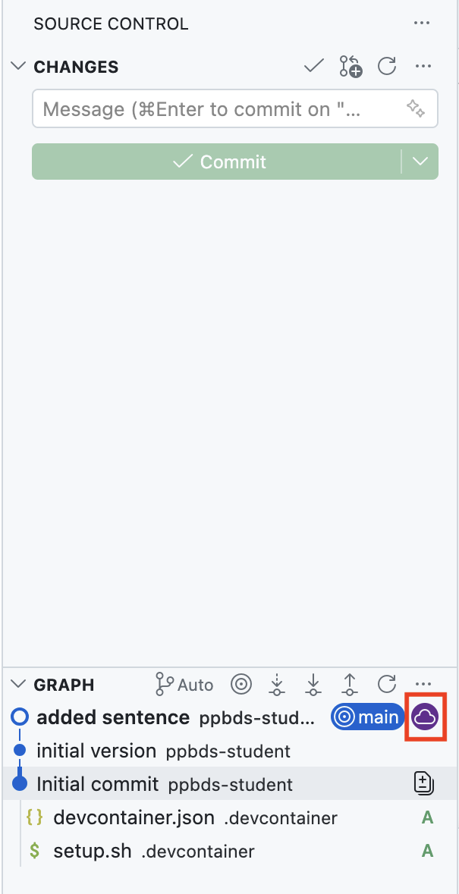
```

Notice how the purple cloud icon, representing the remote tracking branch on GitHub called "origin/main", has moved to the most recent commit along with the local main branch.

From the Terminal, run `git log` again. CP/CR.

```{r using-git-23}
question_text(NULL,
	answer(NULL, correct = TRUE),
	allow_retry = TRUE,
	try_again_button = "Edit Answer",
	incorrect = NULL,
	rows = 7)
```

###

Your answer should look like:

````
github-introduction $ git log
commit be56bbaedd692a6d29bba410f0a6fd5b1d844a64 (HEAD -> main, origin/main, origin/HEAD)
Author: ppbds-student <acrogers362+ppbds-student@gmail.com>
Date:   Mon May 4 16:57:38 2026 +0000

    added sentence

commit 5fc089ec356a2f91dc447a86e76533f443bdb080
Author: ppbds-student <acrogers362+ppbds-student@gmail.com>
Date:   Mon May 4 16:57:08 2026 +0000

    initial version
````

This looks the same as before, except that "(HEAD -> main)" in the top line has changed to "(HEAD -> main, origin/main, origin/HEAD)". This tells us that our changes have been pushed to GitHub, not simply committed locally. We will save a discussion of what `"HEAD"` means for later.

A term like "commit be56bbaedd692a6d29bba410f0a6fd5b1d844a64" gives us the address of that commit. We can use that string to revert to the codebase as it looked after that commit.

### Exercise 24

If you look at the GitHub page for `github-introduction`, you will see that the changes have been pushed to GitHub. If your computer stops working, you won't lose any of your work.

```{r}
include_graphics("images/analysis-1-gh-1.png")
```

This page shows the files from your project that have been pushed to GitHub. Click on the commit history button (in the red box above). This will show a page with the history of commits that you have pushed to GitHub.

```{r}
include_graphics("images/analysis-1-gh-2.png")
```

Copy and paste the text of this page.

```{r using-git-24}
question_text(NULL,
	answer(NULL, correct = TRUE),
	allow_retry = TRUE,
	try_again_button = "Edit Answer",
	incorrect = NULL,
	rows = 5)
```

###

You should have something like this:

````
Commit History
Commits on May 4, 2026

    added sentence
    ppbds-student
    ppbds-student
    committed
    3 minutes ago
    initial version
    ppbds-student
    ppbds-student
    committed
    6 minutes ago
    Initial commit
    ppbds-student
    ppbds-student
    authored
    15 days ago

````
###

As AI writes more and more of our code, it's becoming increasingly important to get good at managing this code with Git and GitHub.

## Publishing with GitHub Pages
### 

An HTML file rendered by Quarto only lives on your computer (or Codespace) — it isn't accessible to anyone else. [GitHub Pages](https://pages.github.com/) solves this by serving the static files from your GitHub repository as a public website, giving you a real URL you can share with anyone.

GitHub Pages isn't the only option. [Netlify](https://www.netlify.com/), [Quarto Pub](https://quartopub.com/), and [Posit Connect](https://posit.co/products/enterprise/connect/) are some popular alternatives for hosting HTML files and websites.

### Exercise 1

Let's make `analysis-1.qmd` worth publishing. Set it up as you learned in the Quarto tutorial:

* Change the title to "A Beautiful Graphic" and add your name as the author.

* Add `execute: echo: false` to the YAML header. Make sure to use two spaces, not a tab, when indenting.

* Add a code chunk which loads **tidyverse**, with `#| message: false`.

* Add a second code chunk holding an AI-generated plot that uses ggplot and a built-in data set. Render with `Cmd/Ctrl + Shift + K` and iterate with your AI until you have a graphic of which you are proud.

(In the Antigravity tutorial you met a CLI agent that can edit your files directly. Either approach is fine throughout these Git tutorials: ask an AI in a chat window and copy/paste the code by hand, or let an agent write it into your file for you. Use whichever you prefer.)

In the R Terminal, run `tutorial.helpers::show_file("analysis-1.qmd", chunk = "Last")`. CP/CR.

```{r publishing-with-github-pages-1}
question_text(NULL,
	answer(NULL, correct = TRUE),
	allow_retry = TRUE,
	try_again_button = "Edit Answer",
	incorrect = NULL,
	rows = 12)
```

###

````
ggplot(mpg, aes(x = displ, y = hwy, color = class)) +
  geom_point(alpha = 0.7) +
  scale_color_brewer(palette = "Set2") +
  scale_size_continuous(range = c(2, 8)) +
  labs(
    title = "Highway MPG vs Engine Displacement by Vehicle Class",
    subtitle = "Larger points indicate higher city MPG",
    x = "Engine Displacement (L)",
    y = "Highway MPG",
    color = "Vehicle Class",
    size = "City MPG"
  ) +
  theme_minimal() +
  theme(
    plot.title = element_text(size = 16, face = "bold", hjust = 0.5),
    plot.subtitle = element_text(size = 12, hjust = 0.5),
    legend.position = "right",
    legend.box = "vertical",
    panel.grid.major = element_line(color = "grey90"),
    panel.grid.minor = element_blank()
  )
````

###

My image looks like:

```{r}
ggplot(mpg, aes(x = displ, y = hwy, color = class)) +
  geom_point(alpha = 0.7) +
  scale_color_brewer(palette = "Set2") +
  scale_size_continuous(range = c(2, 8)) +
  labs(
    title = "Highway MPG vs Engine Displacement by Vehicle Class",
    subtitle = "Larger points indicate higher city MPG",
    x = "Engine Displacement (L)",
    y = "Highway MPG",
    color = "Vehicle Class",
    size = "City MPG"
  ) +
  theme_minimal() +
  theme(
    plot.title = element_text(size = 16, face = "bold", hjust = 0.5),
    plot.subtitle = element_text(size = 12, hjust = 0.5),
    legend.position = "right",
    legend.box = "vertical",
    panel.grid.major = element_line(color = "grey90"),
    panel.grid.minor = element_blank()
  )
```

Nothing in this exercise was new: the YAML header, the setup chunk, `#| message: false`, and `execute: echo: false` all come straight from the Quarto tutorial. What *is* new is what comes next: publishing this page from a repo you have managed with raw Git commands.

### Exercise 2

If you click the Source Control button, your Codespaces window should look something like this:

```{r}
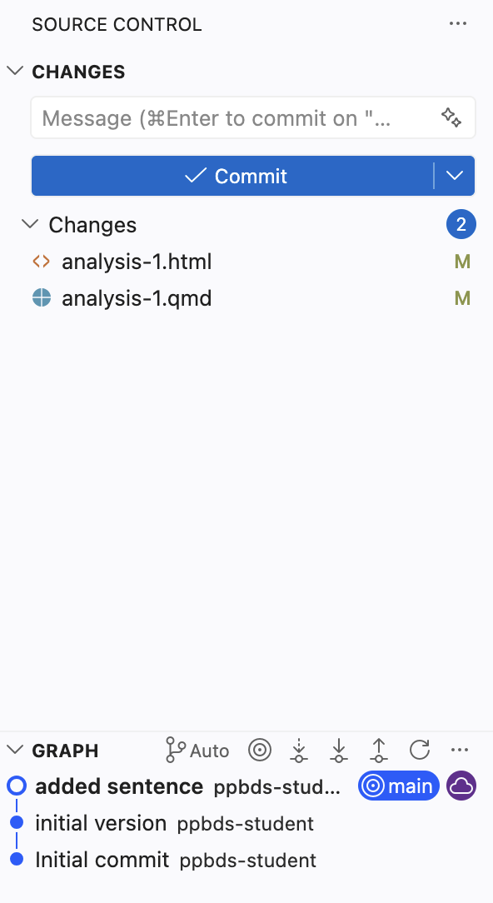
```

Commit your files and push them to GitHub. Don't forget the commit message. Don't forget that "push" means the same thing as "sync."

Use `Ctrl + c` to stop the Quarto watching process. From the Terminal, run `git log -n 1`. CP/CR.

```{r publishing-with-github-pages-2}
question_text(NULL,
	answer(NULL, correct = TRUE),
	allow_retry = TRUE,
	try_again_button = "Edit Answer",
	incorrect = NULL,
	rows = 3)
```

###

````
github-introduction $ git log -n 1
commit d8486207321f7e682075bc5fab87e02f8124a5f1 (HEAD -> main, origin/main, origin/HEAD)
Author: ppbds-student <acrogers362+ppbds-student@gmail.com>
Date:   Mon May 4 19:30:10 2026 +0000

    added chart
github-introduction $
````

We are being a little sloppy to equate "pushing" with "syncing." Strictly speaking, "syncing" does two things: it "pushes" your changes to GitHub *and* it "pulls" any changes made on GitHub to your local computer. But, in this case, because no one else but you can change the GitHub repo, there is nothing to "pull." 

### Exercise 3

Let's publish our results to [GitHub Pages](https://pages.github.com/). Before we do, go to the GitHub repo for `github-introduction`, click on the "Settings" top menu item, and then click on the "Pages" side menu item.

```{r}
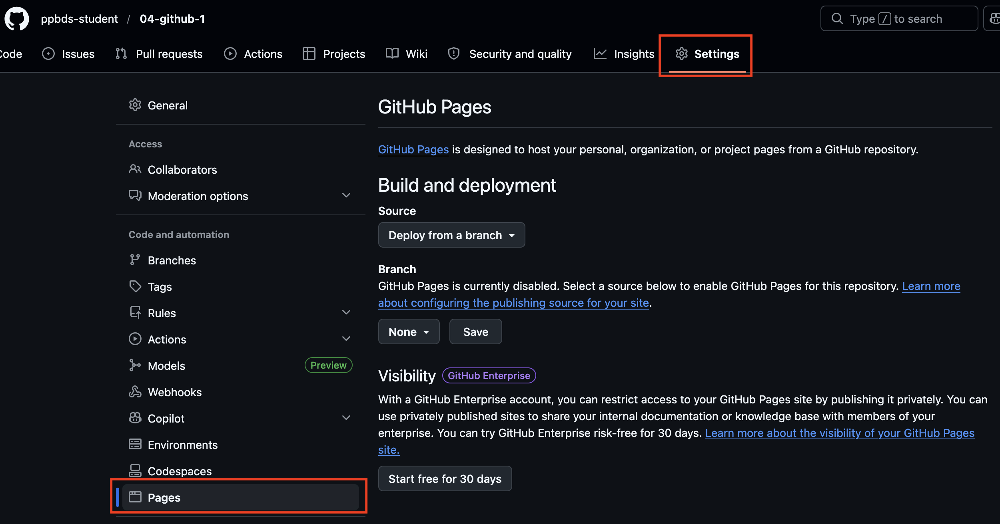
```

We won't modify these options by hand. But it is useful to know where the details are located.

From the Terminal, run `quarto publish gh-pages analysis-1.qmd`. Respond with "Y" when it asks whether you want to publish. (This might take a minute to run.) 

CP/CR just the first 10 or so lines of the output.


```{r publishing-with-github-pages-3}
question_text(NULL,
	answer(NULL, correct = TRUE),
	allow_retry = TRUE,
	try_again_button = "Edit Answer",
	incorrect = NULL,
	rows = 12)
```

###

Here is what I see, broken up to allow for comments:

````
github-introduction $ quarto publish gh-pages analysis-1.qmd
? Publish site to https://ppbds-student.github.io/github-introduction/ using gh-pages? (Y/n) › Yes
````

There are settings that will prevent this question from being asked every time we update the website. Otherwise, Quarto will check each time.

````
Saved working directory and index state WIP on main: d848620 added chart
Switched to a new branch 'gh-pages'
[gh-pages (root-commit) 0e5631c] Initializing gh-pages branch
remote: 
remote: Create a pull request for 'gh-pages' on GitHub by visiting:        
remote:      https://github.com/ppbds-student/github-introduction/pull/new/gh-pages        
remote: 
To https://github.com/ppbds-student/github-introduction
 * [new branch]      HEAD -> gh-pages
 ````

By default, `quarto publish` follows the standard GitHub Pages approach of creating a new Git "branch" called `gh-pages`. Branches are lightweight pointers to specific commits. They allow you to isolate work in progress, experiment with new features, and collaborate effectively without affecting the main codebase. 

 ````
Switched to branch 'main'
Your branch is up to date with 'origin/main'.

From https://github.com/ppbds-student/github-introduction
 * branch            gh-pages   -> FETCH_HEAD
Rendering for publish:


processing file: analysis-1.qmd
1/4                  
2/4 [unnamed-chunk-1]
3/4                  
4/4 [unnamed-chunk-2]
output file: analysis-1.knit.md
````

`quarto publish` processes `analysis-1.qmd` in the same way that `quarto preview` or `quarto render` does.

### Exercise 4

Go to your `github-introduction` page on GitHub. Refresh the page. `quarto publish` has changed some of the items. Copy and paste all the text in the "Visit site" box.


```{r publishing-with-github-pages-4}
question_text(NULL,
	answer(NULL, correct = TRUE),
	allow_retry = TRUE,
	try_again_button = "Edit Answer",
	incorrect = NULL,
	rows = 3)
```

###

````
Your site is live at https://ppbds-student.github.io/repo-2/
Last deployed by @ppbds-student ppbds-student 6 minutes ago
````

Here is my whole page:

```{r}
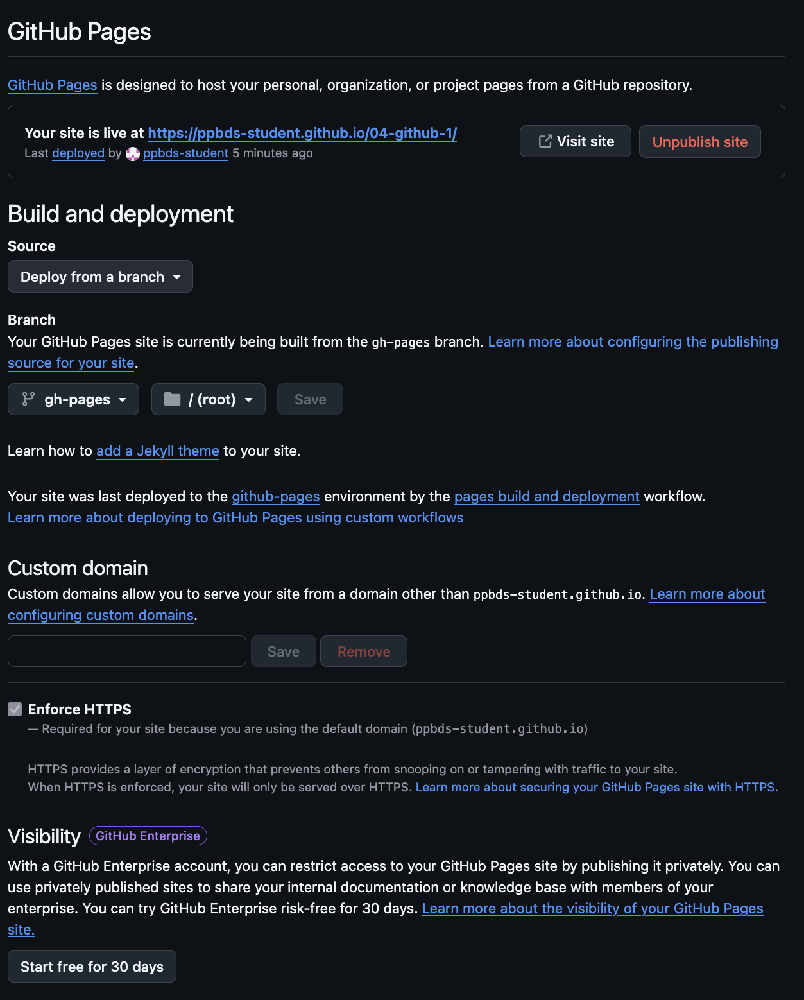
```

We could have made these changes by hand, but it is much easier to let `quarto publish` handle them.

Publishing to GitHub Pages has not changed any of the files in our repo, so the "Source Control" button does not show any changes for us to deal with. Our local repo matches our `github-introduction` on GitHub. We are done!


## Summary
### 

This tutorial covered [Git](https://git-scm.com/), a program for keeping track of changes in your code, and [GitHub](https://github.com/), the leading platform for storing your code in the cloud. Some material is from [*R for Data Science (2e)*](https://r4ds.hadley.nz/) by Hadley Wickham, Mine Çetinkaya-Rundel, and Garrett Grolemund.

The most useful reference for Git/GitHub is [*Happy Git and GitHub for the useR*](https://happygitwithr.com/). Refer to that book whenever you have a question.

```{r download-answers, child = system.file("child_documents/download_answers.Rmd", package = "tutorial.helpers")}
```
