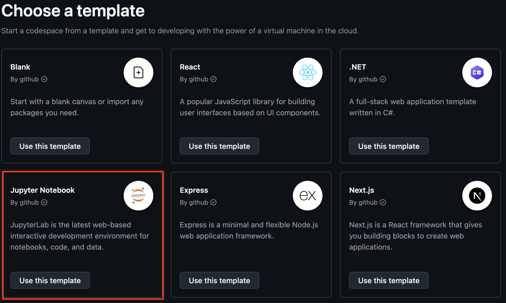
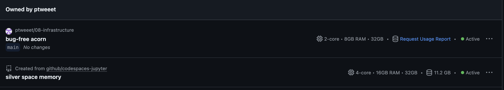
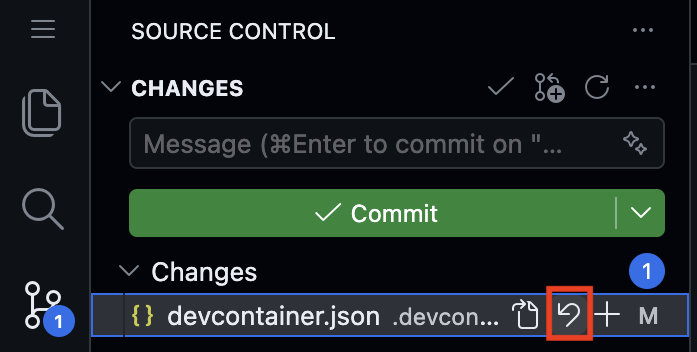
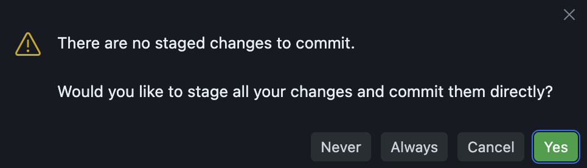
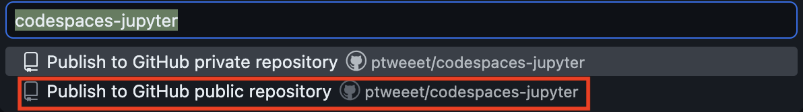
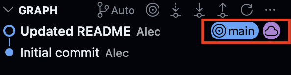

```{r setup, include = FALSE}
library(learnr)
library(tutorial.helpers)
library(knitr)

knitr::opts_chunk$set(echo = FALSE)
knitr::opts_chunk$set(out.width = '90%')
options(tutorial.exercise.timelimit = 60,
        tutorial.storage = "local")
```

```{r info-section, child = system.file("child_documents/info_section.Rmd", package = "tutorial.helpers")}
```

## Introduction
###

This tutorial explores devcontainers --- configuration files that define how a GitHub Codespace is set up. You will examine a `devcontainer.json` file to understand how it specifies the starting image, installed packages, VS Code extensions, and startup commands that make a Codespace ready to use. You will also compare two different Codespace configurations side by side.

### Exercise 1

You should be doing this tutorial in a repo named `devcontainers`. If you are not, create one and connect to it, as you learned in earlier tutorials.

Copy and paste the URL for your `devcontainers` repository.

```{r introduction-1}
question_text(NULL,
	answer(NULL, correct = TRUE),
	allow_retry = TRUE,
	try_again_button = "Edit Answer",
	incorrect = NULL,
	rows = 5)
```

###

```
https://github.com/ppbds-student/devcontainers
```

###

The [`codespace-starter`](https://github.com/PPBDS/codespace-starter) repo you have been using includes a `.devcontainer/devcontainer.json` file that tells GitHub exactly what to install in any new codespace. This is what ensures everyone who opens a codespace from the same repo gets the same tools, extensions, and settings.

### Exercise 2

Copy and paste the URL for your Codespace.

```{r introduction-2}
question_text(NULL,
	answer(NULL, correct = TRUE),
	allow_retry = TRUE,
	try_again_button = "Edit Answer",
	incorrect = NULL,
	rows = 5)
```

###

```
https://congenial-chainsaw-wv757pv4pp67cpw.github.dev/
```

###

Every codespace runs on a remote computer provided by GitHub. The URL you just pasted is a unique address for your specific machine in the cloud --- a different person opening a Codespace from the same repo will get a different URL, but the same setup.

### Exercise 3

At the bash Terminal, run `pwd`, then `ls -a`. CP/CR.

```{r introduction-3}
question_text(NULL,
	answer(NULL, correct = TRUE),
	allow_retry = TRUE,
	try_again_button = "Edit Answer",
	incorrect = NULL,
	rows = 6)
```

###


```
devcontainers $ pwd
/workspaces/devcontainers
devcontainers $ ls -a
.  ..  .git
devcontainers $
```

###

Your `devcontainers` repo starts almost empty --- the `.git` directory confirms it is tracked by Git, but there is nothing else here yet. This is where you will save your own work. Notice what is *missing*: there is no `.devcontainer` directory, even though this Codespace clearly has one configured. We track it down next.

### Exercise 4

In the bash Terminal, run `cd ../codespace-starter`, then run `pwd`. CP/CR.

```{r introduction-4}
question_text(NULL,
	answer(NULL, correct = TRUE),
	allow_retry = TRUE,
	try_again_button = "Edit Answer",
	incorrect = NULL,
	rows = 5)
```

###

Your output should look like:

````
devcontainers $ cd ../codespace-starter
codespace-starter $ pwd
/workspaces/codespace-starter
codespace-starter $
````

###

Both repos live side by side inside this Codespace, under `/workspaces`: your own `devcontainers` and the `codespace-starter` you launched from. The `..` in `cd ../codespace-starter` means "the parent directory," so the command moves up from `/workspaces/devcontainers` to `/workspaces`, then down into `codespace-starter`. That is where the `devcontainer.json` that configured this machine actually lives --- not in your work repo, which is just for saving your own work. Notice the prompt change from `devcontainers $` to `codespace-starter $`: the prompt always shows the name of the directory you are in, a quick way to confirm where you are.

### Exercise 5

Run `cat .devcontainer/devcontainer.json`. CP/CR.

```{r introduction-5}
question_text(NULL,
	answer(NULL, correct = TRUE),
	allow_retry = TRUE,
	try_again_button = "Edit Answer",
	incorrect = NULL,
	rows = 15)
```

###

Your output shows the full `devcontainer.json` from the `codespace-starter` repo. You will explore each part of this file in a later tutorial. Keep this Codespace open --- you will need it alongside a second Codespace in the next section.

## Jupyter Notebook Devcontainer
###

A `devcontainer.json` file captures the entire setup --- starting image, packages, extensions, and startup commands --- so that any codespace opened from the repo starts in an identical, ready-to-use state. In this section you will examine the devcontainer for GitHub's Jupyter Notebook template, which sets up a codespace for doing data science with Python and with Jupyter Notebooks.

### Exercise 1

Go to https://github.com/codespaces/templates. Then press the "Use This Template" button for the Jupyter Notebook notebook template. This will open a new Codespace using this template. Copy and paste its URL.

```{r}

```

```{r devcontainers-1}
question_text(NULL,
	answer(NULL, correct = TRUE),
	allow_retry = TRUE,
	try_again_button = "Edit Answer",
	incorrect = NULL,
	rows = 5)
```

###

````
https://silver-space-adventure-97xrvw59xhx.github.dev/
````

###

The Jupyter Notebook template is a pre-built Codespace for Python data science using Jupyter notebooks --- similar to how `codespace-starter` is set up for R, Quarto, and running tutorials.

### Exercise 2

You should have two Codespaces open. Go to https://github.com/codespaces. Then copy and paste the two table rows corresponding to your open Codespaces.

```{r}

```

```{r devcontainers-2}
question_text(NULL,
	answer(NULL, correct = TRUE),
	allow_retry = TRUE,
	try_again_button = "Edit Answer",
	incorrect = NULL,
	rows = 5)
```

###

````
devcontainers      ppbds-student/devcontainers       main    Active
codespaces-jupyter    ppbds-student/codespaces-jupyter     main    Active
````

###

The `github.com/codespaces` page is where you manage all your active Codespaces. Each one uses hours and storage from your GitHub monthly limit, so stop or delete ones you're not using.

### Exercise 3

In this new Jupyter Notebook codespace, select the `devcontainer.json` file within the `.devcontainer` directory in the Explorer. Find the line beginning with "image", copy and paste.

```{r devcontainers-3}
question_text(NULL,
	answer(NULL, correct = TRUE),
	allow_retry = TRUE,
	try_again_button = "Edit Answer",
	incorrect = NULL,
	rows = 5)
```

###

```
"image": "mcr.microsoft.com/devcontainers/universal:2",
```

###

The `image` field tells GitHub which pre-built setup to use --- think of it as choosing a computer that already has certain software installed. `mcr.microsoft.com/devcontainers/universal:2` is Microsoft's general-purpose setup with Python and several other programming languages pre-installed.

### Exercise 4

In the same file, find the chunk of code beginning with `"vscode": {` copy and paste this chunk, ending with the bracket which closes the starting bracket on the first line.


```{r devcontainers-4}
question_text(NULL,
	answer(NULL, correct = TRUE),
	allow_retry = TRUE,
	try_again_button = "Edit Answer",
	incorrect = NULL,
	rows = 5)
```

###

```
"vscode": {
      "extensions": [
        "ms-toolsai.jupyter",
        "ms-python.python"
      ]
    }
```

###

This block lists which VS Code extensions to pre-install. `ms-toolsai.jupyter` enables Jupyter notebooks; `ms-python.python` adds Python code completion and error highlighting.

### Exercise 5

<!-- DK: Split into two questions. -->

Find the line beginning with `"updateContentCommand"` in `devcontainer.json`. Copy and paste it. Then navigate to `requirements.txt` in the Explorer and copy and paste the entire file.

```{r devcontainers-5}
question_text(NULL,
	answer(NULL, correct = TRUE),
	allow_retry = TRUE,
	try_again_button = "Edit Answer",
	incorrect = NULL,
	rows = 15)
```

###

Your answer should look like this:

```
"updateContentCommand": "python3 -m pip install -r requirements.txt",

ipywidgets==8.1.8
matplotlib==3.8.4
pandas==2.2.2
torch==2.8.0
torchvision==0.23.0
tqdm==4.66.4
pillow>=12.1.1
fonttools>=4.60.0
filelock>=3.20.3
Pygments==2.20.0
```

###

`updateContentCommand` runs when the Codespace is first created and again whenever the repo's files change --- so if someone pushes a new `requirements.txt`, the packages update automatically. `pandas` and `matplotlib` are the core packages: the Python equivalents of the tidyverse tools you've been using in R.


### Exercise 6

Tell AI to edit `devcontainer.json` so it installs and configures the environment for using R instead of Python. 

Copy and paste your new `devcontainer.json`.

```{r devcontainers-6}
question_text(NULL,
	answer(NULL, correct = TRUE),
	allow_retry = TRUE,
	try_again_button = "Edit Answer",
	incorrect = NULL,
	rows = 5)
```

###

My new file looks like this:

```
{
  "image": "mcr.microsoft.com/devcontainers/universal:2",
  "hostRequirements": {
    "cpus": 4
  },
  "waitFor": "onCreateCommand",
  "updateContentCommand": "Rscript -e \"if (!requireNamespace('remotes', quietly=TRUE)) install.packages('remotes', repos='https://cloud.r-project.org')\"",
  "postCreateCommand": "",
  "customizations": {
    "codespaces": {
      "openFiles": []
    },
    "vscode": {
        "extensions": [
        "ms-toolsai.jupyter",
        "Ikuyadeu.r"
      ]
    }
  }
}
```

###

Describing what you want in plain English works just as well for configuration files like `devcontainer.json` as it does for analysis code. Once comfortable, you can publish your own repo as a template and reuse it for future projects.

### Exercise 7

 Let's revert any changes we've made to `devcontainer.json`. Go to the Source Control side bar and press the revert button on the right.

```{r}

```

Run `git status` in a bash Terminal. CP/CR.

```{r devcontainers-7}
question_text(NULL,
	answer(NULL, correct = TRUE),
	allow_retry = TRUE,
	try_again_button = "Edit Answer",
	incorrect = NULL,
	rows = 5)
```

###

You should see something like this:

```
@ppbds-student ➜ /workspaces/codespaces-jupyter (main) $ git status
On branch main
nothing to commit, working tree clean
@ppbds-student ➜ /workspaces/codespaces-jupyter (main) $
```

This indicates that Git doesn't detect any changes to the repository.

###

Until you commit, changes exist only in your local files and can be discarded at any time. The revert button works here precisely because changes in `devcontainer.json` was never added to Git or committed --- once a change is committed, undoing it requires a new commit rather than a simple discard.


### Exercise 8


<!-- DK: What is going on here? Can we really commit (and push?!) changes in the Jupyter codespace? How does that work? -->

Replace the first paragraph of `README.md` with:

```
This is YOUR NAME's new Python Codespace!
```

Save the changes. In the Source Control side bar, write a commit message like "Updated README". Then, press the "Commit Button". A pop-up will appear:

```{r}

```

Press "Yes".

Run `git log --oneline` to view the Git history. CP/CR.

```{r devcontainers-8}
question_text(NULL,
	answer(NULL, correct = TRUE),
	allow_retry = TRUE,
	try_again_button = "Edit Answer",
	incorrect = NULL,
	rows = 5)
```

###

Your output should look something like this:

```
@ppbds-student ➜ /workspaces/codespaces-jupyter (main) $ git log --oneline
bf71a79 (HEAD -> main) Updated README
7c6c35a Initial commit
@ppbds-student ➜ /workspaces/codespaces-jupyter (main) $
```

###

This pop-up doesn't appear when we use Codespaces started with `codespace-starter` because that template enables smart commit, a VS Code feature that automatically includes all changed files when the "Commit" button is pressed. The pop-up appeared in this Codespace because the `devcontainer.json` does not enable this feature.

### Exercise 9

Let's continue our tour of this repo. Navigate to `.gitignore` in the Explorer.

Copy and paste the entire file.

```{r devcontainers-9}
question_text(NULL,
	answer(NULL, correct = TRUE),
	allow_retry = TRUE,
	try_again_button = "Edit Answer",
	incorrect = NULL,
	rows = 5)
```

###

```
notebooks/data
notebooks/cifar_net.pth
.ipynb_checkpoints/
```

###

Each line excludes files that shouldn't be tracked in Git, either because it might contain excessively large files (`notebooks/data`, `notebooks/cifar_net.pth`) or because the files are temporary (`.ipynb_checkpoints/`) .

### Exercise 10

Navigate to the `data` directory and open `atlantis.csv`. Paste the top 5 lines.

```{r devcontainers-10}
question_text(NULL,
	answer(NULL, correct = TRUE),
	allow_retry = TRUE,
	try_again_button = "Edit Answer",
	incorrect = NULL,
	rows = 5)
```

###

```
year,population
2000,12400
2001,12800
2002,13800
2003,13600
```

###

CSV (comma-separated values) is a plain-text format where each row is a record and each column is separated by a comma --- `atlantis.csv` contains simulated year-by-year population data for a fictional city.

### Exercise 11

In the Explorer, navigate to the `notebooks` directory, then `populations.ipynb`. Double click the heading of the document to open the editor for that section. Copy and paste all of the text.

```{r devcontainers-11}
question_text(NULL,
	answer(NULL, correct = TRUE),
	allow_retry = TRUE,
	try_again_button = "Edit Answer",
	incorrect = NULL,
	rows = 5)
```

###

```
# Population Data from CSV

This notebooks reads sample population data from `data/atlantis.csv` and plots it using Matplotlib. Edit `data/atlantis.csv` and re-run this cell to see how the plots change!
```

###

A `.ipynb` file is a Jupyter notebook --- like a Quarto document, it mixes text, code, and output in runnable cells. `populations.ipynb` reads population data from `atlantis.csv` and plots it with **matplotlib**.

### Exercise 12

Go to the Source Control side bar and press the "Publish Branch" button.

You may be asked to sign into GitHub. If so, select "Allow" then your GitHub account. This happens because we created this Codespace directly from a template. We have a local Git repository in the Codespace, but do not yet have a Git Repository on GitHub. Press the "Publish Branch" button again.

Now you can name the GitHub repository and then select if you'd like to make it private or public. Name it `codespaces-jupyter` and choose public.

```{r}

```

Run `git log --oneline`. CP/CR.


```{r devcontainers-12}
question_text(NULL,
	answer(NULL, correct = TRUE),
	allow_retry = TRUE,
	try_again_button = "Edit Answer",
	incorrect = NULL,
	rows = 5)
```

###

```
@ppbds-student ➜ /workspaces/codespaces-jupyter (main) $ git log --oneline
bf71a79 (HEAD -> main, origin/main) Updated README
7c6c35a Initial commit
@ppbds-student ➜ /workspaces/codespaces-jupyter (main) $
```

Also notice how the Graph section of the Source Control side bar shows the same information.

```{r}

```


###

`(HEAD -> main, origin/main)` on the same commit means your local branch and GitHub are up to date with each other. The Source Control graph shows the same thing --- a purple cloud icon means the commit has been pushed to GitHub.

### Exercise 13

Go to GitHub. In the upper-right corner, click your profile picture, then select "Your repositories". Click the repository named `codespaces-jupyter`. Paste the URL of the repo.


```{r devcontainers-13}
question_text(NULL,
	answer(NULL, correct = TRUE),
	allow_retry = TRUE,
	try_again_button = "Edit Answer",
	incorrect = NULL,
	rows = 5)
```

###

```
https://github.com/ppbds-student/codespaces-jupyter
```
###

Codespaces started from `codespace-starter` are backed by an existing GitHub repo, so pushing just sends commits to a remote that already exists. This Codespace was created directly from a template, so there was no GitHub repo yet --- "Publish Branch" is what creates it.

### Exercise 14

If you haven't already, stop the Jupyter Notebook Codespace. Open the Command Palette with `Cmd/Ctrl + Shift + P`, type `>stop`, and select **"Codespaces: Stop Current Codespace"**.

Then go to https://github.com/codespaces. Find the row for the Jupyter Notebook Codespace and copy and paste it.

```{r devcontainers-14}
question_text(NULL,
	answer(NULL, correct = TRUE),
	allow_retry = TRUE,
	try_again_button = "Edit Answer",
	incorrect = NULL,
	rows = 5)
```

###

````
codespaces-jupyter    ppbds-student/codespaces-jupyter    main    Stopped
````

###

Stopped Codespaces don't use compute hours but still occupy storage --- they can be restarted at any time. Deleting a codespace frees the storage entirely but cannot be undone.

## New Devcontainer
###

In the previous section you explored a devcontainer someone else wrote. Now you will build one from scratch. You will open a blank codespace with no configuration at all, manually create the devcontainer files, use AI to draft the JSON, replace it with a clean version, and rebuild the container to see the new environment take effect.

### Exercise 1

Go to https://github.com/codespaces/templates. Click "Use This Template" for the **Blank** template. This will open a new blank codespace. You should now have two codespaces open: the one running this tutorial and the new blank one.

Copy and paste the URL of the new blank codespace.

```{r new-devcontainer-1}
question_text(NULL,
	answer(NULL, correct = TRUE),
	allow_retry = TRUE,
	try_again_button = "Edit Answer",
	incorrect = NULL,
	rows = 3)
```

###

Without a `.devcontainer` directory, GitHub falls back to a generic default setup with no customization. This is the starting point for any brand-new project where you want to configure the codespace from scratch.

### Exercise 2

In the blank codespace, open the Explorer. Right-click in the file tree and select **"New Folder"**. Name it `.devcontainer`. Then right-click the new folder and select **"New File"**. Name it `devcontainer.json`.

In the bash Terminal, run:

```
ls .devcontainer/
```

CP/CR.

```{r new-devcontainer-2}
question_text(NULL,
	answer(NULL, correct = TRUE),
	allow_retry = TRUE,
	try_again_button = "Edit Answer",
	incorrect = NULL,
	rows = 4)
```

###

Your output should look like:

````
devcontainer.json
````

###

GitHub Codespaces looks for a file named exactly `devcontainer.json` inside a directory named exactly `.devcontainer` at the root of the repo. The leading dot makes `.devcontainer` a hidden directory --- it won't appear in `ls` without the `-a` flag, but it is visible in VS Code's Explorer by default.

### Exercise 3

Open an AI chatbot --- ChatGPT, Gemini, Claude, or any other. Ask it:

```
Write a devcontainer.json for an R data science project.
```

CP/CR the AI's full response.

```{r new-devcontainer-3}
question_text(NULL,
	answer(NULL, correct = TRUE),
	allow_retry = TRUE,
	try_again_button = "Edit Answer",
	incorrect = NULL,
	rows = 20)
```

###

AI tends to produce longer `devcontainer.json` files than needed, adding optional fields like `postCreateCommand` or `features` as a precaution. Reviewing and simplifying the output is a normal part of using AI for technical setup work.

### Exercise 4

Open `.devcontainer/devcontainer.json` in the editor. Replace all of its contents with the following:

```
{
  "name": "R Dev Container",
  "image": "ghcr.io/rocker-org/devcontainer/tidyverse:4",
  "customizations": {
    "vscode": {
      "extensions": [
        "REditorSupport.r"
      ]
    }
  }
}
```

Save the file. Then in the **bash Terminal**, run:

```
cat .devcontainer/devcontainer.json
```

CP/CR.

```{r new-devcontainer-4}
question_text(NULL,
	answer(NULL, correct = TRUE),
	allow_retry = TRUE,
	try_again_button = "Edit Answer",
	incorrect = NULL,
	rows = 12)
```

###

````
{
  "name": "R Dev Container",
  "image": "ghcr.io/rocker-org/devcontainer/tidyverse:4",
  "customizations": {
    "vscode": {
      "extensions": [
        "REditorSupport.r"
      ]
    }
  }
}
````

###

This file is simpler than what the AI produced --- fewer fields means fewer things that can go wrong. Good devcontainers are minimal: only add what the project actually needs.

### Exercise 5

Click the blue connection indicator in the bottom-left corner of VS Code (it shows text like **"Codespaces: ..."**). From the menu that appears, select **"Rebuild Container"**, then **"Full Rebuild"**. Wait for the rebuild to complete --- the window will reload when the new container is ready.

Once the Codespace has reloaded, in the bash Terminal run:

```
R --version
```

CP/CR.

```{r new-devcontainer-5}
question_text(NULL,
	answer(NULL, correct = TRUE),
	allow_retry = TRUE,
	try_again_button = "Edit Answer",
	incorrect = NULL,
	rows = 6)
```

###

Your output should begin with something like:

````
R version 4.6.1 (2026-06-13) -- "Reassured Reassurer"
````
Note that your R version may differ as R releases new versions regularly.

###

A full rebuild constructs the container from scratch using the updated `devcontainer.json`, which is slower but guarantees the Codespace matches the configuration exactly. Because the Rocker image already has R pre-installed, R is available the moment the rebuild finishes.

### Exercise 6

Find the line beginning with `"image"`. Copy and paste it.

```{r new-devcontainer-6}
question_text(NULL,
	answer(NULL, correct = TRUE),
	allow_retry = TRUE,
	try_again_button = "Edit Answer",
	incorrect = NULL,
	rows = 3)
```

###

Your answer should look like:

```
"image": "ghcr.io/rocker-org/devcontainer/tidyverse:4",
```

###

`ghcr.io/rocker-org/devcontainer/tidyverse:4` is a pre-built image from the [Rocker Project](https://rocker-project.org/) that comes with R 4.x, the tidyverse, and common data science packages already installed --- no install scripts needed.

### Exercise 7

Find the `"customizations"` block. Copy and paste the entire block, from the `"customizations": {` line through its closing `}`.

```{r new-devcontainer-7}
question_text(NULL,
	answer(NULL, correct = TRUE),
	allow_retry = TRUE,
	try_again_button = "Edit Answer",
	incorrect = NULL,
	rows = 8)
```

###

Your answer should look like:

```
"customizations": {
  "vscode": {
    "extensions": [
      "REditorSupport.r"
    ]
  }
}
```

###

The `customizations` block holds tool-specific settings --- each tool reads only its own key. The `vscode` key contains settings only VS Code reads, so the same `devcontainer.json` can also work with other editors.

### Exercise 8

Find the line containing `"REditorSupport.r"`. Copy and paste it.

```{r new-devcontainer-8}
question_text(NULL,
	answer(NULL, correct = TRUE),
	allow_retry = TRUE,
	try_again_button = "Edit Answer",
	incorrect = NULL,
	rows = 3)
```

###

Your answer should look like:

```
"REditorSupport.r"
```

###

Extension IDs follow the format `publisher.extension-name`. `REditorSupport.r` provides colored code, code completion, and inline R output --- the same extension you've been using throughout this course.

### Exercise 9

In the blank Codespace, go to the Source Control sidebar. Write a commit message like **"add R devcontainer"** and press the **Commit** button. Then press **"Publish Branch"**. Name the repository `r-devcontainer` and choose public.

```{r}

```

Run `git log --oneline`. CP/CR.

```{r new-devcontainer-9}
question_text(NULL,
	answer(NULL, correct = TRUE),
	allow_retry = TRUE,
	try_again_button = "Edit Answer",
	incorrect = NULL,
	rows = 5)
```

###

Your log should look like this:

```
main $ git log --oneline
abc1234 (HEAD -> main, origin/main) add R devcontainer
def5678 Initial commit
main $
```

###

`(HEAD -> main, origin/main)` on the same commit means your local branch and GitHub are up to date with each other.

### Exercise 10

Go to GitHub. In the upper-right corner, click your profile picture, then select **"Your repositories"**. Click the repository named `r-devcontainer`. Paste the URL of the repo.

```{r new-devcontainer-10}
question_text(NULL,
	answer(NULL, correct = TRUE),
	allow_retry = TRUE,
	try_again_button = "Edit Answer",
	incorrect = NULL,
	rows = 5)
```

###

Your URL should look something like this:

```
https://github.com/ppbds-student/r-devcontainer
```

###

This Codespace was created directly from a template, so there was no GitHub repo yet --- "Publish Branch" is what creates it.

### Exercise 11

If you haven't already, stop the blank codespace. Open the Command Palette with `Cmd/Ctrl + Shift + P`, type `>stop`, and select **"Codespaces: Stop Current Codespace"**.

Then go to https://github.com/codespaces. Find the row for the blank Codespace and copy and paste it.

```{r new-devcontainer-11}
question_text(NULL,
	answer(NULL, correct = TRUE),
	allow_retry = TRUE,
	try_again_button = "Edit Answer",
	incorrect = NULL,
	rows = 5)
```

###

Stopped codespaces don't use compute hours but still occupy storage --- they can be restarted at any time. Deleting a codespace frees the storage entirely but cannot be undone.

## Summary
###

This tutorial introduced devcontainers as a way to define and share consistent codespace setups. You toured the Jupyter Notebook template's `devcontainer.json` --- its starting image, VS Code extensions, and startup command --- then built your own minimal R `devcontainer.json` from scratch, used AI to draft a first version, replaced it with a clean version, and rebuilt a codespace to confirm it worked. 

### Exercise 1

Go to https://github.com/codespaces. Stop any Codespaces you are no longer using by clicking the three-dot menu next to each one and selecting "Stop codespace". Paste the URL of your `codespaces-jupyter` GitHub repository below.

```{r summary-1}
question_text(NULL,
	answer(NULL, correct = TRUE),
	allow_retry = TRUE,
	try_again_button = "Edit Answer",
	incorrect = NULL,
	rows = 3)
```

###

Your URL should look something like:

```
https://github.com/ppbds-student/codespaces-jupyter
```

###

Stopping codespaces when you are done with them conserves your free monthly compute hours. Deleted codespaces cannot be recovered, but stopped ones can be restarted at any time.

### Exercise 2

Paste the URL of the `r-devcontainer` GitHub repository you created in the New Devcontainer section.

```{r summary-2}
question_text(NULL,
	answer(NULL, correct = TRUE),
	allow_retry = TRUE,
	try_again_button = "Edit Answer",
	incorrect = NULL,
	rows = 3)
```

###

```
https://github.com/ppbds-student/r-devcontainer
```

###

<!-- DK: Explain `requirements.txt` earlier. -->

Because the `devcontainer.json` you wrote is committed to `r-devcontainer`, the Codespace configuration travels with the repo --- anyone who launches a Codespace from it gets the exact same R setup. This is the same principle behind `requirements.txt`: capture your setup in Git so it can be reproduced by anyone.

```{r download-answers, child = system.file("child_documents/download_answers.Rmd", package = "tutorial.helpers")}
```
